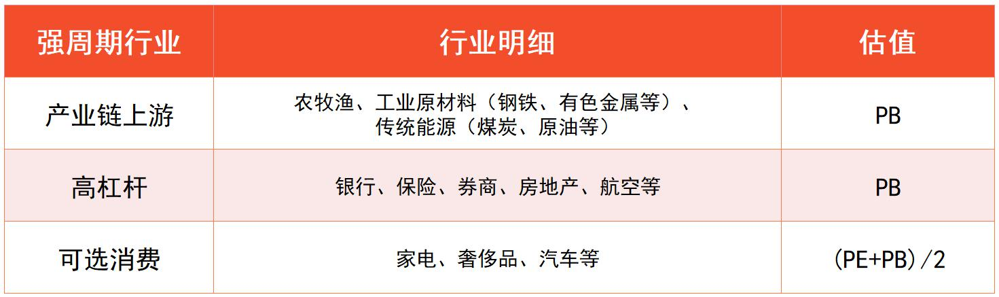
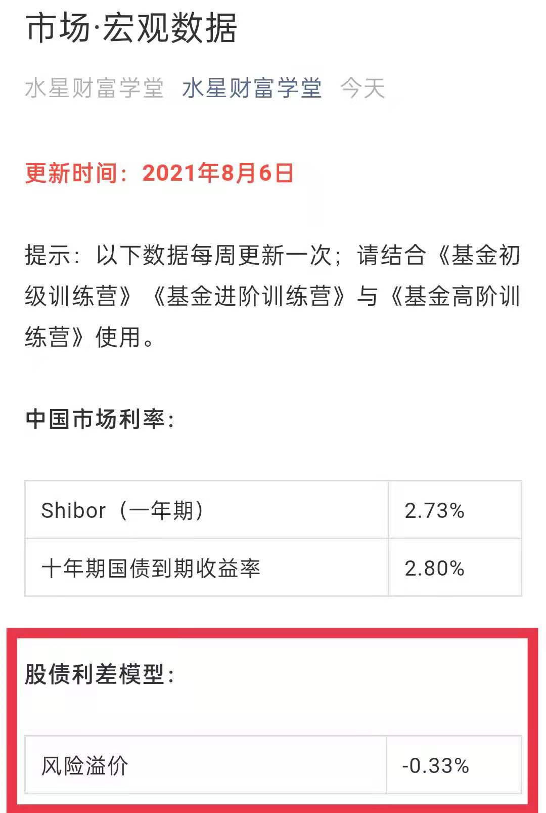
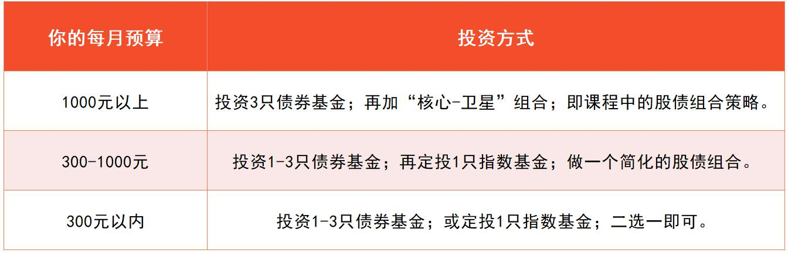
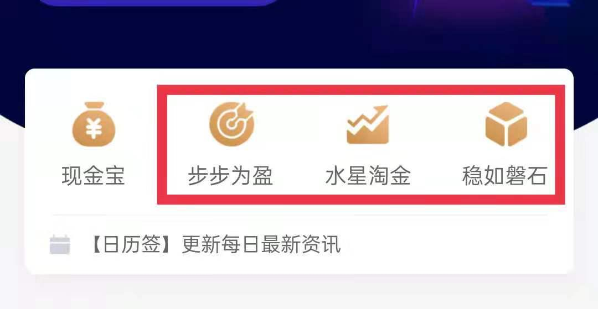
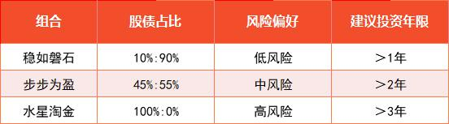

## 基进期末复习

又是一周的周六, 我们的基金进阶到这里, 已经结束了所有的新课了. 是不是有种基进刚刚开始没多久的感觉? 班班和学姐们也陪伴了大家 5 周的时间了, 还剩下 2 周的高阶课和 1 周的复习课, 希望大家保持热情共赴山海.

学姐先简单带大家复习下第一周的知识点.

上周我们了解了"核心-卫星"策略, 深入了解 4 个行业——主要消费、医药、科技、新能源车. 核心为低估值宽基指数; 卫星为消费、医药、科技和新能源四大领域. 考虑到并不是所有的时候, 每个领域的卫星都有低估指数, 班班还带大家了解了新材料和稀土, 作为备用卫星储备.

上周咱们已经了解策略和行业, 本周的重点是估值和买卖实操了.

我们先来看看估值:

原则:

1、PE 估值适用于弱周期行业; PB 估值适用于强周期行业.

2、高成长赛道可以放宽估值要求, 温度 80 度以下都可以定投.

进阶课介绍的所有行业和产业, 有且仅有农牧渔属于强周期. 所以, 农牧渔相关的指数适合用 PB 估值. 除农牧渔之外, 进阶课中涉及到的其他指数均用 PE 估值.

要判断行业是否强周期?

我们首先根据生活经验判断;

其次可以用三个锦囊:(1)看行业是否处于产业链上游; (2)看行业是否高杠杆; (3)可选消费.

这里需要注意的是, 虽然原材料属于强周期行业, 但仅限于钢铁等成熟行业. 对于新材料和稀土, 它们的成长性较好, 发展空间大, 成熟之前还体现不出太强的周期性. 咱们就可以按照弱周期用 PE 估值.

说完用什么估值, 现在就来说说什么时候可以买入.

先说, 用 PB 估值的, PB 温度低于 50 度时买入, PB 温度高于 50 度时卖出.

用 PE 估值的行业, 由于他们的成长性好, 估值可以适当放宽. 估值和盈利, 共同决定了股价上涨. 成熟行业侧重于赚估值从低到高修复的钱; 高成长行业侧重于赚盈利爆发的钱.

PE 温度低于 80 度时买入, PE 温度高于 80 度时卖出.

在配置四颗卫星时, 我们只需要在消费、医药、科技、新能源里面, 各选择一个估值最低的指数就可以了.

如果某一个领域没有估值合理的指数, 那就暂时不配置该领域的基金. 可以把保留下来的本金放在货币基金里生息; 等该领域的机会一出现, 就一次性把钱取出来, 全部投资进去.

注意:

1、"核心-卫星"组合是为了搭配指数基金, 而指数基金所投资的底层资产以股票为主.

2、进阶课的指数基金定期定额投资就可以了.

投资中的进攻和防守, 不是一成不变的, 而是要根据市场情况灵活调整.

股市收益率减去无风险利率, 就是承担风险所带来的那部分收益率; 这部分叫做"风险溢价". 风险溢价, 越高越好. 溢价越高, 代表我们承担同等风险所带来的收益率越高.

"水星财富学堂"公众号每周更新风险溢价的数据, 供大家参考.

当风险溢价大于 0 时, 全力进攻;

当风险溢价在-1%到 0 之间时, 进攻为主;

当风险溢价在-2%到-1%之间时, 防守为主;

当风险溢价小于-2%时, 全力防守.

ps: 投资的时候, 只要股债之间的侧重点抓对了, 具体的比例可以灵活调整.

除了市场情况, 我们配置的时候还需要考虑下自身的情况.

SAA 也叫战略资产配置, 是预先设定好配置比例, 一直按照固定的配比来投资. SAA 主要考虑三大方面: 个人性格和心理偏好、财务状况和持有时间、所处的人生阶段.

TAA 也叫战术资产配置, 就是根据市场动向, 灵活调整配比.

SAA 和 TAA 相结合, 可以做到知己知彼. 按照木桶定律, 最终攻守方向应选择 SAA 和 TAA 中较保守的那一种.

当我们确定好股债占比, 就可以构建股债组合了, 可以分为"实战五步走":

第一步, 确定每月定投金额;

第二步, 确定股债配比;

第三步, 选定指数基金;

第四步, 选定债券基金;

第五步, 调整投资金额.

组合建好以后, 我们要每月查看指数估值, 必要时重新选择指数基金.

每年或每半年, 要进行一次组合再平衡, 也就是从头开始, 把"实战五步走"再进行一遍. 把旧的股债组合, 调整为全新的股债组合.

实战前的几个小提醒:

对于预算较少的小伙伴而言, 可以选和自己预算相匹配的投资方式. 每月预算在 300 元以内, 可以在股和债之间二选一; 每月预算 300~1000 元, 可以考虑做一个简化版的股债组合.

金斧子基金 App 有 3 个现成的组合可以选择. 水星淘金组合相对激进; 稳如磐石组合相对保守; 步步为盈侧重于攻守平衡. 这些组合门槛低, 都是 100~200 元起购, 一次性投资 5~10 只基金.

每月预算 3000 元以内做"核心-卫星"组合, 可以考虑单纯配置场外基金; 每月预算 3000 元以上, 可以选场内指数基金, 费率更低.

到这里, 我们其实已经学完了"核心-卫星"策略所有的内容了. 买卖靠估值, 但是持有考验的是心态.

音频课里帮大家梳理了几个心理误区:

1. 基本心理误区包括: 从众心理和过度自信.
2. 时效心理误区包括: 近因效应和缺乏耐心.
3. 决策心理误区包括: 偏爱复杂、锚定效应、心理账户和膀胱效应.

同样一个消息, 媒体可以解读为利好, 也可以解读为利空. 哪怕是面对同样的解读, 有人觉得买入合理, 还有人觉得卖出合理. 在各种解读中迷失, 是因为缺乏一套自己的投资标准. 咱们学习完之后, 要维持独立思考的习惯哦~

基金买入标准概括起来一共就两条:(1)买好的; (2)买得好.

基金卖出标准概括起来一共就四条:(1)你贵了; (2)你变了; (3)我变了; (4)我错了.

投资中是有机会成本的. 把钱放在错误的投资上, 就相当于放弃了用这笔钱做正确投资的机会. 在投资中, 认错没什么不好的. 一旦发现错了, 及时收手止损.

最后我们还学了三个高阶思维, 让我们的投资可持续进行, 从而实现终身复利.

1、逆向思维——"人弃我取, 人取我予". 只有和多数人反着来, 在他们贪婪的时候选择恐惧, 在他们恐惧的时候选择贪婪, 才有机会实现低买高卖, 从而赚到收益.

2、组合思维——高风险不代表高收益, 我们可以通过建立组合的方式, 将波动控制在很小的范围内, 而对收益的影响很小.

3、长期思维——投资赚钱, 需要我们坚守长期主义, 用可持续的方法实现终身复利, 而不是捞一笔就走.

昨晚班班还带大家做三个交易记录, 分别是: 买前自问清单、卖前自问清单、完整交易复盘.

搞清楚我们每一笔交易, 为什么买? 为什么卖? 并总结经验给下次投资累积经验值.

虽然过程确实较为繁琐, 但是却可以很好的避免我们一时上头去做盲目投资. 毕竟, 用的都是真金白银.

好啦, 这周的知识点就已经复习完了哦~明天有期末考试, 记得完成哦~

下周就是基金的高阶课了, 我们即将学习主动基金、量化对冲基金、私募基金、黄金基金和 reits 基金啦~

下周有复习, 也要记得按时来跟着班班学姐进行梳理哦~
