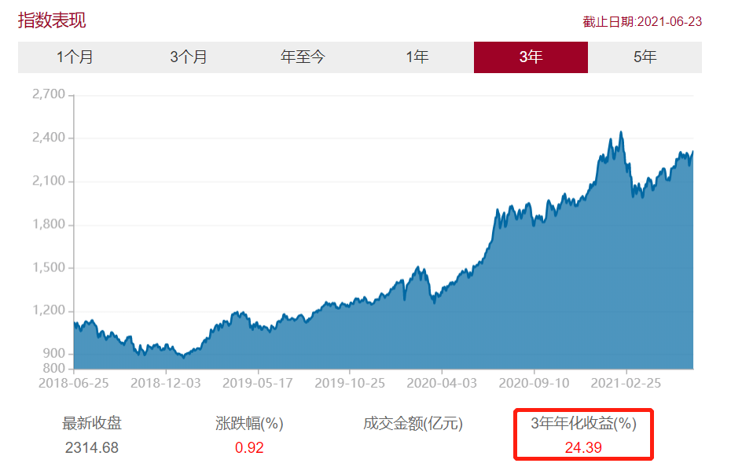
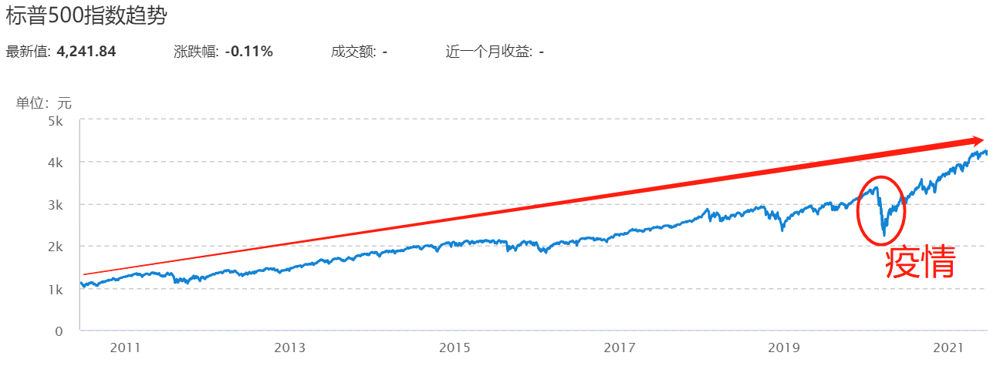
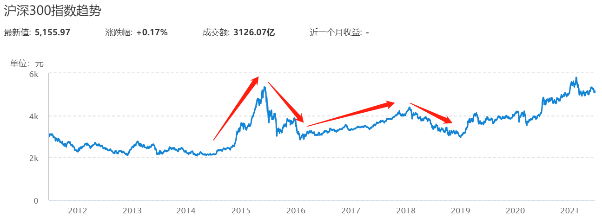
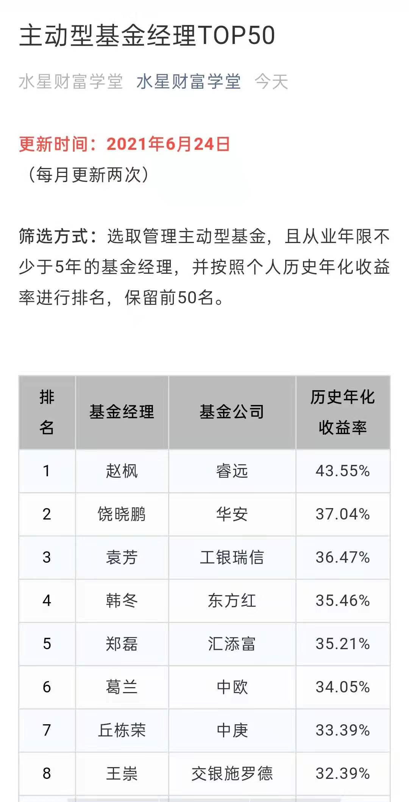
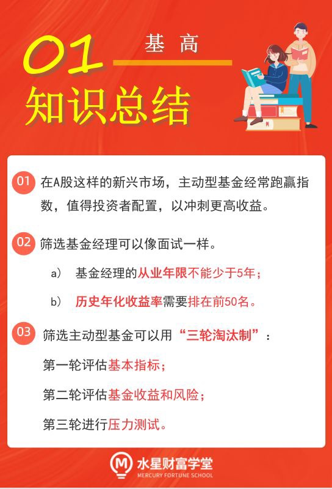
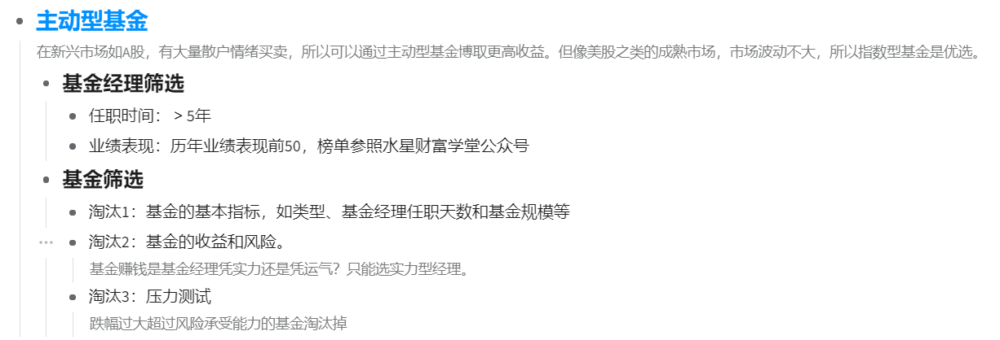
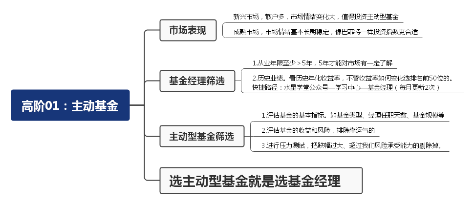

## 新兴市场, 跑赢指数并不难

小伙伴们你们好, 恭喜你们过五关斩六将, 来到了基金学习的最终站:《基金高阶训练营》.

在初级课和进阶课中, 我们学习了许多指数基金, 它们都属于被动型基金. 也就是说, 基金经理不主动挑选股票, 而是被动地复制指数的成分.

而在股票型基金的海洋里, 除了指数基金以外, 还有大量的主动型基金. 基金经理主动选股、择时力图获得超越市场平均水平的收益.

那么, 主动型基金的表现, 到底能不能超越市场平均水平呢? 在国内市场, 这是完全可以实现的.

从 2018 年 6 月到 2021 年 6 月, 3 年时间里, 投资沪深 300 指数的年化收益率为 12.57%, 而主动型基金的总体回报水平为年化 24.39%.(数据来源: 中证指数有限公司)

(图为中证主动式股票型基金指数表现, 该指数可反映主动型基金的总体表现.)

很多优秀的主动型基金, 历史表现远远跑赢沪深 300, 甩出了指数化投资八条街!

有的小伙伴可能想问, 既然主动型基金有这么好的表现, 为什么股神巴菲特非要推荐大家投资指数基金呢?

而且, 巴菲特还曾有个"十年赌约", 验证了主动型基金无法战胜指数. 难道赌约是假的吗?

其实, 巴菲特推荐指数基金没错, "十年赌约"也不假, 关键问题在于, 巴菲特主要投资于美股市场, 美股属于成熟市场. 除非出现金融危机、疫情、战争等重大事件, 否则美股的涨势非常稳定.

以标普 500 指数为例, 在过去 10 年里, 除了 2020 年疫情爆发时出现了较大幅度下跌, 其他大部分时间几乎可以说是"稳稳地上涨".

之所以这么稳, 是因为美股以机构投资者为主, 散户只占很小的比例. 机构投资者大都是很理性的, 没有太多情绪化交易, 所以很难创造出暴涨暴跌的机会.

反观"大 A 股", 由于发展时间较短, 还属于新兴市场, 散户占比大, 情绪化交易非常明显, 经常制造出暴涨暴跌的机会.

国内的基金经理, 便可以抓住这些机会, 大跌时捡便宜拿筹码, 大涨时又能放大收益, 从而跑赢指数.

所以说, 成熟市场和新兴市场的投资方式不一样. 在成熟市场, 主动型基金很难跑赢指数, 所以不值得配置; 但在 A 股这样的新兴市场, 主动型基金经常跑赢指数, 值得投资者配置, 以冲刺更高收益.

## 选定靠谱的基金经理

虽然主动型基金值得投资, 但不代表随便买几只就可以跑赢指数哦.

那么, 到底该怎么筛选主动型基金呢?

方法很多, 指标也很多, 但一切都绕不开一句话: 选主动型基金就是选基金经理.

基金经理选择投资哪些股票, 选择多大仓位, 选择在什么时候买入, 在什么时候卖出, 直接影响到基金的表现.

能不能跑赢指数, 关键就看这个人眼光好不好, 本事大不大了.

所以, 我们在筛选基金之前, 需要先筛选一遍基金经理. 对于表现优秀的基金经理, 我们再进一步去研究他管理的基金; 对于未入选的基金经理, 我们直接排除, 就不用再去看他管理的基金啦.

如何筛选基金经理呢? 简单来说, 我们可以像面试一样来操作.

面试的时候, 面试官需要考察应聘者两个最基本的问题: 你工作多久了? 你之前做出过什么成绩?

同样, 我们也可以拿这两个问题来考察一下基金经理.

第一, 你工作多久了?

这一问是在考察基金经理的从业年限. 毕竟基金经理也属于工作岗位, 经验丰富的"老司机"会更加靠谱.

对于普通工作来说, 有 3 年以上的工作经验就算"老司机"啦. 但是在投资界, 3 年还不足以反映"市场先生"的脾气; 而且, 投资和我们的钱直接相关, 所以要卡得更严一点. 我们可以把标准定为 5 年.

基金经理的从业年限不能少于 5 年, 否则就排除, 等他资历足够了再予以考虑.

第二, 你之前做出过什么成绩?

这一问是在考察基金经理的历史业绩. 评价标准很简单, 就看他能带来多高的投资收益率.

以往投资回报高的, 未来保持高回报的可能性比较大; 以往投资回报低的, 未来扭转乾坤的可能性就很小了.

那么, 到底达到多高的收益率才算优秀呢?

这里我们不设置具体的数字, 而是按照历史年化收益率, 给基金经理排一下名次. 不管收益率如何变化, 我们都选排名最靠前的 50 个人就可以啦.

那么, 基金经理的从业年限、历史年化收益率数据在哪看呢?

水星财富学堂已经给大家整理出了现成的数据, 不需要大家手动计算啦.

在"水星财富学堂"公众号, 底部菜单点击"学习中心"; 在跳转后的页面找到"基金经理"按钮, 点开就可以看到"主动型基金经理 TOP50"啦.

这 50 名全部满足从业年限不少于 5 年, 排名的依据就是历史年化收益率.

由于考察的历史业绩达到了 5 年以上, 每天的涨跌对总收益率的影响非常有限, 单日的数据变化幅度往往不足 0.1%, 所以小伙伴们不需要每天关注数据变化. 这份表格的更新频率是每月 2 次, 大家参考最近一次的统计数据即可.

## 启动"三轮淘汰制"

我们根据两个筛选条件, 选出了 50 位基金经理. 这些基金经理管理的基金全都可以买入吗? 当然不是啦.

主动型基金的预期回报更高, 相应地, 就需要我们付出更多的精力, 进行严格筛选, 把不符合条件的淘汰, 最终只留下通过了层层考验的基金.

接下来, 我们将化身基金界的"评委", 正式开启选基之旅. 选基过程可以总结为"三轮淘汰制".

第一轮, 评估基金的基本指标. 例如基金类型、基金经理任职天数和基金规模等等. 如果基金的基本指标不过关, 直接在第一轮淘汰.

第二轮, 评估基金的收益和风险.50 位基金经理的历史业绩已经足够优秀了, 但是, 赚到这些收益需要承担多大的风险? 我们将在这一轮严格把关. 而且, 基金赚钱靠的是基金经理的实力还是运气, 性质完全不一样. 只有凭实力赚钱, 未来才可持续. 这一轮, 我们会综合评估基金的收益和风险, 把不达标的基金淘汰掉, 把收益中运气成分较重的基金也淘汰掉.

第三轮, 进行压力测试. 虽然基金的最终收益显得不错, 但是, 在持有的过程中难免涨涨跌跌, 如果中途跌幅太大, 令我们承受不住压力, 可能提前以亏损收场, 无法拿到最终的收益. 这一轮, 我们将把跌幅过大, 超过我们风险承受能力的基金淘汰掉.

经过三轮残酷的淘汰, 最终还能幸存下来的基金, 就可以作为我们的投资标的啦.

各位评委请准备好! 接下来的三节课, 我们将正式进入三轮淘汰制.

## 总结

1. 在 A 股这样的新兴市场, 主动型基金经常跑赢指数, 值得投资者配置, 以冲刺更高收益.
2. 筛选基金经理可以像面试一样. 基金经理的从业年限不能少于 5 年; 历史年化收益率需要排在前 50 名.
3. 筛选主动型基金可以用"三轮淘汰制", 第一轮评估基本指标, 第二轮评估基金收益和风险, 第三轮进行压力测试.

