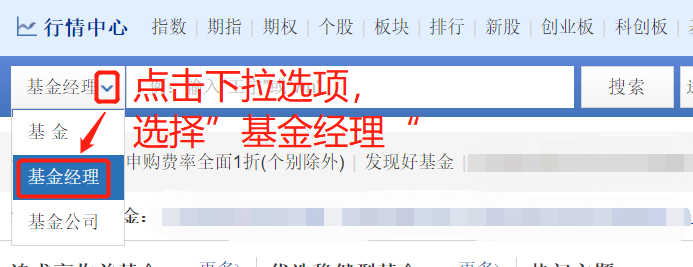
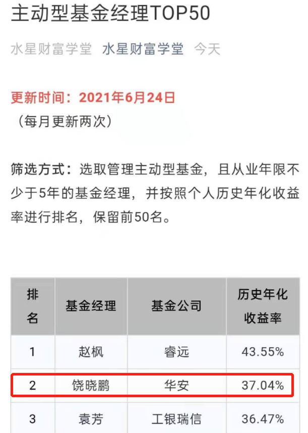
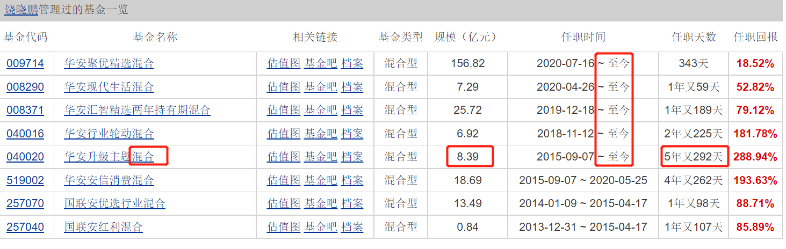
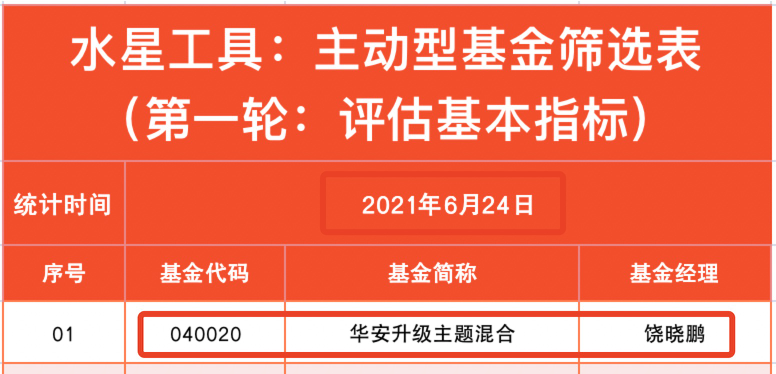
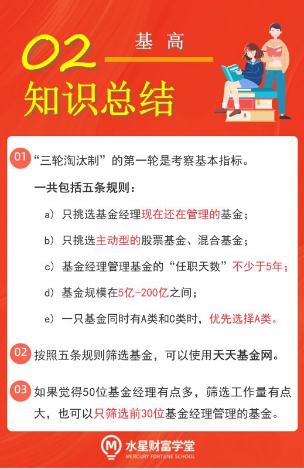
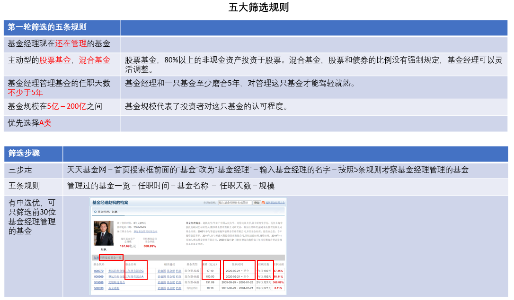
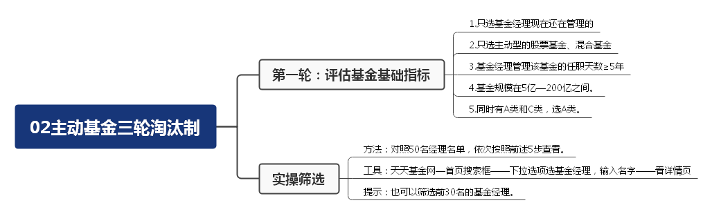

上一节课, 我们了解了筛选主动型基金的"三轮淘汰制", 第一轮评估基本指标, 第二轮评估基金收益和风险, 第三轮进行压力测试.

本节课, 我们就正式进入第一轮, 评估基金的基本指标.

## 第一轮筛选一共有五条规则.

(1)只挑选基金经理现在还在管理的基金.

投资主动型基金重点关注的就是基金经理的能力, 如果基金经理已经离开了某只基金, 我们也没有必要留恋它啦.

(2)只挑选主动型的股票基金、混合基金;

有些基金经理同时管理多只基金, 有主动型的, 也有被动型的; 有债券类的, 也有股票类的.

我们只挑选我们想要的主动型基金. 其中有两类值得大家关注, 一是股票基金, 80%以上的非现金资产投资于股票; 二是混合基金, 股票和债券的比例没有强制规定, 基金经理可以灵活调整. 大部分情况下, 混合基金中占比较大的成分是股票.

(3)基金经理管理基金的"任职天数"不少于 5 年.

之前我们考察的是, 基金经理的从业年限不少于 5 年. 但是, 这 5 年里他有没有频繁跳槽? 有没有在不同基金之间来回切换? 我们没有考察.

基金经理和一只基金至少"磨合"5 年, 对管理这只基金才能驾轻就熟.

所以, 我们把"任职天数"的底线定为 5 年.

(4)基金规模在 5 亿, ~200 亿之间.

基金规模代表了投资者对这只基金的认可程度. 投资者认可度越高, 越愿意买这只基金, 基金规模就会越大.

如果基金规模过小, 说明这只基金不受广大投资者待见, 多多少少存在一些缺陷, 我们不去趟这趟"浑水". 根据经验, 我们可以把 5 亿元作为基金规模的底线, 规模小于 5 亿元的基金不予考虑.

但是, 基金规模不能过大. 因为优质的股票份额本身有限, 如果基金规模过大, 基金经理在配置完优质的股票份额之后, 只能拿多出来的资金配置次好的股票, 从而会拉低收益率. 建议大家选择规模控制在 200 亿以内的基金.

(5)一只基金同时有 A 类和 C 类时, 优先选择 A 类.

C 类份额的基金需要每年缴纳销售服务费, 而我们投资主动型基金需要坚持长期投资, 选择 c 类不划算. A 类份额不收取销售服务费, 建议大家选择 A 类.

## 实操(上): 巧用筛选工具

有了五条规则以后, 我们就要正式开启筛选啦. 接下来, 我们需要对照 50 位基金经理的名单, 逐个筛选他们管理的基金.

以 6 月 24 日的统计结果为例, 排名第一位的基金经理是赵枫. 我们来检查一下他名下有哪些符合条件的基金.

第一步, 打开天天基金网, 将首页搜索框前面的"基金"改为"基金经理".

[天天基金网](https://fund.eastmoney.com/)

第二步, 在搜索框填写基金经理的名字"赵枫", 会自动弹出下拉菜单, 点击其中名字相匹配的一行.

第三步, 按照前面的 5 条规则, 考察基金经理管理的基金.

在跳转后的页面, 可以看到基金经理"管理过的基金一览". 这里有我们第一轮筛选所需的全部信息.

首先, 只挑选基金经理现在还在管理的基金. 我们可以看表格中的"任职时间", 如果任职时间中写着"至今", 就说明符合规则, 否则直接排除. 可以看到, 该基金经理管理的基金中有 2 只符合规则.

其次, 选择主动型的股票基金、混合基金. 这里我们直接看基金名字就知道了. 股票基金的名字里写着"股票", 混合基金的名字里写着"混合". 可以看到, 2 只基金都是混合基金, 符合规则.

第三, 基金经理的任职天数不少于 5 年. 表格中直接展示了"任职天数"这一列, 可以看到, 基金经理在两只基金上的任职天数都只有 1 年又 124 天, 不满足要求.

到这里, 我们可以直接排除这两只基金啦. 也就是说, 第一位基金经理管理的基金中, 没有符合筛选规则的.

那么, 我们就在天天基金网输入第二位基金经理的名字, 执行下一轮筛选过程. 根据排名情况, 第二位基金经理是饶晓鹏.

文稿中展示了其管理过的基金.

其中, 基金经理仍在管理的基金有 5 只, 都是混合基金, 其中 1 只对应的任职天数不少于 5 年. 前三条规则全部通过.

第四条, 基金规模在 5 亿到 200 亿之间. 表中基金的规模为 8.39 亿元, 符合条件.

第五条, 排除 C 类, 优先选择 A 类. 可以看到, 这只基金没有区分 A 类份额和 C 类份额, 所以不用专门考察 A 类和 C 类, 直接保留即可.

此时, 我们终于找到了第一只通过了第一轮筛选的基金.

按照同样的方法, 我们可以继续筛选其他基金经理管理的基金.

## 实操(下): 水星专属筛选表

有的小伙伴可能会说, 排名榜上的基金经理足足 50 位, 管理的基金也很多, 筛选过程会不会很杂乱呢?

大家放心, 训练营会提供专属的筛选表格, 方便大家统计整理筛选结果. 大家可以咨询自己的训练营班班获取表格.

<a href="/水星工具：基金高阶专用.xlsx" target="_blank">水星工具：基金高阶专用.xlsx</a>

首先, 我们把上—小节筛选出来的基金填入表格中.

接下来, 我们需要把 50 位基金经理管理过的基金全部筛查一遍, 把符合条件的全部填入到表格中. 经过 2021 年 6 月 24 日统计, 共有 37 只基金通过了第一轮筛选.

好啦, 第一轮筛选就告一段落啦.

如果你觉得 50 位基金经理有点多, 也可以优中选优, 只筛选前 30 位基金经理管理的基金.

面对这么多入选的基金, 下一步该怎么办呢?

有的小伙伴估计会说: 比一比基金的历史收益就行了, 谁的历史收益高, 就选谁.

对于主动型基金来说, 这么做是不对的. 我们不能仅仅考虑收益, 还需要权衡一下, 获得相应收益需要承担多大风险.

打个比方, 如果赢得 A 比赛可以获得 1 万元, 赢得 B 比赛可以获得 1 亿元, 单看收益, 肯定是参加 B 比赛更值. 但是, 如果 A 比赛没什么成本, 而 B 比赛有搭上性命的风险, 那么很明显, B 比赛就不值得考虑啦.

所以, 风险和收益要综合起来评估.

下一节课, 我们将进入"三轮淘汰制"的第二轮: 评估收益和风险.

本节课的内容到此结束. 下面, 我们一起来回顾一下课程重点.

## 总结

1. "三轮淘汰制"的第一轮是考察基本指标, 一共包括五条规则: 只挑选基金经理现在还在管理的基金; 只挑选主动型的股票基金、混合基金; 基金经理管理基金的"任职天数"不少于 5 年; 基金规模在 5 亿~200 亿之间; 一只基金同时有 A 类和 C 类时, 优先选择 A 类.
2. 按照五条规则筛选基金, 可以使用天天基金网.
3. 如果觉得 50 位基金经理有点多, 筛选工作量有点大, 也可以只筛选前 30 位基金经理管理的基金.

