上一节课, 我们了解了筛选主动型基金的"三轮淘汰制", 第一轮评估基本指标, 第二轮评估基金收益和风险, 第三轮进行压力测试.

本节课, 我们就正式进入第一轮, 评估基金的基本指标.

## 第一轮筛选一共有五条规则.

(1)只挑选基金经理现在还在管理的基金.

投资主动型基金重点关注的就是基金经理的能力, 如果基金经理已经离开了某只基金, 我们也没有必要留恋它啦.

(2)只挑选主动型的股票基金、混合基金;

有些基金经理同时管理多只基金, 有主动型的, 也有被动型的; 有债券类的, 也有股票类的.

我们只挑选我们想要的主动型基金. 其中有两类值得大家关注, 一是股票基金, 80%以上的非现金资产投资于股票; 二是混合基金, 股票和债券的比例没有强制规定, 基金经理可以灵活调整. 大部分情况下, 混合基金中占比较大的成分是股票.

(3)基金经理管理基金的"任职天数"不少于 5 年.

之前我们考察的是, 基金经理的从业年限不少于 5 年. 但是, 这 5 年里他有没有频繁跳槽? 有没有在不同基金之间来回切换? 我们没有考察.

基金经理和一只基金至少"磨合"5 年, 对管理这只基金才能驾轻就熟.

所以, 我们把"任职天数"的底线定为 5 年.

(4)基金规模在 5 亿~200 亿之间.

基金规模代表了投资者对这只基金的认可程度. 投资者认可度越高, 越愿意买这只基金, 基金规模就会越大.

如果基金规模过小, 说明这只基金不受广大投资者待见, 多多少少存在一些缺陷, 我们不去趟这趟"浑水". 根据经验, 我们可以把 5 亿元作为基金规模的底线, 规模小于 5 亿元的基金不予考虑.

但是, 基金规模不能过大. 因为优质的股票份额本身有限, 如果基金规模过大, 基金经理在配置完优质的股票份额之后, 只能拿多出来的资金配置次好的股票, 从而会拉低收益率. 建议大家选择规模控制在 200 亿以内的基金.

(5)一只基金同时有 A 类和 C 类时, 优先选择 A 类.

C 类份额的基金需要每年缴纳销售服务费, 而我们投资主动型基金需要坚持长期投资, 选择 c 类不划算. A 类份额不收取销售服务费, 建议大家选择 A 类.

## 实操(上): 巧用筛选工具

有了五条规则以后, 我们就要正式开启筛选啦. 接下来, 我们需要对照 50 位基金经理的名单, 逐个筛选他们管理的基金.

以 6 月 24 日的统计结果为例, 排名第一位的基金经理是赵枫. 我们来检查一下他名下有哪些符合条件的基金.

第一步, 打开天天基金网, 将首页搜索框前面的"基金"改为"基金经理".

[天天基金网](https://fund.eastmoney.com/)

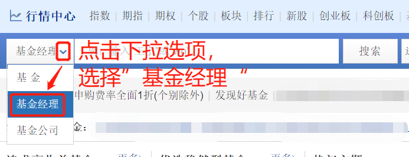

第二步, 在搜索框填写基金经理的名字"赵枫", 会自动弹出下拉菜单, 点击其中名字相匹配的一行.

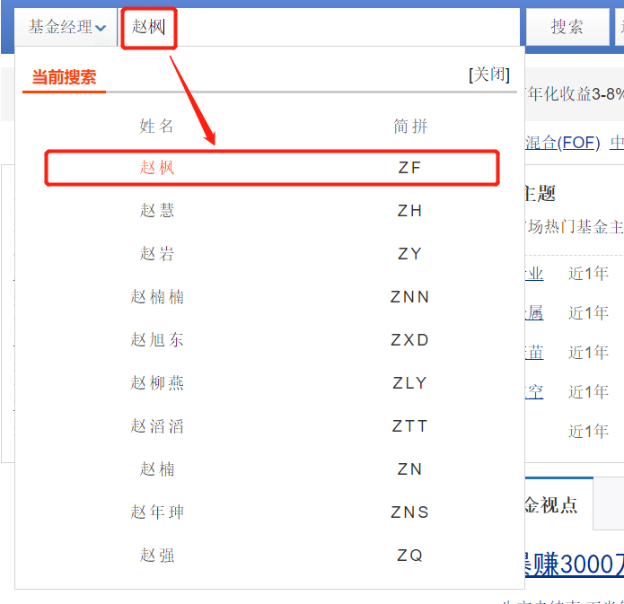

第三步, 按照前面的 5 条规则, 考察基金经理管理的基金.

在跳转后的页面, 可以看到基金经理"管理过的基金一览". 这里有我们第一轮筛选所需的全部信息.

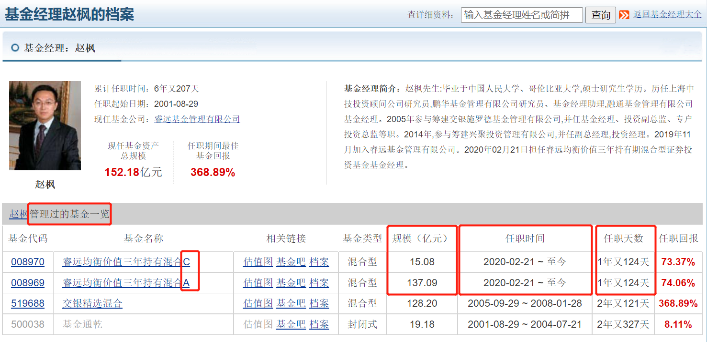

首先, 只挑选基金经理现在还在管理的基金. 我们可以看表格中的"任职时间", 如果任职时间中写着"至今", 就说明符合规则, 否则直接排除. 可以看到, 该基金经理管理的基金中有 2 只符合规则.

其次, 选择主动型的股票基金、混合基金. 这里我们直接看基金名字就知道了. 股票基金的名字里写着"股票", 混合基金的名字里写着"混合". 可以看到, 2 只基金都是混合基金, 符合规则.

第三, 基金经理的任职天数不少于 5 年. 表格中直接展示了"任职天数"这一列, 可以看到, 基金经理在两只基金上的任职天数都只有 1 年又 124 天, 不满足要求.

到这里, 我们可以直接排除这两只基金啦. 也就是说, 第一位基金经理管理的基金中, 没有符合筛选规则的.

那么, 我们就在天天基金网输入第二位基金经理的名字, 执行下一轮筛选过程. 根据排名情况, 第二位基金经理是饶晓鹏.

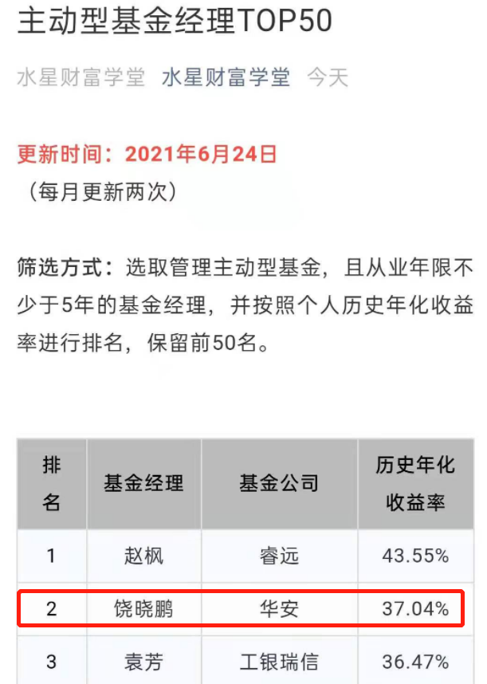

文稿中展示了其管理过的基金.

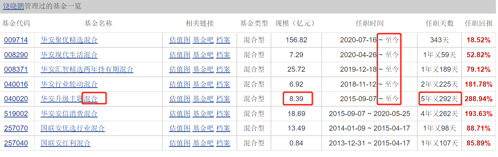

其中, 基金经理仍在管理的基金有 5 只, 都是混合基金, 其中 1 只对应的任职天数不少于 5 年. 前三条规则全部通过.

第四条, 基金规模在 5 亿到 200 亿之间. 表中基金的规模为 8.39 亿元, 符合条件.

第五条, 排除 C 类, 优先选择 A 类. 可以看到, 这只基金没有区分 A 类份额和 C 类份额, 所以不用专门考察 A 类和 C 类, 直接保留即可.

此时, 我们终于找到了第一只通过了第一轮筛选的基金.

按照同样的方法, 我们可以继续筛选其他基金经理管理的基金.

## 实操(下): 水星专属筛选表

有的小伙伴可能会说, 排名榜上的基金经理足足 50 位, 管理的基金也很多, 筛选过程会不会很杂乱呢?

大家放心, 训练营会提供专属的筛选表格, 方便大家统计整理筛选结果. 大家可以咨询自己的训练营班班获取表格.

<a href="/水星工具：基金高阶专用.xlsx" target="_blank">水星工具：基金高阶专用.xlsx</a>

首先, 我们把上—小节筛选出来的基金填入表格中.

接下来, 我们需要把 50 位基金经理管理过的基金全部筛查一遍, 把符合条件的全部填入到表格中. 经过 2021 年 6 月 24 日统计, 共有 37 只基金通过了第一轮筛选.

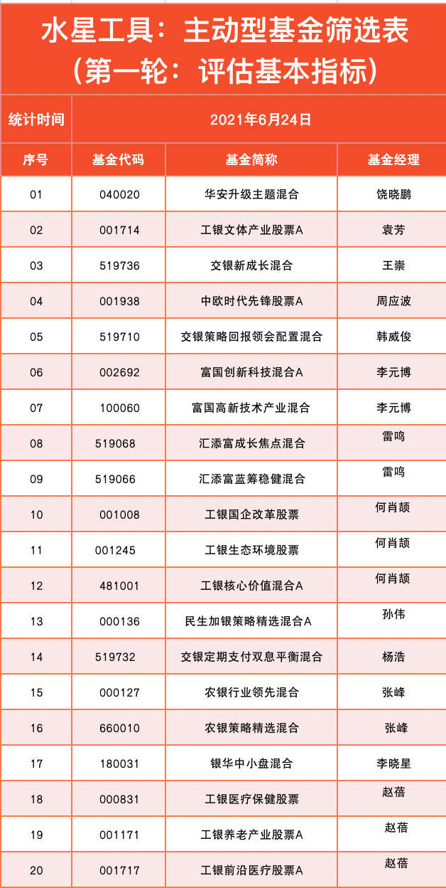

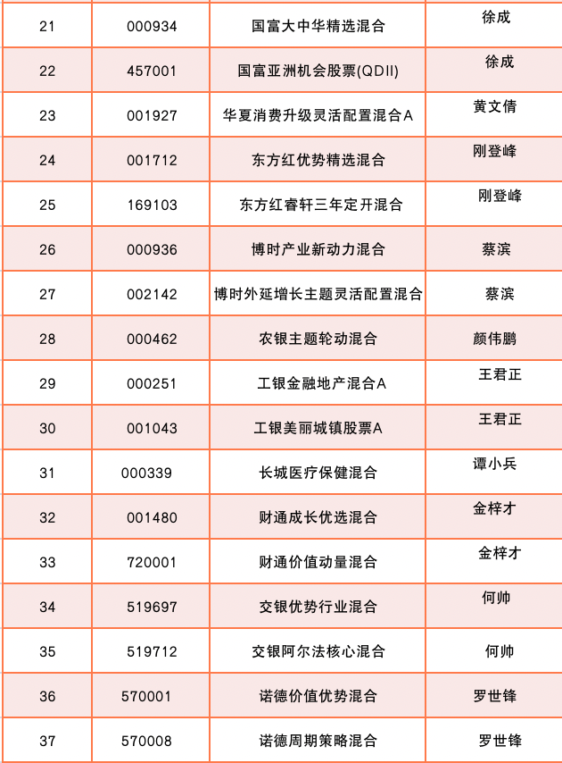

好啦, 第一轮筛选就告一段落啦.

如果你觉得 50 位基金经理有点多, 也可以优中选优, 只筛选前 30 位基金经理管理的基金.

面对这么多入选的基金, 下一步该怎么办呢?

有的小伙伴估计会说: 比一比基金的历史收益就行了, 谁的历史收益高, 就选谁.

对于主动型基金来说, 这么做是不对的. 我们不能仅仅考虑收益, 还需要权衡一下, 获得相应收益需要承担多大风险.

打个比方, 如果赢得 A 比赛可以获得 1 万元, 赢得 B 比赛可以获得 1 亿元, 单看收益, 肯定是参加 B 比赛更值. 但是, 如果 A 比赛没什么成本, 而 B 比赛有搭上性命的风险, 那么很明显, B 比赛就不值得考虑啦.

所以, 风险和收益要综合起来评估.

下一节课, 我们将进入"三轮淘汰制"的第二轮: 评估收益和风险.

本节课的内容到此结束. 下面, 我们一起来回顾一下课程重点.

## 总结

1. "三轮淘汰制"的第一轮是考察基本指标, 一共包括五条规则: 只挑选基金经理现在还在管理的基金; 只挑选主动型的股票基金、混合基金; 基金经理管理基金的"任职天数"不少于 5 年; 基金规模在 5 亿~200 亿之间; 一只基金同时有 A 类和 C 类时, 优先选择 A 类.
2. 按照五条规则筛选基金, 可以使用天天基金网.
3. 如果觉得 50 位基金经理有点多, 筛选工作量有点大, 也可以只筛选前 30 位基金经理管理的基金.

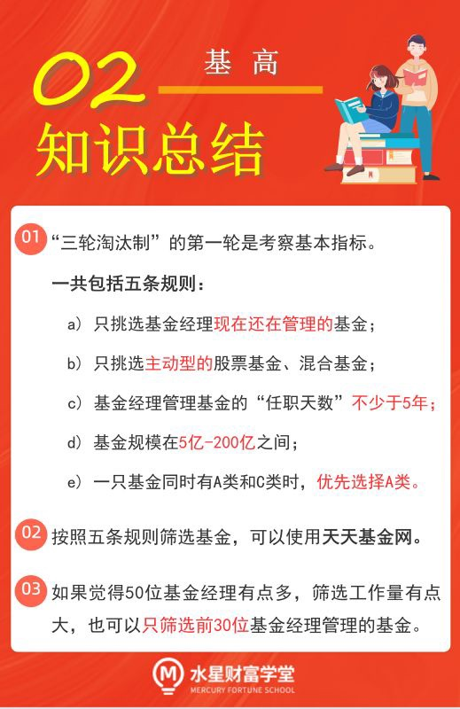

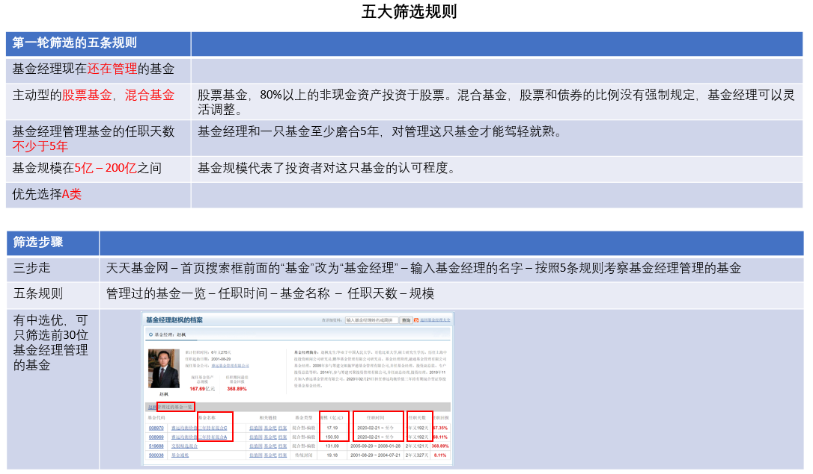

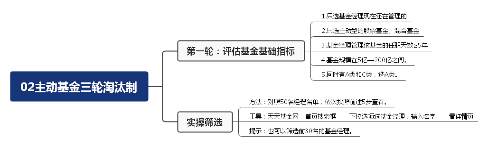

## 高手怎么阅读主动型基金报告?

一起跟着班班, 到基金报告里"挖宝"吧!

班班先来解释一下, 为什么买基金要看基金报告. 基金的报告里面能看出些什么信息, 对咱们投资赚钱有什么用.

基金报告里面很清晰地展示了基金的投资目标、投资策略、风险和收益情况等等, 都在一张表里, 字不多, 一目了然, 方便我们更清晰地认识我们所买的基金.

报告里还有基金经理对投资策略和业绩表现的说明, 而且还有对未来的投资展望. 基金跌了是因为什么, 涨了是因为什么, 未来收益水平会如何变化, 这些问题的答案经常会藏在报告里哦.

而且有些基金经理会把自己的分析写得非常详细. 咱们除了能了解目前的投资情况, 还能学到大佬们的投资经验、独家干货哦. 就像我们今天课程学习明星基金经理的投资逻辑~

最后, 有些基金是机构定制产品, 对我们个人投资者并不友好, 这种基金需要排除. 我们通过阅读报告, 可以一眼看穿这种"机构定制货", 直接排雷.

说了这么多好处, 想必大家都想实操阅读一下基金报告了. 话不多说, 我们现在就开始.

### 一、锁定"定期报告"

公募基金隔三差五就会发布各种各样的公告, 比如基金销售搞优惠活动啦, 基金经理换人啦, 发布招募说明书啦, 等等. 这些都是证监会要求的, 必须做的信息披露.

但是我们不用所有的公告都打开看一遍, 大部分人没这个闲心和精力. 今天班班带大家着重看一下, 其中最重要的一种基金公告: 定期报告.

定期报告是投资者最关注的内容, 因为它们会对基金的具体投资运作情况进行披露. 班班在开头说到的那些看报告的用处, 都可以在定期报告里找到.

定期报告分为三种: 季报、半年报、年报. 其中季报最简单, 半年报和年报更加详细.

季报一年披露 4 份, 分别在每年 1 月、4 月、7 月、10 月当月 20 日左右披露上个季度的季报.

半年报每年 1 份, 每到 8 月底披露上半年报. 基金没有下半年的半年报. 年报每年 1 份, 每年的 3 月底披露上一年的年报.

班班给大家总结成了表格, 大家可以保存起来:

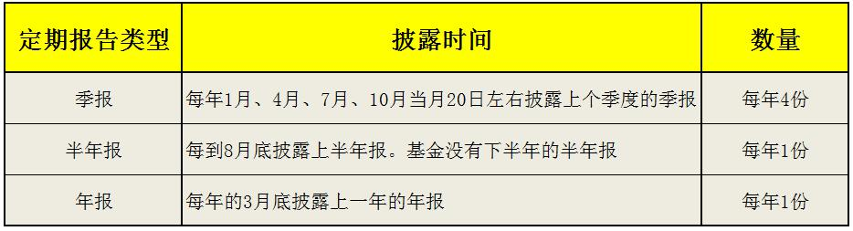

因为年报里面的信息是最全的, 所以班班带着大家实操看一遍基金的年报. 学会以后, 其他的半年报、季报大家就能轻易搞定了.

### 二、在哪看年报?

我们以景顺长城核心竞争力混合 A(代码:260116)为例, 来看一下看年报的整个流程.

提醒一下: 这只基金只是用来作为案例教学, 不代表投资建议, 大家不要抄代码哦.

想要找到基金的定期报告, 一共分四步.

第一步, 打开[天天基金网](网址:https://fund.eastmoney.com/) 在搜索框输入基金的名字或代码, 点击搜索.

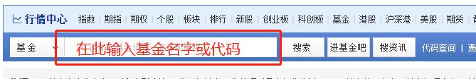

第二步, 在跳转出来的页面中, 点击"基金公告". 位置大家看下图 ↓↓↓, 在右下角

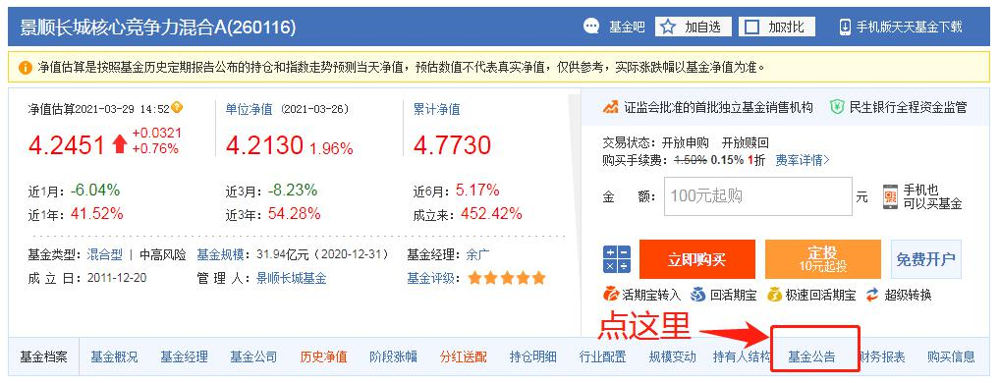

点开以后, 我们就能看到这只基金相关的所有公告啦, 而且最新公告在最前面, 方便我们按时间顺序查看.

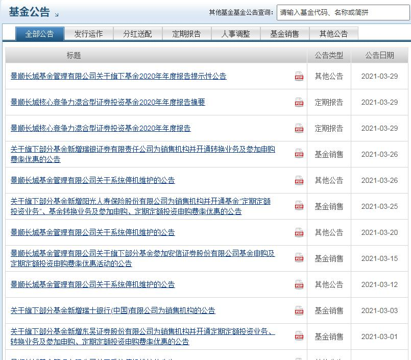

第三步, 我们从前往后找一下, 找到"景顺长城核心竞争力混合型证券投资基金 2020 年年度报告", 点开它.

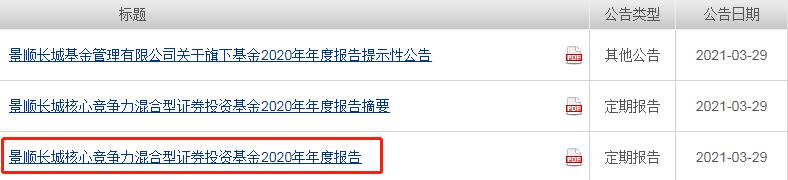

第四步, 在跳转出来的页面中, 点击"查看 PDF 原文".

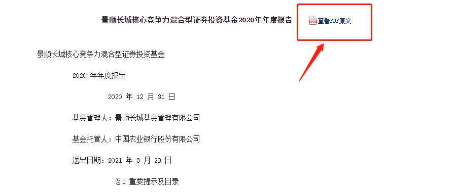

好啦, 此时我们就正式打开了一份完整的基金年报. 接下来, 我们马上来分析里面的具体内容.

### 三、解读报告内容

大家会发现, 这份报告全部看下来, 一共有 68 页, 比很多硕士、博士论文还长, 全看的话估计大家要头皮发麻了.

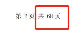

不要紧, 我们不用全看, 班班给大家画个重点.

我们总共看四个方面:

(1)审计意见;

(2)持有人户数和持有人结构;

(3)基金产品说明;

(4)管理人对报告期内基金的投资策略和业绩表现的说明.

先来看第一点, 审计意见. 主要是为了预先确认一下, 这份报告里所说的内容是否可信.

实操很简单, 一步搞定, 在报告中搜索关键词"审计意见类型", 直接定位到我们想看的地方.

键盘的快捷键是 ctrl+f, 按下后会跳出检索框, 在框中输入"审计意见类型"6 个字, 就搞定啦.

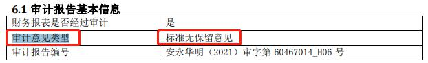

我们可以看到, 这只基金的审计意见类型是"标准无保留意见".

审计意见是专门检查公司反映情况是否属实的审计师给出的, 受到证监会的监管, 意见是比较可靠的. 审计意见类型一共五种: 标准无保留意见、带强调事项段的无保留意见、保留意见、无法表示意见和否定意见.

标准无保留意见, 相当于告诉咱们"质检合格", 这份报告所说的内容可以当真. 那么咱们就相对放心了. 至于其他四种意见, 都说明报告的可信赖度没那么高.

一旦出现后四种意见, 咱们不管它是什么原因导致的, 本着疑罪从有的原则, 直接排除这只基金. 市面上的基金几千只, 没有必要在一只基金上浪费这种时间.

只要看到"标准无保留意见", 我们就可以进入下一步啦.

接下来咱们要看的是"持有人户数和持有人结构". 同样利用快捷键 ctrl+f 进行检索, 这次检索的关键词是"持有人结构"5 个字. 检索可以找到如下位置:

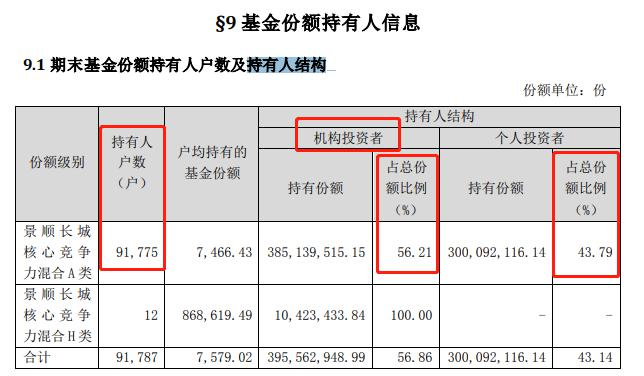

大家也可以直接在目录中点击"基金份额持有人信息", 也是可以定位到这里的哦.

我们可以看到一组关键数据, 景顺长城核心竞争力混合 A 类, 持有人户数一共 91775 户, 机构投资者占比 56.21%, 个人投资者占比 43.79%.(表中的 H 类大家不用管, H 类指仅在香港地区发售, 跟咱们关系不大)

这组数据有什么用呢? 其实是帮助我们"排雷"用的, 而且可以排掉两个雷哦~

首先可以帮我们预防基金清盘风险. 所谓的清盘, 就是说, 这只基金到此为止了, 以后不运作了, 大家投进来的钱分回给大家, 以后就见不到这只基了. 背后的原因主要是, 基金收益不给力, 导致参与投资的人数太少, 募集的资金量太小.

基金清盘需要很久的时间, 资金回本时间较久, 在此期间咱们无法拿这笔钱进行其他投资, 对我们投资者来说是一种损失.

如果连续 60 日基金资产净值低于 5000 万元, 或者连续 60 日持有户数不到 200 户, 就可以触发清盘的条件.

所以, 咱们在年报里看到的持有人户数, 必须大于 200, 而且是越多越好. 因为户数越多, 说明投资者越分散, 哪怕其中三五户的人申请赎回, 不会造成巨大冲击. 如果户数过少, 万一出现集中赎回, 就会冲击到我们的收益.

班班建议把户数要求定在 500 户以上, 低于 500 户的基金要谨慎考虑.

其次再看机构投资者的占比数据. 如果机构占比超过 90%, 那么要警惕, 这只基金很可能是机构定制产品, 我们个人投资者需要规避.

这一点主要也是为了防止集中赎回造成的冲击. 如果机构做了大额赎回, 对机构来说可能只是常规操作, 但是对我们小散户来说冲击可不小, 毕竟机构手里的都是巨量资金, 咱们小散户跟他们根本没法比, 对赎回的承受力也不是一个级别.

班班举个反面例子: 建信鑫丰回报灵活配置混合. 班班去查了它 2019 年的年报, 持有人户数总共只有 315 户, 机构投资者占比 99.86%, 典型的机构定制产品.

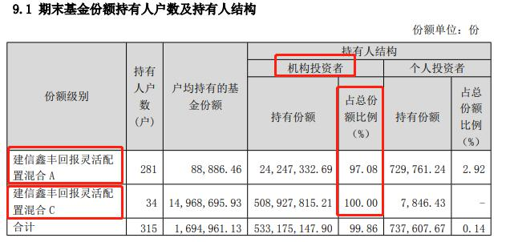

2016 年 1 月 28 日, 建信鑫丰回报灵活配置混合 C, 单位份额净值为 1.039 元, 1 月 29 日却只剩 0.337 元, 一天时间暴跌 67.56%!

事后基金公司发公告解释这件事, 明确是因为产生了巨额赎回.

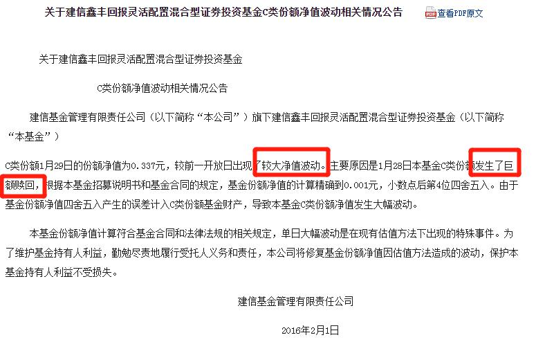

一天暴跌 67.56%, 对于机构来说可能只是一小部分钱, 但是对于很多散户而言是致命的打击. 所以建议大家避开机构定制产品.

总结一下:

第一看户数, 要在 500 户以上;

第二看机构占比, 不能超过 90%~ 两个条件有任何一个不满足, 就直接排除.

如果这一步检查合格了, 那么我们继续往下看第三个点.

第三点, 基金产品说明.

还是老方法, 直接 ctrl+f 搜索, 关键词是"基金产品说明", 定位到下图位置.

我们可以看到投资目标、投资策略、业绩比较基准和风险收益特征. 这四个部分方便我们对这只基金有更充分的认识.

投资目标: 比如咱们举例的景顺长城核心竞争力混合这只基金, 投资目标写了"基金资产的长期资本增值". 说明基金经理投资遵循的是长期逻辑, 如果是选择它来短期炒作就不适合了.

投资策略: 涉及到很多专业的分析术语, 大家不用管. 咱们把钱交给基金经理打理就是图方便的, 不需要自己精通这些技术. 但是有一点需要关注一下: 有些基金会在"投资策略"这里写明投资股票和债券的比例.

比如易方达平稳增长混合(110001)这只基金, 股票资产 30-65%, 债券资产 30-65%, 现金资产不低于 5%.

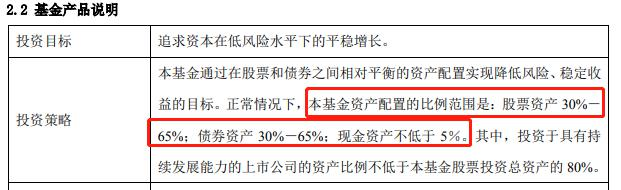

这就给我们释放了一个信号, 这只混合基金比较侧重于稳健, 股票资产最多也只能是 65%, 咱们的预期收益就不能抬得太高.

然后是业绩比较基准: 是为了和基金的收益做对比, 提供一个参考. 这在接下来要讲的第四点中会用得上, 大家可以先记着.

最后是风险收益特征: 我们可以看到景顺长城这只基金属于较高风险、较高收益的品种.

基金产品说明就讲这么多啦. 接下来咱们进入最后一个方面: 管理人对报告期内基金的投资策略和业绩表现的说明直接把上面这行字打在 ctrl+f 的检索框中, 就找到啦.

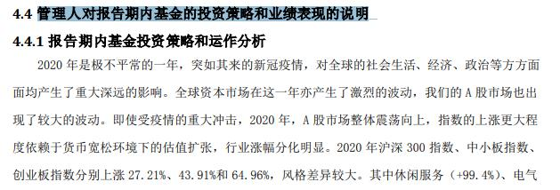

在这一部分, 我们可以看到基金经理的精彩"小作文". 他们会详细分析市场变化, 说明自己的投资策略, 展示自己的收益情况, 同时展望一下未来趋势.

比如景顺长城核心竞争力混合这只基, 信息量就很大:

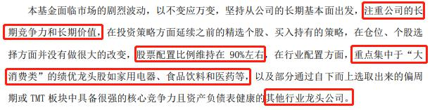

咱们至少能看到这样几点:

第一, 经理注重公司的长期竞争力和长期价值, 是按照长期逻辑来投资的;

第二, 股票配置比例维持在 90%以上, 说明风格相对激进, 风险和收益等级较高;

第三, 重点投资大消费类的绩优龙头股, 如家用电器、食品饮料和医药等, 这样我们对所投资的行业有了一个整体把握;

第四, 还选择了一些其他行业的龙头公司, 分散一下投资风险.

然后我们还能看到基金的业绩表现:

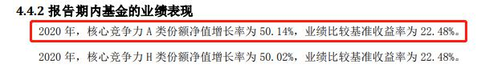

2020 一整年, 这只基金涨了 50.14%, 业绩比较基准收益率为 22.48%, 说明基金远远跑赢了比较基准.

最后我们还能看到基金经理对未来的展望.

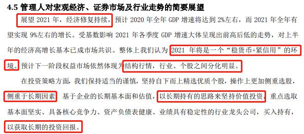

基金经理写得比较宏观, 提到了 2021 年将是一个"稳货币+紧信用"的环境. 也就是印钱放水的可能性不大, 各种发放贷款会卡信用, 把关很严格; 所以流向股市的钱预计不会太多, 大牛市可能性不大, 但是会有结构性行情, 需要精选行业和个股.

当然, 不是每个基金经理都是从宏观角度来写. 整个这一部分没有严格的格式, 基金经理可以把自己想要分享给投资者的话写进这里, 不管是宏观的还是具体的, 有时候甚至还带有心理按摩.

接着, 经理连续三次提到了"长期"两个字: 侧重于长期因素; 以长期持有的思路来坚持价值投资; 以获取长期的投资回报. 可见基金经理是一名坚定的长期主义者.

好啦, 整个基金年报就看这么多了. 班班再次总结一下, 一共四个方面:

## 晚分享总结

(1)审计意见;

(2)持有人户数和持有人结构;

(3)基金产品说明;

(4)管理人对报告期内基金的投资策略和业绩表现的说明.

大家可以拉出其他的基金, 按照上面的步骤练练手.

最后提醒一下同学们, 咱们刚才看的是年报, 而且也说到了基金的定期报告除了年报, 还包括半年报等.

年报的信息是最全的, 所以咱们刚才想找的部分都能找到. 但是有些信息在半年报和季报里是不展示的.

基金的半年报和季报都没有审计报告, 所以我们只需要每年看一次年报的审计报告就行了, 不需要一年看很多次.

再比如, 持有人户数和机构投资者占比, 以及基金经理对未来的展望, 这些在年报和半年报里都有, 但是季报里是没有这一部分的.

大家看到有缺少的部分不要疑惑, 把年报、半年报、季报结合着来看就行啦.
