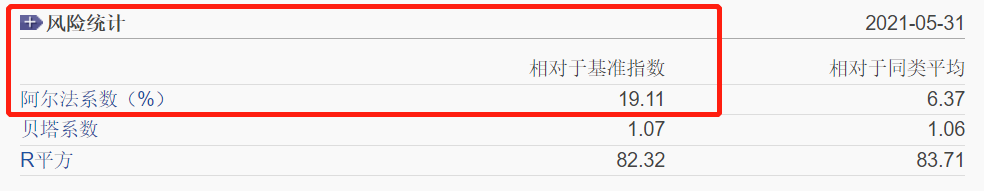

上一节课, 我们开启了"三轮淘汰制", 严选主动型基金, 并且已经成功完成了第一轮淘汰.

本节课, 我们正式进入第二轮淘汰, 评估基金的收益和风险.

评估过程到三个指标, 分别是夏普比率、基金评级和 α 系数. 首先我们来看夏普比率.

## 夏普比率

夏普比率相当于投资的"收益风险比", 也可以理解为"性价比". 其公式如下:

夏普比率=(预期年化收益率-无风险利率)/标准差

有的小伙伴最害怕看到公式啦. 大家不要慌, 实际筛选时, 夏普比率是一个可以直接看的指标, 不需要大家手动计算. 看公式只是为了帮助大家理解它的意思.

首先, 我们来看夏普比率的分子: 预期年化收益率-无风险利率.

预期年化收益率, 指的是我们预计可以达到的年化收益率水平; 无风险利率, 指的是大家不承担风险就可以获得的回报, 相当于银行存款的利率.

如果分子为负数, 就说明预期年化回报率小于无风险利率, 也就是说, 投资该基金还不如把钱存到银行.

如果分子为正数, 就说明预期年化收益率大于无风险利率, 也就是说, 投资该基金的回报起码好过银行存款.

总之, 夏普比率的分子反映的是基金的收益水平. 大家记住这一点就可以啦.

其次, 我们再来看夏普比率的分母: 标准差.

标准差评估的是基金过往的波动性. 标准差越大, 说明基金波动性越大, 投资风险越高; 标准差越小, 说明基金波动性越小, 投资风险越低.

所以, 夏普比率的分母反映的是基金的风险水平.

好啦, 现在我们可以得出, 夏普比率的本质, 就是用基金的收益除以风险.

夏普比率越高, 说明同等风险下收益更高, 或者同等收益下风险更低, 大家可以直接把夏普比率当作买基金的"性价比"指标. 夏普比率越高越好. 数值越高, 基金的性价比就越高.

为了淘汰不合格的基金, 我们需要给夏普比率设置一个下限. 夏普比率低于下限的基金全部淘汰. 那么, 夏普比率最小多少合适呢?

其实, 单看某一个夏普比率的数值没有意义. 我们需要将拿它来跟指数做对比.

对一只主动型基金来说, 如果它的夏普比率高于指数的夏普比率, 就说明它的性价比高, 买它要好于买指数基金; 如果它的夏普比率低于指数的夏普比率, 就说明它的性价比低, 买它还不如买指数基金.

不过, 指数那么多, 选哪一个来作为参照呢?

沪深 300 指数, 作为股票指数的典型代表, 基本可以反映整个股票市场的表现, 而且也被大多数基金经理作为业绩比较基准.

我们不妨选择沪深 300 指数, 将它的夏普比率作为底线. 高于它的, 判断为合格; 低于它的, 直接淘汰.

沪深 300 指数的夏普比率应该怎么看呢? 我们只需要找—只沪深 300 指数基金, 去晨星网查一下就可以啦.

[晨星网](https://www.morningstar:cn/)

以"华泰柏瑞沪深 300ETF""为例, 代码 510300, 我们在晨星网首页的搜索框输入代码, 找到这只基金, 点击查看它的详细信息.

在"风险评估? 一栏, 可以看到它的夏普比率数值. 课程中的查询日期为 2021 年 6 月 24 日, 其结果为: 三年的夏普比率为 0.72, 五年的夏普比率为 0.75.

这两个数值, 就是我们第二轮淘汰的基准.

为了方便大家筛选, 水星财富学堂准备了专属的筛选表格, 大家只需要录入查到的数据, 就可以自动生成筛选结果啦.

<a href="/水星工具: 基金高阶专用.xlsx" target="_blank">水星工具: 基金高阶专用.xlsx</a>

首先, 我们在表头中录入淘汰基准, 也就是沪深 300 的三年夏普比率和五年夏普比率.

然后, 在第一轮留下的基金中, 我们将每一只基金的三年夏普比率、五年夏普比率都查一遍, 录入到表格中. 如果晨星网缺乏数据, 我们就用录入一个破折号("———"')来代替.

大家注意看文稿中的图片, 第一轮筛选和第二轮筛选的每一行, 都有对应关系, 可不要写错行哦.

数据录入完成后, 不需要大家亲自和沪深 300 的夏普比率做对照, 表格会在最后自动生成筛选结果哦.

不过, 在得到最终的筛选结果之前, 我们还需要填写完表格中剩余的三列数据: 三年晨星评级、五年晨星评级和 α 系数.

## 基金评级

除了夏普比率以外, 还有一个指标也同时考虑了基金的收益和风险, 那就是晨星评级.

晨星网把每只具备 3 年以上业绩数据的基金归类, 在同类基金中进行排名. 排名前 10%的被评为 5 星; 接下来 22.5%被评为 4 星; 中间 35%被评为 3 星; 随后 22.5%被评为 2 星; 最后 10%被评为 1 星.

有的小伙伴可能以为, 晨星评级只是纯粹的基金收益指标, 基金赚的越多, 评级就越高. 这种想法是错误的哦! 大家注意, 晨星网在给基金排名时, 依据的是"晨星风险调整后收益".

所谓的"风险调整后收益", 就是剔除了风险因素后的收益. 虽然晨星网没有公开具体的算法, 但我们没必要自己计算, 只需要了解, 晨星评级是兼顾收益和风险的指标, 然后学会利用它就好啦.

晨星评级也是越高越好. 大家对评级可以这样理解: 五星代表优秀, 四星代表良好, 三星代表一般, 两星代表较差, 一星代表特别差.

我们要想筛选优质的主动型基金, 起码得要求达到良好的水平, 也就是晨星评级为四星或者五星.

接下来, 我们就把每一只基金的晨星评级填入到水星专属表格中.

以第一轮保留下来的第一只基金为例, 代码 040020, 我们在晨星网首页的搜索框输入代码, 找到这只基金, 点击查看它的详细信息.

在"晨星评级"—栏, 可以看到, 这只基金的三年评级是五星, 五年评级是四星.

大家不用每只基金都去判断是否达标, 只需要如实填写晨星评级, 表格会自动为大家进行判断的.

在填写的时候大家注意, 不需要填写星星这么麻烦. 评级为几颗星, 我们就填写相应的阿拉伯数字, 就可以啦. 比如前面刚查询的这只, 三年评级是五颗星, 我们就在它的三年评级一格填写数字 5; 五年评级四颗星, 我们就在它的五年评级一格填写数字 4.

其他基金也是一样的查看方法. 我们按照上述方法, 把两列评级数据填好.

现在就只剩下一列数据了, 就是:α 系数.

## α 系数

在理解什么是"α 系数"之前, 我们先来看一个通俗的例子.

假如你在一列火车的车厢里, 向前走了 1 米, 同时, 火车向前开了 100 米. 那么, 你实际走出去距离就不是 1 米啦, 而是 101 米.

也就是说, 你前进的距离等于, 你自己走的, 再加上火车带你走的.

其实投资也是一样. 基金经理进入股市赚钱, 就像上了一趟火车. 他赚到的钱, 一部分是凭自己选股、择时的本事赚的, 还有一部分是由于股市整体上涨, 带着所有参与者一起赚的.

凭基金经理选股的本事赚的, 叫做 α 收益, 也叫"绝对收益".α 收益特别能体现基金经理的真实水平.

至于股市整体上涨, 带着所有参与者一起赚的部分, 叫做 β 收益. 这部分收益虽然也是真金白银, 但毕竟包含很大的运气成分, 属于典型的"看天吃饭", 难以体现基金经理的真实水平.

所以, 我们重点考察 α 收益就好啦.

α 系数是评估 α 收益的一项指标.α 系数越高, 代表基金经理越牛, 越能战胜市场. 一般来说, α 系数在 15%以上, 就算不错的水平啦.

查询 α 系数用到的工具依然是晨星网. 依旧以第一轮保留下来的第一只基金为例, 代码 040020, 我们查看一下它的详细信息.

在"风险统计"一栏, 就可以看到它的 α 系数哦. 我们要看的是: 相对于基准指数的 α 系数. 基准指数代表的就是基金的业绩比较基准. 和基准比, 才能比出它超越基准的水平有多高.

可以看到. 这只基金的 α 系数是 19.11%, 我们把这个结果填入水星专属表格中.

填表时请大家注意, 不需要填写百分号. 比如 α 系数 19.11%, 直接填写 19.11 就可以啦.

填写完成后, 表格会自动生成筛选结果. 可以看到, 该基金的筛选结果为"通过第二轮". 如果基金不通过, 筛选结果就会保持显示为一条横线.

筛选的逻辑已经在本节课中全部提到了, 分别是: 三年、五年夏普比率均不低于沪深 300 的夏普比率; 晨星三年评级、五年评级均不少于四星; α 系数不小于 15%.

课程中的筛选曰期为 2021 年 6 月 24 日, 结果有 15 只基金通过了第二轮筛选. 由于篇幅有限, 我们只展示其中的一部分.

温馨提醒: 课程中提到的基金和代码, 只用来作为教学演示, 不构成投资建议; 不同时间进行筛选, 结果会有所不同; 大家不要照抄课程里的结果, 一定要亲自实操哦.

本节课的内容就到这里啦. 最后, 我们一起来总结一下课程重点.

## 总结

1. 对于一只主动型基金来说, 夏普比率高于沪深 300, 则通过第二轮筛选; 夏普比率低于沪深 300, 则淘汰.
2. 主动型基金的晨星三年评级、晨星五年评级都要达到四星或五星, 否则淘汰.
3. α 收益是凭基金经理选股的本事赚的, 也叫"绝对收益", 特别能体现基金经理的真实水平.
4. α 系数就是评估 α 收益的一项指标.α 系数越高, 代表基金经理越牛, 越能战胜市场.α 系数需要在 15%以上, 否则淘汰.

## 手把手带你做风险管理

投资者面对风险, 就像奥特曼碰上了小怪兽, 不把它打倒誓不罢休. 今天我们就把投资中的风险管起来!

### 一、你做过风险测评了吗?

风险的问题得从两方面来看. 第一需要了解, 我们自己的风险承受能力到底是什么水平; 第二需要了解, 我们面对的产品到底达到了什么风险水平.

人的风险承受能力, 和产品的风险等级, 得互相匹配才行, 这个过程的专业说法叫"适当性匹配". 那么具体怎么匹配呢?

我们只需要做一下风险测评就可以啦.

按照风险承受能力, 普通投资者由低到高, 分为 5 种类型: C1, C2, C3, C4, C5. 数字越大, 代表风险承受能力越高.

在"金斧子基金"App 里, C1~C5 对应的叫法是: 安全性、保守性、稳健性、成长性、进取型. 怎么才能知道知道自己是哪个类型呢? 在 App 里做一下风险测评就可以啦.

如果还没下载 App, 在水星财富学堂公众号, 底部菜单选择"投资神器", 再选择"我的基金" 就可以进入了. 这个链接和 App 是互通的, 两边操作都一样.

进入之后, 底部菜单选择"我的", 在这个界面上方点击自己的头像.

接下来, 选择"适当性管理".

上图中显示"进取型", 是因为班班已经做过一次测评啦. 大家没做过的, 从这里点进去做一下就可以了.

测评有几道选择题组成, 做完以后会生成测评结果. 班班测完是下面这样, 进取型, 也就是 C5 级别:

大家注意一定如实答题, 不要刻意选一些过于保守或者过于激进的选项, 否则测出来不准, 就没法匹配合理风险等级的产品啦.

上图显示"您可以购买以下风险等级的产品: 低风险, 中低风险, 中风险, 中高风险, 高风险".

产品风险等级一共就上面这 5 种. 由于班班是最高风险承受能力, 所以每个级别的产品都可以购买.

具体产品属于哪一个风险等级, 我们在 App 里的产品详情页就能看到, 风险等级就标在基金名字下面. 比如下面这只"长城医疗保健混合", 风险等级显示为"中高风险".

这只基金只是拿来举例子哦, 不是给大家提供投资建议哦!

大家做完风险测评以后, 记住自己的风险承受能力级别, 在拿到一只基金后不要急着买, 先看一下风险级别和自己是否匹配再做决定.

当然, 如果你准备购买一只超过了你的风险承受能力的基金, App 会自动提醒你, 让你再次确认是否真的决定要买.

至于 C1~C5 分别匹配哪些风险等级的产品, 大家可以看下图, O 代表可以直接购买, R 代表会给你风险提示, 由你来确认是否要买.

出现风险提示的时候, 大家一定谨慎定夺, 在你判断这只基金确实不错之后, 再进一步考虑.

超过风险承受能力的产品, 少量放在投资组合里, 影响不大, 但是不建议过多配置.

有的小伙伴做过多番对比, 可能发现不同平台上面, 产品标出来的风险等级不一样, 比如在 A 平台显示为"中风险"的产品, 在 B 平台显示却是"中高产品", 这到底是哪边搞错了呢?

其实大家都没错. 中国证券投资基金业协会发布过一个产品风险定级的标准, 给各个机构作为参考, 不过各个机构可以根据实际情况进行划分.

也就是说, 机构们都有一定的机动决策权, 只要和参考标准八九不离十, 就可以了. 所以最后, 我们在不同平台上看到的产品风险等级, 会稍微有一些出入, 但总体来说差别不大哈.

### 二、买基金的风险有哪些?

前面咱们说完了"适当性匹配", 也就是【风险承受能力】和【产品风险等级相匹配】. 但是需要小伙伴们了解, 产品风险等级, 是针对单只基金的风险评定.

它主要考察: 基金产品结构简单还是复杂, 业绩波动大不大, 投资标的流动性好不好, 杠杆加的大不大, 等等......

然而, 我们买基金的时候, 面对的可不仅仅是单只基金的风险哦, 还有一些其他的风险. 总的来说, 投资基金的风险分成两大类: 系统性风险和非系统性风险. 为了方便理解, 班班打个比方:

假如你开着一艘小船在大海上航行, 这时候你面对的风险有: 第一, 海啸; 第二, 船漏了.

海啸, 就是系统性风险, 也就是只要在这片海上的船, 全部都要面对.

船漏了, 就是非系统性风险, 也就是只有你一艘船面对, 别的船没啥事.

对应到投资上, 其实也就很好理解啦:

系统性风险, 也叫市场风险, 顾名思义, 就是整个市场全部都要面对的风险, 哪只基金都跑不掉. 比如疫情造成的暴跌, 可以说全盘下跌, 这就是系统性风险.

非系统性风险, 说的就是单只基金的风险. 咱们看基金的风险等级, 其实看的是非系统性风险的大小哦.

另外, 咱们课程里教大家看主动型基金的"α 系数", 看的其实就是基金经理应对非系统性风险的本事.

基金经理通过选出优质股票, 保证基金收益; 这就相当于做一艘结实的船, 漏水概率很小. 所以说应对的是非系统性风险.

那么, 系统性风险怎么考察呢?

大家还记得晨星网显示的指标吗? 除了 α 系数, 我们还有 β 系数啊.β 就是用来衡量系统性风险的.

### 三、β 系数

还是以"长城医疗保健混合"为例, 我们在晨星网搜它一下, 可以找到它的 β 系数. 班班 7 月 14 日搜到的, 它的 β 系数是 0.83. 大家注意, α 系数是个百分数, β 系数可没有百分号哦.

单看数字也看不出什么名堂. 班班给大家解释一下 β 的意思:

β=1, 说明基金的真实业绩表现和业绩比较基准吻合. 也就是说, 你涨 10%, 我就涨 10%; 你跌 10%, 我就跌 10%. 不多不少, 涨跌一模一样.

β<1, 说明基金业绩没有业绩比较基准的波动那么大. 比如上图, β=0.83, 指的是, 你涨 10%, 我就涨 8.3%; 你跌 10%, 我就跌 8.3%.

β>1, 说明基金业绩比业绩比较基准的波动更大. 举个例子, β=1.5, 指的是, 你涨 10%, 我就涨 15%; 你跌 10%, 我就跌 15%.

主动型基金的目标一般是跑赢市场, 所以业绩比较基准通常代表市场涨跌情况. 所以, 上面总结起来就一句话:

以 1 为分界线, β>1 就说明基金把市场波动放大了; β<1 就说明基金把市场波动缩小了.

那么 β 大了好, 还是小了好呢? 小伙伴们先自己想一下答案. 班班公布答案了哦:β 大还是小, 没有好坏之分.

有的小伙伴可能觉得, β 大了把波动风险放大了, 这不好吧. 但其实, 它是把涨和跌的幅度双向放大了, 如果涨起来, 高 β 的基金涨得更猛哦.

所以市场上同时有两种策略存在: 高 β 策略, 低 β 策略.

高 β 策略就为了放大波动, 冲刺更高收益, 这种策略在牛市里可以赚更多. 低 β 策略为了稳一点, 跌的时候少跌一点, 在熊市里更占优势.

至于大家该如何选择, 这需要结合各自的风险偏好. 自问一下, 自己希望稳一点, 还是激进一点?

当然, 咱们课程里的"三轮淘汰制"没有加入 β 指标, 大家也没有必要专门拿这个指标来筛选, 大体了解 β 的意思即可, 可以等三轮筛选全部做完后, 在最终通过的基金里面, 挑一下 β 系数更符合自己偏好的.

## 晚分享总结

1. 按照风险承受能力, 普通投资者分为 5 种类型: 安全性、保守性、稳健性、成长性、进取型. 按照风险大小, 基金产品分为 5 个等级: 低风险, 中低风险, 中风险, 中高风险, 高风险.
2. 机构们在评定基金风险等级时, 有一定的机动决策权. 所以我们在不同平台上看到的产品风险等级, 会稍微有一些出入, 但总体来说差别不大.
3. 以 1 为分界线, β>1 就说明基金把市场波动放大了; β<1 就说明基金把市场波动缩小了. 选择高 β 还是低 β, 取决于个人偏向稳健还是基金.
