本节课, 我们继续筛选主动型基金, 共同完成"三轮淘汰制"中的最后一轮: 压力测试.

## 要收益, 也要投资体验

课程一开始, 我们先来做一个思想实验: 假设现在有两只基金, 一只收益率 50%, 另一只收益率 80%, 大家觉得哪只基金更好呢?

很多新手会简单粗暴地判断, 当然是 80%的更好啦! 基金赚的越多越好.

现在, 我们再增加一个信息: 收益率 50%的基金, 几乎每天都是稳稳地上涨, 一步一个脚印地创造收益; 而收益率 80%的基金, 每天都在暴涨暴跌, 中途出现过巨亏 80%的情形, 后来才走势反转, 扭亏为盈.

那么, 现在的你觉得, 哪只基金更好呢?

相信很多人都会改变选择, 放弃收益率 80%的基金, 去接受收益率 50%的基金.

因为现实往往是, 没有几个人能够坦然面对 80%的巨大亏损. 很多人在亏损的中途就害怕了, 小心脏承受不住下跌的压力, 结果选择了"割肉离场". 至于后来扭亏为盈, 达到收益率 80%, 也就和他们无关了.

这种暴涨暴跌的基金, 即使总收益率再高, 也很难让投资者赚到钱. 所以, 我们做投资的时候, 应该看重的不仅仅是收益, 还有良好的投资体验.

总结成—句话就是: 不但收益要满足我们的需求, 而且中间过程如果亏损了, 跌幅不能超过我们的承受范围.

在上一节课, 我们已经对基金的收益水平进行了考察; 这节课, 我们就来考察一下基金的最大跌幅, 看它有没有超过我们的承受范围. 这个过程就叫"压力测试".

压力测试需要考察的指标是基金的"最大回撤率".

## 最大回撤率

最大回撤率的意思是: 在选定的时间段内, 基金出现的最大下跌幅度.

也就是说, 假如我们在一段时间内买入某只基金, 不小心遇上了最糟糕的情况, 最多会亏百分之几.

用公式表达就是:

基金的最大回撤率-(最低点净值-最高点净值)/最高点净值

举个例子: 某只基金的净值为 0.5, 后来上涨到了 2, 再后来又下跌到了 1. 我们来看一下它的最大回撤率如何计算.

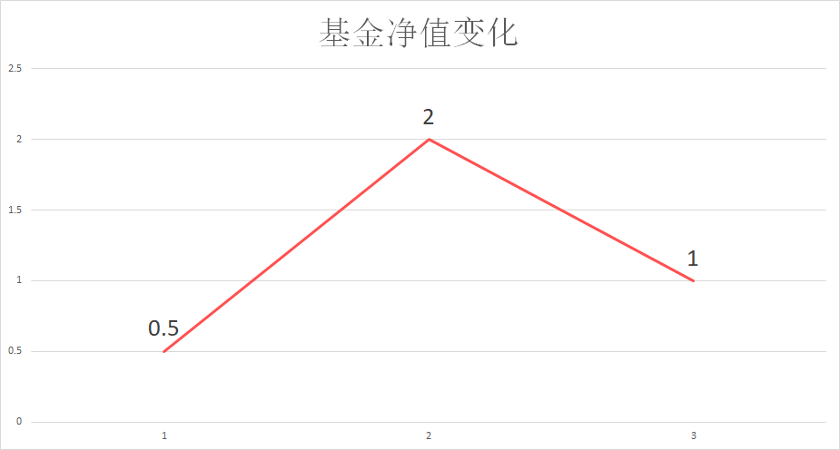

在这个例子中, 最高点净值为 2, 相信大家直接看图就能看出来. 那么, 最低点净值是多少呢? 大家注意, 最低点净值是 1, 而不是 0.5.

这是因为, 最大回撤率看的是基金从最高点往下跌的情况, 我们找最低点净值, 也要从最高点往后找. 至于最高点之前出现的数据, 就不考虑啦.

所以, 在这个例子里, 最低点净值为 1. 我们代入公式就可以得到, 它的最大回撤率为 1 减 2, 再除以 2, 结果是-50%.

最后, 我们根据自己的风险承受能力评估一下, 该基金下跌 50%是否可以承受. 如果可以承受, 就通过了压力测试, 可以考虑投资这只基金; 如果觉得下跌 50%太严重, 小心脏承受不了, 就没有通过压力测试, 可以直接放弃这只基金.

那么, 在实操中, 如何查看一只基金的最大回撤率呢?

我们以"华安升级主题混合"这只基金为例, 代码 040020, 一起查一下它的最大回撤率.

第一步, 在天天基金网搜索基金代码, 点击进入基金详情页面.

[天天基金网](https://fund.eastmoney.com/)

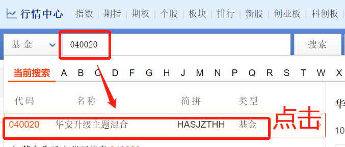

第二步, 在详情页面往下拉, 找到'单位净值走势". 这里就可以查看基金的历史净值走势啦.

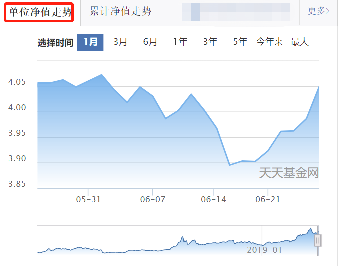

第三步, 选择时间. 这里以"1 年"为例, 我们查看一下该基金过去 1 年的最大回撤率.

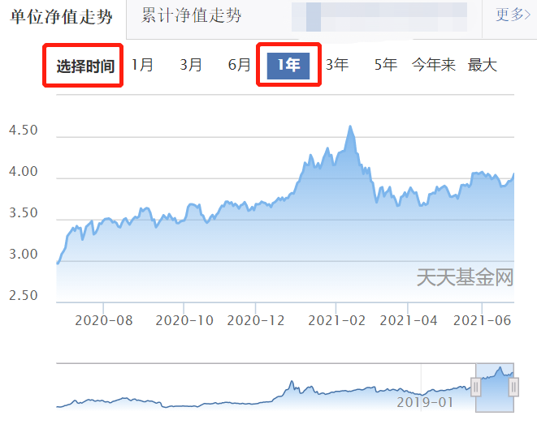

第四步, 在净值走势图上, 找到基金净值的最高点, 以及从最高点下跌后的最低点.

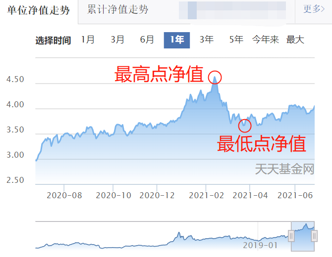

我们直接把鼠标放在走势图上, 就可以自动显示出对应节点的净值哦. 可以看到最高点净值为 4.625, 最低点净值为 3.663.

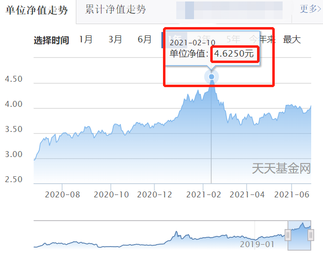

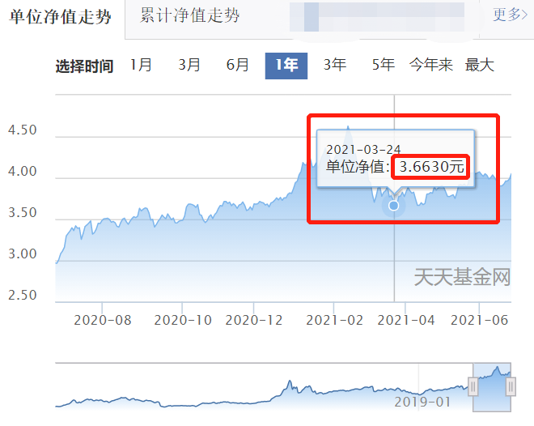

第五步, 代入公式, 计算最大回撤率. 这里可以得到, 该基金过去 1 年的最大回撤率为 3.663 减去 4.625, 再除以 4.625, 最后结果是-20.8%.

请大家注意, 课程中提到的基金净值仅仅为了演示实操过程, 实际上, 基金净值每日变化, 大家需要根据最新的净值来进行判断哦.

如果大家想要查看最最近 1 个月、3 个月、6 个月, 3 年, 5 年等等不听时间段的最大回撤率, 也可以按照上述方法来查询和计算, 只需要把第三步"选择时间"改成对应的时间段即可

## 历史最差回报

上一小节, 我们学习了如何查询和计算基金的最大回撤率. 有的小伙伴可能想说, 不同时间段的最大回撤率都不一样, 而且每一个都需要套公式计算, 太麻烦了; 有没有可以不用计算, 直接就可以查到数据的方法呢?

这个可以有. 下面, 我们就来学一个取巧的方法.

这个方法需要用到晨星网. 我们仍然以"华安升级主题混合"这只基金为例, 代码 040020, 分步实操一遍.

这次不需要五步啦, 两步就能搞定.

第一步, 在晨星网的首页搜索基金代码, 点击进入基金的详情页面.

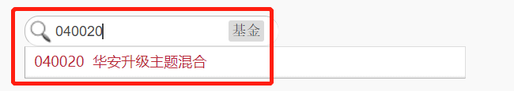

第二步, 找到历史最差回报"这一栏, 可以查到这只基金的"最差三个月回报"和"最差六个月回报".

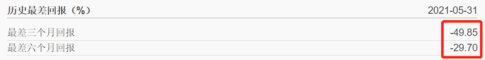

可以看到, 这只基金的最差三个月回报是-49.85%, 最差六个月回报是-29.70%.

这两个数据代表什么意思呢?

注意, 它们不是最大回撤率哦. 计算最大回撤率需要先确定一个时间段, 而这两个数据不限制具体的时间段.

以"最差三个月回报"为例, 它的意思是, 这只基金成立以来, 曾经在 3 个月内出现过的最大跌幅. 也就是说, 我们在这只基金的历史上任意时刻入手, 拿三个月, 最多会亏多少.

同理, "最差六个月回报"就是, 我们在这只基金的历史上任意时刻入手, 拿六个月, 最多会亏多少.

虽然这两个指标和最大回撤率有所区别, 不过, 它们本质上都是为了考察基金的回撤情况, 都可以作为压力测试的指标.

如果你懒得计算最大回撤率, 可以用"最差三个月回报"和"最差六个月回报"来近似代替.

水星财富学堂为大家准备了专属的筛选表格, 为了节约大家的筛选时间, 表格中用到的指标就是"最差三个月回报"和"最差六个月回报"哦.

填表环节很简单. 首先, 我们在表头位置选择"可接受最大回撤"的百分比. 大家点击一下"可接受最大回撤"后面的空白单元格, 右下角会出现一个倒三角形状的图标. 点击该图标, 可以看到五个选项, 分别是:-10%, -20%, -30%, -40%, -50%.

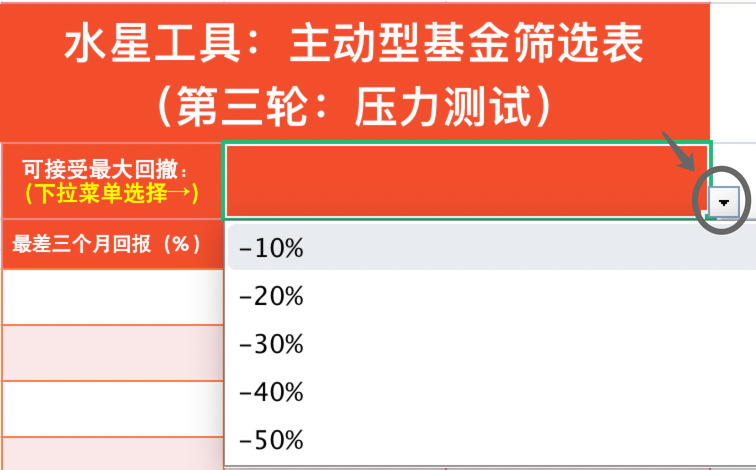

这里, 请大家选择自己可接受的回撤幅度就可以啦. 我们以-30%为例, 点击选择该选项.

接下来, 我们按照前面描述的步骤, 在晨星网查找每一只基金的最差三个月回报和最差六个月汇报, 并且把数据填入表格中.

需要大家注意的是, 这一轮统计数据, 我们只需要统计已经通过第二轮筛选的基金就可以啦. 至于第二轮没通过的, 没有必要让它进入第三轮.

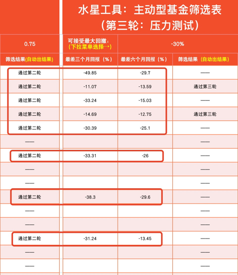

填写完成后, 表格会自动判断每只基金是否通过筛选. 如果通过了筛选, 筛选结果一列会显示"通过第三轮"; 如果没有通过筛选, 筛选结果会维持一条横线.

表格判断是否通过筛选的逻辑很简单: 只要"最差三个月回报"和"最差六个月回报"都小于我们选择的"可接受最大回撤", 基金就可以通过筛选啦.

筛选结束后, 如果通过第三轮的基金超过了 5 只, 大家只需要从前往后, 挑选 5 只以内买入即可. 因为基金本身就是一种分散化投资的工具, 再进一步分散会拉低收益率.

如果没有任何一只基金通过筛选, 大家不要硬凑, 而是要耐心等待, 隔段时间再重新筛选一次.

主动型基金不需要频繁筛选. 一般来说, 半年或一年筛选一次就可以啦.

筛选完以后, 该什么时候买, 什么时候卖呢?

主动型基金的基金经理会根据市场情况调整手中的现金比例. 所以, 我们投资主动型基金不需要择时, 选到好基金以后, 直接上车就行啦.

至于什么时候卖出, 可以分为两种情况:

第一种情况, 基金经理换人了, 直接卖掉下车.

第二种情况, 经过重新筛选以后, 发现了更优秀的基金经理, 这时可以卖掉老的, 买入新的, 换一趟车继续跑

## 总结

1. 压力测试就是考察基金的最大跌幅, 看它有没有超过我们的承受范围.
2. 最大回撤率的意思是: 在选定的时间段内, 基金出现的最大下跌幅度. 计算公式为:(最低点净值-最高点净值)/最高点净值. 查询和计算基金的最大回撤率, 可以利用天天基金网.
3. "最差三个月回报"指的是, 我们在这只基金的历史上任意时刻入手, 拿三个月, 最多会亏多少."最差六个月回报"含义类似. 用这两个指标近似代替基金的最大回撤率, 更加方便快捷.
4. 如果通过最终筛选的基金超过 5 只, 从前往后选择 5 只以内即可; 如果一直也没有, 不要硬凑, 而是要耐心等待.
5. 买入主动型基金不需要择时, 卖出主动型基金有两种情况: 一是基金经理换人了, 二是找到了其他更值得投资的基金.

恭喜大家学完了主动型基金的"三轮淘汰制". 今后遇到主动型基金, 大家就知道怎么下手啦!
