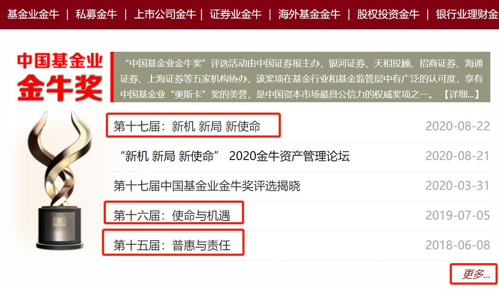
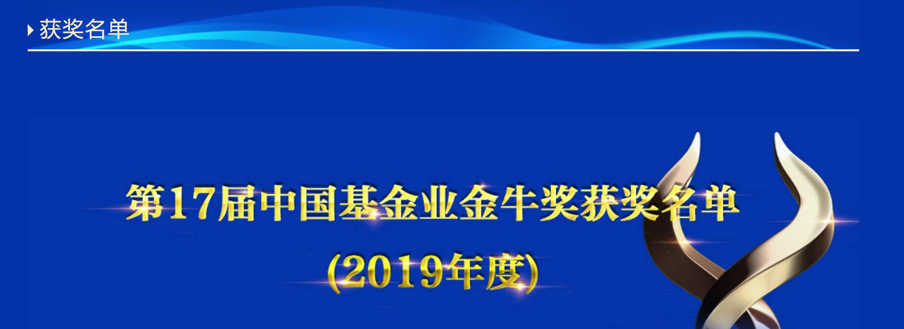

本节课, 我们继续筛选主动型基金, 共同完成"三轮淘汰制"中的最后一轮: 压力测试.

## 要收益, 也要投资体验

课程一开始, 我们先来做一个思想实验: 假设现在有两只基金, 一只收益率 50%, 另一只收益率 80%, 大家觉得哪只基金更好呢?

很多新手会简单粗暴地判断, 当然是 80%的更好啦! 基金赚的越多越好.

现在, 我们再增加一个信息: 收益率 50%的基金, 几乎每天都是稳稳地上涨, 一步一个脚印地创造收益; 而收益率 80%的基金, 每天都在暴涨暴跌, 中途出现过巨亏 80%的情形, 后来才走势反转, 扭亏为盈.

那么, 现在的你觉得, 哪只基金更好呢?

相信很多人都会改变选择, 放弃收益率 80%的基金, 去接受收益率 50%的基金.

因为现实往往是, 没有几个人能够坦然面对 80%的巨大亏损. 很多人在亏损的中途就害怕了, 小心脏承受不住下跌的压力, 结果选择了"割肉离场". 至于后来扭亏为盈, 达到收益率 80%, 也就和他们无关了.

这种暴涨暴跌的基金, 即使总收益率再高, 也很难让投资者赚到钱. 所以, 我们做投资的时候, 应该看重的不仅仅是收益, 还有良好的投资体验.

总结成—句话就是: 不但收益要满足我们的需求, 而且中间过程如果亏损了, 跌幅不能超过我们的承受范围.

在上一节课, 我们已经对基金的收益水平进行了考察; 这节课, 我们就来考察一下基金的最大跌幅, 看它有没有超过我们的承受范围. 这个过程就叫"压力测试".

压力测试需要考察的指标是基金的"最大回撤率".

## 最大回撤率

最大回撤率的意思是: 在选定的时间段内, 基金出现的最大下跌幅度.

也就是说, 假如我们在一段时间内买入某只基金, 不小心遇上了最糟糕的情况, 最多会亏百分之几.

用公式表达就是:

基金的最大回撤率=(最低点净值-最高点净值)/最高点净值

举个例子: 某只基金的净值为 0.5, 后来上涨到了 2, 再后来又下跌到了 1. 我们来看一下它的最大回撤率如何计算.

在这个例子中, 最高点净值为 2, 相信大家直接看图就能看出来. 那么, 最低点净值是多少呢? 大家注意, 最低点净值是 1, 而不是 0.5.

这是因为, 最大回撤率看的是基金从最高点往下跌的情况, 我们找最低点净值, 也要从最高点往后找. 至于最高点之前出现的数据, 就不考虑啦.

所以, 在这个例子里, 最低点净值为 1. 我们代入公式就可以得到, 它的最大回撤率为 1 减 2, 再除以 2, 结果是-50%.

最后, 我们根据自己的风险承受能力评估一下, 该基金下跌 50%是否可以承受. 如果可以承受, 就通过了压力测试, 可以考虑投资这只基金; 如果觉得下跌 50%太严重, 小心脏承受不了, 就没有通过压力测试, 可以直接放弃这只基金.

那么, 在实操中, 如何查看一只基金的最大回撤率呢?

我们以"华安升级主题混合"这只基金为例, 代码 040020, 一起查一下它的最大回撤率.

第一步, 在天天基金网搜索基金代码, 点击进入基金详情页面.

[天天基金网](https://fund.eastmoney.com/)

第二步, 在详情页面往下拉, 找到'单位净值走势". 这里就可以查看基金的历史净值走势啦.

第三步, 选择时间. 这里以"1 年"为例, 我们查看一下该基金过去 1 年的最大回撤率.

第四步, 在净值走势图上, 找到基金净值的最高点, 以及从最高点下跌后的最低点.

我们直接把鼠标放在走势图上, 就可以自动显示出对应节点的净值哦. 可以看到最高点净值为 4.625, 最低点净值为 3.663.

第五步, 代入公式, 计算最大回撤率. 这里可以得到, 该基金过去 1 年的最大回撤率为 3.663 减去 4.625, 再除以 4.625, 最后结果是-20.8%.

请大家注意, 课程中提到的基金净值仅仅为了演示实操过程, 实际上, 基金净值每日变化, 大家需要根据最新的净值来进行判断哦.

如果大家想要查看最最近 1 个月、3 个月、6 个月, 3 年, 5 年等等不同时间段的最大回撤率, 也可以按照上述方法来查询和计算, 只需要把第三步"选择时间"改成对应的时间段即可

## 历史最差回报

上一小节, 我们学习了如何查询和计算基金的最大回撤率. 有的小伙伴可能想说, 不同时间段的最大回撤率都不一样, 而且每一个都需要套公式计算, 太麻烦了; 有没有可以不用计算, 直接就可以查到数据的方法呢?

这个可以有. 下面, 我们就来学一个取巧的方法.

这个方法需要用到晨星网. 我们仍然以"华安升级主题混合"这只基金为例, 代码 040020, 分步实操一遍.

这次不需要五步啦, 两步就能搞定.

第一步, 在晨星网的首页搜索基金代码, 点击进入基金的详情页面.

第二步, 找到"历史最差回报"这一栏, 可以查到这只基金的"最差三个月回报"和"最差六个月回报".

可以看到, 这只基金的最差三个月回报是-49.85%, 最差六个月回报是-29.70%.

这两个数据代表什么意思呢?

注意, 它们不是最大回撤率哦. 计算最大回撤率需要先确定一个时间段, 而这两个数据不限制具体的时间段.

以"最差三个月回报"为例, 它的意思是, 这只基金成立以来, 曾经在 3 个月内出现过的最大跌幅. 也就是说, 我们在这只基金的历史上任意时刻入手, 拿三个月, 最多会亏多少.

同理, "最差六个月回报"就是, 我们在这只基金的历史上任意时刻入手, 拿六个月, 最多会亏多少.

虽然这两个指标和最大回撤率有所区别, 不过, 它们本质上都是为了考察基金的回撤情况, 都可以作为压力测试的指标.

如果你懒得计算最大回撤率, 可以用"最差三个月回报"和"最差六个月回报"来近似代替.

水星财富学堂为大家准备了专属的筛选表格, 为了节约大家的筛选时间, 表格中用到的指标就是"最差三个月回报"和"最差六个月回报"哦.

填表环节很简单. 首先, 我们在表头位置选择"可接受最大回撤"的百分比. 大家点击一下"可接受最大回撤"后面的空白单元格, 右下角会出现一个倒三角形状的图标. 点击该图标, 可以看到五个选项, 分别是:-10%, -20%, -30%, -40%, -50%.

这里, 请大家选择自己可接受的回撤幅度就可以啦. 我们以-30%为例, 点击选择该选项.

接下来, 我们按照前面描述的步骤, 在晨星网查找每一只基金的最差三个月回报和最差六个月汇报, 并且把数据填入表格中.

需要大家注意的是, 这一轮统计数据, 我们只需要统计已经通过第二轮筛选的基金就可以啦. 至于第二轮没通过的, 没有必要让它进入第三轮.

填写完成后, 表格会自动判断每只基金是否通过筛选. 如果通过了筛选, 筛选结果一列会显示"通过第三轮"; 如果没有通过筛选, 筛选结果会维持一条横线.

表格判断是否通过筛选的逻辑很简单: 只要"最差三个月回报"和"最差六个月回报"都小于我们选择的"可接受最大回撤", 基金就可以通过筛选啦.

筛选结束后, 如果通过第三轮的基金超过了 5 只, 大家只需要从前往后, 挑选 5 只以内买入即可. 因为基金本身就是一种分散化投资的工具, 再进一步分散会拉低收益率.

如果没有任何一只基金通过筛选, 大家不要硬凑, 而是要耐心等待, 隔段时间再重新筛选一次.

主动型基金不需要频繁筛选. 一般来说, 半年或一年筛选一次就可以啦.

筛选完以后, 该什么时候买, 什么时候卖呢?

主动型基金的基金经理会根据市场情况调整手中的现金比例. 所以, 我们投资主动型基金不需要择时, 选到好基金以后, 直接上车就行啦.

至于什么时候卖出, 可以分为两种情况:

第一种情况, 基金经理换人了, 直接卖掉下车.

第二种情况, 经过重新筛选以后, 发现了更优秀的基金经理, 这时可以卖掉老的, 买入新的, 换一趟车继续跑

## 总结

1. 压力测试就是考察基金的最大跌幅, 看它有没有超过我们的承受范围.
2. 最大回撤率的意思是: 在选定的时间段内, 基金出现的最大下跌幅度. 计算公式为:(最低点净值-最高点净值)/最高点净值. 查询和计算基金的最大回撤率, 可以利用天天基金网.
3. "最差三个月回报"指的是, 我们在这只基金的历史上任意时刻入手, 拿三个月, 最多会亏多少."最差六个月回报"含义类似. 用这两个指标近似代替基金的最大回撤率, 更加方便快捷.
4. 如果通过最终筛选的基金超过 5 只, 从前往后选择 5 只以内即可; 如果一只也没有, 不要硬凑, 而是要耐心等待.
5. 买入主动型基金不需要择时, 卖出主动型基金有两种情况: 一是基金经理换人了, 二是找到了其他更值得投资的基金.

恭喜大家学完了主动型基金的"三轮淘汰制". 今后遇到主动型基金, 大家就知道怎么下手啦!

## 主动型基金"优中选优"三步走

课程中已经为大家详细展示了主动型基金的"三轮淘汰制", 用这三轮淘汰, 就可以选出优秀的基金啦.

今晚要讲的"优中选优"是指, 在经过"三轮淘汰制"以后, 保留下来的基金里面, 进一步精挑细选, 保留那些更值得选择的.

有的小伙伴估计想问: 班班, 你是要再加一轮淘汰吗? 三轮淘汰还不够吗? 为了避免误会, 班班先说清楚:

今晚即将讲到的所有指标, 没有一个是用来淘汰基金的. 相反, 它们都是加分项.

也就是说, 如果基金达到了接下来的指标, 属于锦上添花, 好上加好; 如果达不到呢, 也没关系, 不代表基金不行.

大家做完了三轮淘汰以后, 如果发现通过筛选的基金太多啦, 想进一步挑选一下, 那么就可以用下面三个指标"优中选优".

### 第一个指标: 获奖情况

很多行业都有重量级的评奖, 比如影视行业, 国外有"奥斯卡", 国内有"金鸡百花奖"等等. 基金行业也不例外, 有很多评奖活动哦. 其中国内影响力最大的一个奖, 叫"金牛奖".

悄悄问问, 咱们班有没有金牛座的小伙伴呀? 星座里面常说, 金牛座是很务实、而且爱财有道的一个星座, 估计搞理财都会成为大牛~

当然, 这个"金牛奖"可能和星座关系不大. 它是由中国证券报社主办的, 评选宗旨是:

展示中国优秀基金及优秀基金管理公司, 提高和扩大基金业在社会上的认同感, 引导基金管理人更加注重基金持续回报能力, 培育和引导投资人的长期投资理念, 推动我国基金业朝着规范健康方向发展.

说的直白一点就是: 宣传好基金, 让大家都知道! 而且注意哦, 里面提到了"培育和引导投资人的长期投资理念". 咱们的训练营也一直鼓励大家做长期投资, 希望大家不要忘记这一点呀. 和那些短线炒作的投资者划清界限!

言归正传, 金牛奖包括哪些奖项呢?

总的来说分两大类, 第一类是给基金公司颁的奖; 第二类是给具体的基金颁的奖.

咱们挑的是基金, 不是公司, 所以重点关注第二类奖项. 其中, 具体到股票型、混合型, 这两大类主动型基金, 会颁以下奖项奖:

七年期持续优胜金牛基金

五年期持续优胜金牛基金

三年期持续优胜金牛基金

大家注意"持续优胜", 意思是连续多年, 综合表现非常优秀.

其中, "三年期"、"五年期"和"七年期"指的是评选考核的时间长度. 三年期、五年期的奖项是一直有的, 七年期是 2020 年刚加上的.

之前还有个"年度金牛基金", 选的是最近年度表现优秀的基金, 在 2020 年, 这个奖项取消了. 大家可以品一下其中的原因. 年度表现好, 真的不代表基金能长期优秀. 主动型基金有个"冠军魔咒", 某一年业绩夺冠的基金, 之后的年份往往表现不佳.

把"年度"奖项去掉, 把"七年期"奖项加上, 也是引导大家坚持长期投资哦!

那么, 获得金牛奖的基金在哪查看呢?
大家用搜索引擎搜一下"金牛奖", 点进官网, 就可以找到啦.

[金牛奖](http://www.cs.com.cn/jnj/)

首页有很多奖, 大家看图, 锁定"中国基金业金牛奖"这部分. 其中可以看到"第十七届"、"第十六届"、"第十五届"的标题, 点进去就可以查看具体的获奖情况啦. 金牛奖一年评一次.

如果大家还想看之前更多年份的, 可以点击右下角的"更多".(上图给大家标出来了)

首届金牛奖是 2004 年办的, 不过大家没必要从第一届开始看哈, 一般看看最近三届、五届的就可以啦.

班班以第十七届为例, 点开给大家看一下. 第一眼可以看到这一届的主题, 各种单位的名字等等. 这些不用管, 直接往下拉.

一直下拉, 直到看到"获奖名单"为止.

大家注意哈, 每一年评选的都是上一年度的获奖名单. 所以 2020 年这一届评选的 2019 年度获奖名单.

一般获奖基金公司的名单会排在前面, 我们直接滑过, 往下找获奖基金的名字. 在获奖名单里, 找到"开放式股票型"、"开放式混合型"的字眼, 它们就是我们要找的基金名单.

股票型、混合型, 都包含了七年期、五年期、三年期的奖项, 总共就是 6 个奖项.

我们把课程"三轮淘汰制"保留下来的基金名单, 和这份获奖名单比照一下, 如果保留的基金获奖了, 那就太好啦, 属于锦上添花, 加分!

没获奖也不要紧, 毕竟获奖名额太有限, 而且不排除有些基金没有参选的情况. 班班重复一下, 得金牛奖是加分项, 不是淘汰标准.

班班在 2021 年 6 月份按照课程做了一次筛选, 选出来 4 只基金: 工银文体产业股票 A、中欧时代先锋股票 A、工银前沿医疗股票 A、长城医疗保健混合

拿来和金牛奖一对比, 有两只重合的:

这也从侧面反映出来, 咱们课程里的筛选方法, 是行之有效的. 当然啦, 大家可不能完全不筛选, 直接照抄"金牛奖"名单来投资哦.

比如今天课程带大家做了压力测试, 这个选择是因人而异的, 金牛奖可没法展示是否符合你的抗压能力.

再比如, 咱们课程要求基金经理从业年限至少五年, 如果获奖基金中途换过基金经理, 只是历史业绩优异, 未来不确定性大, 咱们无从知晓. 所以建议大家按照课程里的筛选步骤来.

### 第二个指标: 持仓情况

咱们今晚一共讲三个指标. 第一个"获奖情况"已经讲完啦, 下面进入第二个指标"持仓情况".

持仓主要看两点: 持仓集中度、持仓重合度. 班班挨个来讲哈.

持仓集中度, 指的是一只基金持有股票的集中程度.

有些基金经理喜欢分散持股, 降低投资风险, 篮子里挑了一百多只股票, 每只股票只占很小的比重.

还有的基金经理喜欢集中持股, 专注投资几十只股票, 而且给特别看好的股票很大的比重, 以期待获得更高收益. 当然, 这种情况下承担的波动风险也较大一些.

集中和分散, 与基金经理的投资风格有关. 那么, 哪种风格更好呢?

这个没有标准答案. 我们选择跟自己的风险偏好一致的就行了.

如果你的风险偏好相对激进, 着重瞄准高收益, 那么可以优先选择持股集中的基金. 如果你风险偏好相对稳健, 很关注风险控制, 那么可以优先选择持股分散的基金.

天天基金网可以直接查看基金持仓. 以"景顺长城核心竞争力"为例, 在它的详情页面, "股票持仓"位置如下 ↓

大家重点关注"前十持仓占比合计", 如果超过 50%, 就意味着前 10 只股票占了过半的比重, 说明基金经理持仓相对集中; 反之则相对分散.

如果你的风格偏激进, 选择了"前十持仓占比合计"超过 50%的基金, 那么还要注意, 关注一下持仓重合度. 也就是拿多只基金做对比, 看持仓前十的股票里面, 有多少股票是重合的.

有些基金业绩都很优秀, 但是持仓大同小异, 说明基金经理的投资理念、投资风格太相似了, 这时候我们选择其中一只就行啦.

如果前 10 只股票里面有 7 只以上都一样, 那就说明持仓重合度较高. 这时候可以在天天基金网顺便看一下基金近三年收益率, 谁的收益高一点, 就保留谁.

### 第三个指标: 换手率

"换手"是什么意思呢? 简单来说就是, 针对一只股票, 俩人一买一卖形成交易, 股票从张三的手里到了李四的手里, 这就是"换手".

"换手率"考察的是基金经理买卖股票的频率. 如果经理持有每一只股票的时间很短, 频繁买卖, 那么换手率就很高; 反之, 经理经常持股不动, 很少买卖, 那么换手率就很低.

那么, 换手率高了好, 还是低了好呢?

这个问题也没有标准答案. 但是对于咱们长期投资者来说, 还是低了好.

原因如下:

如果换手率高, 经理频繁交易, 说明他投资很关注择时, 常常进行"波段操作", 赚短期的差价. 这和我们长期投资的理念不太相符.

如果换手率低, 说明经理在投资时, 关注更多的是选股, 锁定好股票, 然后长期持有, 不频繁买卖. 这和我们长期投资的理念相一致.

根据历史表现, 选股优秀的基金经理不在少数, 但是能够精准择时的并不多. 大多数基金经理都把重心放在了选股, 而不是择时.(当然, 也会一些基金经理双管齐下, 既选股又择时)

总之, 跟着投资理念相一致经理, 赚钱更舒心, 持有更长久.

查询换手率, 仍然可以用"天天基金网". 班班给大家演示一下步骤. 还是以"景顺长城核心竞争力混合"为例, 大家刚打开基金的详情页面时, 看到的是这样的:

在这个页面, 一直往下拉, 直到看到基金投资风格、基金换手率、业绩评价这一栏. 位置大家可以看下图 ↓

点击其中的"基金换手率", 就可以看到具体数据啦.

天天基金网的基金换手率, 每半年更新一次. 我们可以看到最近两年, 一共 4 个换手率数据. 如上图所示, 这位基金经理, 最近两年换手率都不超过 100%.

换手率控制在 100%以内, 就算是非常非常忠诚的长期主义者啦.

一般来说, 换手率控制在 500%以内就可以啦. 当然, 这个数据没有官方标准, 纯经验之谈. 大家不要卡得太死. 在"优中选优"时, 大家可以综合比较每一只基金的换手率, 选其中换手率更低的.

最后, 班班再次声明: 今晚分享的内容, 只作为"三轮淘汰制"留下基金太多时, "优中选优"用的, 不作为淘汰标准. 分享中提到的基金只是作为案例, 不构成投资建议哦!

今晚分享到此结束.

## 晚分享总结

1. 主动型基金"优中选优"三步走: 看获奖情况; ; 看持仓情况; 看换手率.
2. 金牛奖是基金界的重量级奖项, 每年评选一次. 股票型、混合型会颁以下奖项奖: 七年期持续优胜金牛基金、五年期持续优胜金牛基金、三年期持续优胜金牛基金.
3. 观察基金持仓集中度:"前十持仓占比合计"如果超过 50%, 说明基金经理持仓相对集中; 反之则相对分散.
4. 如果选择了"前十持仓占比合计"超过 50%的基金, 那么还要关注持仓重合度. 也就是拿多只基金做对比, 看持仓前十的股票里面, 有多少股票是重合的. 如果前 10 只股票里面有 7 只以上都一样, 那就说明持仓重合度较高. 这时候可以在天天基金网顺便看一下基金近三年收益率, 谁的收益高一点, 就保留谁.
5. "换手率"考察的是基金经理买卖股票的频率. 对于咱们长期投资者来说, 换手率低了好. 换手率低说明经理在投资时, 关注更多的是选股, 锁定好股票, 然后长期持有, 不频繁买卖. 这和我们长期投资的理念相一致. 在"优中选优"时, 大家可以综合比较每一只基金的换手率, 选其中换手率更低的.
