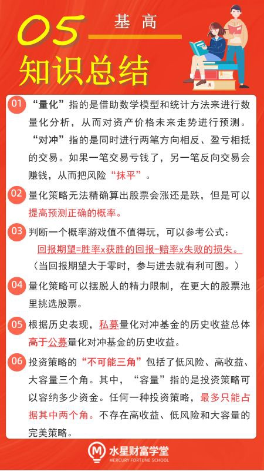

## 神秘的量化对冲

本节课开始, 我们将学习一个崭新的基金品种——量化对冲基金

小伙伴们应该还记得, 我们已经学过的基金品种包括: 货币基金、债券基金、股票基金、混合基金等等. 现在又冒出来一个"量化对冲基金", 它到底是何方神圣?

总的来说, 咱们之前学习过的基金, 都是按照投资对象来命名的, 比如, 主投债券的叫债券基金, 主投股票的叫股票基金.

而量化对冲基金呢, 不是按照投资对象来命名, 而是按照投资策略来命名.

量化对冲基金包含了两大策略, 一个是量化, 另一个是对冲.

"量化"指的是借助数学模型和统计方法来进行数量化分析, 从而对资产价格未来走势进行预测. 说白了就是在投资的时候, 不需要人主观拿主意了, 而是交给电脑运算, 根据运算结果来做决策.

"对冲"指的是同时进行两笔方向相反、盈亏相抵的交易. 如果一笔交易亏钱了, 另一笔反向交易会赚钱, 从而把风险"抹平".

听起来是不是有点云里雾里的? 这么"高大上"的策略, 需要数学, 需要统计, 还得懂金融, 一般人很难搞定吧?

没关系. 使用量化对冲策略的绝大部分都是机构, 不是个人. 简单来说, 我们买入量化对冲基金以后, 基金经理和他的团队就会利用这些策略, 帮咱们赚钱. 至于策略怎么用, 让基金经理去操心就好啦, 我们没必要深入钻研.

但是, 本着"不懂不碰, 先学习再投资"的原则, 大家需要对量化对冲有一些基本的认识, 知道自己到底在投资什么.

## 量化中的概率思维

在上一小节, 我们已经了解过, "量化"指的是借助数学模型和统计方法来进行数量化分析, 从而对资产价格未来走势进行预测.

有的小伙伴可能想问: 电脑预测的一定准吗? 是不是按照电脑判断的结果买入, 就一定会涨?

这可不一定哦. 否则那就不是电脑, 而是上帝啦. 量化策略不要求精确算出股票会涨还是跌, 而是看重涨跌的概率.

为了方便理解, 我们用一个小游戏来打个比方:

假设老王和你玩抛硬币的游戏. 如果出现正面, 老王给你 100 块钱; 如果出现背面, 你给老王 10 块钱. 硬币不做任何手脚, 就是纯粹的概率游戏. 请问你愿意参加吗?

相信大部分人都是愿意的. 因为胜算大. 每玩一把, 你有 50%的可能性赚 100 块钱, 还有 50%的可能性亏 10 块钱.

如果只是玩一次, 那么你是有可能输 10 块钱的. 但是, 如果一直玩下去, 只要次数足够多, 你就是赚钱的.

判断一个概率游戏值不值得玩, 其实有一个简单的公式:

回报期望=胜率 x 获胜的回报-赔率 x 失败的损失

这个例子里, 回报的期望值就是, 50%x100-50%x10, 结果等于 45.

只要这个数是正的, 就说明这个游戏对你有利. 长期玩下去, 你就能从概率优势中获利.

量化策略其实和硬币游戏很相似. 比如说, 一个模型预测股票涨跌, 10 次能对 7 次, 准确率 70%, 如果我们只预测一次, 可能会判断失误; 但是, 如果我们长期反复这样玩, 预测正确的概率大, 就能盈利.

现在小伙伴们可以理解啦: 量化就是用电脑算法, 提高预测正确的概率.

那么, 怎么才能设计出优秀的算法, 提高预测正确的概率呢? 机构可不能纯靠猜呀, 必须找到一些有效的因子

这里的"因子", 大家可以理解为选秀舞台的评委. 每一个因子都是一名评委, 每只股票都是台上的选手.

因子会给股票打分. 比如, 估值因子, 就会从估值的角度给股票打分; 再比如, 成交量因子, 就会从成交量的角度给股票打分. 除此之外, 还有成长因子, 波动率因子, 情绪因子, 等等.......

所有因子打完分以后, 算出总分. 总分排名靠前的股票就会入选, 成为最终的投资对象.

想要找到有效的因子, 可不是一件容易的事儿; 有些因子原本有效, 但是随着市场环境变化, 就会失效. 所以, 机构在寻找有效因子这件事上, 可谓费尽心思, 绞尽脑汁.

有些机构会引入机器学习算法, 批量挖掘因子; 还有些机构跟著名高校合作, 进行因子研究. 总之, 这个领域需要高端的技术和高端的人才, 能做量化的机构都不简单哦.

## 公募量化 PK 私募量化

有的小伙伴可能会说: 我觉得靠主观判断来选股就挺好的, 你说的量化选股有什么不可替代的优势吗?

这么说吧, 人和机器毕竟不一样.

主观选股靠人力, 而人的精力毕竟有限. 一般来说, 一家主观选股的机构往往只能覆盖 200 只以内的股票, 而且只能对其中的一部分进行深入的研究.

而量化策略就没有这方面的约束啦. 反正都是电脑算法在统计, 算一只是算, 算一千只也是算, 不会受到精力的限制, 所以, 量化策略可以在更大的股票池里挑选股票.

还有的小伙伴可能会说: 别搞太复杂, 你就告诉我量化策略能赚多少钱就行啦.

根据历史表现, 私募量化对冲基金的历史收益总体高于公募量化对冲基金的历史收益.

看收益之前, 小伙伴们首先要理解公募和私募的区别

公募基金采用的是公开募集的方式, 募集途径有很多, 包括证券交易所、银行柜台等等, 随着互联网兴起, 现在手机 App 上也可以募集啦. 大家之前学过的所有基金, 都属于公募基金.

私募基金采用的是非公开募集的方式, 募集对象是特定投资者, 通常要 100 万元起投, 门槛较高, 所以属于小众市场.

大家可以看文稿中的表格. 它针对量化对冲产品, 在公募和私募之间进行了收益对比. 其中的收益率为同类产品的平均累计收益率.

量化对冲产品的分年平均累计收益率

可以看到, 2018 年到 2020 年这 3 年里, 私募量化对冲的收益水平相对更高.

为什么会出现这种差异呢? 这就要说到投资策略的"不可能三角"啦.

"不可能三角"包括了低风险、高收益、大容量三个角. 其中, "容量"指的是投资策略可以容纳多少资金.

任何一种投资策略, 最多只能占据其中两个角. 也就是说, 不存在高收益、低风险和大容量的完美策略.

至于保留"不可能三角"的哪两个角, 公募和私募各有侧重.

私募量化一般会保留低风险、高收益, 牺牲大容量.

这是因为私募量化主打短周期、高换手率的"量价策略", 持股时间只有一两天, 或者两三天; 而且选股集中在中小盘股. 中小盘股数量多、市值小, 少量资金就可以带来股价明显变化, 非常适合"短平快"的操作. 所以, 私募量化对冲基金侧重"小巧灵活", 不需要大容量.

公募量化一般会保留低风险、大容量, 牺牲高收益.

这是因为公募量化主打长周期、低换手率的"基本面策略", 持仓以大盘股为主. 截止到 2021 年 3 月 31 日, 规模最大的一只公募量化对冲基金已经达到了 180.85 亿元的规模. 低风险、大容量, 势必要削减收益.

关于如何筛选量化对冲基金, 我们将在下节课中学习哦.

本节课的内容到此结束. 下面, 我们一起来总结一下课程重点.

## 总结

1. "量化"指的是借助数学模型和统计方法来进行数量化分析, 从而对资产价格未来走势进行预测."对冲"指的是同时进行两笔方向相反、盈亏相抵的交易. 如果一笔交易亏钱了, 另一笔反向交易会赚钱, 从而把风险"抹平".
2. 量化策略无法精确算出股票会涨还是跌, 但是可以提高预测正确的概率.
3. 判断一个概率游戏值不值得玩, 可以参考公式: 回报期望=胜率 x 获胜的回报-赔率 x 失败的损失. 当回报期望大于零时, 参与进去就有利可图.
4. 量化策略可以摆脱人的精力限制, 在更大的股票池里挑选股票.
5. 根据历史表现, 私募量化对冲基金的历史收益总体高于公募量化对冲基金的历史收益.
6. 投资策略的"不可能三角"包括了低风险、高收益、大容量三个角. 其中, "容量"指的是投资策略可以容纳多少资金. 任何一种投资策略, 最多只能占据其中两个角. 不存在高收益、低风险和大容量的完美策略.

## 公募基金的"双十限制"

### 一、公募和私募, 傻傻分不清?

【私募】是相对于【公募】而言的. 咱们平时接触的绝大部分基金, 都是公募基金.

公募就是公开募集, 广大社会群众谁都可以参与. 比如 2020 年支付宝上面火遍全国的"蚂蚁战略配售基金", 路边灯箱、电梯里都是募集的广告, 这就是典型的公募基金的募集方式.

当然最后蚂蚁被监管啦哈哈, 暂缓上市, 这个不是咱们今晚的主题, 不展开了. 班班接着往下说私募基金.

私募简单来说, 就是私下里, 非公开发售, 面向一部分的合格投资者募集.

估计有小伙伴可能疑惑, 好端端的募集就行了, 为什么要私下里干? 不会是非法集资吧?

这一点不用担心. 非公开主要是因为, 证监会要求的就是这样. 私募基金不能通过媒体无差别地向所有人打广告, 只能向特定的人群发售.

为什么要这么规定呢? 因为私募基金不像公募基金那样普适, 它对投资者有比较高的要求, 只能是合格投资者才能参与. 所谓的合格, 主要卡的是风险承受的能力.

投资私募基金的分为单位和个人, 单位和咱们关系不大, 班班不讲. 咱们重点看看对个人的要求. 证监会规定, 满足以下条件的才算是合格投资者:

(1)投资于单只私募基金的金额不低于 100 万人民币;

(2)金融资产不低于 300 万元, 或者最近三年个人年均收入不低于 50 万元的个人.

上面的"金融资产", 包括银行存款. 当然也包括股票啊, 基金啊这些, 都算上的, 加起来要不低于 300 万. 不满足这一点没关系, 满足最近三年自己的年均收入不低于 50 万元也算合格.

简单来说就是, 要么你有足够的家底, 要么你每年有足够的流水进账, 两样至少得占一样, 才算合格. 否则就不能选择私募基金啦.

还有的小伙伴问, 私募基金卡的这么严, 也没看出来有啥优势呀?

这个问题, 咱们和公募对比一下就知道了.

咱们的课程里讲了一些私募量化的优势了, 这里班班补充一个公募和私募的很大区别: 双十限制.

### 二、公募的"双十限制"

先划一下重点: 只有公募基金才有双十限制, 私募基金没有双十限制.

什么是公募基金的"双十限制"呢? 内容一共有两条:

"双十限制"第一条: 一只公募基金持有一家公司发行的证券, 其市值不得超过基金资产净值的 10%.

比如说班班是基金经理, 我很看好贵州茅台, 很想重仓买茅台, 但是因为有了上面的规定, 我持有茅台就不能超过基金资产净值的 10%了. 哪怕再看好, 也不能重仓. 这是证监会规定的.

这么规定的初衷是为了严控风险. 如果公募基金重仓某一只股票, 一旦股价大跌, 那么这只基金也要跟着大幅下跌.

但是咱们反过来想, 如果一只股票大涨, 因为规定限制不能重仓, 基金经理就不得不跟诱人的回报擦肩而过啦.

这条限制相当说: 因为你是公募的, 你面向所有人, 所以不能让你跌得太严重, 但也没法涨得太厉害.

这么做能保护大部分小白. 不过对于咱们很多态度乐观、投资风格激进的小伙伴来说, 这条限制会一定程度上削弱赚钱的效果.

"双十限制"第二条: 同一基金管理人管理的全部基金持有一家公司发行的证券, 不得超过该证券的 10%.

还是打比方, 班班是基金经理, 管理 100 亿的资金规模, 我看中了一只股票, 未来上涨可能性很大, 现在市值只有 1 亿, 想买.

讲道理, 我拿着 100 亿去买 1 亿的东西, 完全有能力把它全买下来. 别人就不用考虑了, 我自己做股东, 股价涨不涨我说了算.

官方肯定是不会让大家这样搞的, 所以才有了第二条规定的限制.

按照前面说的规定, 我持有这只股票不能超过它市值的 10%, 也就是说哪怕我管的钱再多, 最多只能买 1 亿市值的 10%, 也就是 1 千万.

大家想啊, 我一共管理 100 亿, 如果拿出 1 千万买一只股票, 那简直就是九牛一毛啊. 一方面我得花时间分析股票, 花了大量的时间和精力去分析, 结果却只能买这么点, 肯定不划算啊.

另一方面, 我就算分析了, 买了, 它也确实涨了, 但是因为买它的本金才 1 千万, 回报不会高到哪里去, 放在这只基金所有的收益里, 可以说不值一提.

所以就会造成一个结果: 公募基金很少会配置小市值的股票, 一来浪费精力, 二来拉不动收益, 费力不讨好. 这也是"双十限制"一个不好的地方.

小市值里面也有很多好公司, 暂时规模不大, 但是人家前景非常好, 未来涨幅很诱人. 看中了却不能配置就有点可惜.

### 三、"双十限制"导致"新人坑老人"

下面班班再带着大家, 从另一个角度来看看双十限制:

假设班班管理某基金, 它成分里有只好股票, 班班非常看好, 已经配置了差不多 10%的比例, 不能再加了, 再加就不符合双十限制了.

结果这只股票真的涨了, 把基金的收益率也带起来了. 那么就有很多新人看到这只基金涨得好, 然后跟风买入. 基金规模随之壮大. 这就有问题出现了:

新投入的这些资金, 班班作为基金经理该怎么处理呢? 如果再去配置那只好股票, 那就超 10% 的限制了啊. 所以我只能去选择其他的, 在我的判断中没那么好的股票了. 这一改, 把收益率也拉低了.

原本在这只基金上面的"老人"都赚得挺舒服的, 结果新人涌进来, 收益被拉低, 这就是"新人坑老人".

所以咱们以往筛选基金的时候, 课程会给大家设置一个基金规模的上限, 规模超过上限就不建议大家选择了. 原因就是这么来的.

而且大家会发现, 很多表现很好的公募基金经理, 跟风选他的散户很多, 但人家是很谨慎的, 人家不希望规模变得太大. 规模越大, 双十限制就越明显, 操作就越来越束手束脚.

比如张坤管理的易方达中小盘混合, 2021 年 3 月发公告"暂停申购", 也就是说大家暂时不能买了. 主要就是因为这只基金的规模太大了(当时 400 多亿), 大家再买, 要拉低基金的收益率啦.

班班总结一下, 双十限制一共两条:

(1)一只公募基金持有一家公司发行的证券, 其市值不得超过基金资产净值的 10%

(2)同一基金管理人管理的全部基金持有一家公司发行的证券, 不得超过该证券的 10%

双十限制是把双刃剑. 这么做一方面保护了公募基金, 保护了股价; 另一方面, 也让公募基金在操作上束手束脚.

对比一下, 私募基金就没有这种硬性的规定. 私募基金的基金经理可以自由选择投资啥, 投资多少. 满仓, 空仓, 都是他说了算.

这主要是因为, 私募基金只面向少数人, 募集的资金总规模不会特别大, 哪怕重仓某一只股票, 也不会对股价造成灾难性的波动.

私募基金的投资者要经过条件筛选, 风险承受能力相对更高一些, 不用像公募基金那样采取过于严格的保护.

很多小市值股票的投资机会, 公募基金没法参与, 私募基金可以大展身手.

而且有些投资策略, 只有私募基金才能玩的转. 明晚班班会跟大家分享下私募基金的各种花式策略哦.

今晚的分享到此结束!

## 晚分享总结

1. 公募就是公开募集, 广大社会群众谁都可以参与; 私募就是私下里, 非公开发售, 面向一部分的合格投资者募集.
2. 公募基金的"双十限制": (1)一只公募基金持有一家公司发行的证券, 其市值不得超过基金资产净值的 10% (2)同一基金管理人管理的全部基金持有一家公司发行的证券, 不得超过该证券的 10%
3. 双十限制的缺点: (1)限制了风险的同时也限制了赚钱效果; (2)导致基金经理只能选择大市值的股票, 放弃小市值股票的机会; (3)导致新人坑老人.
