## 越跌越赚钱的"做空"

上一节课, 我们学习了量化对冲策略中的量化部分. 本节课, 我们一起来走近对冲策略.

有些小伙伴可能听说过看空、做空、空头等词汇. 这些和"空"有关的说法, 其实就是对冲策略的精髓.

在投资中, 多和空是一对反义词.

"多"字代表的是上涨."看多"就是觉得会涨, "做多"就是买入. 如果一个投资者看多也做多, 他就是"多头".

反过来说, "空"字代表的是下跌."看空"就是觉得会跌, "做空"就是卖出. 如果一个投资者看空也做空, 他就是"空头".

股市里绝大多数投资者都是典型的"多头". 大家的赚钱方法就是做各种筛选评估, 选择一家有潜力的公司, 低位入手, 等高位卖出, 赚其中的差价. 这就是典型的"做多".

如果经过评估, 股价被高估了, 不适合买入了, "多头"们就只好默默等待啦. 但是这时候, 还有一些投资者会通过"做空"的手段, 反向操作, 在股价从高位下跌到低位的过程中赚钱哦.

这个神奇的玩法是怎么实现的呢? 我们来打个比方.

张三看到大米的价格 5 元一斤, 觉得太贵了, 未来很可能要下跌. 他瞅准机会, 决定"做空"大米.

怎么"做空"呢? 他赶紧找李四借了 100 斤大米, 说过段时间再还给他.

张三把大米借来以后, 转手就在市场上卖掉了, 按照 5 元一斤, 卖了 500 块钱. 后来不出所料, 大米价格跌到了 2 元一斤, 张三用这个价格从市场上买回 100 斤大米, 还给李四, 只花了 200 块钱.

虽然大米价格跌了, 但是, 张三却赚到了 300 块钱的差价.

我们把这个例子中的大米替换成股票, 意思就很明显啦. 投资者手里没有股票, 但是可以从交易平台借过来, 转手卖掉, 等股价跌了, 再把股票买回来, 还给平台. 这就是"做空"股票赚钱的原理.

实际操作中, 投资者不仅仅可以做空单只股票, 而且可以做空股票指数哦.

有的小伙伴要问啦: 为什么我从来没在交易平台发现做空股票的方法呢?

这是因为, 做空需要在期货市场进行. 期货的原理很复杂, 风险也很大, 不建议小伙伴们单独尝试. 大家可以选择量化对冲基金, 让基金经理帮着咱们去完成做空操作

## 两大对冲策略

上—小节, 我们了解了越跌越赚钱的"做空". 不过, 仅仅知道"做空", 还无法解释"对冲"到底是怎么回事儿.

下面我们就来看看, 做空和做多是怎么完美配合, 形成"对冲"效果的.

常见的对冲策略有"股票多空策略"和"市场中性策略". 我们分别来看.

### (1)股票多空策略

股票多空策略会对一篮子股票进行估值排名, 低估的排在前面, 高估的排在后面, 然后做多前 N 只股票, 做空后 N 只股票.

举个简单的例子——

假设篮子里有格力电器和美的集团两只股票, 格力被低估了, 美的被高估了; 那么按照股票多空策略, 量化对冲基金就会做多格力, 做空美的.

当市场上涨时, 格力的估值修复空间较大, 涨幅较大, 做多格力的收益较多; 而美的处于估值高位, 上涨空间有限, 所以涨幅较小, 做空美的导致的亏损也较少. 多赚少亏, 总体收益为正.

当市场下跌时, 由于格力已经处于估值低位, 下跌空间有限, 做多格力的亏损较少; 而美的处于估值高位, 高位下跌的跌幅往往较大, 做空美的赚的钱也较多. 依然是多赚少亏, 总体收益依然为正.

所以, 无论市场涨跌, 股票多空策略都可以创造正收益, 让基金稳稳地上涨, 无惧市场波动.

以上讨论的是概率较大的情况, 实际也会有例外. 不过, 投资本就是一场概率游戏, 长期做胜率高的事情即可带来盈利.

温馨提醒: 列举格力电器和美的集团, 仅仅为了方便大家理解策略, 估值高低基于假设, 不代表真实情况, 也不构成投资建议.

### (2)市场中性策略

除了做空具体的股票, 量化对冲基金还可以做空股票指数.

小伙伴们还记得基金的 α 收益和 β 收益吗?

α 收益, 也叫绝对收益, 指的是基金经理凭借自己选股的本事赚到的收益, 考验的是基金经理的真实水平;

β 收益, 指的是市场整体上涨, 带着所有参与者一起赚到的收益.

由于"市场先生"的脾气捉摸不透, 未来涨跌难以预测, 所以, β 收益属于典型的"看天吃饭".

那么, 有没有可能, 把市场涨跌"对冲"掉, 不承担这部分风险, 只凭基金经理的真本事赚 α 收益呢?

想要实现这一想法, 就要用到"市场中性策略"啦.

这一策略会做多个股, 做空股指期货.

比如, 基金经理很看好贵州茅台这只股票, 只想要从茅台身上赚稳稳的利润, 不想承受市场波动, 那么他就可以做多茅台, 做空沪深 300 股指期货.

如果市场上涨, 茅台获得了 β 收益, 而做空沪深 300 亏钱, 与收益抵消.

如果市场下跌, 茅台承担了 β 亏损, 而做空沪深 300 赚钱, 弥补了 β 亏损.

总之, 通过做空股指期货来完成对冲, 难以预测的 β 就消失了, 只留下了确定性高的 α 收益, 这就是"市场中性策略".

## 如何选择量化对冲基金

量化和对冲两大策略, 我们都已经了解过啦. 神秘的量化对冲基金就是用这"两把刷子", 谋取收益的同时, 还避开了市场波动, 降低了风险.

"最大回撤率"的概念, 指的是一只基金的历史最大亏损. 那么, 大家知道量化对冲基金的最大回撤率是多少吗?

鉴于私募产品只能对合格投资者展示, 信息相对不透明, 我们可以拿公募基金的数据来作为参考. 大家看文稿中的表格, 它展示了公募量化对冲基金历年的最大回撤率.

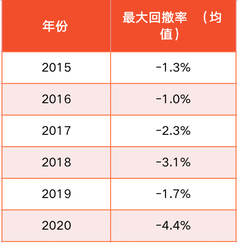

可以看到, 在市场的剧烈波动下, 对冲策略可以多年保持很小的回撤, 最大回撤率一般在-5%以内. 选择量化对冲基金的投资体验相对舒适, 小心脏不用每天为市场下跌而揪心.

那么, 量化对冲基金该如何选择呢?

上节课我们已经了解过, 私募量化对冲基金的历史业绩明显好于公募量化对冲基金.

如果你的资金实力雄厚, 可以优先考虑私募量化对冲基金. 投资私募基金需要合格投资者证明. 证监会规定, 满足以下两个条件的才算是合格投资者:

⑴ 投资于单只私募基金的金额不低于 100 万人民币;

(2)金融资产不低于 300 万元, 或者最近三年个人年均收入不低于 50 万元的个人.

其中提到的"金融资产", 不仅包括银行存款, 而且包括股票、基金等资产.

感兴趣且有实力的小伙伴可以联系靠谱的财富管理机构, 请专业的理财师为自己分析产品. 至于怎么挑选财富管理机构, 我们会在下一节课学习哦.

还有很多小伙伴资金有限, 暂时达不到投资私募基金的条件, 那么可以先选择公募量化对冲基金. 筛选过程需要用到晨星网和天天基金网.

[晨星网](https://www.morningstar.cn/)

[天天基金网](https://fund.eastmoney.com/)

第一步, 在晨星网首页的顶部菜单, 找到"基金工具", 点击其中的"基金筛选器".

第二步, 在跳转后的"基金筛选"页面, 点击其中的"更多筛选条件".

第三步, 基金分类勾选"市场中性", 申赎状态选择"申购开放, 赎回开放", 点击"查询".

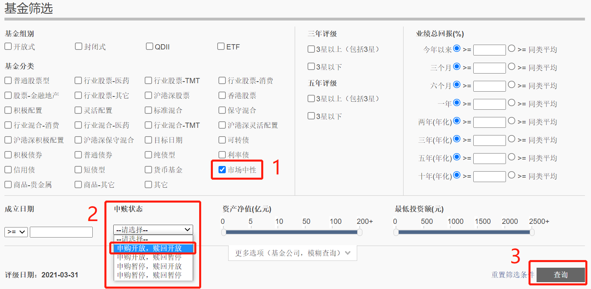

课程筛选时间为 2021 年 6 月 30 日, 共有 11 只基金通过筛选.

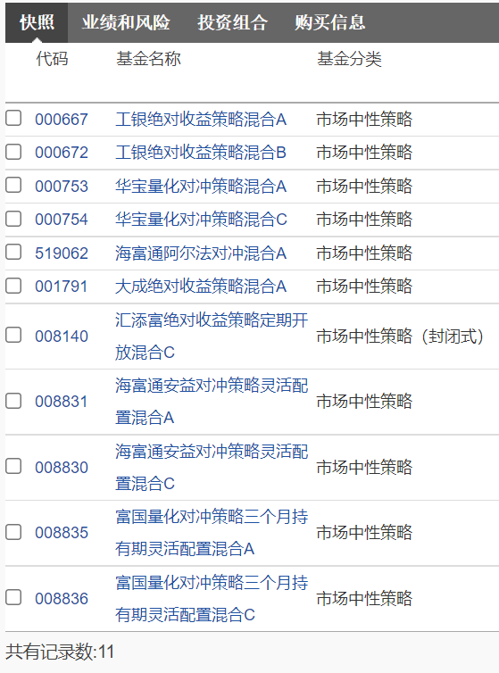

大家可以看文稿中的图片, 11 只基金中包含了 A 类、B 类、C 类. 其中, B 类和 C 类需要每年收取销售服务费, 对于长期投资来说不划算, 我们只保留 A 类. 这 11 只里面, A 类只有 6 只.

下面, 我们就把 6 只基金的名字录入水星专属筛选表格中. 表格是现成的, 大家可以联系自己的训练营班班获取哦.

<a href="/水星工具: 基金高阶专用.xlsx" target="_blank">水星工具: 基金高阶专用.xlsx</a>

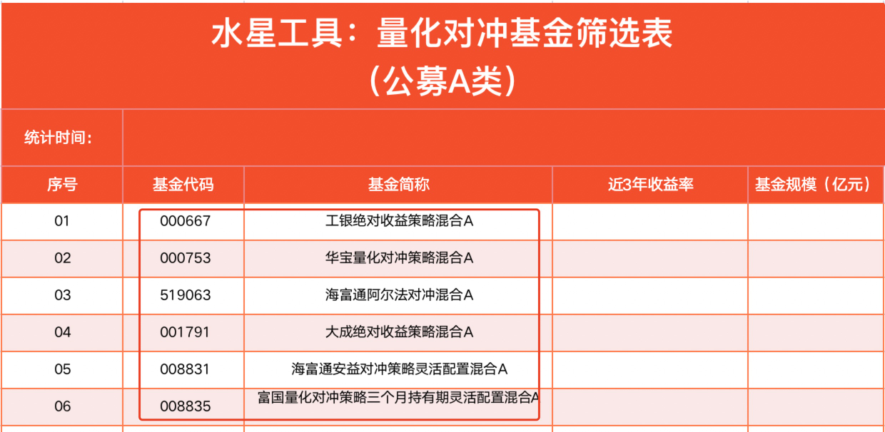

好啦, 晨星网的使用到此结束. 接下来, 我们进入天天基金网, 查询 6 只基金的"近 3 年收益率"和"基金规模".

以第一只基金"工银绝对收益策略混合 A"为例, 代码 000667, 我们在天天基金网搜索基金代码, 点击进入它的详情介绍页面.

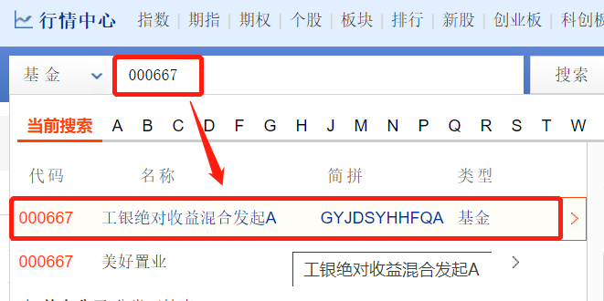

可以看到, 该基金近 3 年收益率为 19.78%, 基金规模为 9.45 亿元.

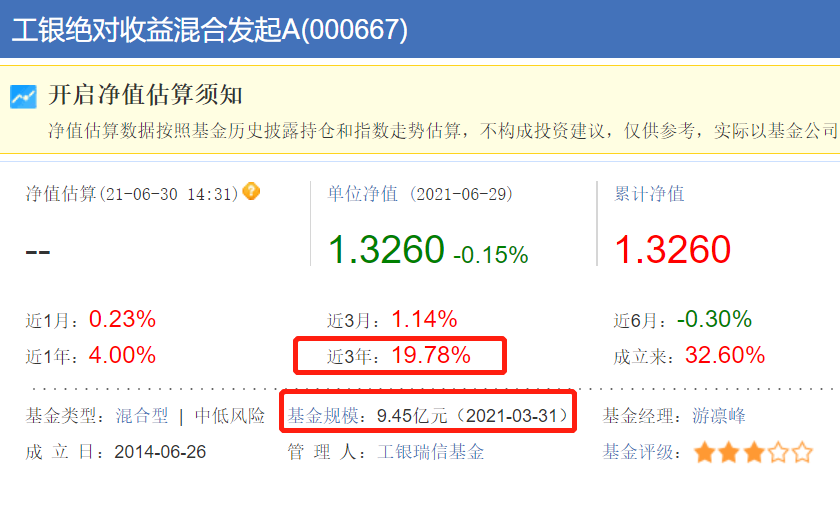

其他几只基金的查询方法也一样. 每查完一只, 大家就把数据录入到表格中. 如果近 3 年收益率缺少数据, 说明基金成立时间不满三年, 我们在表格中录入一条横线就好啦.

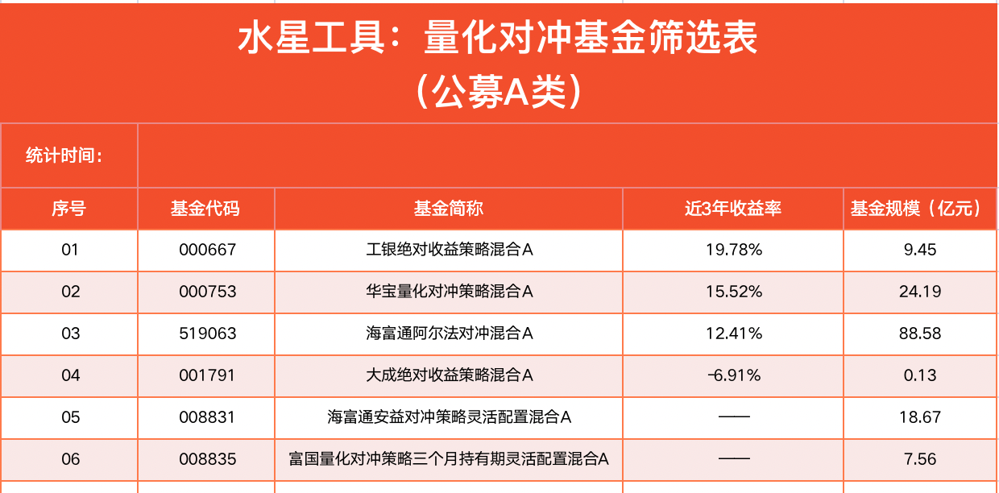

基金规模最好不少于 2 亿元. 在此基础上, 近 3 年收益率越大越好. 根据这条标准, 第一只基金最符合条件.

近 3 年 19.78%的收益率, 相当于历史年化 6.2%, 需要承受的下跌风险也不算大, 大家可以在晨星网查一下它的回撤大小, 截至 2021 年 6 月 30 日, 最差三个月回报是-5.82%, 最差六个月回报是-5.03%.

综合评估下来, 量化对冲基金是值得配置的哦. 公募量化对冲基金数量很少, 大家选择一只配置就可以啦.

有条件的小伙伴可以进 ─ 步考虑私募基金. 私募量化对冲基金的数量更多, 策略花样更多, 历史收益也更可观.

最后提醒: 课程中提到的基金和代码, 只是为了演示实操流程, 不代表投资建议, 大家一定要亲自实操筛选, 不要"刻舟求剑".

## 总结

1. "多"字代表的是上涨."看多"就是觉得会涨, "做多"就是买入. 如果一个投资者看多也做多, 他就是"多头". 反过来说, "空"字代表的是下跌."看空"就是觉得会跌, "做空"就是卖出. 如果一个投资者看空也做空, 他就是"空头".
2. 做空股票赚钱的原理是: 投资者手里没有股票, 但可以从交易平台借过来, 转手卖掉, 等股价跌了, 再把股票买回来, 还给平台. 做空需要在期货市场进行.
3. 股票多空策略就是对一篮子股票进行估值排名, 做多低估的, 做空高估的.
4. 市场中性策略就是通过做空股指期货, 消除市场涨跌的影响, 只保留凭借基金经理能力赚取的 α 收益.
5. 公募量化对冲基金的筛选需要用到晨星网和天天基金网. 不过, 有条件的小伙伴可以进一步考虑私募基金. 私募量化对冲基金的数量更多, 策略花样更多, 历史收益也更可观.
6. 投资私募基金需要合格投资者证明. 证监会规定, 满足以下两个条件的才算是合格投资者: 第一, 投资于单只私募基金的金额不低于 100 万人民币; 第二, 金融资产不低于 300 万元, 或者最近三年个人年均收入不低于 50 万元的个人.

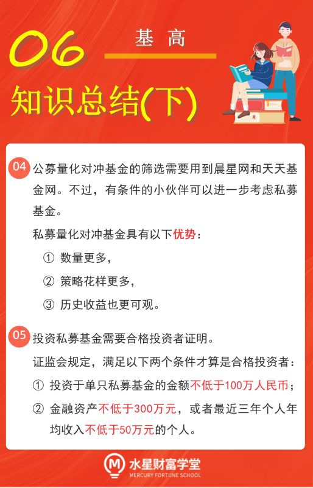

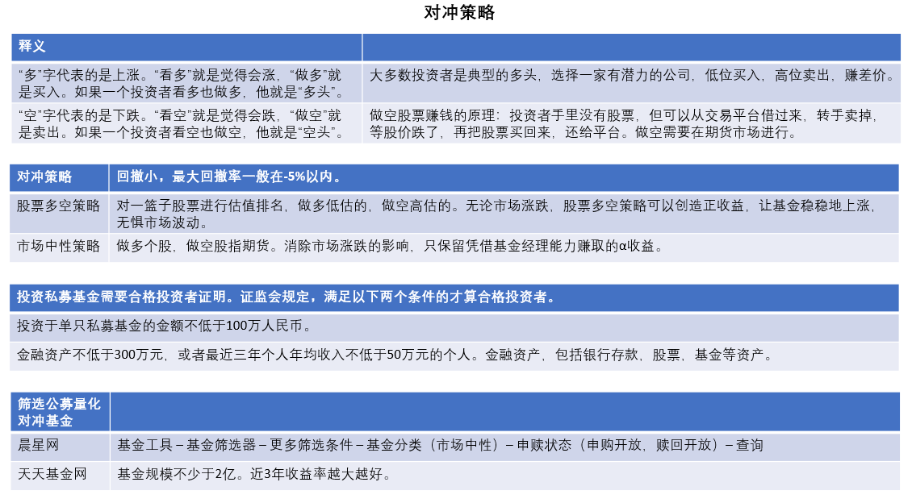

## 找个"管家", 量身定制理财规划

准备好了吗? 小伙伴们. 晚分享又如约而至~

### 一、投资市场的"四大角色"

学理财, 上水星财富学堂.

小伙伴们你们好, 欢迎继续学习《基金高阶训练营》.

本节课, 我们将一起走近个人理财的新选择: 财富管理机构.

有的小伙伴估计要犯嘀咕了: 财富我明白, 管理我也明白, 可是组合在一起就不知道什么意思了.

其实, 财富管理机构是投资中的重要角色之一. 在投资市场中, 一共存在着四种角色.

第一种角色, 个人投资者. 也就是小伙伴们这样的参与者.

第二种角色, 各类底层资产. 也就是股票、债券、大宗商品等等.

第三种角色, 资产管理机构. 它主要和产品打交道, 一门心思研究投资策略, 提高投资回报. 基金公司就属于资产管理机构的行列.

第四种角色, 财富管理机构. 它主要和人打交道, 为客户分析家庭财务, 综合考虑资产、负债、 流动性、风险承受能力等状况, 量身定制财务规划, 满足大家在不同阶段的财务需求.

在这四种角色之间, 可以形成三种投资链条.

第一种投资链条: 个人投资者 → 底层资产.

这是最原始的投资链条, 需要个人投资者亲自上阵, 付出大量的精力去研究底层资产, 直接买股票、债券、期货等等.

这种方式的缺点十分明显. 个人投资者评估风险的难度较大, 很多人不清楚底层资产的"水深水浅"; 而且, 个人的精力、财力投入有限, 和机构成为交易对手几乎不占优势. 所以, 我们的课程不推荐大家选择第一种投资链条.

第二种投资链条: 个人投资者 → 资产管理机构 → 底层资产.

大家花钱买基金, 让基金经理去挑选底层资产, 做各种交易决策, 就属于第二种投资链条.

资产管理机构减少了个人分析底层资产的麻烦, 而且会有强大的投资研究团队提供支持; 基金经理会发挥专业特长, 运用各种投资策略, 控制投资风险, 提高盈利概率.

但是, 资产管理机构只关注投资能力. 至于购买的人是谁、买多少、风险是否匹配等问题, 他们不会过多关注.

第三种投资链条: 个人投资者 → 财富管理机构 → 资产管理机构 → 底层资产.

很多小伙伴不太清楚, 按照自己的财务状况, 拿出多少钱来投资才算合理, 哪种风险等级的投资品更适合自己, 各种投资品分别配置多少比例, 等等.

有句话叫做"适合自己的才是最好的". 虽然课程里的各种投资方法普遍可用, 但是, 具体到每个人来说, 很难做到千篇一律.

而财富管理机构就是这样一个"中间人", 在个人和资产管理机构之间架起一座桥梁, 拿合适的投资品匹配合适的人.

随着时代发展, 越来越多的投资者选择了财富管理机构, 就像找了一个管家, 委托他分析家庭资产负债情况, 根据个人所处的生命周期, 量身定制理财规划.

有的小伙伴想说: 我也想找个"管家", 给我们家看看具体情况, 做做理财规划, 具体该怎么找呢? 我们下一小节就来揭晓.

### 二、扒一扒财富管理机构

根据监管体系的不同, 财富管理机构可以分成三大类.

第一类, 受银保监会监管的财富管理机构. 这一类主要诞生于银行系、信托系.

第二类, 受证监会监管的财富管理机构. 这一类一部分诞生于券商系, 还有一部分是持有基金独立销售牌照的第三方财富管理机构.

第三类, 在监管体系之外的各种财富管理机构. 比如各类小微贷平台, 以及之前大量存在的 P2P 公司等等.

在选择财富管理机构的时候, 我们首先要排除第三类, 因为他们不仅产品本身的风险不可控, 容易"暴雷", 而且存在监管风险, 监管政策一变, 直接影响公司生存.

其他两类财富管理机构都可以选择. 其中, 银行系、券商系的品牌效应较强. 很多投资者比较认可大银行、大证券公司的"招牌", 会选择它们旗下的财富管理机构.

不过, 银行系、券商系的财富管理机构具备一定的劣势. 打个比方, 我们问 A 银行哪个理财产品好, 它应该不会给我们推荐 B 银行的产品, 即使 B 银行的产品性价比更高, 它也不会推荐. 这就导致, 银行系、券商系的财富管理机构很难做到客观中立.

除了它们以外, 第三方财富管理机构正在国内迅速崛起. 所谓的"第三方", 大家可以理解为一个超市, 里面摆满了各大品牌的产品. 我们逛超市的时候, 可以同类产品综合对比, 买性价比最高的.

所以说, 第三方财富管理机构的优势在于中立, 产品和公司相互独立, 业务的核心逻辑是匹配最适合客户的, 而不是销售最需要销售的.

### 三、三步考察一家机构

上一小节, 我们提到了第三方财富管理机构的优势, 那就是中立. 那么, 当我们面对一家财富管理机构的时候, 怎么判断它是否值得选择呢?

判断过程可以分为三步: 考察持牌情况、考察服务经验以及考察产品线.

第一步, 考察持牌情况.

大家注意, 机构一定要持有基金独立销售牌照, 才算受到了监管认可. 那么, 怎么查一家机构有没有基金独立销售牌照呢?

很简单, 在"中国证券投资基金业协会"的官网就可以查到.

[中国证券投资基金业协会官网](https://www.amac.org.cn/)

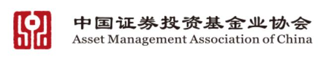

(认准官网标识)

我们打开中国证券投资基金业协会官网, 在首页右上方的搜索框输入机构的名称. 此处以"金斧子"为例来演示操作步骤.

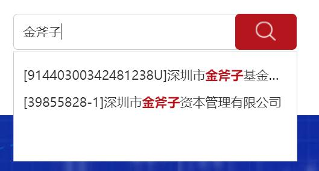

大家可以看到, 搜索结果中出现了两个条目, 遇到这种情况, 我们逐个点开来检查一遍就好啦. 首先我们点击第一个: 深圳市金斧子资本管理有限公司.

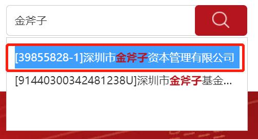

在查询结果中, 可以看到这家公司的"机构类型"是"私募证券投资基金管理人".

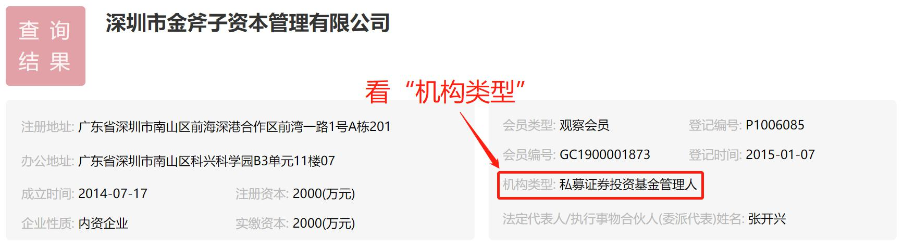

"基金管理人"可以直接理解为基金公司. 所以咱们就能明白啦, 这家机构是做私募基金的.

接下来, 我们再重新搜索一次"金斧子", 选择第二个: 深圳市金斧子基金销售有限公司.

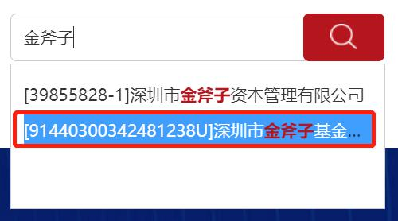

在查询结果中, 可以看到, 这家公司的"机构类型"为: 独立第三方销售机构. 它就是我们要找的机构啦.

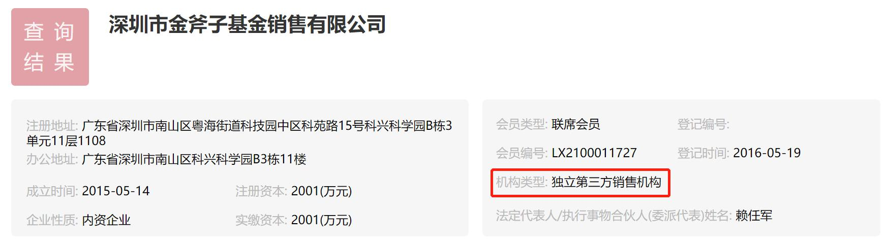

第二步, 考察服务经验.

判断一家公司的服务经验时, 一般看它服务了多少年, 以及服务了多少人.

服务了多少年很好查, 在前面搜索持牌情况是, 查询结果中就包含了服务年限. 公司拿到第三方销售牌照的"登记时间"达到五年以上, 就算是经验丰富的机构啦.

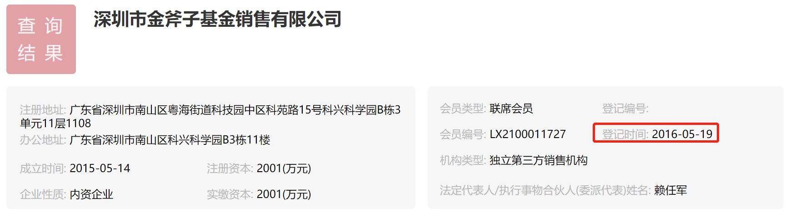

那么, 服务了多少人该怎么看呢? 我们可以搜索一下公司官网, 到官网上面找数据. 如果公司实力雄厚, 就会大方展示自己的客户数量, 从而吸引更多的人.

我们进入"金斧子"官网, 可以找到"关于我们", 里面有一段公司简介. 其中提到"金斧子平台中产以及高净值注册用户已突破 57 万", 而且"超过 10 万个家庭得到了专业、独立、实时、高效的一站式资产配置建议与基金交易服务."可以判断, 公司客户数量足够庞大, 服务经验丰富.

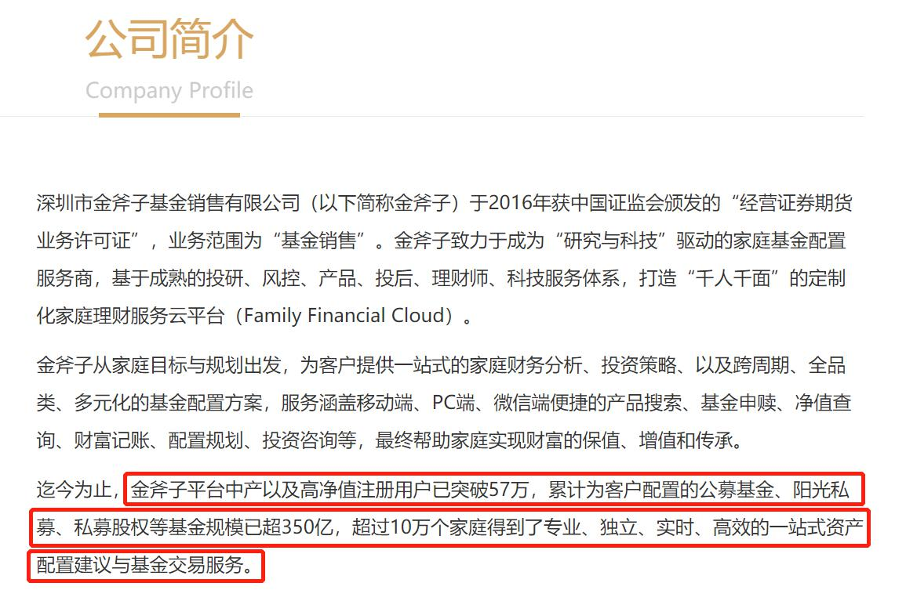

第三步, 考察产品线.

我们前面提到, 财富管理机构就像是"超市", 超市之间有大小区别, 如果超市太小, 我们想买的东西根本找不到, 那也不能通过. 所以, 我们还得关注一下, 公司的产品线是否齐全.

如果一家公司同时具备了固收、股票、商品、量化对冲、股权类产品, 就说明它的产品线相对完备.

其中, 固收指"固定收益"产品, 主要是债券; "股权"指的是尚未上市的公司的股东权益. 有些类别的产品在我们的课程里尚未涉及, 但是在配置的时候, 理财规划师会根据每个人的实际情况有选择地为大家配置哦.

公司的产品一般会展示在官网上面. 我们再次查看"金斧子"的官网. 可以看到, 公司所展示的产品同时包括了公募和私募, 可以实现全品类资产配置.

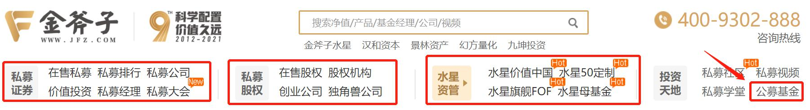

如果在官网找不到想要的信息, 我们还可以联系公司客服, 向客服详细询问. 本节课的内容就到这里啦. 最后, 我们一起来总结一些课程重点.

## 晚分享总结

1. 投资市场中包含四类角色: 个人投资者、底层资产、资产管理公司和财富管理公司.
2. 资产管理机构主要和产品打交道, 一门心思研究投资策略, 提高投资回报. 基金公司就属于资产管理机构的行列. 至于购买的人是谁、买多少、风险是否匹配等问题, 他们不会过多关注.
3. 财富管理机构主要和人打交道, 为客户分析家庭财务, 综合考虑资产、负债、流动性、风险承受能力等状况, 量身定制财务规划, 满足大家在不同阶段的财务需求. 简单来说就是"拿合适的投资品匹配合适的人".
4. 第三方财富管理机构就像一个超市, 优势在于中立, 产品和公司相互独立, 业务的核心逻辑是匹配最适合客户的, 而不是销售最需要销售的.
5. 判断一家财富管理机构是否值得选择, 过程可以分为三步: 考察持牌情况、考察服务经验以及考察产品线.
