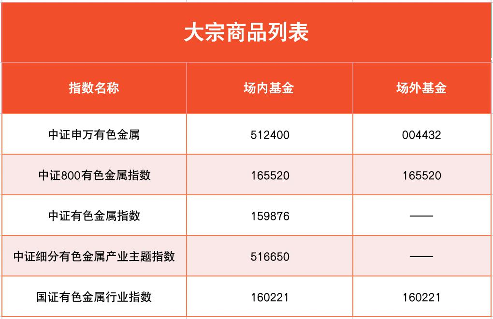
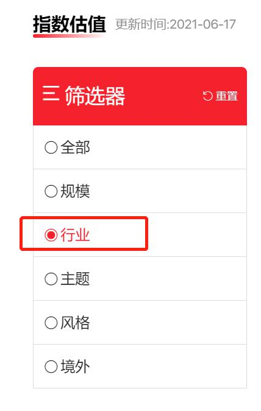
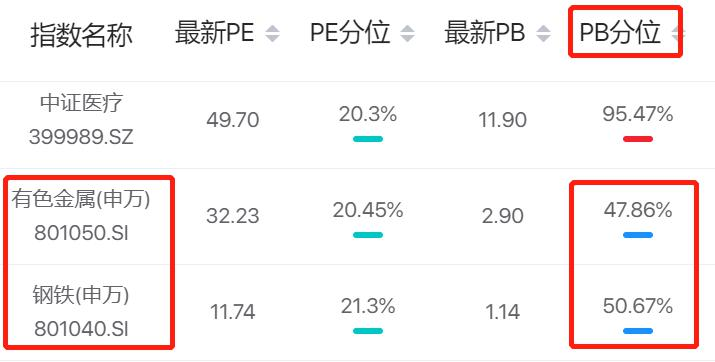

## 大类资产配置

小伙伴们你们好, 欢迎继续学习《基金高阶训练营》.

本节课开始, 我们将打开一扇基金投资的新大门: 商品基金

有的小伙伴可能会想: 我已经有了债券基金和股票基金, 一个进攻一个防守, 这不就够了吗? 多加一个商品基金有什么意义?

对于普通投资者而言, 股债搭配基本可以满足资产配置的需求.

但是, 这仅仅是最基础的资产配置策略, 它的缺陷在于, 如果债券基金收益率过低, 缺乏吸引力, 指数基金又到了温度过高的时候, 不满足入场时机, 那么我们的投资会进入一段"空窗期".

把商品基金加入以后, 常常可以达到填补"空窗期"的效果. 也就是说, 在债券基金、指数基金的投资吸引力都不够的时候, 实物商品基金的机会或许就到来了.

投资大师马丁·普林格有一套著名的理论. 他把经济周期划分成了 6 个阶段. 在每一个阶段, 股票、债券、商品这三类资产都有一种会发生方向性的转变.

大家可以看文稿中的"普林格经济周期六阶段图". 一轮经济收缩加一轮经济增长, 组成一个完整的经济周期. 这一周期为期大约 4~5 年. 在周期内分成了 6 各阶段——

阶段 1: 经济减速, 市场利率下滑; 我们在《基金初级训练营》学习过, 市场利率和债券价格存在负相关的关系, 此时债券价格开始上涨, 适合买入债券.

阶段 2: 经济减速到低位, 开始调整, 准备反弹, 而股市作为经济的"晴雨表", 往往会提前作出反应, 开启上涨模式, 此时适合买入股票.

阶段 3: 经济转头向上, 原本不景气的行业开始复苏, 各个公司渐渐放开规模, 此时需要足够的原材料和能源用于生产, 需求扩大导致商品价格上涨; 而且, 为了刺激经济复苏, 中央银行会适度放开通货膨胀, 从而导致"钱不值钱了", 推升物价上涨, 所以该阶段适合买入商品.

阶段 4: 经济加快扩张, 市场利率上升, 债券价格开始回落, 此时要及时卖出债券.

阶段 5: 经济增长见顶, 即将掉头回落, 此时股市提前开始作出反应, 开启下跌模式, 应当及时实出胶券.

阶段 6: 经济急速下降, 各行各业产能过剩, 开始出清库存, 不需要进行更多的生产, 从而造成商品需求减弱, 商品价格开始下跌, 此时应当及时卖出商品.

根据普林格经济周期的六个阶段, 我们可以发现, 债券、股票和商品在不同的时期发挥不同的作用, 从而达到"东方不亮西方亮"的投资效果.

我们只要做好大类资产配置, 同时把债券、股票和商品纳入投资行列, 就有机会在一轮经济周期中"橹"三份收益, 进而提高投资总回报.

其中, 债券基金已经满足了我们对债券类资产的配置需要, 股票基金已经满足了我们对股票类资产的配置需要, 那么剩下的, 就是如何投资商品啦.

商品的种类有很多. 黄金、白银、原油, 煤炭、有色金属、大豆、玉米, 甚至房子、车子、以及大家网购的各种东西等等都可以算商品. 在这么多种类的商品中, 有一种绝对算得上独树一帜, 它就是黄金.

## 黄金和白银

说黄金不一般, 主要是因为在它身上凝聚了三大属性: 商品属性、投资属性和货币属性.

### (1)商品属性

黄金具有很好的物理性能和化学性能, 比如它的延展性和抗腐蚀性. 这些优点可以用在电子工业、航空航天. 医学等商业领域. 其次, 黄金还具有极强的观赏性, 可以制作成首饰和工艺品进行销售.

### (2)货币属性

黄金作为一种世界公认的货币, 可在全球范围内流通. 世界上多数国家都会在国库储备一定数量的黄金, 当本国货币出现危机的时候, 黄金储备可以拿来应急.

### (3)投资属性

如今的黄金已经成为一种明正言顺的投资品, 投资形式也多种多样, 比如实物黄金、纸黄金、黄金期货和黄金 ETF 等等, 这些将在下一小节中进行详细介绍.

在整个商品界, 能够集齐三大属性的, 只有黄金和白银. 其他种类的商品, 最多具备其中的一两个属性.

比如张三家的二手车, 可以拿来交易, 具备商品属性, 但是它基本不具备投资属性, 更不具备货币属性.

再比如原油、煤炭和有色金属, 它们同时具备了商品属性和投资属性, 但是不能拿来作为货币流通, 所以不具备货币属性.

有些小伙伴可能会觉得白银可以和黄金媲美, 但其实它们有很大区别.

白银和黄金都有悠久的货币历史, 但是, 各国央行基本都选择了储备黄金, 很少去储备白银. 这是因为, 黄金本身属于稀缺的品种, 而且供给量增速很慢, 历史上很少有黄金供给量增速超过 5%的年份. 每年, 全球黄金矿业新采出约 2500~3000 吨黄金.(数据来源: 世界黄金协会)

而白银的开采就多啦. 以 2019 年为例, 这一年世界白银产量就达到了 2.7 万吨, 远远超出了黄金的年产量.

如果一个东西越来越泛滥, 它也就不怎么值钱了. 如果它一直保持稀缺, 就可以一直保持它的价值. 所以, 黄金能够起到保值的作用, 有利于维持国家财政的稳定. 其货币属性占了较大比重, 商品属性不明显.

至于白银, 刚好相反, 货币属性不明显, 保值效果不好, 反倒是商品属性占了较大的比重. 据估计, 到 2030 年, 单单光伏行业就要消耗惊人的 8.88 亿盎司的白银, 换算成重量接近 3 万吨.(数据来源: 世界白银协会)

相比之下, 黄金投资更加适合普通投资者参与. 我们只要抓住它的货币属性来进行投资就可以啦. 这一点会在之后的课程中详细解答.

而且, 投资黄金所产生的收益也很有吸引力! 在 2018 年 6 月到 2021 年 6 月这 3 年时间里, 黄金价格从 273.78 元/克涨到了 396.19 元/克, 涨幅达到了 44.71%, 如果你在这段时间持有黄金, 年化收益率可以达到 13%左右.

## 配置黄金的五种方式

黄金配置可以分为五种方式: 实物黄金、金币、纸黄金、黄金期货以及黄金基金.

我们来一起看一下这些方式到底怎么玩转, 以及每种方式的优缺点.

### 第一种方式, 选择实物黄金.

实物黄金就是大家经常听到的金条、金砖. 这些都是实打实的真东西, 优点是看得见摸得着, 不存在交易系统的风险, 只要自己保存好了, 哪怕埋在地里, 隔三代再挖出来, 照样可以保值.

但是, 实物黄金的缺点就是难以保管, 放在家里难免害怕遭小偷惦记. 如果你在保管上面下足了功夫, 可以配置实物黄金.

不过要提醒一点, 从投资的角度讲, 建议大家选择金条、金砖这种没有过多加工的黄金, 而不是选择黄金首饰和工艺品. 因为首饰和工艺品经过加工之后, 买入价格相对更高, 但是卖出的时候很可能只能按照普通黄金的价格来卖, 这样会降低投资的性价比.

### 第二种方式, 选择金币.

金币就是用黄金铸造的货币. 黄金本身就属于稀缺的东西, 铸成金币的黄金就更加稀缺了. 所以, 金币本身除了可以保值以外, 还具有一定的收藏价值, 未来可能像字画、古玩一样涨价, 收益远远超过买金条、金砖.

不过, 近年来金币的发行量加大了, 稀缺效应在逐渐减弱. 而且, 收藏品是一个非常专业的领域, 外行一般难以驾驭. 比如, 市面上的金银币有两千多种, 哪些未来增值概率大, 哪些不太容易增值, 需要专业的分析. 所以不太建议小伙伴们选择投资金币.

### 第三种方式, 选择纸黄金.

纸黄金一般在银行柜台销售, 相当于我们在银行开一个黄金的存折账户, 往里面存一笔钱, 用于投资黄金. 它是一种个人凭证式的黄金, 与金价挂钩, 优点是随时可以交易, 而且交易成本很低.

但是, 纸黄金不是每个银行都可以买, 国内只有一些特定的银行可以交易.

### 第四种方式, 选择黄金期货.

期货最大的特点就是可以加杠杆, 也就是放大最终的盈亏. 比如, 我们交 1 万保证金, 却可以拿到 10 万的交易额度, 把投资效果放大 10 倍.

虽然能投资的黄金更多了, 但是投资风险也被放大了. 所以, 我们的课程不建议大家选择黄金期货.

### 第五种方式, 选择黄金基金.

黄金基金有专门的基金经理负责管理, 主要投资于黄金或黄金类的衍生交易品种. 比如投资于上海黄金交易所的 AU99.99 现货合约, 这份合约可以兑换成实物黄金哦.

其实黄金基金和指数基金差不多, 区别在于指数基金跟踪的是股票指数, 黄金基金跟踪的是黄金的价格.

投资黄金基金的渠道跟投资指数基金的渠道完全一致, 场内和场外都可以. 大家在金斧子基金和证券公司的平台都是可以买入的哦.

黄金基金的起投门槛和指数基金的差不多, 几百块就可以投资, 这一点对普通投资者非常友好.

### 总结

1. 根据普林格经济周期的六个阶段, 债券、股票和商品在不同的时期发挥不同的作用, 只要我们全部纳入配置方案, 就有机会在一轮经济周期中"增"三份收益, 进而提高投资总回报.
2. 黄金和白银同时具备了三大属性: 货币属性、商品属性和投资属性. 其中, 黄金的货币属性较重, 商品属性不明显; 白银的商品属性较重, 货币属性不明显. 建议普通投资者优先配置黄金.
3. 配置黄金的 5 种方式包括: 实物黄金、金币、纸黄金、黄金期货和黄金基金. 建议普通投资者优先选择黄金基金

## 一次性搞懂大宗商品投资

### 一、认识大宗商品

先问大家一个问题, 什么是大宗商品?

先抛开"大宗"不看, 商品的意思很好懂, 简单说, 市场上能交易的东西就是商品. 比如菜市场的韭菜大葱, 淘宝上的衣服, 直播间的口红, 甚至游戏皮肤, 视频会员, 等等, 都算. 商品的种类可谓五花八门.

但是, 加上一个"大宗", 就比较特别了. 先来看一下教科书式的"大宗商品"定义:

在金融投资市场, 大宗商品指的是【同质化】、【可交易】、【被广泛作为工业基础原材料】 的商品.

乍一看定义, 是不是有些死板? 没关系, 咱们都是实战派, 不在理解概念上浪费时间啦. 简单来说吧, 大宗商品包括三个大类别: 能源化工类、金属类、农副产品类. 班班总结成了一张表, 大家直接对照着表格即可.

能源化工类里面, 最主要的, 也是投资最广泛的, 是原油和煤炭.

大家平时给汽车加油, 都是经过处理后的成品油; 原油指的是从地里取出来, 还没经过加工处理的石油. 至于煤炭, 不用多说了, 就是山西盛产的那个东西.

金属类里面展示的, 除了铁以外, 都是有色金属."有色"这个概念是根据冶金工业来分类的. 金属可以分成两类, 一类是黑色金属, 包含铁、锰、铬三大类. 除了铁、锰、铬, 其他所有的金属统称为有色金属. 咱们课程里讲到的黄金、白银, 都算有色金属哦.

最后是农副产品类. 这一类品种最多啦, 但是对投资来说, 最主要的是大豆、小麦、玉米这三种农产品. 它们都是和我们日常饮食息息相关的, 不需要班班多解释啦.

大宗商品该如何投资呢? 班班给大家总结了三种方式: 大宗商品现货、大宗商品期货、大宗商品股. 三种方式都可以通过基金实现! 下面班班挨个来讲一下哈.

### 二、大宗商品现货

现货的意思就是实物. 比如班班买了一根金条, 再转手卖掉, 这就是实物交易, 也就是现货交易, 特点是一手交钱一手交货.

此外还可以是现货合约的形式. 我们课程里学到的黄金基金, 基金经理投资的是现货合约, 这份合约是可以兑换成实物黄金的哦.

普通投资者能够通过基金实现的, 目前也就只有黄金基金啦. 大家记这一个就行了.

### 三、大宗商品期货

虽然"期货"名字里带个"货"字, 但是它可不是实打实的货, 而是一份合约. 这个合约规定的是未来某一时间, 我们以某一价格购买大宗商品. 特点是先打钱后交货.

比如说, 现在大豆价格是 2000 元/吨, 班班觉得将来大豆价格要涨, 所以就和市场上的交易对手签了一份期货合约, 合约规定未来半年内, 班班可以随时按照 2000 元/吨的价格买 10 吨大豆. 如果未来真的大豆涨价了, 那么班班就提前通过期货, 锁定了便宜价格, 赚到差价.

为什么对手愿意签合约呢? 因为他觉得大豆价格要跌, 以为班班 2000 元/吨会买贵. 所以我们是交易对手嘛, 对赌方向不一样.

为什么班班不直接按照 2000 元/吨买好 10 吨小麦, 囤起来等上涨呢? 因为买 10 吨花钱太多啦, 而期货可以不用付全款, 付保证金表达意向就可以啦. 比如班班想买 10 万的货, 只需要 1 万保证金. 但是最终盈亏是按照 10 万的货来算的, 相当于把盈亏放大了 10 倍. 杠杆非常大~

保证金制度就是期货出现大亏大赚的根本原因. 所以咱们的课程在讲到黄金期货的时候, 提到了不建议大家购买黄金期货. 其他的大宗商品期货, 也不建议大家直接碰.

不过, 在 2019 年 8 月, 国内首批商品期货 ETF 获批. 也就是说, 大家现在可以用基金的方式, 投资大宗商品期货了哦. 而且, "期货 ETF"去掉了杠杆, 不会放大盈亏!

期货 ETF 基金是怎么去掉杠杆的呢?

因为基金经理很小心, 只拿出 10%左右的资产作为保证金, 去配置大宗商品期货.10%即使放大 10 倍, 也不过就是 100%. 超过 100%才算有杠杆哦, 所以说, 期货 ETF 没有杠杆.

至于剩下 90%左右的资产怎么安排? 基金经理可以买入稳稳的货币或债券类资产, 获得额外收益.

总结一下, 期货会成倍加杠杆, 成倍放大投资风险, 不建议大家尝试; 但是期货 ETF 没有杠杆, 不会放大风险, 有合适的机会可以尝试一下.

那么, 大宗商品期货 ETF 包含哪一些呢? 很少, 目前只有 2019 年 8 月首批发行的 3 只, 之后就再也没有新的了. 这 3 只基金大家看下面表格.

大家看, 能源化工类、金属类、农副产品类分别有 1 只. 三类大宗商品都覆盖了, 还省得再去筛选了.

其中, 能源化工、有色金属这 2 只, 都跟踪的是商品指数, 指数代表一篮子商品哦. 这俩是国内"唯二"的综合指数型商品基金.

至于饲料豆粕这只 ETF, 跟踪的是单一品种豆粕, 而不是整个农副产品类. 可能有的小伙伴不知道"豆粕"是啥东西, 班班解释下:

豆粕就是, 大豆提取豆油之后, 得到的一种副产品; 它是家禽和猪的主要饲料来源, 农民伯伯常常拿来喂猪, 所以俗称"猪食". 豆粕主要来源于大豆压榨, 所以它跟大豆息息相关哈. 我国大豆供给几乎靠进口, 所以大家研究国内的大豆生产意义不大. 进口大豆最主要的来源地是巴西, 占比接近 70%!

好啦, 3 只期货 ETF 介绍完啦. 接下来的问题是, 它们该怎么投资呢?

首先班班定个基调: 期货 ETF 属于"非主流"的品种, 波动比较大, 可以当作投资大餐中的一盘小菜, 少量投资即可, 增加一下投资的趣味, 可千万不要重金砸进去哦! 建议配置比例不要超过你的总资产的 10%~

其次, 大家可以结合昨晚加餐分享的, 普林格经济周期 6 阶段. 其中, 阶段 3 适合买入商品, 可以拿大宗商品期货 ETF 来配置.

还是要提醒一下大家, 普林格经济周期偏理想状态, 本身有失效的风险, 只可以当作辅助参考. 最后, 也是最主要的, 就是研究商品供需关系.

供给和需求, 这是经济大课题啦, 咱们不会讲太细, 否则再加 14 天训练营也说不完. 简单来说, 大宗商品期货 ETF 跟踪的是商品价格走势, 导致商品价格变化的主要原因就是供需关系.

供大于求, 说明供给太多啦, 积压很多存货卖不出去, 商品价格就会下降, 对应期货 ETF 就会下跌.

供不应求, 说明需求量很大, 供给跟不上, 成为"缺货"状态, 商品价格就会上涨, 对应期货 ETF 也会上涨.

预期需求会增加, 或者供给会减少, 从而商品价格上涨, 这是投资这 3 只期货 ETF 的最纯的动机, 最有力的证据.

举个典型的例子, 比如新冠疫情爆发, 生产停摆, 原材料、能源供给骤减, 但是随着经济企稳复苏, 生产需要大量的原材料和能源. 供给减少+需求加大, 促进了原材料价格的一波上涨.

大家看一下有色金属期货 ETF 在疫情中后期的强劲涨势:

再看一下能源化工期货 ETF, 涨势也很强劲:

抓这种至关重要的大事件, 大趋势, 对咱们普通投资者来说比较实际一些. 当你预期供需关系明显要变有利了, 就可以布局啦!

### 四、大宗商品股

简单来说, 就是投资上市公司的股票, 而且公司本身就是做大宗商品相关生意的.

比如, 山东黄金, 公司以黄金开采为主业, 拥有勘探、采矿、选矿、冶炼(精炼)和黄金产品深加工、销售于一体的完整产业链.

再比如, 陕西煤业, 主业是产煤卖煤的; 中国石油, 主业是产油卖油的. 这些都是大宗商品股.

选择大宗商品股的优点是投资比较方便, 大家就把它们看成具体的行业, 选择相应的行业指数, 用指数基金就可以投资啦.

比如有色金属, 就有很多指数, 很多只基金哦.

再比如钢铁、煤炭、能源, 都可以找到对应的指数基金哦.

此外, 还有不限种类, 囊括各种大宗商品的指数基金哦.

但是, 大宗商品股的缺点也比较明显, 那就是对大宗商品价格波动的跟踪性较差. 毕竟它还在股票这趟车上, 和股市的相关性比较大.

总结成一句话就是, 大宗商品股相当于"股票"和"商品"结合出来的一个"杂交品种". 如果股市表现好, 商品也好, 那么大宗商品股就是好上加好, 赚的大概率比商品期货 ETF 还要多.

反之, 差上加差, 那就大概率跌得更惨.

关于估值: 大宗商品所处的行业都是强周期行业, 周期行业指数的估值主要看市净率 PB. 初级课学过 PB 哦, 班班带大家回顾一下:

市净率 PB=市值/净资产

PB 代表的是, 需要花几倍的价格买下公司的资产.

实际在考察估值高低的时候, 我们要看 PB 分位点."韭圈儿"上面就可以查看哦. 网址: http://www.funddb.cn/site/index

筛选器选择"行业"↓↓↓

有色金属、钢铁、煤炭 PB 分位点都可以在这里找到.

有些在"韭圈儿"找不到的, 大家可以用理杏仁网站搜索. 方法在初级课都学过了, 咱们就不啰嗦了.

PB 分位点低于 50%, 就说明相对安全, 可以入手. 建议分批定投哦~ 今晚分享到此结束.

### 晚分享总结

1. 大宗商品包括三个大类别: 能源化工类、金属类、农副产品类.
2. 大宗商品投资有三种方式: 大宗商品现货、大宗商品期货、大宗商品股. 三种方式都可以通过基金实现!
3. 期货会成倍加杠杆, 成倍放大投资风险, 不建议大家尝试; 但是期货 ETF 没有杠杆, 不会放大风险, 有合适的机会可以尝试, 但配置比例不要超过自己总资产的 10%.
4. 大宗商品期货 ETF 总共只有 3 只. 判断投资时机重点分析供需关系, 其次可以结合普林格经济周期 6 阶段.
5. 大宗商品股可以通过行业指数基金来投资, 估值看指数 PB 分位点, 低于 50%即可投资.
