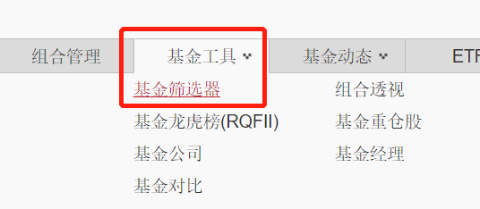
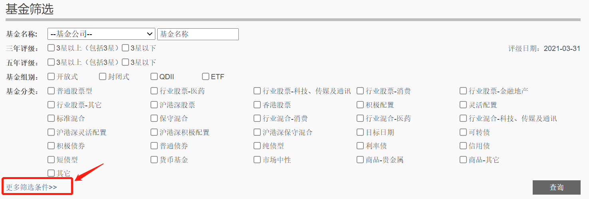
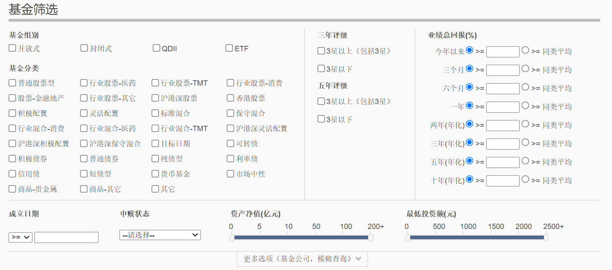
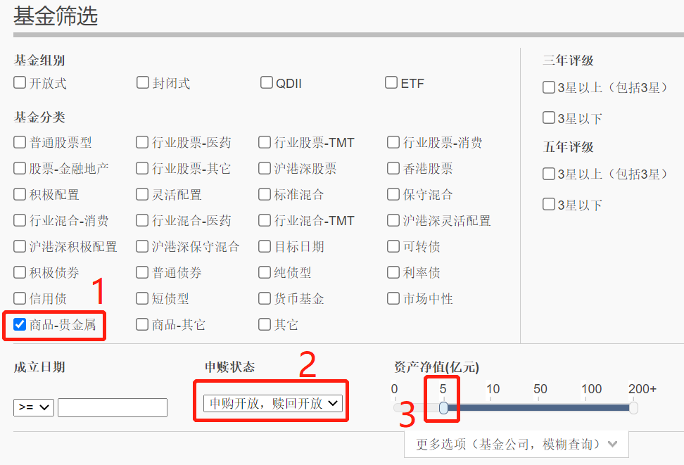
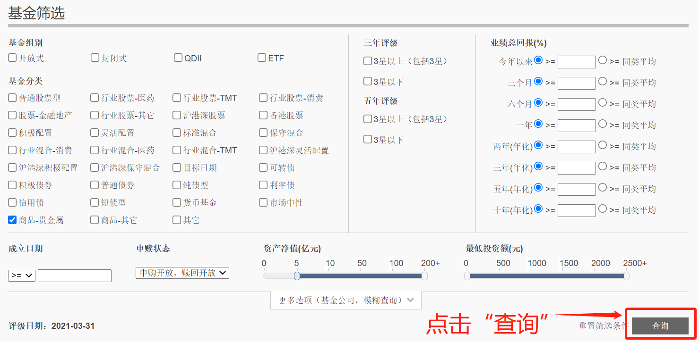
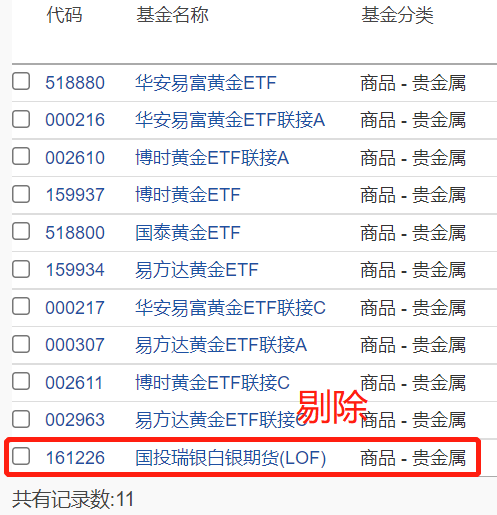
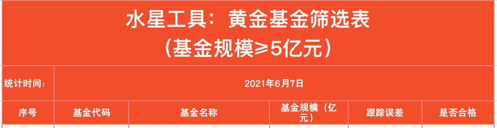
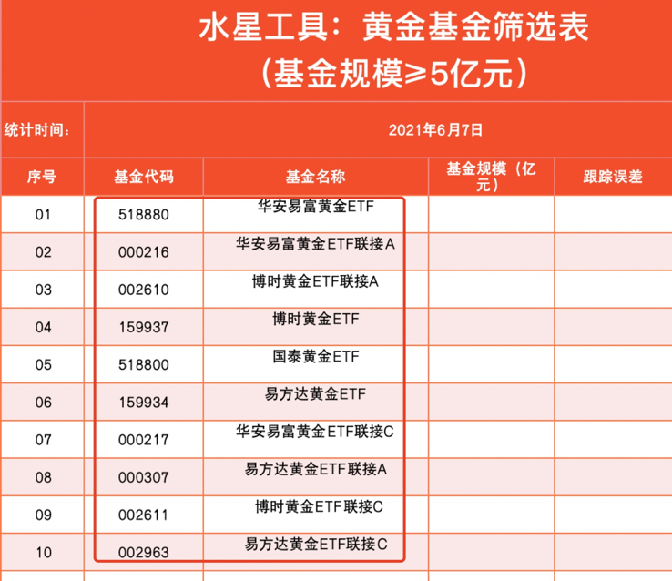
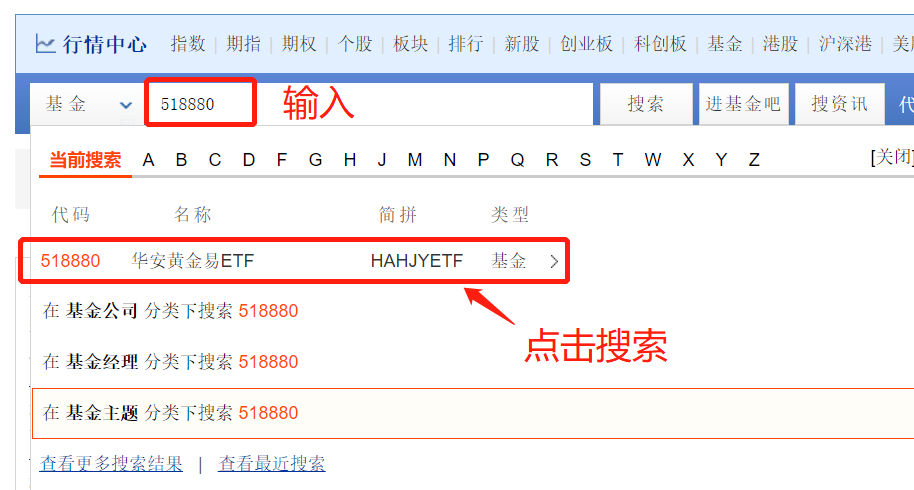
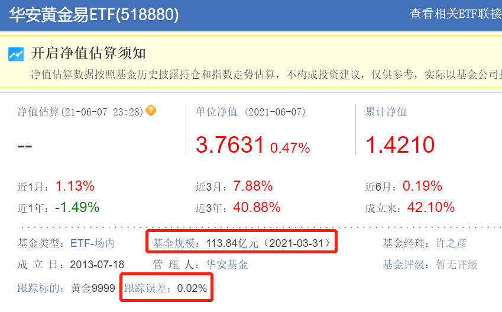

## 如何筛选黄金基金

小伙伴们你们好, 欢迎继续学习《基金高阶训练营》.

在上一节课, 我们学习了配置黄金有五种方式, 其中最适合普通投资者的是黄金基金.

那么, 如何选出满意的黄金基金呢?

黄金基金的筛选和指数基金的筛选很类似. 在筛选指数基金时, 我们主要看三方面: 基金规模、跟踪误差和是否属于增强型指数基金.

对于黄金基金来说, 不存在"增强型"的品种. 所以, 我们只需要看两个指标就好啦, 一个是基金规模, 另一个是跟踪误差.

首先来看基金规模. 需要注意的是, 黄金基金的规模如果过小, 也是存在清盘风险的. 通常来说, 基金规模不小于 1 亿元时, 基金清盘的概率比较小.

基金规模越大, 越有利于基金稳定运作. 安全起见, 我们不妨把筛选标准定高一点, 让基金规模不小于 5 亿元.

其次来看跟踪误差. 这个指标的用法和筛选指数基金时一样. 跟踪误差越小, 说明复制越精确; 跟踪误差越大, 说明复制越糟糕.

我们在筛选的时候, 要尽可能选跟踪误差小的基金.

## 实操(上): 巧用筛选工具

筛选黄金基金需要用到"晨星网".

在晨星网顶部的菜单中找到"基金工具"这一栏, 鼠标移动到文字上的时候, 会自动出现下拉菜单. 接下来, 我们点击下拉菜单中的"基金筛选器".

点击完成后, 会跳转进入基金筛选的界面. 我们点击其中的"'更多筛选条件".

这时我们可以看到, 很多隐藏的筛选条件已经显示出来的. 接下来我们就用它们来进行筛选.

我们点击基金分类里面的"商品-贵金属", 申赎状态选择"开放申购, 开放赎回", 资产净值选择最低 5 亿元. 这样选择, 我们就锁定了资产净值不小于 5 亿元, 而且现在可以正常买卖的贵金属类的基金. 贵金属类基金包括了黄金基金和白银基金, 如果筛选结果中出现白银基金, 我们把它排除即可.

至于晨星网的三年评级和五年评级, 在本次筛选中用不到, 因为晨星网没有给黄金基金这个类别进行评级.

筛选指标都选择好以后, 点击"查询", 就可以看到这一步的筛选结果啦.

课程中的筛选日期为 2021 年 6 月 7 日, 筛选结果共有 11 只基金, 其中最后一只"国投瑞银白银期货"是一只白银基金, 我们把它剔除.

判断白银基金和黄金基金很简单, 只需要看基金的名字就可以了. 这些基金的名字里都会带有"黄金"和"白银"的字眼.

11 只基金剔除了 1 只白银基金以后, 剩下的 10 只基金作为我们的备选项. 我们把它们的基金名称和代码录入到筛选表格中. 水星财富学堂为大家准备了黄金基金筛选表. 大家可以联系自己的训练营班班获取哦.

<a href="/水星工具: 基金高阶专用.xlsx" target="_blank">水星工具: 基金高阶专用.xlsx</a>

录入的时候, 我们首先在表格中填好自己的统计时间, 方便以后复查.

接下来, 将 10 只基金的名字和代码逐个录入表格中.

好啦, 通过在晨星网上简单的操作, 我们把筛选范围缩小在了 10 只黄金基金里面. 这 10 只到底应该投资哪一只呢? 此时就要用到我们的两个筛选指标啦, 也就是基金规模和跟踪误差

## 实操(下): 水星专属筛选表

在上一小节的筛选中, 我们已经把基金规模锁定在了 5 亿元及以上, 说明这 10 只基金全部都已经符合条件. 但是, 本着优中选优的原则, 我们接下来要看一下它们之间谁的基金规模更大.

我们的筛选原则是: 基金规模越大越好, 跟踪误差越小越好.

在哪里看基金规模和跟踪误差呢? 方法和筛选指数基金时完全一样, 用"天天基金网"就可以实现啦.

在天天基金网中, 我们需要逐一搜索 10 只基金. 以第一只基金为例, 华安易富黄金 ETF, 代码 518880, 我们在天天基金网主页的搜索框中搜索它的名字或代码, 并且点击.

天天基金网显示的基金名称叫做"华安黄金易 ETF"而不是"华安易富黄金 ETF", 不同平台在显示上会有一些出入, 这一点大家不用担心, 只要代码一样, 就一定是同一只基金.

点击搜索后进入基金的详情页面, 可以看到, 这只基金的基金规模是 113.84 亿元, 跟踪误差是 0.02%.

我们把这一结果录入到筛选表格中. 其他几只基金的查看方法也是一样的, 这里就不重复演示了.10 只基金的数据全部收集完成后, 我们的填表环节就圆满结束啦.

在这 10 只基金里, 哪一只比较优秀呢?

我们可以发现, 这 10 只基金里面, 有 4 只黄金 ETF, 它们的跟踪误差普遍较小, 只有 0~0.02%; 一般来说, 基金的跟踪误差控制在 0.03%以内都算非常优秀的啦, 所以, 不用过于计较这 4 只基金的跟踪误差, 我们主要看它们的规模.

在 4 只黄金 ETF 里面, 规模最大的是华安易富黄金 ETF, 代码 518880, 规模达到了 113.84 亿元. 本次筛选中, 这只基金可以作为最终的选择.

对于我们普通投资者来说, 黄金 ETF 主要是在场内进行投资的, 也就是需要开立证券账户才可以购买, 其特点是费率更低, 而且每个交易日都可以实时交易.

如果你想要不开证券账户, 直接在场外投资黄金基金, 可以选择黄金 ETF 联接基金.

我们可以看到, 表格中剩下的 6 只基金都属于黄金 ETF 联接基金. 其实严格来说, 它们只是 3 只基金, 每只基金又分成了 A 类份额和 C 类份额. 比如, "博时黄金 ETF 联接 A"和"博时黄金 ETF 联接 C", 他们代表的是同一只基金不同类别的份额, 区别在于费率不同.

对于长期投资者来说, 选择 A 类份额更划算; 对于中短期投资者来说, 选择 c 类份额更划算.

我们可以看到一个规律: 在表中的黄金 ETF 联接基金中, A 类的基金规模总是不如 C 类的基金规模大. 这个现象说明, 在黄金基金的投资中, 中短期投资者占比较大.

但是, 我们可要做坚定的长期主义者哦. 不能因为短线投资者过多就产生从众心理, 这在投资中是不可取的. 建议大家选择 A 类.

A 类的三只黄金 ETF 联接基金, 跟踪误差统一都是 0.04%. 既然数值都一样, 我们也就不用互相比较跟踪误差了, 而是把重点放在基金规模上.

其中, 规模最大的是华安易富黄金 ETF 联接 A, 代码 000216, 规模达到了 16.31 亿元. 本次筛选中, 如果你想要进行场外投资, 这只基金可以作为最终的选择.

在此提醒, 课程中展示的所有基金, 均不构成投资建议. 在不同的时间进行筛选, 结果也会千差万别. 大家重点学习方法, 亲自按照步骤筛选一遍, 才能选出适合投资的基金哦.

## 总结

1. 筛选黄金基金主要看两个指标, 基金规模不小于 5 亿元, 且规模越大越好; 跟踪误差越小越好.
2. 筛选黄金基金用到的工具是晨星网+天天基金网.

黄金基金选好了, 但我们还不能直接买入. 就像指数基金需要看温度一样, 黄金基金也需要有个指标, 帮助我们把握买卖时机.
