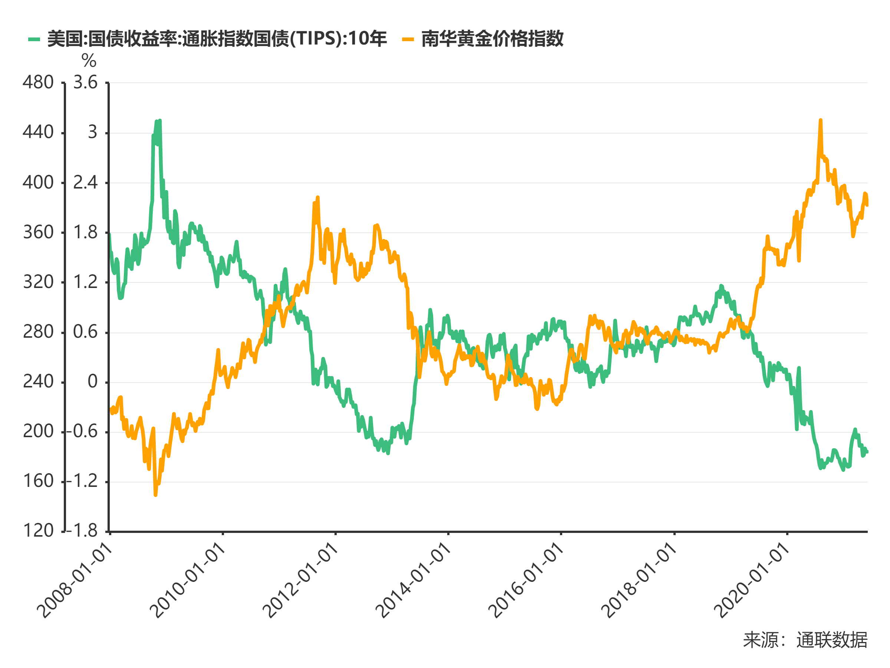
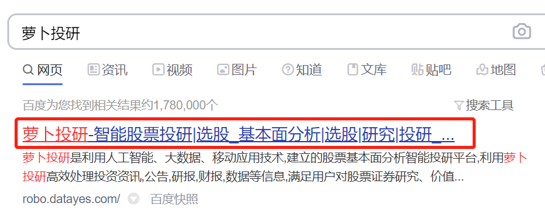
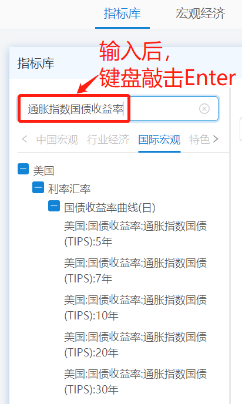
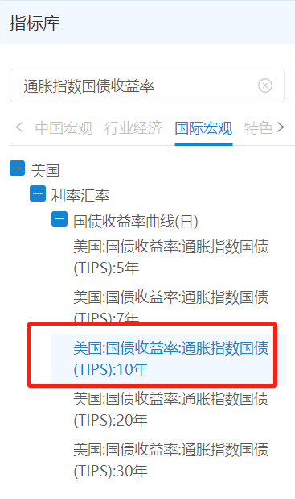
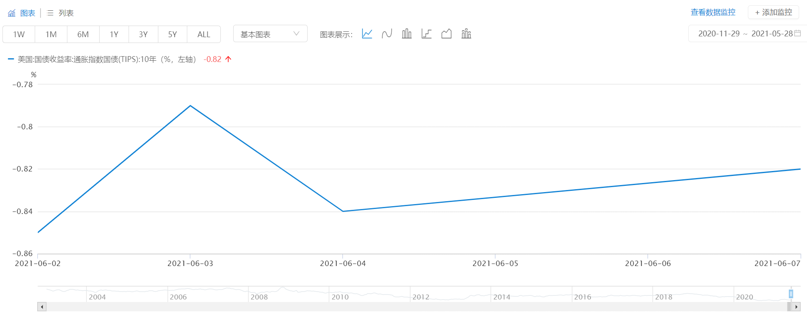
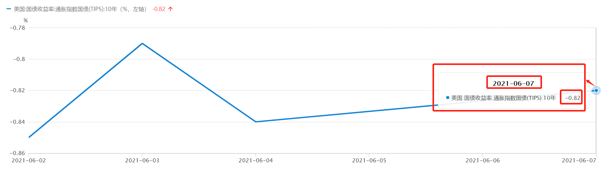
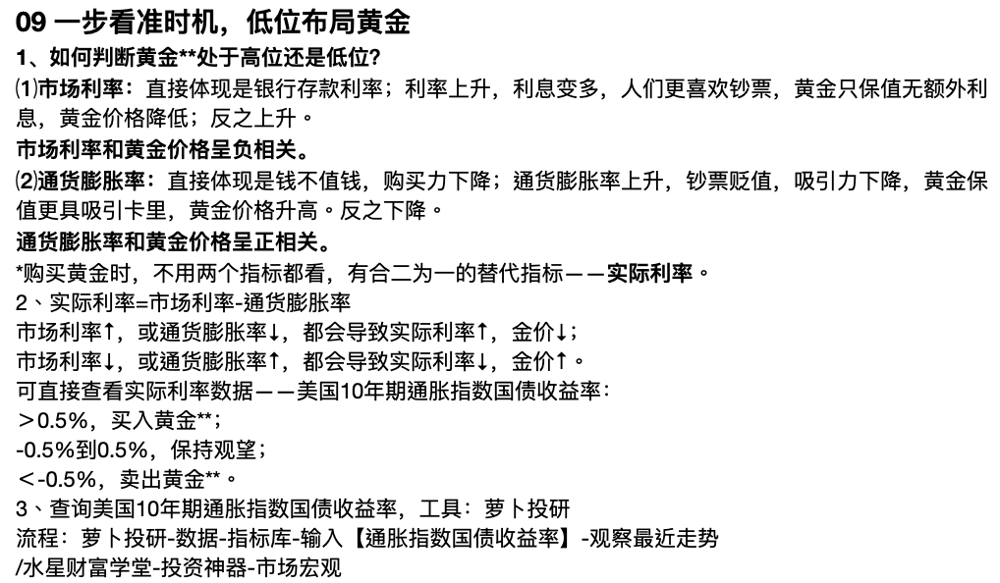
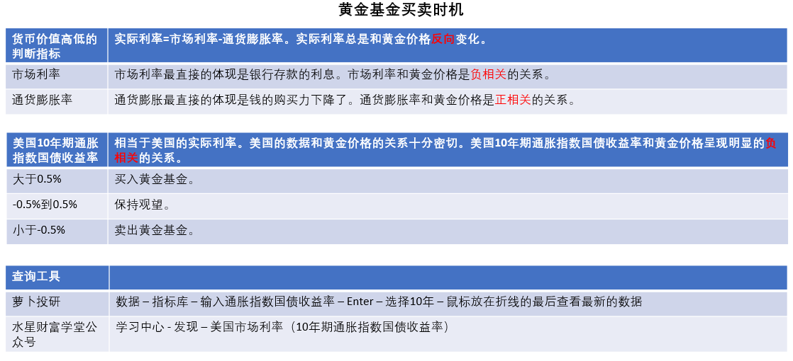

## 现在适合买黄金基金吗?

小伙伴们你们好, 欢迎继续学习《基金高阶训练营》.

上一节课, 我们学习了如何筛选优质的黄金基金. 但是, 这不意味着随时买它都可以赚钱哦.

大家可以类比一下指数基金的投资方法, 我们需要选择在指数温度低的时候入场, 指数温度高的时候离开, 才能实现低买高卖.

投资黄金也是一样的道理, 只有在低位买入, 高位卖出, 才有机会赚到收益.

那么, 怎么判断目前黄金基金处在高位还是低位呢?

黄金最主要的属性是货币属性; 货币的价值高低, 主要看两个方面: 一是市场利率, 二是通货膨胀率.

### (1)市场利率

在生活里, 市场利率最直接的体现就是银行存款的利息.

市场利率上升时, 银行存款的利息变多, 人们会更喜欢拥有钞票; 而黄金除了保值以外, 并不能额外带来利息, 所以黄金的吸引力降低, 进而导致黄金价格下降.

反过来说, 市场利率低下降时, 银行存款的利息变少, 这时候钞票的吸引力下降, 黄金的吸引力上升, 进而导致黄金价格升高.

所以, 市场利率和黄金价格是负相关的关系.

### (2)通货膨胀率

在生活里, 通货膨胀最直接的体现就是"钱不值钱了", 钱的购买力下降了.

当通货膨胀率上升时, 钞票不断贬值, 吸引力下降, 而黄金作为可以保值的品种, 会具备更大的吸引力, 进而导致黄金价格升高.

当通货膨胀率下降时, 钞票贬值放缓, 甚至升值, 从而吸引力上升, 这时候人们想要保值的需求下降, 黄金的吸引力下降, 进而导致黄金价格下降.

所以, 通货膨胀率和黄金价格是正相关的关系.

现在我们有了两个指标, 市场利率和通货膨胀率, 不过在判断黄金买卖时机的时候, 不用两个指标都看, 因为有一个非常实用的指标可以合二为一, 综合考虑市场利率和通货膨胀率, 给我们省下不少麻烦. 这个优秀的指标叫做"实际利率".

## 一个指标, 判断入场时机

上一小节我们提到, 实际利率可以"合二为一"", 综合考虑市场利率和通货膨胀率.

它们之间的关系是: 实际利率=市场利率-通货膨胀率.

市场利率就相当于市场会给你的到手收益, 但是, 到手收益没有考虑通货膨胀哦, 通货膨胀导致钱不值钱了, 到手的钱购买力下降, 所以需要减去通货膨胀的部分. 实际上(实际利率), 就是市场利率-通货膨胀率

市场利率上升, 或者通货膨胀率下降, 都会导致实际利率上升, 黄金价格下降.

市场利率下降, 或者通货膨胀率上升, 都会导致实际利率下降, 黄金价格上升.

所以, 我们只需要抓住实际利率这一个指标就可以啦. 实际利率总是和黄金价格反向变化.

那么, 有没有可能不用计算, 就可以直接查到实际利率的数据呢?

这个可以有. 大家可以查看一个叫做"美国 10 年期通胀指数国债收益率"的数据. 数据的名字比较长, 我们拆开来看一下.

先来看打头的"美国"两个字. 之所以查看美国的数据, 是因为美元目前依旧处于世界货币的地位. 美国货币政策的一举一动, 几乎可以波及全球. 所以, 美国的数据和黄金价格的关系十分密切.

接下来看"10 年期国债收益率". 这个指标在《基金初级训练营》出现过哦, 它代表的就是市场利率.

最后, 我们可以看到, "10 年期国债收益率"中间还夹杂了"通胀指数"四个字. 它的意思就是, 在市场利率里面, 扣除掉通货膨胀率的部分.

综合起来看, "美国 10 年期通胀指数国债收益率"就相当于是美国的实际利率.

看这个数据准不准呢? 我们考察一下它和黄金价格的关系就知道了. 下图是 2008 年 1 月至 2021 年 6 月这段时间里, "美国 10 年期通胀指数国债收益率"和黄金价格的走势对比. 整个时间跨度超过 13 年. 我们可以看到, 两者之间呈现出明显的负相关关系.

最近 10 年时间里, 美国 10 年期通胀指数国债收益率的平均水平大约在+0.5%之间, 我们可以以此为分界线, 制定买卖策略:

当美国 10 年期通胀指数国债收益率大于 0.5%时, 买入黄金基金.

当美国 10 年期通胀指数国债收益率在-0.5%到 0.5%时, 保持观望.

当美国 10 年期通胀指数国债收益率小于-0.5%时, 卖出黄金基金

## 实操: 巧用查询工具

美国 10 年期通胀指数国债收益率应该怎么查看呢? 我们要用到的工具是"萝卜投研". 网址已经附在文稿中了, 大家可以在浏览器输入网址打开, 也可以用搜索引擎搜索"萝卜投研"四个字, 找到这个网站.

[萝卜投研](https://robo.datayes.com/)

初次使用"萝卜投研"时, 需要大家先注册账号并登录. 登陆成功后, 我们在首页顶部的菜单中, 点击"数据"两个字.

在跳转出来的页面左上方, 可以看到"指标库"三个字. 指标库的下方有一个小小的搜索框, 我们在里面输入"通胀指数国债收益率". 键盘敲击 Enter 键进行搜索.

在搜索结果中, 我们可以看到很多个通胀指数国债收益率, 它们代表不同的年数, 我们点击其中写着"10 年"的那一个.

此时, 网页中央会出现一张折线图. 这就是美国 10 年期通胀指数国债收益率的最近走势.

我们要看的是最新的数据, 只需要把鼠标放在折线的最后, 不需要点击, 就会自动弹出最新数据.

我们可以看到, 2021 年 6 月 7 日的数据结果是-0.82%. 按照我们的判断标准, 不适合买入黄金, 如果手里有黄金, 应该考虑卖出.

在此提醒, 不同时间查询到的数据结果不一样, 小伙伴们一定要亲自实操一遍, 以最新的数据为准.

此外, 为了方便大家查询数据, "水星财富学堂"官方公众号也会定期更新这一指标. 大家关注公众号, 在底部菜单选择"投资神器 → 市场宏观", 点进去就可查到相关指标啦.

## 总结:

1. 判断黄金基金的买卖时机, 需要用到的指标是"美国 10 年期通胀指数国债收益率".
2. 当美国 10 年期通胀指数国债收益率大于 0.5%时, 买入黄金基金; 当美国 10 年期通胀指数国债收益率在-0.5%到 0.5%时, 保持观望; 当美国 10 年期通胀指数国债收益率小于-0.5%时, 卖出黄金基金.
3. 判断买卖时机用到的工具是萝卜投研. 大家也可以在水星财富学堂公众号, 直接查看数据结果.

有的小伙伴可能有疑问: 之前我们学习的基金, 涉及的都是股票类资产和债券类资产; 而且, 我们在进阶课中, 已经学习了股债组合策略. 现在多出来一个黄金基金, 没法放到股债组合里.

那么, 我们该如何把黄金基金加入投资组合呢?

下一节课, 我们就来进行大类资产配置, 把股、债、黄金放到同一个投资组合当中.
