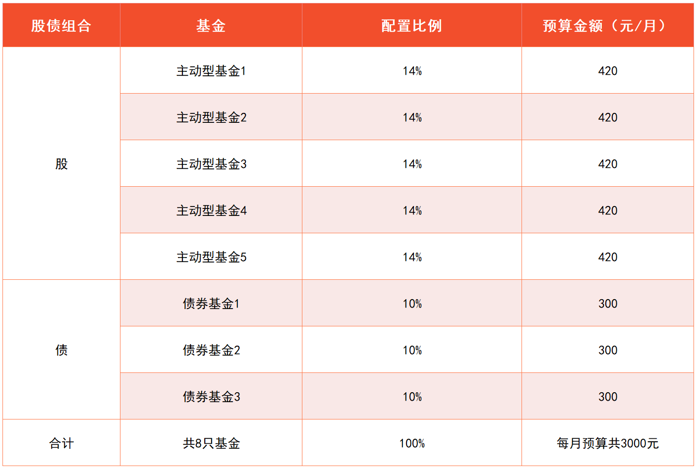
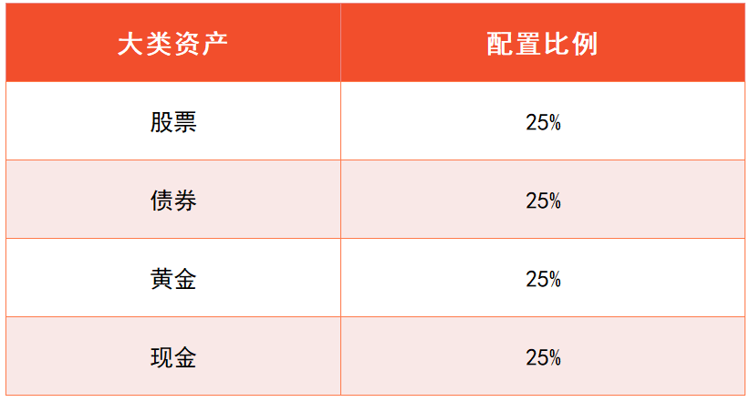
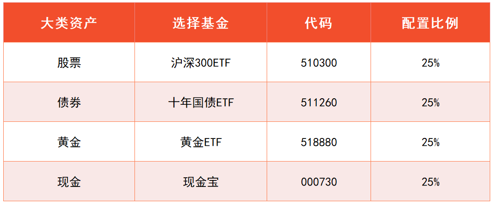
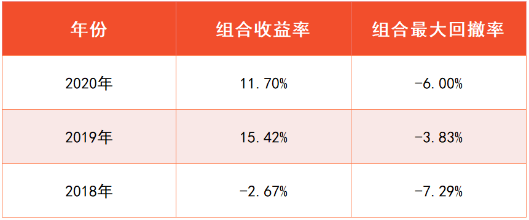
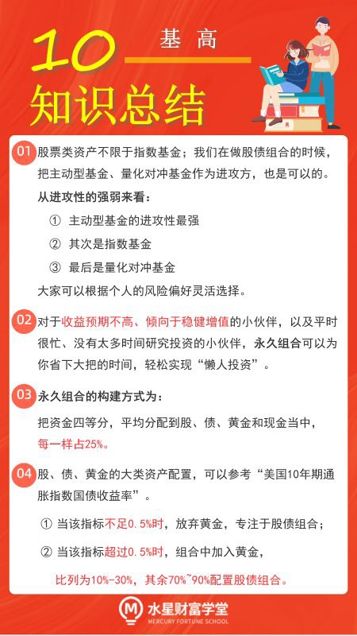

## 优化股债组合

小伙伴们你们好, 欢迎来到《基金高阶训练营》的最后一课.

从进入《基金初级训练营》到今天, 我们已经学习了各种各样的基金, 大家有没有觉得, 基金的世界有些复杂呢?

其实, 按照底层资产来划分, 我们学习的基金无外乎四大类.

第一类, 货币基金. 它的底层资产以现金为主.

第二类, 债券基金. 我们主要学习了短债基金和长期纯债基金. 它们的底层资产以债券为主.

第三类, 指数基金、主动型基金和量化对冲基金. 它们的底层资产以股票为主.

第四类, 黄金基金. 它的底层资产以黄金为主.

在这四大类资产中, 如果我们只配置其中一类资产, 那么就只会在这一资产表现出色的时候获益; 在它表现不好的时候, 我们只能跟着遭受损失.

所以, 合理的投资方式应该是, 各类资产互相搭配, 构建出一个穿越周期的投资组合. 不管哪一类资产表现出色, 我们都能从中获益.

在进阶课中, 我们已经学习了股债组合. 也就是股票类资产和债券类资产互相搭配. 其中的股票类资产, 我们当时选择的是一组指数基金.

不过, 现在大家的知识范围拓宽了, 应该清楚一点: 股票类资产不限于指数基金; 我们在做股债组合的时候, 把主动型基金、量化对冲基金作为进攻方, 也是可以的.

从进攻性的强弱来看, 主动型基金的进攻性最强, 其次是指数基金, 最后是量化对冲基金. 大家可以根据个人的风险偏好灵活选择.

至于防守方, 我们还是在短债基金和长期纯债基金之间选择就可以啦.

然后, 根据股债利差模型, 我们可以判断出攻守策略, 到底是全力进攻、进攻为主、防守为主、全力防守中的哪一个.

举个例子, 小星学长打算把进攻方换成主动型基金. 他查看了股债利差模型, 最新的风险溢价是-0.33%, 适合进攻为主的策略.

所以, 小星学长做出了如下配置:70%的资金用来配置主动型基金, 30%的资金用来配置债券基金.

根据课程中筛选基金的步骤, 小星学长选出了 5 只主动型基金, 3 只债券基金. 做出了如下比例分配. 大家可以参考文稿中的表格.

有的小伙伴可能想问: 股债组合只能配置股和债两大类资产．没有给现金和黄金这两类资产留位置, 怎么才能在组合里加入它们呢?

## 经典的永久组合

想要把股、债、黄金放在同一个组合里, 有一个非常简单的组合策略, 那就是由哈里·布朗(Harry Browne)提出的永久资产组合策略, 简称"永久组合".

组合方式非常简单, 就是把我们的资金四等分, 平均分配到股、债、黄金和现金当中, 每一样占 25%.

这个比例是严格定死的, 不用进行任何灵活调整, 可以说是一种简单到极致的"傻瓜式投资".

股、债、黄金中的任何一种资产升值, 组合都能受益.

当然, 偶尔也会有三类资产都死气沉沉的时期, 这时候 25%的现金就能发挥它的作用啦. 在各类市场崩溃的时候, 现金为王.

这 25%的现金, 可以选择定期存款, 或者货币基金. 虽然赚得少, 但是可以缓冲其他资产崩溃时的暴跌.

不过, 聪明的小伙伴们想必发现了: 永久组合的做法很保守, 收益水平不会太高. 主要原因有三个.

第一, 25%现金的增值空间有限, 在其他三类资产表现好的时候, 现金会拉低组合收益.

第二, 虽然每种资产表现好的时候, 组合都受益, 但是, 每种资产表现不好的时候, 组合也都会受到影响. 也就是说, 永久组合把收益和风险都分散了, 不会赚得太多, 也不会跌得很惨.

第三, 不管一种资产贵还是便宜, 也不管市场处于高位还是低位, 永久组合都坚持每种资产都配置同样的比例, 不进行灵活调整.

所以, 对于收益预期较高的小伙伴来说, 构建永久组合的意义不大.

但是, 对于收益预期不高、倾向于稳健增值的小伙伴, 以及平时很忙、没有太多时间研究投资的小伙伴, 永久组合可以为你省下大把的时间, 轻松实现"懒人投资".

下面我们就一起构建一个永久组合.

股票方面, 可以选择一只沪深 300 指数基金. 沪深 300 指数可以反映股市的总体表现, 而且被大量基金经理用作业绩比较基准.

债券方面, 可以选择相对稳定的上证 10 年期国债指数, 找一只跟踪它的基金.

我们都知道, 股票指数选择的是一篮子股票; 其实市场上也存在着债券指数, 它选择的是一篮子债券. 这里提到的"上证 10 年期国债指数", 由剩余期限 7 到 10 年且在上交所挂牌的国债组成.

黄金方面, 可以按照前面课程介绍的黄金基金筛选方法, 选择一只黄金基金.

最后, 现金方面, 我们找一只货币基金就可以啦.

根据以上选择, 我们可以整理出一份投资品清单. 大家可以看文稿中的表格. 四大类资产各选出一只基金作为代表. 以下基金仅作为学习参考, 不作为投资建议哦.

建好组合以后, 直接把手里的资金四等分, 分配到四类资产中就可以啦.

每年只需要做一次调整, 让每类资产占投资组合的比例恢复到 25%. 在其余时间, 你可以完全忘掉你的投资.

这样的组合可以达到什么样的收益效果呢? 我们可以参考组合的历史表现.

(回测数据来源: 乌龟量化. 回测过程中, 货币基金每年的收益率以 2%近似代替.)

大家可以看文稿中的表格.2018 年至 2020 年这 3 年时间里. 永久组合的最大回撤率都控制在了-10%以内, 投资体验相对较好.

最差收益率出现在 2018 年, 组合下跌仅为-2.67%. 大家要知道, 2018 年的股市处于熊市, 沪深 300 的全年跌幅达到了-25%左右. 相比之下, 永久组合明显缓解了此次暴跌.

如果将这 3 年的收益率折算成年化收益率, 相当于年化 7.85%左右. 对于"懒人投资"方式来说, 已经是不错的成绩啦.

温馨提醒: 以上数据仅供参考, 历史收益不代表未来表现; 基金有风险, 投资需谨慎.

永久组合的特点就是省心, 不看各种估值指标, 也不用每月调整自己的投资. 如果你对目标收益率要求不高, 而且不想在投资上花费太多精力, 可以考虑这种组合方式.

但是, 对于不满足于平淡的回报, 想要冲刺更高收益的小伙伴来说, 就要深入考虑各类指标, 理性进行资产配置.

## 升级版大类资产配置

首先, 现金的增值效果十分有限.

多数主动型基金的经理在投资时, 只会保留 5%左右的现金, 目的也不是为了增值, 而是为了应对投资者突然的赎回.

我们可以参考基金经理的做法, 只留出少量的现金, 放在货币基金里, 能够应对日常生活开支就可以了.

现金这部分, 我们就不把它纳入到升级版的投资组合当中啦.

为了提升组合收益, 我们只聚焦三大类预期回报更高的资产, 那就是: 股、债、黄金.

这种组合方式, 相当于在股债组合的基础上, 又加了黄金. 那么, 我们就要先考虑一下, 黄金目前值不值得加入.

这一点, 我们可以按照上节课的方法, 参考"美国 10 年期通胀指数国债收益率".

当该指标小于-0.5%时, 说明黄金价格处于高位; 当该指标在-0.5%到 0.5%之间时, 适合保持观望.

这两种情况下, 我们都放弃黄金, 按照第一小节的股债组合方式, 单纯配置股和债就可以了.

当该指标大于 0.5%, 说明黄金价格处于低位, 此时适合配置黄金.

我们可以拿出每月定投金额的 10%~30%左右, 配置一只黄金基金. 其余的 70%~90%的金额, 按照股债组合的方式进行配置.

在三类资产的投资中, 黄金投资相对较为"小众"; 而且, 由于黄金的货币属性较强, 它与货币政策、财政政策、汇率, 甚至政治格局、国家安全等都有关系, 对于普通投资者来说, 它的不确定性比股、债都要高. 因此, 不建议大家配置超过 30%的比例.

本节课的内容就到这里啦. 最后, 我们一起来总结一下课程重点.

## 总结

1. 股票类资产不限于指数基金; 我们在做股债组合的时候, 把主动型基金、量化对冲基金作为进攻方, 也是可以的. 从进攻性的强弱来看, 主动型基金的进攻性最强, 其次是指数基金, 最后是量化对冲基金. 大家可以根据个人的风险偏好灵活选择.
2. 对于收益预期不高、倾向于稳健增值的小伙伴, 以及平时很忙、没有太多时间研究投资的小伙伴, 永久组合可以为你省下大把的时间, 轻松实现"懒人投资".
3. 永久组合的构建方式为: 把资金四等分, 平均分配到股、债、黄金和现金当中, 每一样占 25%.
4. 股、债、黄金的大类资产配置, 可以参考"美国 10 年期通胀指数国债收益率". 当该指标不足 0.5%时, 放弃黄金, 专注于股债组合; 当该指标超过 0.5%时, 组合中加入黄金, 比列为 10%~30%, 其余 70%~90%配置股债组合.

到这里, 《基金高阶训练营》的课程已经全部结束啦, 恭喜大家完成了两周的学习.

大鹏一日同风起, 扶摇直上九万里. 祝大家在投资的海洋里纵情遨游, 日进斗金, 财源滚滚.
