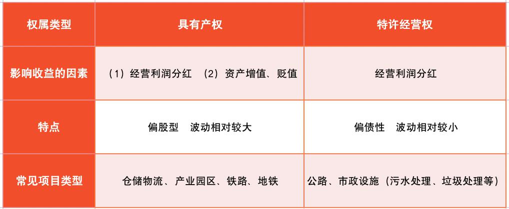
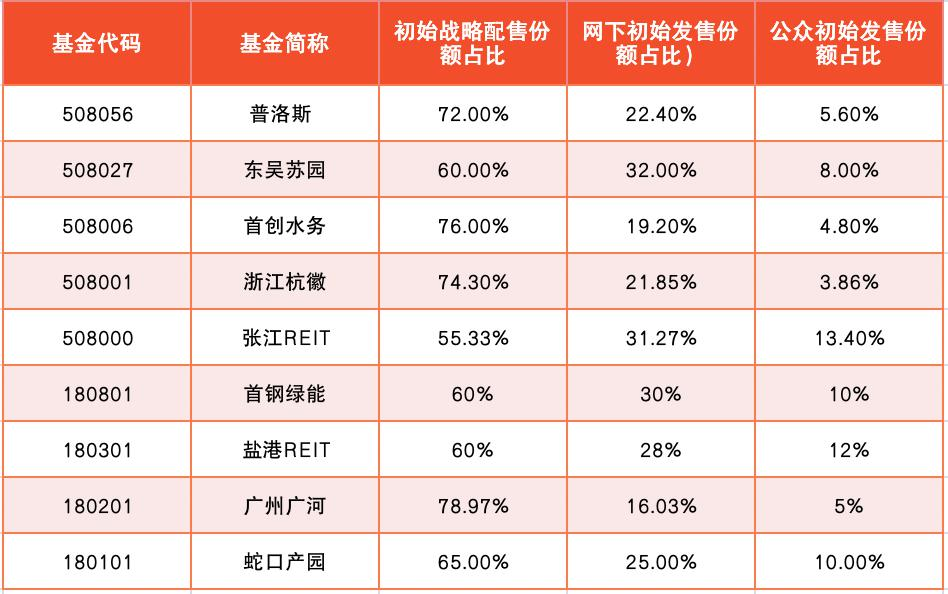

## REITs 到底是什么?

本节课, 我们将一起学习一个全新的品种: 房地产投资信托基金, 英文简称 REITs.

大家不要误会, 虽然 REITs 的名字里带着"房地产投资"五个字, 可是在国内市场, REITs 和"炒房"没有半分钱关系.

之所以叫"房地产投资信托基金", 是因为 REITs 在海外主要投资于房地产. 对于普通人来说, 投资一套完整的房子比较困难, 可能拿不出这么多钱. 而 REITs 可以用基金的形式募集大家的钱, 集合小资金来买房, 投资人可以共同分享房子出租的租金, 以及房子增值的差价.

国内的 REITs 借鉴了海外 REITs 的模式, 让普通人花小钱就可以投资大项目. 但是, 国内 REITs 的底层资产可不是房地产.

所谓的底层资产, 指的是 REITs 所投资的实体资产种类, 在海外是房地产, 在国内是基础设施, 也就是铁路、公路、仓储物流、产业园区、污水处理厂等等.

比如, 我们投资底层资产为高速公路的 REITs, 就相当于共同出资建设一条高速公路, 共同分享这条高速公路的收益. 以前我们只有过路交钱的份儿, 而现在呢, 别人过路交的钱, 会以分红的形式进入我们的口袋.

REITs 大大降低了实物资产的投资门槛. 以前普通人投不起的基建项目, 现在用几百块就可以投资啦.

那么, 投资 REITs 赚钱靠的是什么呢?

总的来说包括两个方面.

### 第一是项目利润分红.

分红来自我们投资的项目产生的利润. 按照规定, REITs 收益分配比例不低于年度可供分配利润的 90%. 也就是说, 如果这个项目今年可供分配的利润有 100 万, 那么, 至少要拿出 90 万来分配给大家. 分红到手的是实打实的现金哦.

### 第二是基金价格上涨.

REITs 作为一种特殊的基金, 本身就存在净值波动. 如果我们低价买入, 高价卖出, 就可以赚到其中的差价.

需要注意的是, 国内的 REITs 采用封闭式运作, 封闭期一般长达几十年, 有的甚至会封闭 99 年, 封闭期内不能申购, 也不能赎回.

不过, REITs 可以像股票和场内基金一样, 在证券交易市场交易, 交易时间内价格实时波动, 我们可以在场内进行买入、卖出操作.

那么, 投资 REITs 的年化收益率可以达到多少呢?

由于国内的 REITs 刚刚诞生不久, 2021 年 5 月底 6 月初的时候刚出现第一批 REITs 的认购, 所以, 暂时缺乏可供参考的历史数据. 而海外的 REITs 主要投资于房地产项目, 底层资产与国内不一致, 历史收益的参考价值也不高.

不过综合来看, 现阶段大部分 REITs 产品将风险等级定为中等风险, 总体风险收益特征介于股票和债券之间.

## 你投的项目有产权吗?

我们在第一小节已经了解, 国内 REITs 的底层资产是各式各样的基础设施. 那么, 究竟什么样的基础设施才能够做成 REITs 呢?

目前, 国家重点支持对经济发展战略意义突出的基础设施项目, 主要包括: 仓储物流、产业园区、公路、铁路、地铁、互联网数据中心、水处理和垃圾处理, 等等.

按照权属类型来归类, 以上项目可以归为两大类, 一类具备产权, 另一类不具备产权, 只具备特许经营权.

为什么要看有没有产权呢?

这是因为, 我们投资 REITs, 相当于投资了实打实的基础设施项目. 这些项目有没有产权, 直接影响到投资的风险收益水平.

虽然小伙伴们对基础设施研究较少, 但是对房地产都不算陌生啦. 我们可以拿房子来做一下类比. 用房子赚钱可以分为两种形式: 第一, 房子可以用来出租, 带来租金收益; 第二, 房子本身还可以增值, 为我们赚差价.

如果我们拥有房子的产权, 那么租金收益和增值差价就都是我们的啦; 但是, 如果我们没有房子的产权, 只有经营房子的权利, 那就好比当"二房东", 只能获得租金收益, 房子增值就和我们无关了.

投资基础设施也一样, 有无产权, 区别很大. 我们分开来看.

### (1)具备产权的项目

基础设施项目具备产权, 那么我们会有两方面的好处. 一是项目经营赚到钱了, 然后给我们分红; 二是项目资产增值, 进而导致 REITs 价格上涨, 增加投资收益.

这里需要大家注意, 资产可不一定会增值哦. 如果项目经营不善, 也有可能出现资产贬值. 一旦资产贬值, 就会导致 REITs 价格下跌, 减少投资收益, 甚至有可能造成亏损.

所以, 如果一只 REITs 投资于具备产权的项目, 它在股性和债性之间更偏向于股性, 波动相对较大.

具备产权的项目类型主要包括: 仓储物流、产业园区、铁路和地铁等.

### (2)只具备特许经营权的项目

基础设施项目不具备产权, 只具备特许经营权, 那就只能给我们带来经营利润的分红.

至于资产增值、贬值, 因为我们投资的 REITs 不包括产权, 也就不和收益挂钩了.

所以, 如果一只 REITs 投资于只具备特许经营权的项目, 它在股性和债性之间更偏向于债性, 波动相对较小.

只具备特许经营权的项目类型主要包括: 公路、污水处理和垃圾处理等.

了解清楚区别以后, 我们把两大权属类型放在一张表格里, 大家可以看文稿, 对比一目了然.

至于应该选择哪一种权属类型, 其实没有统一的答案. 这取决于大家的投资风格.

如果你偏向于稳健的风格, 可以选择债性更强的只具备特许经营权的项目; 如果你偏向于激进的风格, 可以选择股性更强的具备产权的项目.

当然, 你也可以选择折中的方案, 两类项目各选择一部分, 在 REITs 内部做到"攻守兼备".

## 怎么参与 REITs 投资?

参与 REITs 投资的方式主要有两种. 一种是认购新发行的 REITs, 另一种是等 REITs 上市以后, 在证券交易市场参与买卖.

### (1)认购新发行的 REITs

新 REITs 发行时, 我们可以通过场外和场内两种方式认购.

场外认购, 就跟普通的新基金认购一样, 通过直销平台、银行或者互联网第三方基金销售机构认购.

场内认购, 需要我们开通证券账户, 在证券公司的平台上认购. 相比较而言, 场内认购更加便利.

这是因为, REITs 基金为封闭式基金, 场外认购以后, 封闭期内无法赎回. 如果想要卖掉, 必须将手里的基金份额转托管至场内申请卖出.

我们没有必要专门研究转托管怎么操作. 既然卖出环节必须在场内进行, 不如在认购的时候就直接在场内认购, 省去转托管的麻烦.

在认购的时候, 大家需要注意, REITs 本身份额有限, 新 REITs 留给个人投资者的份额比例很少. 大家可以看文稿中的表格, 以 2021 年国内首发的 9 只 REITs 为例, 公众初始发售份额占比都不到 15%, 最少的只有 3.86%.

(数据来源: 中金公司研究部)

这里的公众初始发售份额, 就是我们个人投资者可以认购的份额. 其他占大头的份额, 基本都被原始权益人和机构投资者承包了.

所谓的原始权益人, 就是一开始拥有基础设施项目, 想要发行 REITs 融资的人. 所谓的机构投资者, 就是证券公司、银行、保险公司、社保基金、 养老保险基金等等. 它们拿到了大多数的份额.

在公众初始发售份额占比很少的情况下, 如果个人投资者认购火爆, 就无法全部成交啦, 只能按照认购比例成交一部分. 至于认购不成功的部分, 本金会原路退还, 但是认购产生的手续费不退.

而且, 从认购成功到 REITs 上市开放买卖, 中间还需要等一段时间, 粗略估计在 1 个月左右. 这段时间无法进行任何操作.

总的来说, 认购新 REITs 的优势不明显, 吸引力不大. 相比之下, 等 REITs 上市以后, 在证券交易市场直接参与买卖会更加方便.

### (2)REITs 上市以后参与买卖

等到 REITs 上市以后, 就会出现实时价格波动; 而且在交易时间内, 我们可以随时进行买卖. 这时的 REITs 交易和场内基金的交易基本一样.

交易时间是每个交易日的 9:30~11:30, , 以及 13:00~15:00.

上市首日, REITs 的单日涨跌幅限制为 30%; 过了首日以后, REITs 的单日涨跌幅限制固定为 10%.

本节课的内容就到这里了. 下面, 我们一起来总结一下课程重点.

## 总结

1. REITs 名叫"房地产投资信托基金", 但是在国内, REITs 和房地产没有关系, 其底层资产是基础设施.
2. 投资 REITs 赚钱靠的是项目利润分红和 REITs 价格上涨.
3. 按照权属类型分, REITs 所投资的基础设施项目有两类, 一类是具备产权的项目, 另一类是只具备特许经营权的项目.
4. 参与 REITs 投资的方式有两种, 一种是认购新发行的 REITs, 另一种是等 REITs 上市后再投资. 建议大家选择后者.
5. REITs 上市后, 交易时间是每个交易日的 9:30~11:30, , 以及 13:00~15:00. 上市首日, REITs 的单日涨跌幅限制为 30%; 过了首日以后, REITs 的单日涨跌幅限制固定为 10%.
