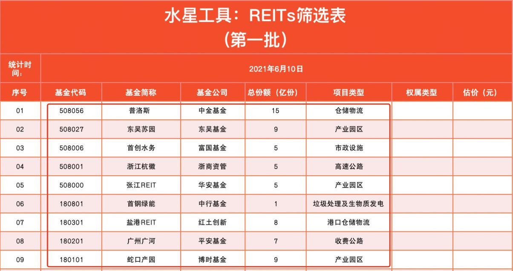
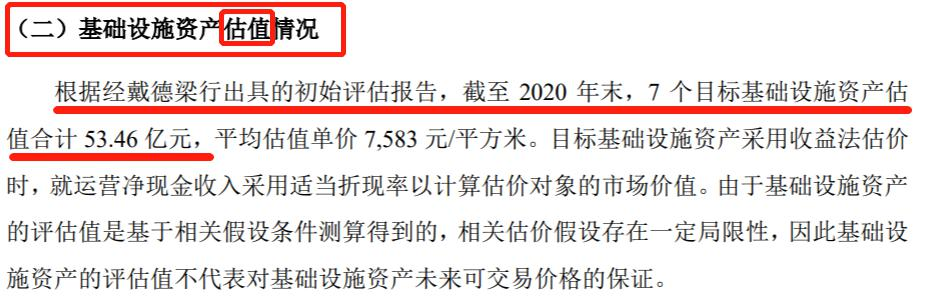

## 实操: 水星专属筛选表

上节课, 我们了解了国内 REITs 的底层资产是基础设施; 它们按照权属类型分为具备产权的项目和只具备特许经营权的项目.

仅仅了解概念还不够, 这节课, 我们就来学习 REITs 投资中的实操环节.

水星财富学堂为大家准备了专属工具: REITs 筛选表. 我们的实操环节将按照这张表格逐步进行. 大家可以咨询自己的训练营班班, 获取这份表格.

<a href="/水星工具: 基金高阶专用.xlsx" target="_blank">水星工具: 基金高阶专用.xlsx</a>

首先, 我们在表格中输入统计时间, 方便日后复查.

接下来, 我们可以看到, 表格被划分成了 8 列, 除了序号以外, 还包括了基金代码、基金简称、 基金公司、总份额、项目类型、权属类型和估价.

虽然有这么多项目要统计, 但是大家完全不必担心, 绝大多数项目都可以在"集思录"这个网站找到. 网址已经附在了文稿中, 大家可以在浏览器中打开它; 也可以用搜索引擎搜索"集思录"三个字找到它.

[集思录](https://www.jisilu.cn/)

在集思录首页的中间位置, 可以看到"实时投资数据"的字眼, 实时投资数据下面有很多模块, 我们点击其中的"REITs"模块.

在跳转后的页面左上角, 大家需要确认一下网站为我们选择的是"A 股 REITs"菜单. A 股可以理解为国内的证券投资市场. 至于旁边的港股 REITs, 用 A 股的证券账户无法投资, 我们暂时不予考虑.

在 A 股 REITs 之下, 有"上市 REITs"和"待发 REITs"两个选择, 我们要买卖的是上市之后的 REITs, 所以直接选"上市 REITs"就好啦.

在页面中间区域, 可以看到 REITs 的信息汇总. 基金代码、基金简称、项目类型、基金公司, 这 4 个信息都可以直接在页面中查到.

至于 REITs 的总份额, 在 REITs 最开始发行的时候就已经确定了, 之后都不会改变. 我们可以在"待发 REITs"这一列查到总份额数据.

其中, "拟募集(亿份)"这一列代表的是 REITs 的总份额. 大家注意不要看错列, 我们要看的是"拟募集(亿份)", 可不要看成"拟募资(亿元)"哦.

接下来, 我们把查询到的内容录入到筛选表格中.

此时还剩两列内容需要录入, 分别是权属类型和估价.

权属类型的判断, 直接看项目类型就可以. 在上节课我们已经学习过, 具备产权的项目类型主要包括: 仓储物流、产业园区、铁路和地铁等; 只具备特许经营权的项目类型主要包括: 公路、 污水处理和垃圾处理一类的市政设施, 等等.

以"普洛斯"这只 REITs 为例, 它的项目类型为仓储物流, 属于具备产权的项目, 我们就在权属类型这一列填入"产权".

再比如浙江杭徽, 项目类型是高速公路, 属于只具备特许经营权的项目, 我们就在权属类型这一列填入"特许经营权".

其他 REITs 以此类推. 权属类型这一列也就可以搞定啦.

下一小节, 我们一起来搞定关键的最后一列, 也就是估价.

## 估值: 说明书里的"宝藏数据"

REITs 在发行的时候, 会找专业的资产评估机构给自己做估值. 官方的估值已经写在了《基金招募说明书》中, 不需要我们手动计算.

以"普洛斯"这只 REITs 为例, 代码 508056, 我们来查一下它的估值数据. 我们要用到的工具是天天基金网.

[天天基金网](https://fund.eastmoney.com/)

首先, 在天天基金网首页搜索普洛斯的代码"508056", 点击进入基金的详情介绍页.

在跳转后的页面中点击"基金公告". 基金公告的位置大家可以参考文稿中的图片.

在基金公告的子菜单中, 点击"发行运作".

在发行运作下面的所有公告中, 找出《基金招募说明书》.

我们将基金招募说明书点开, 可以发现"查看 pdf 原文", 位置可以参考文稿中的图片. 大家不要犹豫, 直接将它点开.

在说明书原文的目录中, 找到"基础设施项目基本情况"这一章节. 我们要找的估值数据就藏在这个章节里面.

我们直接点击一下"基础设施项目基本情况"这一行字, 就可以跳转到对应的章节.

在这一章节, 我们需要从前往后寻找估值数据. 不过大家不需要逐字阅读, 只需要重点看其中的小标题, 锁定介绍估值的标题就可以了.

在"普洛斯"的这份文件中, 可以看到"基础设施资产估值情况"的一个小节, 其中提到, "根据经戴德梁行出具的初始评估报告, 截至 2020 年末, 7 个目标基础设施资产评估合计 53.46 亿元."

于是我们就得到了"普洛斯"这只 REITs 的总估值, 也就是 53.46 亿元.

这里, 我们简单了解一下文字中的其他关键词."戴德梁行"是一家专业的资产评估机构, "7 个目标基础设施"指的是这只 REITs 的底层资产包含了 7 个子项目. 具体的子项目不需要单独研究, 我们的任务是拿到它们的总估值数据, 现在已经圆满完成啦.

有的小伙伴可能会疑惑:53.46 亿元是截至 2020 年末的估值数据, 现在 2020 年早都结束了, 盈利可能涨了, 资产说不定也增值了, 这个估值不准了吧?

其实, 我们用这个数据, 也就是假设 2020 年结束以后, 普洛斯没有任何盈利、资产也没有任何增值. 这样估算出来的价值偏向于保守. 估值保守一些, 投资就安全一些.

不过, 我们在实际交易的时候, 最直观的数据是 REITs 的买卖价格. 怎么才能把估值换算成 REITs 的价格呢? 很简单, 一个公式就可以搞定.

REITs 的合理价格=总估值/总份额

总估值已经找到了, 总份额也已经统计到了筛选表格里. 普洛斯的总份额为 15 亿份.

由于 REITs 属于封闭式基金, 总份额在封闭期内不变. 所以, 总份额的数据只需要录入一次, 永久可用.

总估值和总份额的数据都有了, 直接代入公式, 两个数一除, 就可以得到 REITs 的合理价格.

对于普洛斯而言, 其合理价格为 53.46 除以 15, 也就是 3.56 元. 我们把这个结果填入筛选表格中.

特别提醒, 以上分析仅作为教学案例, 估值数字仅供大家参考学习, 不构成具体的投资建议.

对于已上市的 REITs 而言, 我们需要及时关注它的价格表现, 当实际的价格高于我们预估的合理价格时, 就说明该 REITs 被大家高估了, 当前不适合买入, 如果已经买了建议及时卖出.

当实际的价格低于我们预估的合理价格时, 就说明该 REITs 被大家低估了, 当前适合买入. 其他 REITs 的估价方法与上述一致. 大家亲自实操一遍, 即可得到一张完整的筛选表.

这个操作比较麻烦, 我们换一种 REITs 的估值方法, 工具用集思录

我们去集思录, 点开 REITS

选择 A 股 REITS, 然后选择已上市的

看到折价率这一行

折价率大于等于零, 就是便宜, 可以买入了

折价率小于零, 就是贵了, 可以卖出

折价率＝(发行价-现价)/发行价\*100%

净值就是发行价

这个方法更加简洁哈

## 建立自己的 REITs 组合

经过上一小节的学习, 我们可以先把被高估的 REITs 剔除掉. 在保留的被低估的 REITs 中, 我们要开始建立自己的 REITs 组合啦.

为了分散投资风险, 建议大家至少配置 5 只以上的 REITs 产品, 而且要做到两个"三分之一".

### (1)同一个项目类型的产品, 配置比例不超过三分之一;

比如, 我们投资 REITs 的预算是 9000 元, 那么投资仓储物流项目的钱不要超过 3000 元, 其他项目类型也是一样. 这样可以分散单一项目类型带来的风险.

### (2)同一家基金公司的产品, 配置比例不超过三分之一.

首批 9 只 REITs 产品来自于 9 家不同的基金公司, 但是, 未来不排除同一家基金公司有多只 REITs 的情况.

还是以 9000 元预算为例, 我们投资于某一家基金公司的 REITs 产品, 资金加起来不要超过 3000 元. 毕竟 REITs 在国内属于新品种, 基金公司管理 REITs 的能力不好把握, 这样做可以分散基金公司本身带来的风险.

在实操时, 小伙伴们可能会遇到这样一种情形: 被低估的 REITs 产品总共没剩几只, 无法满足两个"三分之一".

这时大家不要不够硬凑, 而是要保留现金, 等新的一批 REITs 发行时再补充几只.

举个例子, 假设在本次筛选中, 我们打算投资 5 只 REITs, 结果全部看下来, 只有"普洛斯" 和"东吴苏园"两只 REITs 符合被低估的要求, 还缺 3 只.

那么, 我们可以把 1/5 的本金投资于普洛斯, 1/5 的本金投资于东吴苏园.

剩下 3/5 的本金先放在货币基金里存着, 等下一批 REITs 发行的时候, 如果有合适的再补充进来.

只要保证最终 5 只 REITs 放在一起满足两个"三分之一"就好啦.

本节课的内容到此结束. 最后, 我们一起来总结一下课程的重点.

## 总结

1. 本节课用到的工具包括: 水星专属筛选表、集思录、天天基金网.
2. REITs 的估值已经写在了《基金招募说明书》中, 不需要我们手动计算. REITs 的合理价格= 总估值/总份额.
3. 对于已上市的 REITs 而言, 我们需要及时关注它的价格表现, 当实际的价格高于我们预估的合理价格时, 就说明该 REITs 被大家高估了, 当前不适合买入, 如果已经买了建议及时卖出. 当时实际的价格低于我们预估的合理价格时, 就说明该 REITs 被大家低估了, 当前适合买入.
4. 建议大家至少配置 5 只以上的 REITs 产品, 而且要做到两个"三分之一", 也就是: 同一个项目类型的产品, 配置比例不超过三分之一; 同一家基金公司的产品, 配置比例不超过三分之一.
