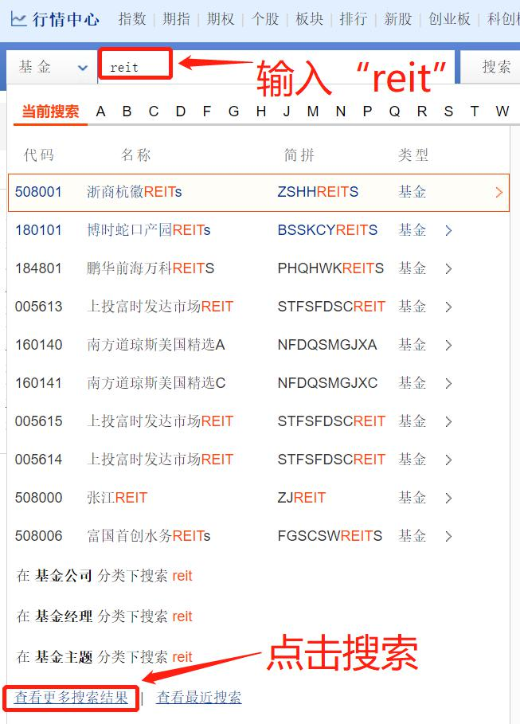

## 海外 REITs, 有啥不一样?

学过课程的小伙伴已经了解过了, 海外的 REITs 和国内的 REITs 不一样, 区别主要在底层资产.

海外 REITs 主要投资于房地产项目, 国内 REITs 主要投资于基础设施项目.

除此之外, 海内外 REITs 的投资标的类型也不一样. 严格来说, REITs 投资标的可以分为三种类型.

### (1)单一项目 REITs

这种类型表示, 一只 REITs 对应一个单独的项目. 比如说, 星云班班要建一条高速公路, 发行了一只"星云 REITs", 那么这只 REITs 就只服务于星云班班的高速公路项目, REITs 的盈利完全取决于这一个项目的表现.

### (2)多项目 REITs

这种类型表示, 一只 REITs 包含了多个子项目. 通常来说是相同类型的项目. 这时候, REITs 的盈利由每一个子项目的表现共同决定.

多个子项目可以分散投资风险, 所以, 多项目 REITs 的风险比单一项目 REITs 的风险要低一些.

### (3)REITs 指数

这种类型就跟股票指数差不多. 股票指数是选一篮子股票, REITs 指数就是选一篮子 REITs.

指数的特点大家还记得吗? 指数可以长生不老, 长期上涨. 对于 REITs 指数来说也是一样的哦. REITs 指数会定期更新成分, 届时不符合条件的 REITs 会被踢出指数, 最新符合条件的 REITs 会被加入指数.

REITs 指数不仅仅做到了项目之间的分散, 而且还做到了不同 REITs 之间的分散, 所以风险在三种投资形式里面属于最低的.

了解了三种类型以后, 我们再来看国内的 REITs、海外的 REITs 分别可以选择哪种投资标的.

2020 年 8 月 7 日中国证监会发布了《公开募集基础设施证券投资基金指引(试行)》, 其中提到"80%以上基金资产不须投资于单一基础设施 ABS".

班班解释一下这句话:

首先是"80%以上基金资产", 跟债券基金、股票基金的分界线类似, 债基要求 80%以上投资于债券; 股基要求 80%以上投资于股票; REITs 要求, 80%以上投资于基础设施. 至于剩下的不超过 20%, 可以投资于利率债, AAA 级信用债以及货币基金等等.

"不须投资于单一基础设施 ABS", 意思是可以是单一项目的 REITs, 也可以是多项目 REITs. 也就是说, 咱们刚才提到的三种投资标的类型, 前两种在国内都可以投资.

至于上面这句话里的"ABS", 大家不用多关心, 它就是一个从 REITs 到实体项目之间过渡的一个环节, 是出于合规的考虑才加了这么一个环节, 对咱们投资没什么影响.

总而言之, 国内可以投资单一项目 REITs, 也可以投资多项目 REITs. 大家记住这一点就行了.

但是, 国内暂时不能投资 REITs 指数. 为什么呢? 因为指数要挑选成分, 得有足够的 REITs 可以挑选才行. 目前国内的 REITs 才刚刚起步, 刚发行没多少只, 还不够组建指数, 所以没法指数化投资.

海外的 REITs 由于发展比较久了, 相对更成熟, 所以上面三种类型都可以投资, 尤其是可以投资 REITs 指数, 对普通投资者来说比较友好.

那么, 我们有没有可能投资于海外 REITs 指数呢?

方法当然是有的哈. 班班今晚就来分享这个方法. 来吧小可爱们, 一起进行一次海外 REITs 投资之旅~

## 海外 REITs 投资的两种方式

海外 REITs 投资分两种方式, 一种是开通海外的账户, 比如港股账户、美股账户, 直接到海外市场进行投资.

如果你同时参与港股打新, 已经开通了港股账户, 可以用港股账户直接投资港股 REITs 哦. 不过鉴于开户过程比较麻烦, 不是所有同学都开户啦, 所以咱们不重点讲这个.

第二种方式是通过 QDII 投资海外 REITs. QDII 是我们的老朋友啦, 简单来说就是不出国门就能投资海外市场. 之前讲过投资美国的标普 500 指数, 中国香港的恒生指数, 等等, 都可以通过 QDII 实现.

通过 QDII, 也可以投资于海外 REITs 哦, 而且投资的是 REITs 指数哦.

今晚分享的实操重点, 就是通过 QDII 投资海外 REITs 指数.

## 实操筛选

我们要用的工具是"天天基金网". 网址:https://fund.eastmoney.com/

在天天基金网首页的搜索框中, 输入"REIT", 大小写都可以. 不过大家注意是 REIT, 别加"s", 可以搜到更多哦.

输入后不要直接点击"搜索", 而是点击下拉菜单中的"查看更多搜索结果". 具体如下图所示 ↓

在跳转后的界面中, 可以看到很多之 REITs 相关的基金. 其中包含了很多国内的 REITs, 大家不用管. 直接从结果里挑出来海外的 REITs 即可.

大家看上图, 班班框出来 5 只海外 REITs. 一般来说, 大家看基金名字就可以知道是不是海外 REITs 啦. 通常海外的都带着"发达市场"、"美国"、"全球"等等字眼.

如果不太确定, 可以点击查看详情, 基金类型是"QDII"就是海外的啦

不过这 5 只大家可以看到, 有些名字都一样. 比如有 3 只都叫"上投富时发达市场 REITs". 别急, 我们把鼠标放在它们的名字上, 就会看出区别哈.

比如 005614 这只, 其实叫做"上投富时发达市场 REITs 美钞".

再比如 005615 这只, 叫做"上投富时发达市场 REITs 美汇".

带美钞、美汇字样的都不能用人民币买哈, 所以这 2 只不予考虑. 最后就只剩下 3 只啦.

我们把 3 只基金录入到水星专属筛选表中. 班班已经把表格给过大家啦哈.

有的同学可能想问, 难道就只有三只吗?

当然不是啦, 我们只搜索了"reit"这一个关键词. 还有个关键词可以搜出来更多, 那就是"房地产". 我们从天天基金网的首页再来一遍, 这一次搜索"房地产".

在跳转后的界面中, 有一个"共 xx 条结果, 点击展开更多", 我们点击一下, 把所有结果都显示出来.

在这次的搜索结果中, 我们可以找出 5 只投资海外 REITs 的基金.

其中, 有两只是"美元现汇", 排除即可. 还剩 3 只, 统计到我们的表格中.

好啦, 我们一共找到了 6 只基金. 接下来, 我们把这份表格补全. 表格中还差: 基金规模、成立时间和主动被动.

这些项目在哪里查呢? 反应快的小可爱应该可以想到了吧. 答案就是天天基金网的基金详情介绍.

以第一只基金 005613 为例, 我们在天天基金网搜索它的代码, 找到它的详情介绍.

可以看到, 这只基金的基金规模是 3.57 亿元., 成立时间是 2018 年 4 月 26 日, 跟踪指数是 "富时 EPPA/NAREIT 发达市场指数". 我们把这些信息录入到表格中.

其他几只基金也是一样的查询方法哦. 全部查完了以后, 我们的表格也就可以填完了.

这些基金究竟该怎么筛选呢?

首先, 基金规模不宜小于 1 亿, 规模太小有清盘风险.

其次, 成立时间不能少于 3 年, 时间太短.

最后, 必须有跟踪的指数, 也就是说, 我们只选择指数化投资, 表中显示"——"的, 说明是主动型, 由基金经理主动选择 REITs, 投资效果无法保障.

综合以上三点来看, 只有两只符合要求. 一只是 005613, 上投富时发达市场 REITs; 另一只是 000179, 广发美国房地产指数.

## 什么时候买卖? 收益怎么样?

前面咱们选出来两只 REITs, 给大家看一下它们 2018 年 5 月~2021 年 5 月, 这 3 年的历史走势:

可以说走势几乎一样, 广发美国房地产指数稍好一点. 而且, 广发美国房地产指数成立时间更久, 2013 年 8 月就成立了.

班班就拿广发美国房地产指数这只, 回测一下它的历史收益.

首先是一次性投资. 在 2013 年 8 月成立的时候, 一次性投入 1 万元, 之后什么也不管, 到 2021 年 6 月, 接近 8 年时间, 年化收益率为 7.64%!

其次, 咱们来看一下定投. 在 2013 年 8 月成立的时候, 开始每月定投 1000 元, 到 2021 年 6 月, 接近 8 年时间, 年化收益率为 6.24%.

这还是期间经历了新冠疫情, 有一次暴跌的情况下, 达到了这个收益率.

之所以定投收益率更低一点, 是因为定投的优势在于下跌的时候摊薄成本, 而 REITs 长期上涨趋势明显, 下跌摊薄成本的机会不多, 所以越是买在前面越有优势. 大家不用刻意挑选买入时机.

不算极特殊的重大事件(战争、疫情等等), REITs 长期来看上涨还是偏稳健的, 适合长期配置. 这里长期的意思是 3 年起步.

如果你有一整笔闲钱, 可以放在 REITs, 多年卧兵不动, 这是最好的策略. 如果你很难拿出一整笔, 可以采取每月定投的策略, 虽然收益有点影响, 但是根据回测显示, 差别也不是很大.

本次分享到此结束.

## 总结

1. REITs 投资标的分为 3 类: 单一项目 REITs; 多项目 REITs 和 REITs 指数. 其中国内 REITs 目前没有对应的指数, 海外 REITs 可以实现指数化投资.
2. 海外 REITs 投资的方式有两种, 一种是开一个港股账户, 直接到海外市场投资; 另一种不用开港股账户, 而是利用 QDII 基金间接投资.
3. 筛选投资 REITs 指数的 QDII 基金, 需要用到"天天基金网". 分别搜索两个关键词"REIT" 和"房地产", 把结果中的海外 REITs 统计在表格中, 进行筛选.
4. 海外 REITs(QDII)的基金规模不宜小于 1 亿; 成立时间不能少于 3 年; 必须有跟踪的指数. 5. 海外 REITs 越是买在前面越有优势, 不用刻意挑选买入时机.
