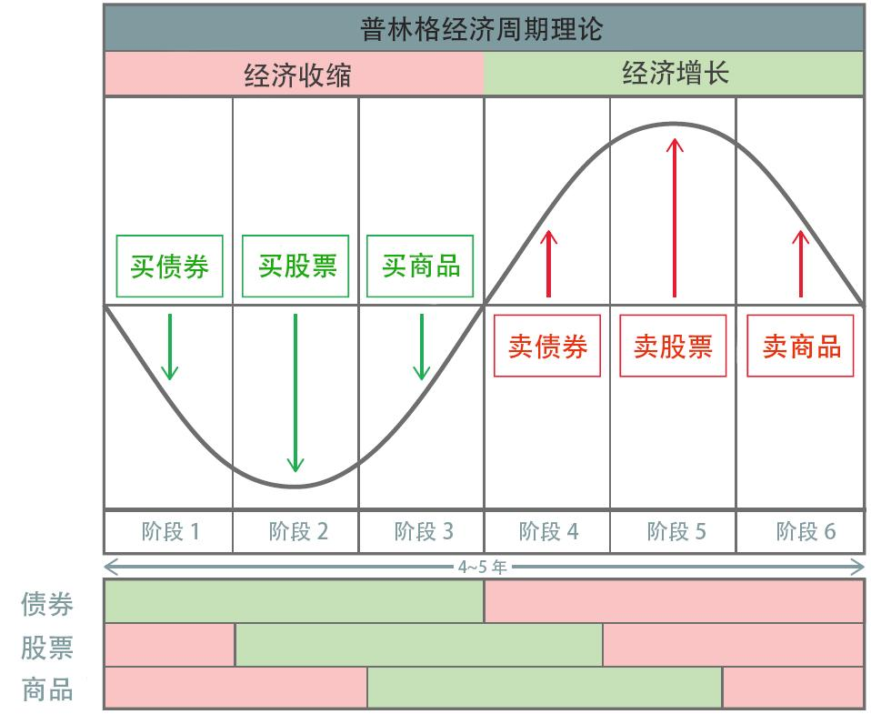
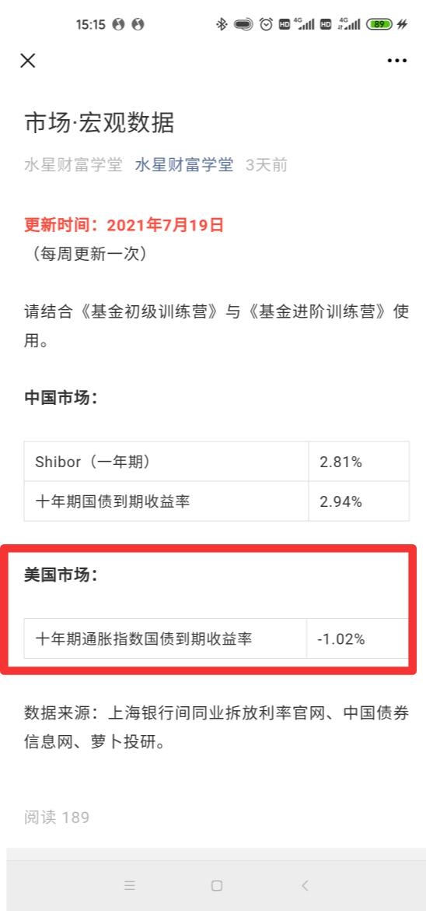
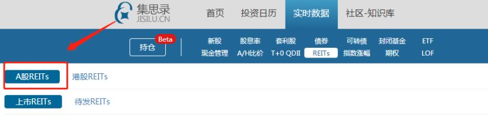
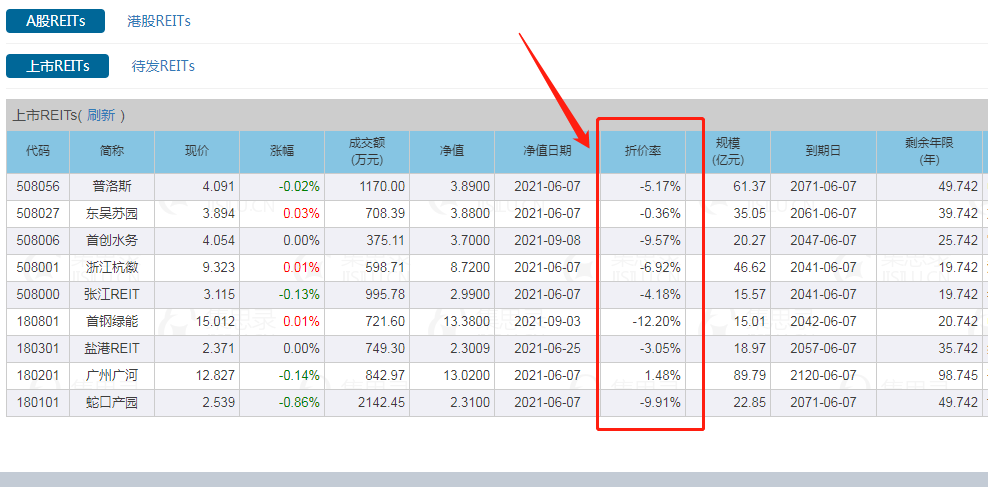

hello, 同学们今晚跟着学姐一起来盘点最后一周所有的知识点吧~

上周我们的量化对冲基金只讲了"量化"策略, 本周讲了"对冲"策略

在学习对冲策略之前, 我们先学习做多、做空两种投资方式.

"多"字代表的是上涨."看多"就是觉得会涨, "做多"就是买入. 如果一个投资者看多也做多, 他就是"多头". 反过来说, "空"字代表的是下跌."看空"就是觉得会跌, "做空" 就是卖出. 如果一个投资者看空也做空, 他就是"空头".

做空股票赚钱的原理是: 投资者手里没有股票, 但可以从交易平台借过来, 转手卖掉, 等股价跌了, 再把股票买回来, 还给平台. 做空需要在期货市场进行.

股票多空策略就是对一篮子股票进行估值排名, 做多低估的, 做空高估的.

市场中性策略就是通过做空股指期货, 消除市场涨跌的影响, 只保留凭借基金经理能力赚取的 α 收益.

"对冲"指的是同时进行两笔方向相反、盈亏相抵的交易. 如果一笔交易亏钱了, 另一笔反向交易会赚钱, 从而把风险"抹平".

公募量化对冲基金的筛选需要用到晨星网和天天基金网以及水星学堂的筛选表格(基高版). 步骤如下:

第一步, 在晨星网首页的顶部菜单, 找到"基金工具", 点击其中的"基金筛选器".

第二步, 在跳转后的"基金筛选"页面, 点击其中的"更多筛选条件".

第三步, 基金分类勾选"市场中性", 申赎状态选择"申购开放, 赎回开放", 点击"查询".

注意: 这里我们只保留 A 类, 并把所有的基金登记在筛选表里进行下一步的筛选.

接下来, 我们进入天天基金网, 查询基金的"近 3 年收益率"和"基金规模".

筛选要求:

基金规模最好不少于 2 亿元. 在此基础上, 近 3 年收益率越大越好.

有条件的小伙伴可以进一步考虑私募基金. 私募量化对冲基金的数量更多, 策略花样更多, 历史收益也更可观.

我们还认识了投资市场中的四类角色: 个人投资者、底层资产、资产管理公司和财富管理公司.

资产管理机构主要和产品打交道, 一门心思研究投资策略, 提高投资回报. 基金公司就属于资产管理机构的行列. 至于购买的人是谁、买多少、风险是否匹配等问题, 他们不会过多关注.

财富管理机构主要和人打交道, 为客户分析家庭财务, 综合考虑资产、负债、流动性、风险承受能力等状况, 量身定制财务规划, 满足大家在不同阶段的财务需求. 简单来说, 就是"拿合适的投资品匹配合适的人".

第三方财富管理机构就像一个超市, 优势在于中立, 产品和公司相互独立, 业务的核心逻辑是匹配最适合客户的, 而不是销售最需要销售的.

判断一家财富管理机构是否值得选择, 可以分为三步: 考察持牌情况、考察服务经验以及考察产品线.

除此之外, 我们还系统的学习了黄金基金和 REITs 基金.

根据普林格经济周期的六个阶段, 债券、股票和商品在不同的时期发挥不同的作用, 只要我们全部纳入配置方案, 就有机会在一轮经济周期中"撸"三份收益, 进而提高投资总回报.

而黄金具备了三大属性: 货币属性、商品属性和投资属性.

配置黄金的 5 种方式包括: 实物黄金、金币、纸黄金、黄金期货和黄金基金. 建议普通投资者优先选择黄金基金.

筛选黄金基金主要看 2 个指标:

1、基金规模不小于 5 亿元, 且规模越大越好;

2、跟踪误差越小越好.

筛选黄金基金用到的工具是晨星网+天天基金网+水星工具: 黄金基金筛选表.

筛选步骤如下:

1、在晨星网顶部的菜单中找到"基金工具"这一栏, 点击下拉菜单中的"基金筛选器".

2、点击其中的"更多筛选条件"

3、点击基金分类里面的"商品-贵金属", 申赎状态选择"开放申购, 开放赎回", 资产净值选择最低 5 亿元

4、点击"查询", 将结果录入到筛选表格中.

小提醒: 贵金属类基金包括了黄金基金和白银基金, 如果筛选结果中出现白银基金, 我们把它排除即可.

5、在天天基金网中, 逐一搜索表格内的基金, 进入基金的详情页面, 可以查看到基金规模和跟踪误差率, 并把结果录入到筛选表格中

6、最终从表里内, 挑选出一只跟踪误差率和基金规模上最优的基金进行投资就可以啦~

判断黄金买卖时机要看的是实际利率, 也就是美国 10 年期通胀指数国债收益率.

实际利率大于 0.5%时, 买入黄金基金;

实际利率在-0.5%和 0.5%之间时, 保持观望或继续持有;

实际利率小于-0.5%时, 卖出黄金基金.

贴心的课程研发组已经把相关数据, 放在【水星财富学堂】公众号里, 大家可以直接在这里查看.

查看路径:【水星财富学堂】——左下角【投资神器】——【市场-宏观】——【美国市场: 十年期通胀指数国债收益率】

接下来, 我们一起来看 REITs 基金.

REITs 基金又叫"房地产投资信托基金", 因为 REITs 在海外主要投资于房地产.

对于普通人来说, 投资一套完整的房子比较困难, 可能拿不出这么多钱. 而 REITs 可以用基金的形式募集大家的钱, 集合小资金来买房, 投资人可以共同分享房子出租的租金, 以及房子增值的差价.

国内的 REITs 借鉴了海外 REITs 的模式, 让普通人花小钱就可以投资大项目. 但是, 国内 REITs 的底层资产可不是房地产, 而是基础设施, 也就是铁路、公路、仓储物流、产业园区、污水处理厂等等. 投资 REITs 赚钱靠的是项目利润分红和 REITs 价格上涨.

REITs 投资标的分为 3 类:

单一项目 REITs; 多项目 REITs 和 REITs 指数. 其中国内 REITs 目前没有对应的指数, 海外 REITs 可以实现指数化投资.

接下来, 看看这几种 REITs 应该怎么样投资呢?

(一)国内 REITs

按照权属类型分, REITs 所投资的基础设施项目有两类, 一类是具备产权的项目, 另一类是只具备特许经营权的项目.

参与 REITs 投资的方式有两种, 一种是认购新发行的 REITs, 另一种是等 REITs 上市后再投资. 建议大家选择后者.

筛选 REITs 基金用到的工具是集思录+天天基金网+水星工具: REITs 基金筛选表. 筛选步骤如下:

第一步: 打开"集思录", 点击"REITs"

第二步: 选择"A 股 REITs"里的"上市 REITs", 看到折价率这一行

折价率大于等于零, 就是便宜, 可以买入了

折价率小于零, 就是贵了, 可以卖出

查询网址:https://www.jisilu.cn/data/cnreits/#CnReits

折价率=(发行价-现价)/发行价\*100%

此处净值就是发行价

为了分散投资风险, 课程建议大家至少配置 5 只以上的 REITs 产品, 而且要做到两个"三分之一", 也就是: 同一个项目类型的产品, 配置比例不超过三分之一; 同一家基金公司的产品, 配置比例不超过三分之一.

REITs 基金上市后, 交易时间是每个交易日的 9:30~11:30, , 以及 13:00~15:00. 上市首日, REITs 的单日涨跌幅限制为 30%; 过了首日以后, REITs 的单日涨跌幅限制固定为 10%.

(二)海外 REITs 基金

海外 REITs 投资的方式有两种, 一种是开一个港股账户, 直接到海外市场投资; 另一种不用开港股账户, 而是利用 QDII 基金间接投资.

筛选投资 REITs 指数的 QDII 基金, 需要用到"天天基金网"+水星工具: REITs 基金筛选表.

海外 REITs(QDII)的筛选标准有 3 个:

1、基金规模不宜小于 1 亿;

2、成立时间不能少于 3 年;

3、必须有跟踪的指数

筛选步骤如下:

1、在天天基金网首页的搜索框中, 输入"REIT", 大小写都可以. 注意: 是 REIT, 别加"s", 可以搜到更多哦.

2、输入后不要直接点击"搜索", 而是点击下拉菜单中的"查看更多搜索结果".

3、在跳转后的界面中, 挑出来海外的 REITs, 并录入到水星专属筛选表中

4、再次在天天基金网的首页搜索, 更换搜索词为:"房地产", 依旧选择"查看更多搜索结果", 在跳转后的界面中, 挑出来海外的 REITs, 并录入到水星专属筛选表中

5、逐一搜索表格内的基金, 进入基金的详情页面, 可以查看到基金规模、跟踪误差率和跟踪标的, 并把结果录入到筛选表格中

6、最后从表格里, 筛选出基金规模大于 1 亿、成立时间不能少于 3 年和有跟踪的指数的基金进行投资

海外 REITs 的买卖不需要特意择时, 买入越早越有优势.

最后, 我们还学习了大类资产配置.

股票类资产不限于指数基金; 我们在做股债组合的时候, 把主动型基金、量化对冲基金作为进攻方, 也是可以的. 从进攻性的强弱来看, 主动型基金的进攻性最强, 其次是指数基金, 最后是量化对冲基金. 大家可以根据个人的风险偏好灵活选择.

对于收益预期不高、倾向于稳健增值的小伙伴, 以及平时很忙、没有太多时间研究投资的小伙伴, 永久组合可以为你省下大把的时间, 轻松实现"懒人投资".

永久组合的构建方式为: 把资金四等分, 平均分配到股、债、黄金和现金当中, 每一样占 25%.

股、债、黄金的大类资产配置, 可以参考"美国 10 年期通胀指数国债收益率". 当该指标不足 0.5%时, 放弃黄金, 专注于股债组合; 当该指标超过 0.5%时, 组合中加入黄金, 比列为 10%~30%, 其余 70%~90%配置股债组合.

好了, 到这里咱们所有的课程都已经学习晚了. 明天有期末考试, 记得完成哦~ 下周有总复习, 也要按时记得来参加梳理哦~
