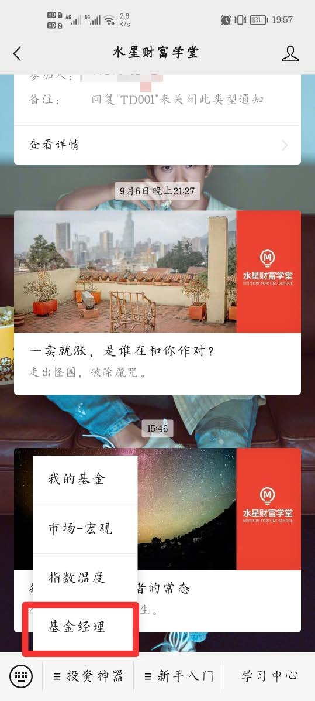
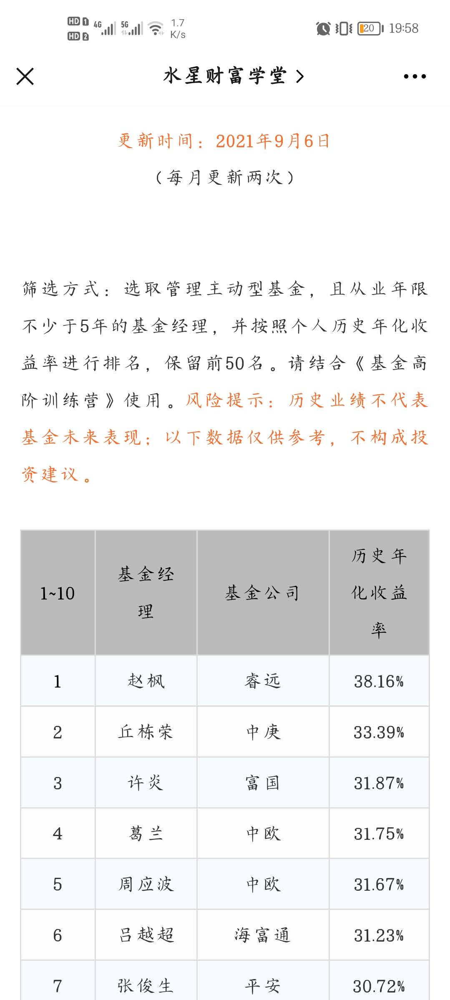

## 投资产品——股权类基金(下)

晚上好呀, 同学们, 我们昨天复习完了股权类基金里的指数基金. 今晚我们一起来梳理下主动基金和量化基金.

在 A 股这样的新兴市场, 主动型基金经常跑赢指数, 值得投资者配置, 以冲刺更高收益.

我们在筛选主动基金之前, 要先筛选基金经理.

基金经理的筛选标准

1、从业年限不能少于 5 年

2、历史年化收益率需要排在前 50 名

这里, 水星财富学堂已经将年化收益在前 50, 且从业年限 >5 年的基金经理整理好了, 大家可以直接在水星财富学堂的公众号里查看.

查看路径:【水星财富学堂】——【投资神器】——【基金经理】

筛选完基金经理之后, 我们就来正式考察这些优秀的基金经理管理的主动型基金是不是值得买入了.

可以用"三轮淘汰制", 第一轮评估基本指标, 第二轮评估基金收益, 第三轮评估基金风险.

第一轮, 考察基本指标, 一共 5 条规则:

(1) 只挑选基金经理现在还在管理的基金

(2) 只挑选主动型的股票基金、混合基金

(3) 基金经理管理基金的"任职天数"不少于 5 年

(4) 基金规模在 5 亿~20 亿之间

(5) 一只基金同时有 A 类和 C 类时, 优先选择 A 类

第二轮, 评估基金收益

(1) 基金的 3 年的夏普比率和 5 年夏普比率都高于沪深 300, 否则淘汰 .

(2) 主动型基金的晨星三年评级、晨星五年评级都要达到四星或五星, 否则淘汰.

(3) α 系数就是评估 α 收益的一项指标.α 系数越高, 代表基金经理越牛, 越能战胜市场.α 系数需要在 15%以上, 否则淘汰.

PS:α 收益是凭基金经理选股的本事赚的, 也叫"绝对收益", 特别能体现基金经理的真实水平.

第三轮, 评估基金的风险, 也叫压力测试

压力测试就是考察基金的最大跌幅, 看它有没有超过我们的承受范围.

基金有个最大回撤率的概念, 是指在选定的时间段内, 基金净值从最高点下跌到最低点的跌幅.

计算公式为:(最低点净值-最高点净值)/最高点净值.

查询和计算基金的最大回撤率, 可以利用天天基金网.

"最差三个月回报"指的是, 我们在这只基金的历史上任意时刻入手, 拿三个月, 最多会亏多少."最差六个月回报"含义类似.

用这两个指标近似代替基金的最大回撤率, 更加方便快捷.

这一轮需要你先评估自己的承受范围, 如果基金的最差三个月回报和最差六个月回报均<你的承受范围最大值, 则通过考核, 进入备选池里.

我们还学了主动基金的 3 个加分项, 如果备选池里的基金有加分项, 可以优先选择它主动型基金"优中选优"三步走: 看获奖情况; 看持仓情况; 看换手率.

加分项 1: 看是否获得金牛奖.

金牛奖是基金界的重量级奖项, 每年评选一次. 股票型、混合型会颁以下奖项奖: 七年期持续优胜金牛基金、五年期持续优胜金牛基金、三年期持续优胜金牛基金. 我们优先选择已经获奖的基金.

加分项 2: 观察基金持仓集中度

"前十持仓占比合计"如果超过 50%, 说明基金经理持仓相对集中; 反之则相对分散.

如果选择了"前十持仓占比合计"超过 50%的基金, 那么还要关注备选池里基金的持仓重合度. 也就是拿多只基金做对比, 看持仓前十的股票里面, 有多少股票是重合的.

如果前 10 只股票里面有 7 只以上都一样, 那就说明持仓重合度较高. 这时候, 可以在天天基金网顺便看一下基金近三年收益率, 谁的收益高一点, 就选择谁.

加分项 3: 看基金的换手率

"换手率"考察的是基金经理买卖股票的频率. 对于咱们长期投资者来说, 换手率低了好. 换手率低说明经理在投资时, 关注更多的是选股, 锁定好股票, 然后长期持有, 不频繁买卖. 这和我们长期投资的理念相一致. 在"优中选优"时, 大家可以综合比较每一只基金的换手率, 选其中换手率更低的.

如果通过最终筛选的基金超过 5 只, 从前往后选择 5 只以内即可; 如果一直也没有, 不要硬凑, 而是要耐心等待.

买入主动型基金不需要择时, 卖出主动型基金有 2 种情况: 一是基金经理换人了, 二是找到了其他更值得投资的基金.

最后, 如果备选池里的基金, 依旧难分伯仲的话, 可以上天天基金网查看基金的定期报告, 获得更加详细的介绍.

定期报告分为三种: 季报、半年报、年报. 年报里面的信息是最全的, 建议大家重点观看.

定期报告的发布时间:

基金年报信息量巨大, 一般来说, 我们看这四个方面就够了:

(1) 审计意见

是否是"标准无保留意见", 如果不是, 本着疑罪从有的原则, 直接排除这只基金.

(2) 持有人户数和持有人结构

持有人户数是否>50, 且持有人里机构占比<90%才算通过

(3) 基金产品说明

重点看到投资目标、业绩比较基准和风险收益特征, 了解基金公司对该产品的定位, 再对比自己的投资需要, 看是否与基金的定位相匹配.

(4) 管理人对报告期内基金的投资策略和业绩表现的说明

可以看到基金经理对过去一年里市场变化进行分析, 说明自己的投资策略, 展示自己的收益情况, 同时展望一下未来趋势.

一般来说, 我们只需要每年看一次年报的审计报告就可以啦~

再次强调不管是主动基金还是指数基金, 都是需要长期持有的哦, 我们要坚持价值投资, 坐享时间与市场给我们带来的投资回报.

我们还学习了量化对冲基金, 这里其实是两种策略——"量化"和"对冲".

"量化"指的是借助数学模型和统计方法来进行数量化分析, 从而对资产价格未来走势进行预测.

"对冲"指的是同时进行两笔方向相反、盈亏相抵的交易. 如果一笔交易亏钱了, 另一笔反向交易会赚钱, 从而把风险"抹平".

量化策略无法精确算出股票会涨还是跌, 但是可以提高预测正确的概率. 量化策略可以摆脱人的精力限制, 在更大的股票池里挑选股票. 根据历史表现, 私募量化对冲基金的历史收益总体高于公募量化对冲基金的历史收益.

投资策略的"不可能三角"包括了低风险、高收益、大容量三个角. 任何一种投资策略, 最多只能占据其中两个角. 不存在高收益、低风险和大容量的完美策略.

私募量化一般会保留低风险、高收益, 牺牲大容量.

公募量化一般会保留低风险、大容量, 牺牲高收益.

公募量化对冲基金的筛选需要用到晨星网和天天基金网以及水星学堂的筛选表格(基高版). 步骤如下:

第一步, 在晨星网首页的顶部菜单, 找到"基金工具", 点击其中的"基金筛选器".

第二步, 在跳转后的"基金筛选"页面, 点击其中的"更多筛选条件".

第三步, 基金分类勾选"市场中性", 申赎状态选择"申购开放, 赎回开放", 点击"查询".

注意: 这里我们只保留 A 类, 并把所有的基金登记在筛选表里进行下一步的筛选.

接下来, 我们进入天天基金网, 查询基金的"近 3 年收益率"和"基金规模".

筛选要求:

1、 基金规模最好不少于 2 亿元

2、近 3 年收益率越大越好

有条件的小伙伴, 可以考虑私募基金. 私募量化对冲基金的数量更多, 策略花样更多, 历史收益也更可观.

好了, 我们已经盘点完所有的股权类基金哦~
