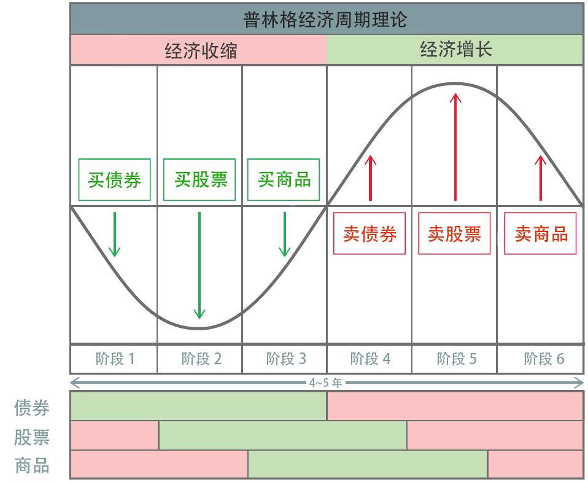
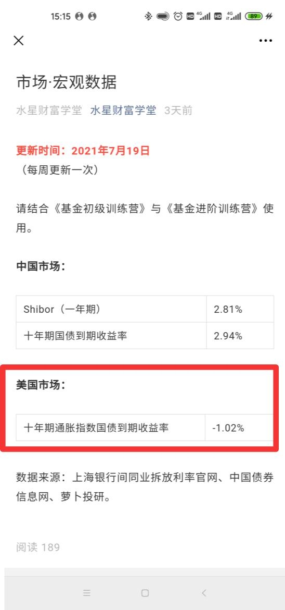

## 投资产品——另类基金

hello, 大家好, 我们今天来盘点梳理的的基金, 叫做另类基金. 怎么理解呢? 这些基金实际的投资范围, 既不属于债权类资产, 又不属于股权类资产, 所以资本市场给了它们新的分类, 叫做另类基金.

属于另类基金的有: 黄金基金、REITs 基金

现在我们来一一回顾下这些基金:

## 黄金基金

先来看, 黄金基金.

根据普林格经济周期的六个阶段, 债券、股票和商品在不同的时期发挥不同的作用, 只要我们全部纳入配置方案, 就有机会在一轮经济周期中"撸"三份收益, 进而提高投资总回报.

而黄金具备了三大属性: 货币属性、商品属性和投资属性.

配置黄金的 5 种方式包括: 实物黄金、金币、纸黄金、黄金期货和黄金基金. 建议普通投资者优先选择黄金基金.

筛选黄金基金主要看 2 个指标:

1、基金规模不小于 5 亿元, 且规模越大越好;

2、跟踪误差越小越好.

筛选黄金基金用到的工具是晨星网+天天基金网+水星工具: 黄金基金筛选表.

筛选步骤如下:

1、在晨星网顶部的菜单中找到"基金工具"这一栏, 点击下拉菜单中的"基金筛选器".

2、点击其中的"更多筛选条件"

3、点击基金分类里面的"商品-贵金属", 申赎状态选择"开放申购, 开放赎回", 资产净值选择最低 5 亿元

4、点击"查询", 将结果录入到筛选表格中.

小提醒: 贵金属类基金包括了黄金基金和白银基金, 如果筛选结果中出现白银基金, 我们把它排除即可.

5、在天天基金网中, 逐一搜索表格内的基金, 进入基金的详情页面, 可以查看到基金规模和跟踪误差率, 并把结果录入到筛选表格中

6、最终从表里内, 挑选出一只跟踪误差率和基金规模上最优的基金进行投资就可以啦~

判断黄金买卖时机要看的是实际利率, 也就是美国 10 年期通胀指数国债收益率.

实际利率大于 0.5%时, 买入黄金基金;

实际利率在-0.5%和 0.5%之间时, 保持观望或继续持有;

实际利率小于-0.5%时, 卖出黄金基金.

贴心的课程研发组已经把相关数据, 放在【水星财富学堂】公众号里, 大家可以直接在这里查看.

查看路径:【水星财富学堂】——左下角【投资神器】——【市场-宏观】——【美国市场: 十年期通胀指数国债收益率】

## REITs 基金

接下来, 我们一起来看 REITs 基金.

REITs 基金又叫"房地产投资信托基金", 因为 REITs 在海外主要投资于房地产.

对于普通人来说, 投资一套完整的房子比较困难, 可能拿不出这么多钱. 而 REITs 可以用基金的形式募集大家的钱, 集合小资金来买房, 投资人可以共同分享房子出租的租金, 以及房子增值的差价.

国内的 REITs 借鉴了海外 REITs 的模式, 让普通人花小钱就可以投资大项目. 但是, 国内 REITs 的底层资产可不是房地产, 而是基础设施, 也就是铁路、公路、仓储物流、产业园区、污水处理厂等等. 投资 REITs 赚钱靠的是项目利润分红和 REITs 价格上涨.

REITs 投资标的分为 3 类: 单一项目 REITs; 多项目 REITs 和 REITs 指数. 其中国内 REITs 目前没有对应的指数, 海外 REITs 可以实现指数化投资.

接下来, 看看这几种 REITs 应该怎么样投资呢?

### (一)国内 REITs

按照权属类型分, REITs 所投资的基础设施项目有两类, 一类是具备产权的项目, 另一类是只具备特许经营权的项目.

参与 REITs 投资的方式有两种, 一种是认购新发行的 REITs, 另一种是等 REITs 上市后再投资. 建议大家选择后者.

筛选 REITs 基金用到的工具是集思录+天天基金网+水星工具: REITs 基金筛选表.

筛选步骤如下:

第一步: 打开"集思录", 点击"REITs"

第二步: 选择"A 股 REITs"里的"上市 REITs", 可以看到所有已经上市的 REITs 基金, 在"水星工具: REITs 基金筛选表"里填写基金代码、基金简称、基金公司和项目类型等相关信息

第三步: 切换到"待发 REITs"查找到"拟募集(亿份)", 这是基金的总份额, 也登记在"水星工具: REITs 基金筛选表"里

第四步: 打开"天天基金网", 输入基金代码, 跳转基金详情页之后, 点击"基金公告"

第五步: 在基金公告里, 点击"发行运作", 找到"基金招募说明书"之后点开, 右上角选择 "查看 pd 原文"

第六步: 在目录里找到"基础设施项目基本情况", 找到"基础设施资产估值情况"就可以看到基金的估值了

第七步": 水星工具: REITs 基金筛选表"里的基金的估价, 等于基金估值除以基金总份额, 计算后填入表内

买卖标准: 比较基金实时价格和估价

当实际的价格高于我们预估的合理价格时, 就说明该 REITs 被大家高估了, 当前不适合买入, 如果已经买了建议及时卖出.

当实际的价格低于我们预估的合理价格时, 就说明该 REITs 被大家低估了, 当前适合买入

为了分散投资风险, 课程建议大家至少配置 5 只以上的 REITs 产品, 而且要做到两个"三分之一", 也就是: 同一个项目类型的产品, 配置比例不超过三分之一; 同一家基金公司的产品, 配置比例不超过三分之一.

REITs 基金上市后, 交易时间是每个交易日的 9:30~11:30, 以及 13:00~15:00. 上市首日, REITs 的单日涨跌幅限制为 30%; 过了首日以后, REITs 的单日涨跌幅限制固定为 10%.

### (二)海外 REITs 基金

海外 REITs 投资的方式有两种, 一种是开一个港股账户, 直接到海外市场投资; 另一种不用开港股账户, 而是利用 QDII 基金间接投资.

筛选投资 REITs 指数的 QDII 基金, 需要用到"天天基金网"+水星工具: REITs 基金筛选表.

海外 REITs(QDII)的筛选标准有 3 个:

1、基金规模不宜小于 1 亿;

2、成立时间不能少于 3 年;

3、必须有跟踪的指数

筛选步骤如下:

1、在天天基金网首页的搜索框中, 输入"REIT", 大小写都可以. 注意: 是 REIT, 别加"s", 可以搜到更多哦.

2、输入后不要直接点击"搜索", 而是点击下拉菜单中的"查看更多搜索结果".

3、在跳转后的界面中, 挑出来海外的 REITs, 并录入到水星专属筛选表中

4、再次在天天基金网的首页搜索, 更换搜索词为:"房地产", 依旧选择"查看更多搜索结果",

在跳转后的界面中, 挑出来海外的 REITs, 并录入到水星专属筛选表中

5、逐一搜索表格内的基金, 进入基金的详情页面, 可以查看到基金规模、跟踪误差率和跟踪标的, 并把结果录入到筛选表格中

6、最后从表格里, 筛选出基金规模大于 1 亿、成立时间不能少于 3 年和有跟踪指数的基金进行投资

海外 REITs 的买卖不需要特意择时, 买入越早越有优势.

好了, 到了这里, 我们其实已经梳理完课程里所有的基金哦~明天班班将会带大家复习投资策略和投资心态.

现在相当于我们已经梳理完所有的招式了, 明天班班帮大家把这些招式串联在一起, 变成组合拳. 明晚 8 点, 班级群, 不见不散哦~
