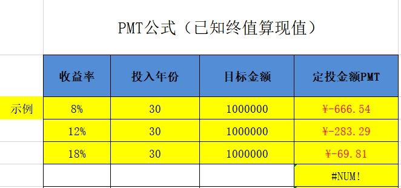
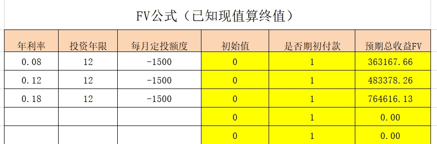

大家晚上好呀~我们今天就是最后一天复习, 有多少人在的呀? 今天我们来复习投资策略和投资心态, 先来看投资策略.

## 投资策略

投资策略分成定投、股债平衡和资产配置.

## 一、 定投

和一次性投资相比, 定投有三个优势, 分别是: 减轻本金压力、摊薄投资成本和规避人性弱点.

### (一)定额定投

1、如果有明确的目标, 可以选择用目标导向法计算定投金额;

<a href="/定投公式-PMT和FV" target="_blank">定投公式-PMT 和 FV</a>

在这个表格里, 输入你最后想要达成的金额, 预计收益率和可投资的年限, 就可以得到, 你每个月应该是需要定投多少钱

2、如果没有明确的目标, 可以选择用固定结余法计算定投金额.

在这个表格里, 输入你每个月的可投资金额预计收益率和可投资的年限, 就可以得到达到该年限后, 我们的本金和收益可以达到多少.

### (二)定期不定额

定期不定额投资更有利于摊薄投资成本, 提高投资收益率. 我们可以把指数温度分为六个区间, 每个区间对应不同的投资比例. 温度越低, 投入越多; 温度越高, 投入越少; 温度超过 50 度, 卖出基金, 落袋为安. 具体比例如下:

## 二、 股债组合

### (一) 股:"核心-卫星"策略

为了平衡直接投资单一行业带来的风险和波动, 我们采用"核心-卫星"策略. 核心为低估值宽基指数; 卫星为消费、医药、科技和新能源四大领域.

配置比例可以根据个人实际情况灵活调整.

激进的组合配比是, 核心占比 40%, 四颗卫星各占比 15%; 稳健的组合配比是, 核心占比 60%, 四颗卫星各占比 10%.

我们需要配置"核心-卫星"策略, 核心是最低估的宽基指数; 在配置四颗卫星时, 我们只需要在消费、医药、科技、新能源里面, 各选择一个估值最低的指数就可以了.

如果某一个领域没有估值合理的指数, 那就暂时不配置该领域的基金. 可以把保留下来的本金放在货币基金里生息; 等该领域的机会一出现, 就一次性把钱取出来, 全部投资进去.

注意:

1、"核心-卫星"组合是为了搭配指数基金, 而指数基金所投资的底层资产以股票为主.

2、进阶课的指数基金定期定额投资就可以了.

### (二) 债: 选择现阶段最适合投资的债基品种

注意: 可转债基金, 并不保底, 属于进攻端.

### 股债平衡

投资中的进攻和防守, 不是一成不变的, 而是要根据市场情况灵活调整.

股市收益率减去无风险利率, 就是承担风险所带来的那部分收益率; 这部分叫做"风险溢价".

风险溢价, 越高越好. 溢价越高, 代表我们承担同等风险所带来的收益率越高.

"水星财富学堂"公众号每周更新风险溢价的数据, 供大家参考.

当风险溢价大于 0 时, 全力进攻;

当风险溢价在-1%到 0 之间时, 进攻为主;

当风险溢价在-2%到-1%之间时, 防守为主;

当风险溢价小于-2%时, 全力防守.

ps: 投资的时候, 只要股债之间的侧重点抓对了, 具体的比例可以灵活调整.

除了市场情况, 我们配置的时候还需要考虑下自身的情况.

SAA 也叫战略资产配置, 是预先设定好配置比例, 一直按照固定的配比来投资.

SAA 主要考虑三大方面: 个人性格和心理偏好、财务状况和持有时间、所处的人生阶段.

TAA 也叫战术资产配置, 就是根据市场动向, 灵活调整配比.

SAA 和 TAA 相结合, 可以做到知己知彼. 按照木桶定律, 最终攻守方向应选择 SAA 和 TAA 中较保守的那一种.

当我们确定好股债占比, 就可以构建股债组合了, 可以分为"实战五步走":

第一步, 确定每月定投金额;

第二步, 确定股债配比;

第三步, 选定指数基金;

第四步, 选定债券基金;

第五步, 调整投资金额.

组合建好以后, 我们要每月查看指数估值, 必要时重新选择指数基金.

每年或每半年, 要进行一次组合再平衡, 也就是从头开始, 把"实战五步走"再进行一遍. 把旧的股债组合, 调整为全新的股债组合.

实战前的几个小提醒:

对于预算较少的小伙伴而言, 可以选择和自己预算相匹配的投资方式.

每月预算在 300 元以内, 可以在股和债之间二选一;

每月预算 300~1000 元, 可以考虑做一个简化版的股债组合.

金斧子基金 App 有 3 个现成的组合可以选择. 水星淘金组合相对激进; 稳如磐石组合相对保守; 步步为盈侧重于攻守平衡. 这些组合门槛低, 都是 100~200 元起购, 一次性投资 5~10 只基金.

每月预算 3000 元以内做"核心-卫星"组合, 可以考虑单纯配置场外基金; 每月预算 3000 元以上, 可以选场内指数基金, 费率更低.

## 三、 大类资产配置

股票类资产不限于指数基金; 我们在做股债组合的时候, 把主动型基金、量化对冲基金作为进攻方, 也是可以的. 从进攻性的强弱来看, 主动型基金的进攻性最强, 其次是指数基金, 最后是量化对冲基金. 大家可以根据个人的风险偏好灵活选择.

对于收益预期不高、倾向于稳健增值的小伙伴, 以及平时很忙、没有太多时间研究投资的小伙伴, 永久组合可以为你省下大把的时间, 轻松实现"懒人投资".

不过这个是对于本金较多的伙伴而言, 对本金较少的小伙伴意义不大, 还是要优先提高收益率. 永久组合的构建方式为: 把资金四等分, 平均分配到股、债、黄金和现金当中, 每一样占 25%.

股、债、黄金的大类资产配置, 可以参考"美国 10 年期通胀指数国债收益率". 当该指标不足 0.5%时, 放弃黄金, 专注于股债组合; 当该指标超过 0.5%时, 组合中加入黄金, 比列为 10%~30%, 其余 70%~90%配置股债组合.

好了, 投资策略基本上, 我们已经梳理完毕, 接下来看投资中的心态建设

## 投资心态

先来看, 反面例子——投资中的 8 大常见的心理误区:

1. 基本心理误区包括: 从众心理和过度自信.
2. 时效心理误区包括: 近因效应和缺乏耐心.
3. 决策心理误区包括: 偏爱复杂、锚定效应、心理账户和膀胱效应.

在投资过程中, 我们经常会看到各种各样的解读信息. 同样一个消息, 媒体可以解读为利好, 也可以解读为利空. 哪怕是面对同样的解读, 有人觉得买入合理, 还有人觉得卖出合理. 在各种解读中迷失, 是因为缺乏一套自己的投资标准.

买入标准概括起来一共就两条:(1)买好的; (2)买得好.

卖出标准概括起来一共就四条:(1)你贵了; (2)你变了; (3)我变了; (4)我错了.

投资中是有机会成本的. 把钱放在错误的投资上, 就相当于放弃了用这笔钱做正确投资的机会. 在投资中, 认错没什么不好的. 一旦发现错了, 及时收手止损.

我们还学习三个高阶思维, 让我们的投资可持续进行, 从而实现终身复利.

1、逆向思维——"人弃我取, 人取我予". 只有和多数人反着来, 在他们贪婪的时候选择恐惧, 在他们恐惧的时候选择贪婪, 才有机会实现低买高卖, 从而赚到收益.

2、组合思维——高风险不代表高收益, 我们可以通过建立组合的方式, 将波动控制在很小的范围内, 而对收益的影响很小.

3、长期思维——坚持长期主义, 投资赚钱, 需要我们坚守长期主义, 用可持续的方法实现终身复利, 而不是捞一笔就走.

班班还带大家做三个交易记录, 分别是: 买前自问清单、卖前自问清单、完整交易复盘.

搞清楚我们每一笔交易, 为什么买? 为什么卖? 并总结经验给下次投资累积经验值.

虽然过程确实较为繁琐, 但是却可以很好的避免我们一时上头去做盲目投资. 毕竟, 用的都是真金白银.

到这里我们就结束了所有的复习哦~
