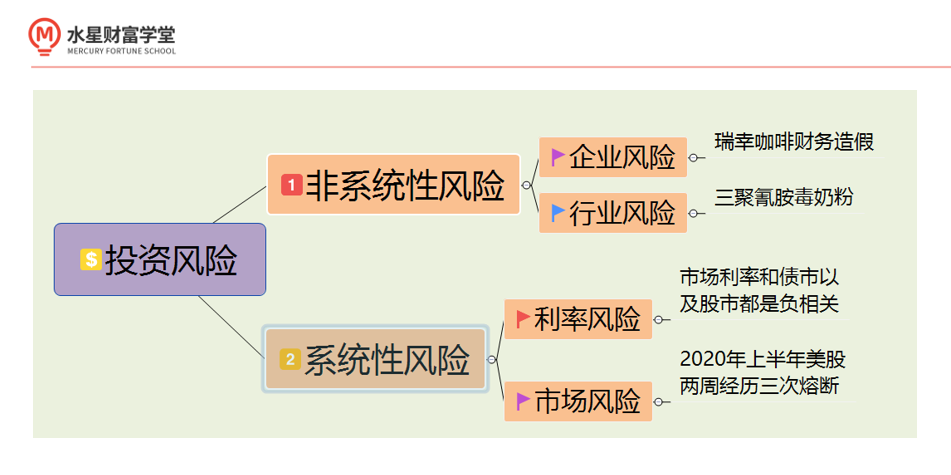
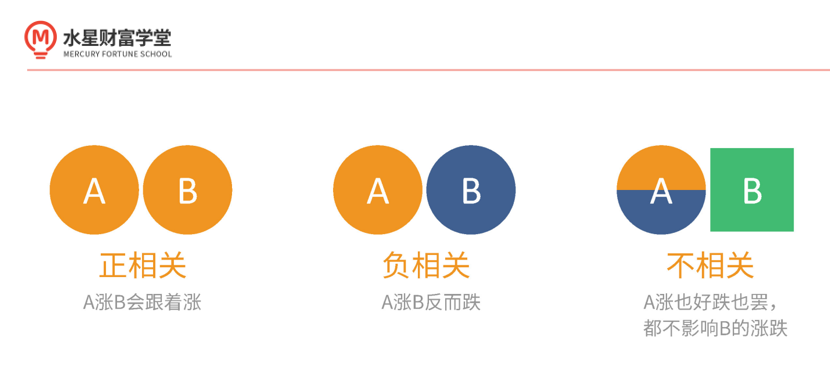
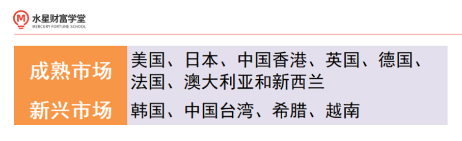
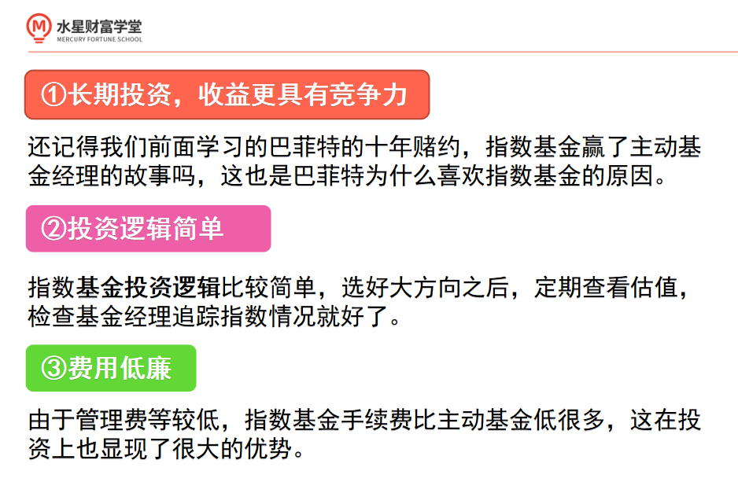
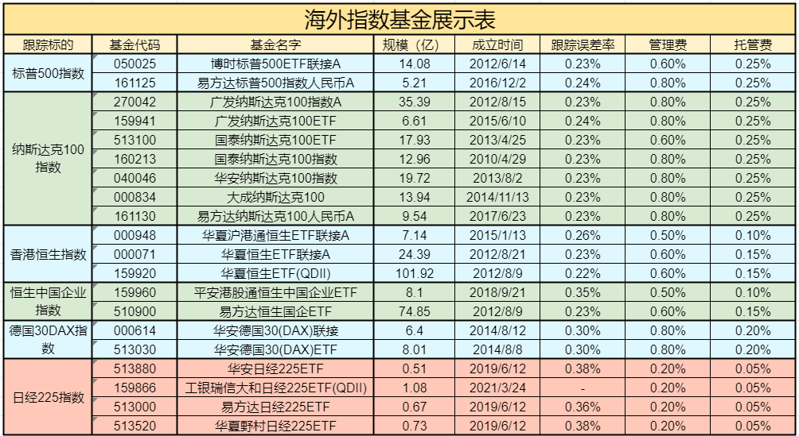
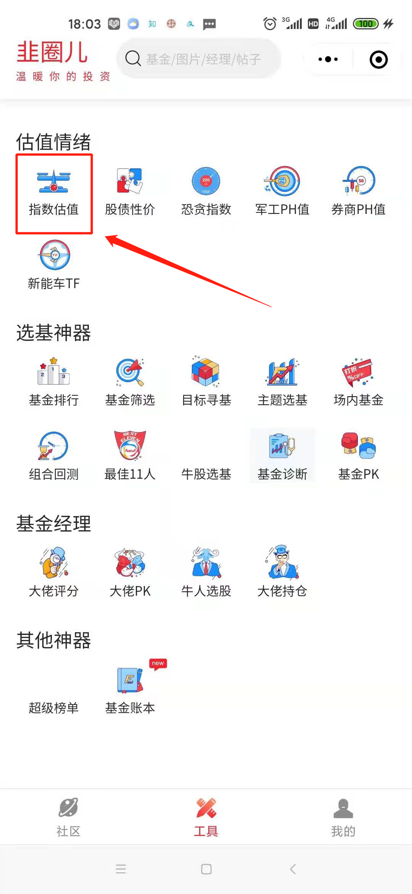
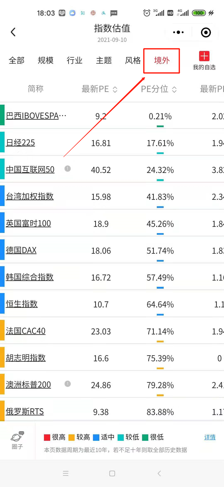

## 一、为什么投资海外市场?

我们已经学习了债券基金、宽基指数基金、行业指数基金以及主动基金.

但是有小伙伴想说了, 这些都是国内的指数和基金, 有没有一种可能, 躺在家里就可以投资海外市场呀? 聪明的小伙伴, 当然有了, 这节课就给大家着重的讲解海外市场.

先问大家一个问题: 都说投资海外市场, 那什么才是海外市场呢?

其实海外市场就是指除 A 股市场以外的市场, 比如中国香港, 美国, 德国, 日本等等.

为什么香港也是海外市场呢? 香港和大陆不应该是一家亲吗?

我们需要了解, 这个称呼并不是按照国家划分的, 其实这主要是历史问题. 因为港澳台没有回归的时候, 大家习惯把他们和国外市场一起称为海外市场, 久而久之习惯了沿用至今.

那么, 投资海外市场对我们来说有什么用呢?

投资永远规避不了的一个问题就是风险. 而且高收益往往伴随着高风险, 这个风险我们将其分为两类: 非系统性风险和系统性风险. 我们再来简单认识下这两种风险:

非系统性风险主要包括企业风险和行业风险, 比如瑞幸咖啡财务造假就属于企业风险, 2008 年震惊国民的三聚氰胺毒奶粉事件就是行业风险. 这种风险的本质是资产本身面临的风险.

系统性风险主要包括利率风险和市场风险. 利率风险主要是利率变动引起的影响, 比如我们知道市场利率和债市以及股市都是负相关, 这就是利率风险.

2020 年上半年美股两周经历三次熔断, 证券价格直线下跌, 就属于是市场风险.

投资海外市场一个很大好处是可以降低系统性风险中的市场风险, 为什么这么说呢?

这里引出一个概念"相关性", "相关性"是指一个投资标的影响另一个投资标的走势的倾向性. 具体可以区分为正相关、负相关和不相关三种.

海外不同市场与 A 股市场有着不同的相关性, 可以利用这点做到资产配置, 降低系统性风险.

## 海外市场的分类

听到这里聪明的小伙伴不禁要问, 班班学姐, 如果这样说, 是不是所有海外市场都与 A 股负相关呀?

要想知道这个问题的答案, 我们先来看看海外市场有着怎样的分类, 总体来说, 海外市场可以分为两大类: 一类是新兴市场, 一类是成熟市场.

新兴市场是指发展中国家的股票市场, 以及发达国家中部分成熟的股票市场. 成熟市场是指发达国家或者地区中相对来说较为成熟的股票市场.

其实关于发展中国家的定义, 官方并没有一个统一的标准, 但是大致会有一个划分区域, 他主要集中在亚洲、非洲、拉丁美洲和东欧地区.

例如巴西、哥伦比亚、埃及印度、马来西亚、墨西哥、菲律宾、泰国、土耳其和阿拉伯等等.

发达国家或者地区大家熟悉的有美国、英国、德国、法国、日本、澳大利亚、新西兰以及我国的香港, 他们也都属于成熟市场.

不过, 发达国家中也有不成熟的股票市场, 例如韩国、希腊.

那么我国股票市场属于哪一类呢? 其实我国 A 股市场和台湾市场属于新兴市场, 香港市场则属于成熟市场.

我们前面学到的各种指数基金都是 A 股中的品, 属于新兴市场, 那么如果我们要找与 A 股相关性低的, 要选新兴市场还是成熟市场呢?

对的, 学姐也不卖关子了, 当然要选择成熟市场. 因为成熟市场和新兴市场的相关性更低, 组合配置的目的就是降低风险, 避免同涨同跌的风险.

不过特别说明一点, 由于中国有很多公司同时在港股和 A 股上市, 他们的股票走势是差不多的.

其次, 两个市场中的股民也会有重合, 导致 A 股市场和港股市场相关度高. 总体而言, 成熟市场与 A 股相关度低.

## 海外投资利器——QDII 基金

到这里, 你心里是不是有一连串的疑问: 我应该开海外投资账户吗? 投资门槛多少? 我应该怎么买呢? 接下来, 跟着学姐, 我们来聊一聊要怎么投资的问题.

首先, 回答一下三个问题: 不需要海外账户, 从国内买基金就可以投资到海外, 门槛只要 100 元.

啊?100 元这是什么操作, 来马上带你认识.

在基金的分类中, 有专门一种叫做 QDII 的基金, 是专门投资海外市场的. 具体是什么意思呢?

官方解释是这样的, QDII 是指在一国境内设立, 经该国有关部门批准从事境外证券市场的股票、债券等有价证券业务的证券投资基金.

翻译成人话就是, 我们国内的基金公司用来投资海外股票、债券等投资品的基金.

不过不是所有的基金公司都能投资海外市场, 还是需要有实力的基金公司获得官方许可才行.

另外, 因为香港市场一直习惯被称为海外市场, 所以港股的基金也被划入了 QDII 基金.

QDII 基金主要有四点优势: 专业度高、投资范围广、信息透明、门槛低.

我们稍微了解下:

### (1)专业度高

我们普通人投资海外市场暂且不说货币转换, 开户等麻烦. 语言的差异也是我们不可逾越的一道鸿沟. 并且在信息的获取上, 占据明显的弱势, 不如交给专业人士去研究、投资、管理.

### (2)投资范围广

QDII 基金一般涉猎投资品种比较广, 股票、债券、房地产、黄金、石油等都有对应产品. 另一方面, 借助 QDII 基金能够买遍全球, 借助 QDII 基金, 亚洲、欧洲、美国等很多地方都可以来投资.

### (3)信息透明

基金投资哪些资产, 投资的策略, 利润如何分配等这些信息和普通基金一样都会出具定期报告或临时报告, 信息公开透明.

### (4)门槛低

和普通基金一样, 有股票账号就可以买到场内 QDII 基金. 通过第三方平台或者基金公司官网, 也可以买到场外 QDII 基金, 一般 100 块钱有些甚至 10 元就可以买到了.

## 如何选择 QDII 基金?

好了, 现在到了最最关键的一步——怎么选择 QDII 基金呢?

给大家支一招叫"抓大放小", 优选指数基金

按照信息掌握程度, 优先投资我们更熟悉的大类资产和成熟大市场的大指数. 之所以这样建议, 因为有三点优势:

遵循上述投资原则, 结合目前 QDII 基金的主要投资方面, 接下来带大家认识主要的 QDII 指数基金.

### (1)美股市场

美股市场主要指数主要有四只: 标普 500 指数、标普 100 指数、纳斯达克 100 指数、道琼斯工业股票指数. 其中, 标普 100 指数跟踪的基金质地一般, 道琼斯工业股指没有追踪的 QDII 基金, 我们直接排除.

所以, 我们重点关注标普 500 和纳斯达克 100 指数.

标普 500 指数, 是精选了美国 500 家上市公司的股票, 可以理解成大盘股指数, 类似与我们的沪深 300.

纳斯达克 100 指数的成分股, 以高科技公司为代表, 可以理解成小盘股指数.

不过需要注意的是, 从近期来看美股的估值一直比较高. 如果想做资产配置, 建议分批投入、控制比例、降低风险.

### (2)港股市场

看到这个标题, 你可能会有疑问, 咦? 不是说港股市场和 A 股市场相关性很大, 这样不就不能很好降低系统性风险了吗?

其实关注港股市场, 也正是因为与 A 股市场的相关性, 港股有我们更熟悉的企业, 且港股市场一直是投资者眼中的价值洼地, 尤其在 2015 年股灾之后.

这也是这些年大家这么愿意关注港股的原因, 我们也可以从港股找到更多的投资机会.

香港市场主要投向两只指数: 恒生指数、H 股指数.

恒生指数, 香港市场最出名的指数, 反映香港市场整体表现.

H 股指数, 又称恒生中国企业指数, 追踪在香港上市的内地企业, 比如中国银行、中国平安、万科等.

### (3)欧洲市场和其他地区

从全球配置的角度来讲, 欧洲市场也是我们投资的重要地区.2020 年全球 GDP 排名前十中, 欧洲德英法意占据四个席位. 我们可以多留意一些欧洲方面相关资讯.

从收益和有跟踪基金考虑, 大家重点留意德国 30DAX 指数

另外, 与我们隔海相望的邻国日本, 大家可以重点关注日经 225 指数.

### 挑选指数基金

知道什么指数可以买, 接下来就是要挑选指数基金了. 考考大家, 还记得筛选基金的标准吗?

没错了~就是基金规模大于 5 亿, 且越大越好, 跟踪误差率越小越好, 选择完全复制型的指数基金.

可爱的班班今天下午特地帮大家做了筛选, 想抄作业的同学, 可得收藏起来了~热乎乎的基金表来啦~

这里, 学姐强调下, 因为日经没有规模合适的基金, 所以班班把所有跟踪日经 225 的指数基金都列上去了, 并且标红. 我们持续关注, 如果实在没有低估的海外指数, 再考虑投资它.

### 买卖

知道了买什么, 那什么时候买, 什么时候卖呢? 这里要说到海外宽基指数的估值方法了.

其实大家都学过, 那就是指数温度. 因为海外指数也是宽基指数, 而且是被世界各国投资者认可的盈利能力比较稳定的指数.

当指数温度在 50 度以下时, 买入指数基金; 当指数温度在 50 度以上时, 卖出指数基金. 大家都会计算温度了, 是不是?

但是, 海外市场的相关资料就没有那么好找了, 目前国内最全的资讯平台——万德才有. 看了看万德高达 5 位数的年费会员, 贴心的班班给大家找了平替, 就是我们的——韭圈儿.

查看途径: 打开韭圈儿小程序——点击"指数估值"——切换到"境外", 就可以看到你想要查找的那只指数了

是不是还蛮方便的呢? 班班特地没计算这些指数的温度, 就是留给大家去完成的(奸笑)

## 总结

1. 海外市场就是指除 A 股市场以外的市场, 比如香港, 美国, 德国, 日本等等; 海外市场分为成熟市场和新兴市场. 从相关性角度来讲, 除港股市场外, 成熟市场与 A 股相关性低, 更能有效降低系统性风险.
2. QDII 基金是国内的基金公司获得官方授权投资海外股票、债券等; QDII 基金主要有四点优势: 专业度高、投资范围广、信息透明、门槛低.
3. 从"抓大放小", 优选指数基金角度挑选 QDII 基金, 总结如下指数:
   1. 美股市场: 标普 500 和纳斯达克 100 指数;
   2. 港股市场: 恒生指数和 H 股指数;
   3. 欧洲市场和其他地区: 德国 30DAX 指数和日经 225 指数.
4. 海外宽基指数也可以用指数温度方法进行估值, 查看海外指数的温度可以去韭圈儿

## QA

### 跟踪海外宽基指数的基金从什么网站搜索呢?

天天基金网输入指数名字就可以搜索相关基金~, 在天天基金网, 按基金主题搜索, 用指数名字做搜索词
