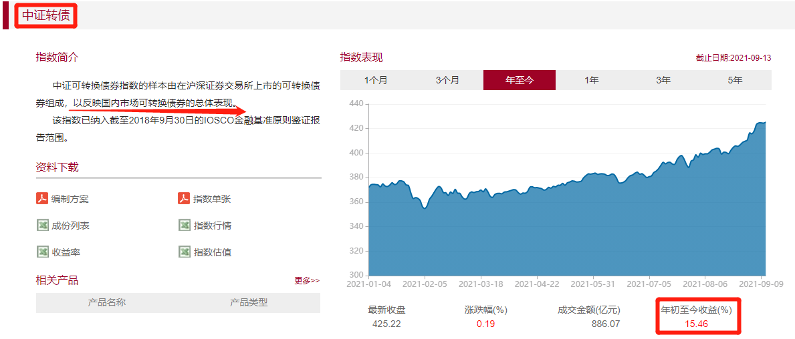

## 可转债是什么呢?

可转债它向下有保底, 即使股市腰斩也能拿回本金加利息, 这是法律条文的规定, 毕竟它本质是债券

向上却近乎没有封顶, 可以完全享受牛市带来的丰厚利润! 今年平均收 益在 30%左右

接下来班班带你们走进可转债的世界~咱们来听个故事, 好好听哟,

话说在遥远的金融大陆里, 住着两个土著种族.

一个是股权族, 他们英姿飒爽、族里盛产俊男美女, 战斗力很强, 但性格骄傲, 看其他种族的人的时候, 恨不得鼻孔朝天, 做事不够稳重(个股的波动大).

他们占据了大陆的北方, 股权族生活在北方的山林、高原、丘陵里, 他们孤傲高冷, 喜欢独立作战

整体来说, 股权族它们个体的战斗力非常强大……族里的"天赋佼佼者", 生下来就注定了, 是站在整个大陆巅峰的强大存在.

但是股权族, 有一个致命的缺陷, 他们发挥完整的实力, 仅限于在夏天(牛市), 在夏天甚至可以借助种族天赋, 超常发挥.

但是! 当到了冬天(熊市)的时候, 他们的战斗力经常会大幅度下降, 因此冬天, 傲娇的股权族, 就只能缩在家族里, 打开护族大阵, 削弱冬天的威力, 躲在角落瑟瑟发抖, 硬抗冬天(熊市)的威力哈哈.

另外一个土著种族, 叫债权族. 他们雍容华贵、彬彬有礼, 性格沉稳, 个体的战斗力、整体天赋虽然不如股权族

但胜在有组织, 善于排兵布阵, 足够团结, 他们在土地肥沃、地形较平坦的南方扎根发展.

债权族世代生活在肥沃的南方田野, 按理说, 南方这么好的"肥肉", 肯定会被其他种族觊觎, 然而虽然债权族他们个体水平不高, 但是团结、稳定, 因此打退了一波波觊觎他们家园的敌人.

而且他们不像股权族, 夏天一顿操作猛如虎, 冬天可能变成二百五哈哈.

在债权族中, 有一个细分支, 他们虽然人数不算特别多, 但是个体实力在债权族中, 遥遥领先其他债权种族的人, 其中的佼佼者, 甚至可以达到股权族的那种恐怖的个体实力~

而且特别好的一点是, 他们的新生儿天赋很稳定, 可能之后随着经历的不同、刻苦程度的不同, 能够发挥的个体实力也是不同的,

但是大家的起点都是相同的, 种族里的竞争氛围非常好, 这个神秘的种族, 名称就叫可转债~

(可转债的发行面值都是 100 块, 可转债本质是债券, 有法律合约保障, 具有保本的属性)

金融大陆上有传言说, 很久以前, 股权族的股皇和债权族的债后, 在年轻的时候, 隐瞒身份去大陆的各个地方历练, 他俩偶然相遇, 然后相恋, 那时候是大陆上, 深受羡慕的恋人, 但是之后身份暴露了, 迫于家族的反对, 不得不分开,

而可转债, 就是股权族的股皇和债权族的债后, 他们爱情的结晶~

(可转债同时具有股性和债性)

可转债的全名叫做"可转换公司债券", 是上市公司发行的,

在一定条件下可以被转换为公司股 票的债券, 它同时具有股性和债性.

听起来可能有点晕, 其实用大白话来翻译就是, 上市公司缺钱了, 想要找我们借钱, 但借钱不能空手借吧,

所以公司给我们写了一张欠条, 上面写着谁是欠钱的, 谁是借钱的, 借了多少, 借多长时间, 啥时候还钱以及要还多少利息等

这张欠条是受法律条约保护的, 所以我们不用担心借出去的钱收不回来.

你可能会想, 不就是一张普通的欠条吗?

NO~NO~NO, 可转债可不是普通的欠条, 不普通在哪里呢?

这就涉及到我们上面说的股性和债性了.

股性和债性是什么? 翻译成人话就是:

隔壁老王买了一支可转债, 会遇到以下两种情况

如果公司的发展好, 我们看好它, 就可以在特定情况下, 把手上的可转债, 转换成公司的股 票, 公司赚钱我们就跟着赚钱, 这就是股性

如果公司的发展不尽人意, 我们也可以持有可转债, 到了还钱的日子公司就把本金和利息还给我们, 这就是债性.

(必须是在可转债面值 100 元买入, 如果可转债走势不如人意, 最差持有到期也可以获得本金+利息哦)

也就是说可转债这张欠条, 不光可以保证我们在面值情况下买入到期获得本金和利息, 同时具有股性和债性的可转债, 下有保底、上不封顶

(是债券在面值价格买入, 会保本, 下有保底; 可以转换成股 票或者直接高价卖出, 上不封顶)

可转债可以说是非常适合我们进行资产配置又可以获得相对低风险一点的, 又想在股市里获得不错收 益的投 资者了

所以我们配置了一部分股权类资产, 可以再配置一部分可转债, 降低我们资产在熊市中的风险.

当然牛市可转债也可以飞天的, 比如今年可转债的收 益平均在 30%左右

而且可转债属于中短期, 平均投 资时间在 1-2 年左右 时间不定.

也可以获得不错的收 益. 可以作为我们投 资组合的搭配.

接下来, 班班带大家回顾这两年的可转债市场, 我们来看看这个投 资品到底表现是什么样的.

(数据来源:wind 截止日:9 月 10 日)

大家看到这 15 只可转债基 金的收 益是不是很心动呀. 那今年的可转债表现如何呢?

举个例也没啥意思, 班班找了最能代表可转债市场总体走向的中证转债.

大家可以通过这个截图看大, 今年至今整个可转债市场是有 15%+的收 益~

注意! 这里说的是平均收 益,

也就是如果你啥也不会, 你把所有的可转债都买下来, 今年就能躺赚 15%, 香不香?

对比下, 同期的沪深 300, 现在收 益率还是负值, 是不是觉得手里的新债更香了

等等, 别上头, 班班要给你泼一下冷水, 投 资可不是一件没有风险的事情.

随手一搜, 投 资可转债亏惨的人可不比股 票更少.

这主要是归结于可转债市场与股 票市场的交易规则的区别:

1、可转债支持 T+0 交易, 可以当天买入, 当天卖出

2、可转债只有停牌机制, 没有涨跌幅机制的!!!

也正是因为这 2 个区别, 越来越多投 机派和短线爱好者涌向了可转债市场, 风险和收 益都会被放大

没有学习过, 千万一定不要盲目操作买卖, 可转债和债券基 金是投 资体系完全不一样, 买卖原理和时机都完全不同.

而且可转债如果不是按照严格投 资买卖策略也是不保本的, 亏损也会很高.

投 资有风险, 入市需谨慎.

我们今天就先初步了解一下这投 资品.

怎么挑选可转债, 如何止盈, 怎么利用券商帮咱们盯盘, 下一小节不见不散哦~
