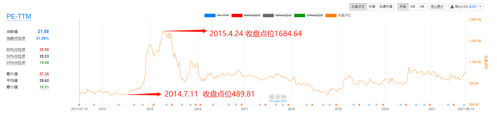
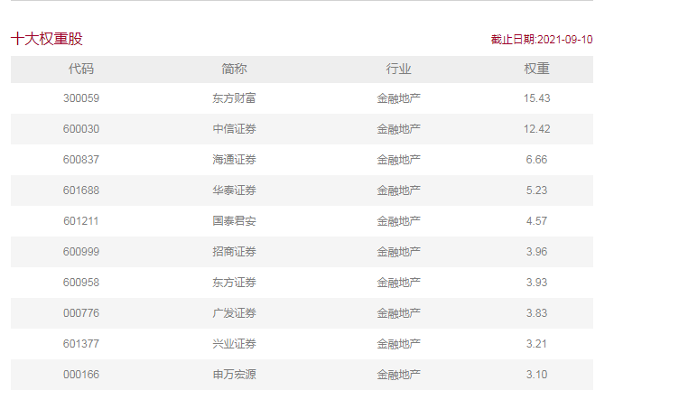
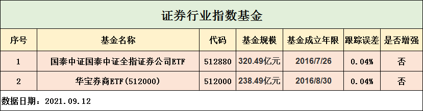
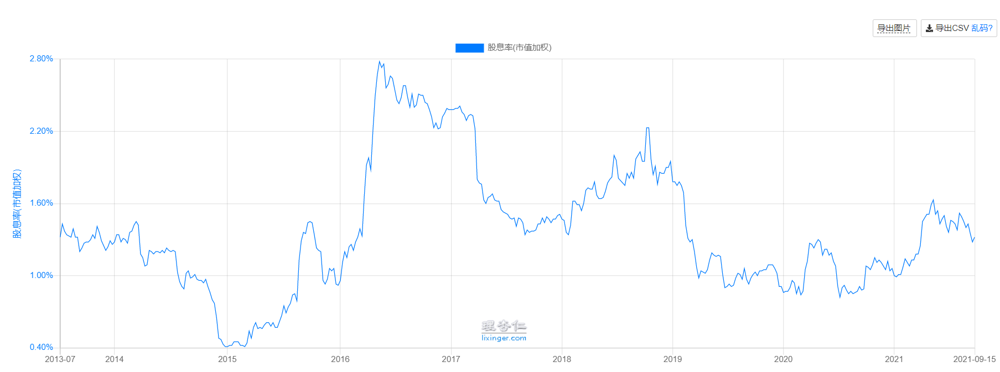
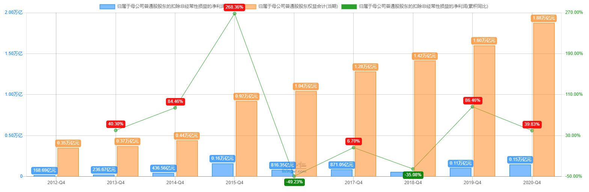
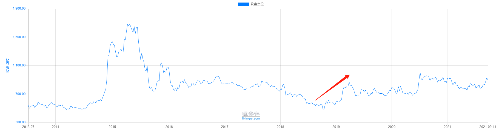
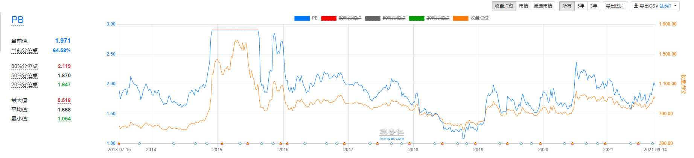

基金音频课我们学习到了消费和医药两个高速增长的行业, 你是不是一拍大腿立马决定就选这两个行业啦, 这总没错了吧.

虽然说消费医药行业是天生比较容易赚钱的行业, 但还有一种行业也是值得关注的, 它也是能赚钱的行业, 那就是强周期行业.

## 1．强周期行业

强周期行业一般包括金融, 地产, 煤炭, 钢铁等, 但并不是所有的强周期行业都适合投资, 因为我们很难判断它们的周期.

比如地产行业的周期受国家宏观政策的影响, 煤炭, 石油的周期受全球的供求关系影响, 宏观政策什么的连巴菲特老爷爷都看不懂, 我们普通人还是算了.

说了那么多又不适合投资, 班班逗你呢嘛.

当然不会, 有一种周期性, 行业周期性明显且容易判断. 那就是金融行业下面的证券行业.

证券行业的周期性体现在牛熊交替的时候, 在熊市的时候, 新开户的人数很少, 成交量也很少, 证券行业的收入自然而然就少.

毕竟他是靠交易吃饭. 在牛市的时候大量的人涌进股市, 不仅开户的人数暴增, 就连成交量也飙升, 收入自然是水涨船高.

给大家看一下它的涨跌走势图, 你看如果我们能瞅准时机, 在 2014 年 7 月入场, 在里面待到 2015 年 4 月就能赚三倍多.

是不是很爽呢, 9 个月赚三倍天上掉馅儿饼也不过如此吧

所以说我们只要掌握证券行业估值能判断股票市场的牛市, 就大概率能获取可观的收益啦.

## 2．为什么是周期之王

那么我们说证券行业的券商是周期股, 而且是周~期~之~王, 就是它是牛熊市的放大镜.

牛市时券商是涨得最猛的, 熊市时券商会比市场跌的更惨, 那这是为什么呢?

我们先来说牛市. 为什么牛市它会比其他的行业猛呢?

a 股有一个特征, 就是散户居多.

机构投资者相比美国市场香港市场都少很多, 那么散户的特点是啥, 大家还记得吗?——追涨杀跌.

当股市大涨, 散户就会冲进去, 15 年牛市的时候, 就是大跌之前, 很多人都冲进股市, 那么这些人开户之后大多数都会买买买

跟风炒股的投资者交易是最频繁的, 券商的经纪业务收入就会大涨.

那么熊市里大家都不动了, 没入场的不想买, 已经在场里的舍不得卖, 因为被套牢啦~

这时都没人开户很少人交易了, 经纪业务收入就会下降, 明明有那么多行业受经济复苏或向好的影响, 公司本身的业绩也会提升, 为什么券商股成为了周期之王呢?

还有一个原因哦~券商自己也投资~

这些投资业务在牛市的时候也会给券商的业绩添上浓墨重彩的一笔. 投资者在买买买, 券商的佣金收入涨涨涨, 股市在涨涨涨, 券商的投资收益也在涨涨涨.

再加上资管业务里市场好的时候, 投资者更愿意拿钱出来买买买. 集合计划, 券商的资管业务收入也会增加

投行业务也是同理, 市场好了, 钱多了, 有些钱没地方使~

IPO 是不是要搞一搞啊~定向增发要不要搞一搞啊~债券发行要不要搞一搞啊~

捞钱了管理层飘了~不如去并购一家公司吧~并购重组搞一搞啊~这些都是投行业务啊~投行业务也挣钱了.

然后这三大块业务累加起来的累加效应可就不是单纯的 1+1+1 啦!

所以综上, 证券行业就会成为股市的放大器啦~

这里还要说到一个证券行业的券商的护城河

券商有政府授权护城河, 不是谁想开就能开的, 所以我们要投资券商股, 只要找到龙头券商公司, 在熊市估值低的时候潜伏进去, 买入并持有, 在牛市估值高的时候卖出, 那差价是赚得很爽的.

证券行业的投资优点是, 周期性明显, 几乎不需要分析, 但是也有一个缺点, 就是需要足够的耐心.

周期股的特点就是不知道会不会跌到地下室去, 周期股的风险大, 可以投资, 但要找到入场时机, 需要我们有更多的能力.

## 3．证券行业的指数

证券行业指数大家重点关注"中证全指证券公司指数", 他是选取中证全指样本股中的证券公司行业股票组成, 以反映该行业股票的整体表现.

前十大重仓股是券商公司龙头企业.

我们回顾下基金初级课里挑选指数基金的要求:

1、指数基金的规模＞ 5 亿, 且越大越好.

2、跟踪误差越小越好.

3、优先选择完全复制型.

班班这里也筛选比较优秀的跟踪的指数基金(结果供大家参考, 不作为投资建议)

## 4．证券行业的估值

直接说结果! 用 PB 温度.

那为什么只看 PB 的温度呢? 进阶课中, 不是说只看 PB 或者只看 PE 不靠谱么?

哎哎哎, 我们再来回忆一下:

只看 PE 不靠谱, 是因为 PE=市值/净利润, 只适合盈利稳定的公司, 而对于盈利不稳定的企业, 就不适合看 PE.

只看 PB 不靠谱, 则是因为 PB=市值/净资产, 只适合资产稳定的公司; 如果公司亏损, 并且亏得连净资产都亏成了负数, 那就不适合用 PB 来估值.

对于宽基指数而言, 其中各类公司都有, 可能有盈利不稳定的, 也可能有净资产不稳定的公司, 所以两者同时看比较好.

但是, 像证券行业这种的强周期性行业, 遇到熊市, 可以三年不开张, 遇到牛市, 那就开张吃三年, 也就是说它的盈利非常不稳定.

我们来看下它的历史盈利能力就可以看出来, ROE 大幅波动:

再看它的 pe 和 pb 估值:

在 2018 年 11 月 16 日, 证券公司指数的 PE 温度达到了 58.36 度, 乍一看, 高估啊! 但是, 同一天的 pb 温度只有 7.82, 非但没有高估, 相反还处于非常低估的区域.

矮油, 苍天啊, 大地啊, 我究竟该相信 PE 还是相信 PB 呢?

别着急, 让我们接着往下看证券行业的归母净利润和归母净资产.

这时就会发现 2018 年由于市场极度低迷, 整个证券行业的净利润比 2017 年下降了快一半, 但是净资产却没有下降, 依然处于稳步增长中.

净利润下降得过快便是导致证券公司指数 PE 升高的主要原因

而由于净资产没有跟着下降, 因此, PB 依然处于低估区域. 这种净利润的下降并不是永久的, 一旦进入市场牛市, 盈利能力就会上升.

所以, PE 的高估不值得参考, 根据 PB 判断证券行业的估值更加靠谱.

现在来看, 我们也会发现, 2018 年底其实是投资证券行业的好时机, 到 2019 年开年, 便有了不错的涨势.

还可以看出, 每次 pb 温度低的时候, 都是好的投资时机.

这里的 pb 温度和进阶课完全一样哦. 强周期行业就按照, pb 温度大于 50 时, 卖出; pb 温度小于 50 时, 买入

班班 9.14 日查询的温度数据, 目前属于比较高估了. 大家后面可以多关注一下

## 总结

1. 证券行业的周期性体现在牛熊交替的时候, 在熊市的时候, 新开户的人数很少, 成交量也很少, 证券行业的收入自然而然就少. 毕竟靠交易吃饭.
2. 证券行业的券商是周期股, 是周期之王, 牛熊市的放大镜.
3. 证券行业指数重点关注"中证全指证券公司指数", 他是选取中证全指样本股中的证券公司行业股票组成, 以反映该行业股票的整体表现.
4. 证券行业的估值, 直接用 PB 温度.
