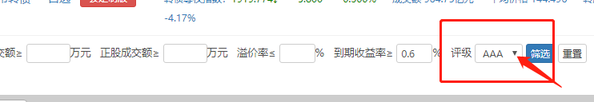

今天和大家分享下, 班班个人运用的可转债投资策略, 希望能对大家以后投资可转债有所帮助.

我个人投资可转债的经验是比较久的, 投资可转债的这几年里, 带给我的平均年化收益率有 20%+, 还是很可观的.

接下来我们进入主菜. 拿出我们的筷子, 啊不, 装备-电脑或手机.

先说工具, 我们用集思录这个网站来完成可转债的实操筛选. [集思录](https://www.jisilu.cn/)

我们先打开集思录, 并选择可转债

我们需要在集思录上选出 10 只以上到期收益率大于 0.6%的高评级可转债.

## 1、去掉可交换债, 到期收益率＞ 0.6

第一步, 我们在上图"到期收益率"那里输入 0.6, 然后取消"交换债"前的勾选, 最后点击筛选就可以了.

为什么选择 0.6 呢, 班班这里说一下: 因为集思录的设计问题, 这个到期收益率是到期税前收益率.

但实际上, 如果可转债没有强赎, 也没有违约, 我们最后拿到手里的钱, 是会被扣税的.

一般来说, 到期税前收益率会比到期税后收益率高大概 0.59%左右. 我们这里直接取 0.6

## 2、评级排序(选择 AAA 和 AA+)

那么第二步, 我们可以点击红框中的评级, 将可转债评级从高到低排序.

如果我们筛出的转债, 没有评级在 AAA 和 AA+以上的, 这时我们可以考虑先不投资可转债.

如果条件允许, 我们最好买入全是 AAA 的转债, 但是转债评级为 AAA 的公司非常的傲娇, 有几只满足条件就不错了.

因此, 我们退而求其次, 买入 AAA 和 AA+都有的转债组合.

## 3、到期税前收益排序选择

第三步, 根据到期税前收益率排序选择确定可转债.

先点击下图红框中的"评级", 选择相应的评级, 这里我们需要选择 AAA

再进行到期税前收益率排序(从高到低购买)

一共筛选有 5 个可以先记录下来(最后一个也符合), 个人经验可转债大于 110 元的我不会选择(我的投资偏保守)

再点击下图红框中的"评级", 选择相应的评级, 这里我们需要选择 AA+

满足要求有 10 个, 那么我们从到期收益从高到低选择和前面 AAA 级别凑够 10 个即可.

## 4、分档买入

分两档建仓买入

第一档是在到期收益率大于或等于 0 时买入一些可转债.

另一档是在可转债的价格低于面值时, 也就是低于 100 元的时候, 买入相同数量的同一只可转债(AAA 级可转债在价格低于 102 元或者 103 元时买入).

如果组合一次配不齐的情况下, 可以一步步的配齐.

## 5、卖出

接下来我们看买入之后, 什么时候卖出.

第一种: 卖出的条件并不复杂, 当我们持有的可转债满足强赎条件后, 我们就可以卖出了.

一般来说在 2-3 年达到 30%+的收益问题不大, 有的优质的转债会更快的. 等到强制赎回赚取 30%+的收益~

查看强制赎回两种方法:

1、集思录上看到可转债名字有红色的感叹号代表已经开始强制赎回, 把鼠标放在红色感叹号会显示最后交易日, 我们要在之前卖出.

2、遇到可转债价格上涨到 130 元, 我们就可以查看它的公告, 是否发起强制赎回. 公告可以在券商 app 上可看到.

第二种: 我们可以找到历史最高价并直接减去 10 元就马上卖出.

如果涨到 10%, 或者 15%了想卖出可以嘛?

自己设置止盈点去做买卖都可以的. 不过可能第二天就继续涨也客观存在, 这个都是有可能的.

如果卖了第二天涨了, 也不用后悔, 毕竟投资是一门概率学, 不是绝对的事情, 我们不可能做到次次买到最低点, 卖到最高点.

我们又不是神仙. 不过每次投资我们都做复盘, 这样就能提高我们下一次投资赚的更多的概率.

## 智能盯盘

主菜结束, 我们来点甜点.

我来设想一下大家的投资景象, 看看我有没有猜中.

第一次买的时候是不是有点小紧张, 生怕哪里点错了, 买的不对了.

有没有看手机频率比原来多很多, 闲下来就点开券商 APP 看一下.

平时买包包, 买化妆品, 买 AJ 都没心疼的, 现在跌一块两块就有点想被人掐了心头肉的感觉.

突然长个一块两块的, 开心的跟彩票中奖了一样, 觉得自己果断下手十分机智英明.

其实刚开始投资都是这样, 会忍不住盯盘, 如果可转债从 110 元盯到 130 元以上, 那我们与理财就是理生活的真理就违背了

现在教大家一个不用盯盘的方法.

我们可以设置智能盯盘~

如何设置呢?

我们输入代码后, 搜索到相应的可转债进入页面, 点击右下角的三个小黑点 我们就会看到智能盯盘的字样, 点击智能盯盘.

这里我们就可以设置买入价格提醒, 卖出价格提醒.

对于智能盯盘卖出价格提醒一般建议设置 130 元, 到 130 元以上可以关注强赎条款是否触发, 继而卖出.

以上就是可转债投资方法. 希望对你有用.

## QA

### 才发行没多久的可转债, 涨到 130 也有可能发起强制赎回?

【回答】这个属于新债发行期, 热度带动起来的上涨. 强制赎回也是有条件的哦.

强制赎回是上市公司的权利, 他们股东通过才会提出强制赎回的

不同的可转债触发的条款不一样哈, 我们可以在集思录上面看到

设定好智能盯盘, 价格上 130 就留意查下是否会被强赎

### 可转债和基金一样是一手吗?

对呀, 按照班班教的策略, 买一只大概是一千左右

### 按班班说的, 同只可转债要建两次仓, 相当于 1 只可转债大约 2 千左右

遇到合适价格可以分两档, 如果没有合适也就是一个, 这个得看机会呀~不是每个可转债都遇到两档机会, 分两档也是为了摊低成本

### 两档是每次都只能买一手还是可以随便买?

根据你投可转债资金调整哈~不要一下子全买, 不能重仓任意一个, 这样也是保守的操作

### 班班是建议最多 10 只么?

分散风险哈~有时候配不到 10 个哦, 那就慢慢配哈, 最多可以 20 个, 市场合适的时候, 我曾经配过 28 个的

10 个就类似一个组合啦~分散风险哈, 记得不要追高, 不要重仓任何一个哦, 按照班班这个办法~是比较保守的操作, 收益也不低~

### 就选 AAA 和 AA+这两种?

对, 评级太低担心出现信用问题哈, 虽然之前没有违规的, 但是不代表以后没有呀

### 资金大概占用多久呢

这个不好说哦~根据整体数据回溯一般投资时间在 2-3 年左右哈, 但是这个真的不好说

### 班班怎么等到 80 才入的本钢呢

之前本钢半死不活的, 但是半年就上涨 140 啦

当时我看到它一直跌, 但是我想了一下最差拿到回售也不亏呀, 都比货币利息高啦, 所以就补仓

不过可转债很是有不少人投机的, 所以刚刚开始还是按照我教的方法, 保守稳健点, 按照策略来, 即使运气不好, 大不了到期还有本金+利息, 高价买了, 是有亏损的风险的

所以大家投可转债也是要看市场行情的, 星大平时行情分析, 对于基金和可转债都是有帮助的, 因为知识都是相通的, 我现在教你们保守操作, 后面你们熟练就会融会贯通啦

### 广汇, 两档买入标准都符合, 那就直接买 2 手?

直接买入就好啦, 两档是看到低价为了补仓的, 如果一起买就起不到拉低成本的作用啦

### 班班, AAA 的 0.76, 107; AA+的 3.7, 104, 哪个更好?

优先评级高的哦~然后再看价格

### 到期收益率大于 0.6 是最低要求, 然后评级越高价钱越低越好?

因为到期收益率大于 0.6 刚好加上是扣税后的, 那就是收益大于 0, 就说明我们最差到期也是有本金和利息的

### 这个到期收益率是按买入的价钱算的还是按 100 元算的呢?

不是哈～这个到期收益率 0.6%还需要扣掉税大概是 0.5 左右, 那就说明我们筛选就是需要到期收益率大于 0 哦.

本金＋利息这个是可转债发行之前就固定好的, 也可以在集思录看到哈

不过利息是非常少的哦, 这个也是最差最差的结果

### 打新债中的是不是在上市前也可以在可转债里查到这些信息, 从而判断是否可以一直持有呢

上市前有部分信息看不到哈~

不过打新债本来就是为了短期赚钱哈, 如果实在不缺钱的可以看行情保留

### 意思是上市的时候可以卖掉, 然后如果是 3A 或者 AA+的我们可以视情况再买入?

对呀, 如果后面价格和筛选条件合适可以买入

### 那这些可转债也是可以像股票一样买波段?

短期操作做 T 是吗? 可以是可以哦, 风险比较大哈

按照今晚教的策略其实也不错的收获啦, 等以后掌握了再试试不同策略哈, 也不迟呀

### 多长时间筛选一次呢?

设置智能盯盘哈, 到达就卖出再筛选, 一切看自己的资金量操作哦
