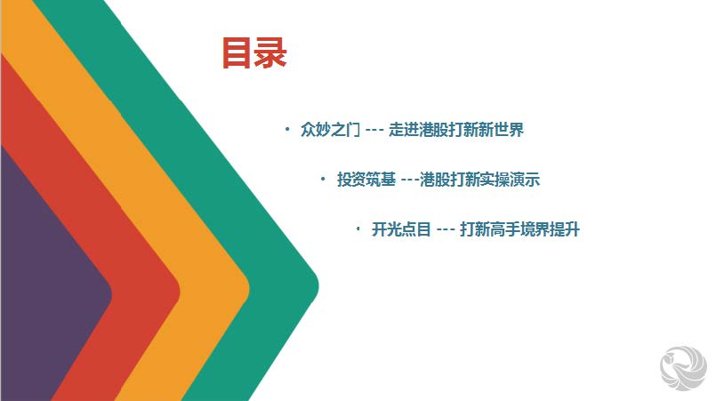

[开户链接](http://forclub.wutongtec.com/hkaccount/index.html?channelId=1000000235035)

[开户流程](https://docs.qq.com/doc/DYVN1dUJ5b3dldGdr)(开户前务必仔细阅读!!)

[入金流程和注意事项](https://docs.qq.com/doc/DYU1ZWmRHUHh5VG5y)(入金前务必请仔细阅读!!)

一入打新深似海, 从此节操是路人.

大家好, 欢迎各位韭菜来到港股打新第一章, 我是职业搬砖, 副业打新的小北.

在这里呢, 我将带着大家各种骚操作, 一起去学习打新的专业知识, 希望各位珍惜资源, 快乐学习.

今天的内容有湿有干, 我建议大家配上一杯 82 年的雪碧来细品!

为了方便大家回看, 我们的课程分享采取图片加文字的形式, 接下来的时间, 将由我来给大家分享港股打新的课程内容, 废话不多说, 我们直接开始, 干就完了!

港股打新对于很多同学来说都很陌生, 其实我参与港股打新已经好几年, 每年的打新收益率都保持在 30% 以上, 甚至有些年度会更多.

听到这里, 可能有些同学都惊呆了.

还没开始, 就开始吹牛逼了? 我不信!

哈哈哈, 原谅我的装逼, 像前段时间的思摩尔, 一个账户一手就赚了 2, 3 万

其实, 在任何行业都存在先吃螃蟹的人, 一个行业刚刚兴起的时候, 知道的人并不多, 这时候参与往往利润很高, 首先进入这个行业的人就属于敢吃螃蟹的.

但是, 随着知道的人越来越多, 越来越多的人涌入这个行业, 随着竞争的加剧, 整体的行业利润也会慢慢下降.

至于利润有没有我说的那么高, ⻛险到底大不大, 我们就通过下面的课程来一起学习.

我们先看下课程目录

在接下来的几节课中, 我们的课程会依次从认知、实操和分析三个⻆度教大家:

第一部分, 提升大家的认知, 让各位同学知道什么是港股打新, 港股打新有哪些特点, 以及它的投资规则.

学习了前面的课程, 那我们如何通过港股打新来赚钱呢?

很多同学依然不知如何下手操作, 那第二部分的课程就是投资实战啦! 我们会手把手教大家开通港股账户, 完成入金, 为我们的港股打新实操扫除障碍.

最后, 我们还有技能提升篇, 通过这一次的学习, 让大家知道如何选择新股, 怎样提高自己打新的中签率, 以及如何卖出新股, 让自己的收益更高, 从而提高自己的港股打新收益率.

总之, 课程干货很多, 大家记得好好做笔记. 那今天我们就开始第一课的学习, 这一节课的内容呢, 我会从这 5 个部分教大家:

## 第一部分, 到底什么是港股打新, 还有港股打新的优势是什么?

可能有些小伙伴参与过 A 股打新, 那就是一家公司在国内 A 股市场公开发行股票, 准备上市的时候, 大家可以参与新股的认购, 等公司成功上市了, 股票代码挂到证券交易所, 股票可以自由流通转让的时候, 再把认购的新股卖出获利, 这就是 A 股打新.

港股打新与 A 股打新非常类似, 但不同的是, 港股打新是认购在香港证券交易所发行的新股.

在香港联合交易所, 申请认购公开发行上市的股票被称为港股打新. 我们也可以说: 一家公司发行股票进行上市, 我们认购他股票的这个过程叫做打新, 然而这个又是香港的新股, 所以叫做港股打新.

相比国内来说, 香港的股票市场发展的时间更⻓, 比国内的股票市场更加成熟, 各项制度更加规范, 而且香港作为一个开放的金融市场, 能够吸引很多优秀的企业赴香港上市, 比如大家熟知的阿里巴巴、小米、美团都是在香港上市的.

首先呢, 我们先学习一下香港市场中, 一个股票的上市流程.

### 第一步—"递表":

如果企业在国内上市, 首先要经过证监会的审批, 而企业在香港上市, 首先要向港交所提出上市申请, 这个行为也就是我们所说的递表.

### 第二步—"聆讯":

港交所在接到企业的上市申请之后, 要对企业提供的材料进行审核问询, 也就是我们说的聆讯, 港交所要询问企业的经营情况, 财务有没有造假等等情况.

### 第三步—"路演招股":

在通过港交所的聆讯之后, 这时候企业就可以进行路演招股, 向投资机构和散户投资者兜售他们发行的新股.

### 第四步—"上市":

最后, 等发行的新股成功卖给投资人之后, 股票就可以在港交所挂牌上市, 自由交易了.

我们参与港股打新, 就是在企业招股的时候, 认购新股, 等上市之后卖出.

我们可以用一张图来总结这个流程.

以上就是港股打新的基本情况, 下面我们来讲一下关于港股打新的优势.

### 第一、中签率高.

A 股打新的收益很高, 基本上每只中签的新股都能翻倍, 但是中签率低的想死的心都有了. 大概只有万分之三的概率会中签, 换句话说, 在 A 股市场上打新 10000 次, 才有可能中签 1 到 2 次, 和中彩票差不多了.

而港股打新一手中签率 2021 年大概是 20%, 现在参与的人多了, 中签率在逐渐下降, 往年一手平均中签率都是在 50%以上. 即便如此, 如果认购一手, 大概有一半多的机会中签, 只从中签率上看, 港股打新秒杀 A 股了.

### 第二, 不需要持仓市值.

如果你想参与 A 股打新, 那你的股票账户在最近 20 个交易日, 要平均有 10000 元的股票市值才能参与.

而港股采取现金打新, 不需要市值就可以打新, 最少 5000-20000 港币即可参与申购, 对于投资者来说这几乎没有资金压力并且避免持仓股票所带来的波动⻛险.

### 第三、资金周转速度快

在港股市场, 从开始打新股到卖出, 只需要两周左右的时间, 而两周之后, 卖掉新股就能立刻回笼资金申购其他新股, 所以我把它总结为资金周转快, 利用率高.

### 第四, 新股数量多, 相应的打新机会也很多

香港作为全球化的金融市场, 过去 10 年, 募资规模有 7 年领跑全球, 我们做了一个统计, 2016 年总共上市 120 家, 2017 年上市 161 家, 2018 年上市 218 家公司, 在 2019 年就上市 162 家, 2020 年有 142 家, 除去非交易日, 我们算一下, 它保持着 2 天就有 1 只新股发行的水平, 也就是说你有更多的机会能在港股打新中中签;

因此香港这块 IPO 投资市场会非常大, 所以大家不用担心自己错过一两只新股而感到沮丧, 毕竟打新是一场⻢拉松, 不是百米冲刺, 今年你依然有很多机会.

在了解了港股的这些优势后, 有的同学就很激动了, 要赶紧冲进去赚钱了, 但是且慢, 做投资需要一个完善的分析框架, 在加入港股打新之前, 我们还要搞清楚下面这几个问题.

那下面进入我们今天课程的第二部分:

## 港股打新和 A 股打新有哪些区别呢?

这个问题, 我们可以从五个方面来理解.

### 第 1 点, 在定价方式上

A 股打新是会采取限价的行为, 他一般不会超过 23 倍的市盈率, 市盈率呢, 是最常用的一种估值指标, 可以从公司盈利的⻆度, 去衡量股票的价值. 而港股打新呢, 它是由市场定价, 只要有人认购, 即使亏损的公司也可以发行上市.

### 第 2 点, 在申购数量限制上

A 股会根据持有市值对应的配额信用进行申购, 当你持有股票总市值越多的时候, 你能够申购的数量才越多, 也就是说并不是你花更多钱打新, 就能申购更多股票; 但是在港股打新里面, 我们可申购的数量就很自由, 甚至哪怕你没多少钱, 也可以使用融资认购的杠杆, 最高至 20 倍.

### 第 3 点, 关于交易规则上

A 股新股上市后有 10%的涨跌幅限制, 涨跌没法一次到位; 港股打新的就有比较大的区别了, 它的上市一般是不设涨跌幅的, 而且 t+0 交易, 流动性更好, 上市的首日的换手率最高可达新股发行股份的 100%.

### 第 4 点, 关于中签率方面

A 股打新的中签率一般是非常非常低的, 平均的只有万分之三, 一万个人里只能有 3 个人中签. 可以想像一下, 你持有 10 万市值去坚持不懈的打新一年, 都不一定会中签, 竹篮打水一场空是常事. 这时候港股打新的中签率的优势也就凸显了出来, 因为它的中签率非常高, 那么如果你是使用融资认购几十手上百手呢, 它的中签率呢, 则会更高, 但是这样资金利用率就很低

后面第三节课中, 我们也会详细跟大家讲如何提高我们的中签概率, 还能让我们的资金利用率也高的独家小秘诀.

### 最后一点, 交易时间上

A 股打新时间只有 1 天, 过时不候. 而港股打新时间则⻓得多, 一般会有 3-6 个自然日. 而从申购截止日到上市日大概还有 7-12 个工作日. 但是港股打新是预先缴款, 如果没有打中, 未中签的资金会退回, 打新资金需要一两周时间才能退出. 所以港股账户里最好多留点资金, 方便资金冻结期间, 有其他新股上市时, 还有钱可以继续申购, 一般一个账户留个 2-3 万港币就基本够用了.

这么一比较, 大家有没有发现, 港股打新的优点确实很多呢? 不过天下没有免费的午餐, 在交易⻛险上, 港股和 A 股还是有很大区别的. A 股的新股呢, 只要你中了, 它基本上是稳赚的, 无非就是中不了的问题. 相比较 A 股新股基本的稳赚不赔, 而港股却会出现新股破发的情况, 破发也就是跌破发行的价格.

新股破发的原因有很多, 可能是上市价格定价太高, 可能是某一段时间市场行情不佳, 可能是股票的质地太差, 投资者不买账.......

不过, 我们常说——不要为了一棵树, 而失去整个森林. 港股打新也是类似, 不要因为有些票可能会小亏出局, 就忽视了总体盈利的情况, 只要我们能做到大赚小亏, 这个投资方向就是正确的.

另外一点, 在进行投资的同时, 我们也可以通过对市场经验的总结, 基于一定策略有选择性的申购, 规避一些容易破发的股票, 这样我们就可以提升收益率, 减少亏损, 这也是今天我们要学习这⻔课的原因.

那通过这几部分的学习, 大家应该对港股打新的优缺点都清楚了, 接下来我们就要学习, 下一个知识点,

### 港股打新的收益, 从哪儿来呢?

我们做投资, 还是看的是期望收益率, 打新的话, 收益计算可以用一个比较简单的公式总结:

单次期望总收益 ≈ 中签概率\*金额\*个股收益率.

先说结论: A 股的中签率低, 但是中签后平均收益高; 而港股中签后平均收益会低于 A 股, 但是中签率要高很多.

下面我们来聊一聊大家最关心的部分就是港股打新能赚多少钱呢? 太久远的数据意义不大, 我们从最近三年(2018-2020 年)来大概分析一下:

从月份上看, 除了 1 月, 2 月, 8 月稍有亏损外, 3 月至 5 月港股打新的行情就十分火爆了.

需要特别提到的是, 2020 年上半年港股打新单账户收益之王就是沛嘉医疗, 有着 8%的中签率, 15000 的入场费, 70%的涨幅.

2021 年同样也有新股创造了收益记录.

我们来看一下 2021 到上半年新股情况. 2021 年 3 月份新股也经历一段时间的破发潮, 主要是因为大势震荡, 新股迎来了价值重估, 所以打新对于选股还是很重要的. 从数据上来看, 新股首日获得上涨的比例还是很高的.

| 名称          | 上市日期  | 发行价 | 发行市值 (亿) | 一手费用 | 一手中签率 | 首日收盘涨幅 |
| ------------- | --------- | ------ | ------------- | -------- | ---------- | ------------ |
| 时代天使      | 2021/6/16 | 173    | 285.45        | 34600    | 1.50%      | 131.79%      |
| 中原建业      | 2021/5/31 | 3      | 98.86         | 6464.49  | 30.00%     | -11.81%      |
| 京东物流      | 2021/5/28 | 40.36  | 2458.57       | 4379.7   | 8.00%      | 3.32%        |
| 新希望服务    | 2021/5/25 | 3.8    | 30.4          | 4747.37  | 50.01%     | 0.53%        |
| 顺丰房托      | 2021/5/17 | 4.98   | 39.84         | 5212     | 60.01%     | -16.47%      |
| 兆科眼科-B    | 2021/4/29 | 16.8   | 89.91         | 8484.65  | 25.00%     | -14.76%      |
| 携程集团-S    | 2021/4/19 | 268    | 1695.67       | 16817.7  | 35.00%     | 4.55%        |
| 联易融科技-W  | 2021/4/9  | 17.58  | 398.08        | 9232.11  | 20.00%     | 9.90%        |
| 盈汇企业控股  | 2021/3/31 | 0.56   | 5.6           | 2828.2   | 30.00%     | -41.07%      |
| 百融云-W      | 2021/3/31 | 31.8   | 157.5         | 16060.2  | 10.00%     | -16.04%      |
| 美佳音控股    | 2021/3/31 | 1.26   | 6.3           | 2727.21  | 40.00%     | 6.35%        |
| 哔哩哔哩-SW   | 2021/3/29 | 808    | 3048.66       | 19959.1  | 10.00%     | -0.99%       |
| 智欣集团控股  | 2021/3/26 | 1.5    | 11.22         | 12120.9  | 10.00%     | -29.33%      |
| 百度集团-SW   | 2021/3/23 | 252    | 7005.66       | 14898.6  | 15.00%     | 0%           |
| 汽⻋之家-S    | 2021/3/13 | 176.3  | 890.04        | 25433.7  | 35.00%     | 2.10%        |
| 久久王        | 2021/3/16 | 0.75   | 5.94          | 3787.79  | 9.00%      | -26.67%      |
| 广联工程控股  | 2021/3/11 | 0.54   | 5.4           | 2727.21  | 4.70%      | -22.22%      |
| 朝云集团      | 2021/3/10 | 9.2    | 122.67        | 4646.35  | 50.00%     | -13.15%      |
| 赛生药业      | 2021/3/3  | 18.8   | 127.44        | 9494.72  | 3.00%      | 0%           |
| 昭衍新药      | 2021/2/26 | 151    | 408.88        | 15252.1  | 5.00%      | -8.61%       |
| 环联连讯      | 2021/2/19 | 0.56   | 5.6           | 2240     | 15.00%     | 26.79%       |
| 诺辉健康-B    | 2021/2/18 | 26.66  | 111.43        | 13330    | 2.00%      | 215.08%      |
| ⻉康医疗-B    | 2021/2/8  | 27.36  | 72.96         | 13680    | 10.00%     | 1.24%        |
| 健倍苗苗      | 2021/2/5  | 1.2    | 10.72         | 2400     | 8.00%      | 80%          |
| 快手          | 2021/2/5  | 115    | 4724.42       | 11500    | 4.00%      | 160.87%      |
| 心通医疗-B    | 2021/2/4  | 12.2   | 288.67        | 12200    | 7.50%      | 54.26%       |
| 星盛商业      | 2021/1/25 | 3.86   | 38.6          | 3860     | 1.29%      | 6.20%        |
| ⻨迪卫康      | 2021/1/19 | 3      | 6             | 2400     | 15.00%     | 26.33%       |
| 宋都服务      | 2021/1/18 | 0.25   | 8             | 2500     | 12.50%     | -36%         |
| 现代中药      | 2021/1/15 | 1.18   | 7.08          | 3540     | 10.00%     | 6.78%        |
| 稻草熊娱乐    | 2021/1/15 | 5.88   | 38.99         | 5880     | 6.00%      | 83.67%       |
| CHESHI        | 2021/1/15 | 1.23   | 14.81         | 4920     | 0.43%      | 21.95%       |
| 医渡科技      | 2021/1/15 | 26.3   | 237.16        | 2630     | 20.00%     | 147.91%      |
| LEGION CONSO  | 2021/1/13 | 0.4    | 5             | 2000     | 1.09%      | -12.50%      |
| 达丰设备      | 2021/1/13 | 1.73   | 20.19         | 3460     | 10.00%     | -8.67%       |
| 裕程物流      | 2021/1/13 | 0.74   | 2.22          | 3700     | 15.26%     | 17.57%       |
| DEYUN HOLDING | 2021/1/13 | 0.4    | 5.04          | 2000     | 10.00%     | 3.75%        |
| 中邦环境      | 2021/1/6  | 2      | 5.5           | 4000     | 13.50%     | 2.50%        |
| 新纽科技      | 2021/1/6  | 4.36   | 34.88         | 3488     | 16.00%     | 0.92%        |

我们再来看一下港股打新过往的收益情况.

下面这张图片为大家展示了 2019 年港股打新的收益情况.

通过这张图片我们可以看到, 2019 年香港全年一共发行了 162 只新股. 根据不同的卖出时间, 申购新股帮我们赚到的收益分别是 22779 港元, 22783 港元, 28003 港元.

如果你投入 30000 港元进行打新, 扣除打新手续费和交易成本之后, 按新股上市首日收盘卖出的利润来看, 2019 年港股打新的收益率是 57%. 右边的柱状图, 就是我们统计的 2019 年各个月份港股打新的收益情况, 虽然有些月份收益是负的, 但是绝大多数月份收益都是正的.

总体来看, ⻛险并不大, 而且操作很简单, 只需要在发行新股的时候买入, 在新股上市的第一天卖出即可. 不用像炒股那样, 必须具备非常专业的财务知识或者技术分析能力才行, 打新完全可以无脑买入和卖出.

我们再看一下更早的数据, 2018 年是公认的全球大熊市, 在 2018 年发售的 204 只新股中, 68 只破发, 136 只上涨, 和 A 股新股比这个破发率似乎有点高, 很多人也是因为这个数据被吓住, 觉得港股新股不赚钱, 但假如你每只新股都申购, 累计权益收益率+270.26%.

因此, 在港股打新中, 虽然会有破发情况出现, 但只要在我们实际的操作中, 能主动的排除那些基本面有大问题、大概率破发的新股, 打新都是一件能赚钱的稳健套利行为, 这也是我的港股打新体系的胜率保持在 85%左右的原因.

那, 我们已经把能不能赚钱的问题讨论清楚了, 下面, 我们就进入第 4 部分的学习, 我们再看看我们赚的是谁的钱?

## 赚的是谁的钱

其实, 港股打新主要是赚三方面的钱.

### 1. 赚上市公司的钱.

因为香港新股定价, 采取的是市场机制, 上市公司的股价会定一个招股价区间, 如果定的价格太高, 投资者不买账不认购, 就会发行失败, 所以上市公司在进行招股价定价时, 一般会取一个中等或者是中等以下的价格进行发行, 因此我们就可以赚到一定的差价, 大概二三十个点.

### 2. 赚保荐人的钱.

这一块具体来说主要赚保荐人护盘的钱, 这个怎么理解呢.

上市公司发行新股的时候, 一般会给保荐人一个多增发股份的权利, 这个权利叫做超额配股权, 也就是绿鞋机制.

如果新股发行后价格下跌, 跌破发行价的时候, 保荐人就会在市场上大量买入破发的股票, 把股价重新拉上去, 起到稳定股价的作用

所以对有绿鞋机制的新股来说, 下跌的幅度有限, 上涨的幅度没有限制, 性价比很高, 这也是港股打新能赚钱的逻辑之一.

关于绿鞋机制, 在后面的课程中, 我们还会详细给大家介绍.

### 3. 赚炒新股人的钱.

由于新股上市之后, 上涨的概率很大, 有很多没有中签的散户, 可能就在二级市场上买入这只股票, 我们把他们叫做炒新股的散户.

如果行情很好的时候, 新股的涨势不错, 会有很多的散户去追高, 哄抬股价.

这个时候我们的新股一开盘, 股价就会不断的拉高. 我们打新的时候, 是按成本价购买的, 而上市后可以按市价卖出, 这就会产生很大的价差, 这是新股赚钱的第三个原因.

所以, 为什么港股打新能赚钱, 背后的原因也不难理解了.

因为新股要完成发行, 总是需要吸引投资者人认购, 那么在一级市场和二级市场之间, 就一定会留有一个可以获利的差价, 即便某些新股可能破发, 但总的来说, 一定会是盈利大于亏损, 这样新股发行才能正常运转.

想明白这个道理, 就知道我们应该港股打新的理由了.

好了, 讲了这么多, 相信小伙伴们对港股打新已经有一个全面的了解了, 那今天的最后一个部分, 我会依次和大家说说, 港股打新里的这些基本名词.

## 基本名词

### 第一个词是入场费:

它指的是申购一手该新股需要的资金, 港股里不同股票它每手的数量不一样, 一手有 50 股, 100 股, 1000 股都是有可能的; 每个股票的入场费在券商 app 里也是可以看到的;

这里有一个公式大家可以记一下, 公开市场认购新股的入场费=申购价格上限\*一手股数+中签费+认购手续费.

说白了, 就是你申购一个新股的最低费用.

我们就拿京东举例, 京东的入场费=定价上限 236 × 一手股数 50 + 中签金额的 1.0077% + 认购手续费,

也就是 236×50+236×50×1.0077%+认购手续费=11918.91 港币.

这里认购手续费因为通过开户链接开户的部分券商, 是不收现金认购手续费的, 所以在这里我们没有加上具体数值

### 第二个词是暗盘;

这个词, 大家听起来可能有点地下交易的意思, 其实没那么神秘.

暗盘就是在新股公布中签当天下午 16:15 分, 投资者可以进行暗盘交易, 提前卖出新股或者买入新股.

而 A 股是没有暗盘交易的, 中签的新股只能等到上市日才能卖出.

暗盘的主要意义在于提前知道新股的受追捧程度, 暗盘常被比喻为打新党的救生圈, 在新股不太受欢迎时, 打新党可以通过暗盘提前止损, 小亏出局;

暗盘交易不是通过交易所系统, 而是某些大型券商自行设立的, 针对自己的客户的内部交易系统. 总体来说, 暗盘给打新投资者多提供了一个卖出机会.

### 第三个词, 什么是融资/现金认购呢

现金认购就是使用账户里的现金认购, 刚刚我们按照公式计算完京东的入场费, 如果你想现金认购, 那意味着你的账户里就至少要有 11918.91 港币, 当然不包括券商需要收取的手续费.

融资打新就是香港市场所说"孖展", 即杠杆交易, 跟券商先"借钱", 想要提高中签率和中签数量, 可以进行融资加杠杆认购.

券商"借钱"给你打新, 是要收息的, 一般在年化利率在 1%-3%之间, 而且每次都要收取 50-100 港币不等的手续费.

目前绝大多数券商可以提供 10 倍的融资认购, 比如你的账号里面有 1 万现金, 那么券商最高可以借给你 9 万, 这样你就可以认购 10 万资金的新股了.

这个也是港股打新的魅力之一, 不过杠杆是吧双刃剑, 新手我们一般不建议使用哦, 大家还是一步步来, 求稳;

目前认购火爆的大市值股票是可以适度使用融资认购的, 新人资金不多时, 如果能利用好一手融, 那么事半功倍!

但冷⻔股慎用杠杆!

冷⻔股慎用杠杆!

冷⻔股慎用杠杆!

重要的话说三遍

### 第四个词, 冻结资金.

什么情况会冻结资金呢? 通过港股账户打新, 认购资金将于认购截至日当天 16:00 开始被冻结, 等到新股中签公布日的时候, 如果中签, 则扣除, 换成等值的股票到你的股票持仓里; 如果不中签, 资金就会退回我们的账户里.

冻结天数为 8-15 天, 如果融资, 就是会产生 8-15 天的利息.

### 第五个词, 修改/撤销新股申购

与 A 股打新不同的是, 港股打新在新股申购截止期之前都可以修改或者撤销, 大多券商不收取费用, 少部分同意撤销也会收取利息! 所以融资打新下单需谨慎, 买定离手!

注意, 港股打新一般于截止日 16:00 结束申购, 融资会提前结束申购, 有的券商也会提前截止现金认购, 部分券商融资打新也是不支持撤销哦, 具体以各大券商 app 上的截止日期为准.

### 第六个词, 招股区间.

大家在接下来认购新股时, 一般都会看到新股的招股的价格是一个区间, 也就是我们行内话叫做新股发行价格区间: 香港新股的发行价在申购的时候只是确定了一个价格区间.

比如最近上市的康方生物-B 定价区间每股发售价 14.88-16.18 港元, 最终由于机构认购火爆所以发行价定的是 16.18 港元; 划重点: 通常定价的高低与新股首日表现无特别的关系, 热⻔股上限定价很正常, 但是需要警惕冷⻔股上限定价, 可能就是来割韭菜的;

### 最后一组词, 公开认购, 国际配售, 回拨机制

公开认购就是大部分散户认购新股的过程, 一般而言新股发售份额的 10%是留给公开市场的散户/大户认购的, 其余 90%是留给机构等通过国际配售参与认购的; 上面讲的新股发行公开认购和国际配售的比例是 1 比 9, 但发行机构会根据公开认购的热度进行调整, 这个调整过程就叫回拨.

关于回拨的知识点就更多了, 这个在后面课程中进行详细讲解.

好啦, 同学们, 在第一节课中, 关于港股打新的一些基础知识我们就先介绍到这里, 在第一部分的学习中, 我们从收益率, 安全性, 操作难度的⻆度, 对港股打新有了一定的了解.

明后天, 我们会继续学习港股打新的更多知识, 大家记得准时来参加哦.

## 课后总结:

今日学习内容: 港股打新第一章

主要知识点:

1. 什么是港股打新
2. 港股打新与 A 股打新的区别
3. 港股打新的收益率分析和收益来源
4. 港股打新的常用名词: 入场费、暗盘、融资/现金认购、冻结资金、修改/撤销新股申购、招股区间、公开认购/国际配售/回拨机制

## QA

### 怎样知道会不会破发, 冷门股不太理解

新股是否破发, 在新股暗盘和上市之后我们就能看到, 一旦新股跌破发行价, 我们就称之为破发, 冷门股第三节课我也会给大家讲的, 可以理解为冷门行业的新股

### 可以通过数据分析港股打新之前就了解这只新股质地吗, 比如这个新股质地不太好, 那么可以事先规避这种风险?

可以, 在新股开始认购的时候我们会给大家发新股分析, 从各个方面给大家分析这只新股, 同时我第三次课也会给大家讲如何分析一只新股的, 稳稳的赚钱

### 融资认购具体是怎么个操作? 融资的前提条件是什么? 在 APP 软件就能操作吗?

融资认购的话在 APP 就可以操作, 在认购新股时会让你选择现金认购还是融资认购.

融资认购又分为一手融资和正常融资, 正常融资的话最低会需要咱们有一手的现金才能融资, 而一手融的话是指当我们不足一手的现金时, 可以通过融资来获得足够一手的钱进行认购, 具体的融资需要的现金门槛的话具体在每只新股的融资认购界面就可以看到

### 预先缴款如果不中全部返还吗? 还是要扣手续费之类的费用

预先交的款分为申购价格上限\*一手股数+中签费+认购手续费, 认购手续费是只要认购就会收取的, 如果没有中签, 会返还申购价格上限\*一手股数的钱和中签费.

中签费是中签之后才收取的, 咱们开户链接里面的券商, 很多现金打新和融资打新不需要认购费, 所以不用交认购手续费, 稳稳的幸福

费用主要会有认购费、中签费和交易佣金、平台费等等

认购费是认购新股的时候券商就会收取的

中签费是新股中签之后才会收取的, 其中, 经纪佣金为 1%是经纪公司所收取、交易征费 0.0027%是香港证监会收取、交易费 0.005%是香港交易所收取

交易佣金是大家在暗盘或者上市后卖出新股时券商收取

平台费是使用券商平台交易时收取的

通过开户链接开户的话不会有开户费和账户管理费, 而且部分券商也会有打新相关的费用优惠, 但是大家还是要清楚可能会产生哪些费用哈, 在选择券商的时候费用也是考虑的一个重点

### 融资的利息是从借那天开始到上市卖出这天归还结束吧, 包含冻结期

是的, 所以一般融资认购的话大家一定要注意融资认购的截止时间, 买定离手

### 所谓的一手, 是不是每个股票发行的每手数量都不一样呀?

是的, 课程里面给了大家公式, 每只新股的一手股数是不一样的, 常见的有 500 股, 1000 股

### 融资就是券商借款给股民打新对么? 需要查征信么?

是的, 融资打新就是我们跟券商借钱, 一般不需要查征信, 因为对于散户来讲我们一般融资的钱比较少, 而对于一些大户, 融资的话可能会需要其他的抵押物, 这个大家在开户的时候应该就注意到了

### 认购手续费是需要领优惠券还是直接免了? 还有什么新手福利是要去领的吧?

有的券商是直接免费, 有的券商是给的优惠券, 有的券商是开会员之后免费, 这个可以在我们的开户链接和券商 APP 里面看到

### 暗盘交易, 大多数券商都有这个系统吗?

是的, 咱们绝大部分的券商都是有暗盘的, 大家可以在开户链接里面的券商详情里面看到, 明天晚上我也会给大家讲如何去看一家券商的

### 怎么选股对打新有利? 怎样有选择性的申购? 有什么策略?

正常我们判断一只新股是否值得打, 会主要看几个方面: 所属行业、质地、基石投资者、保荐人等等, 这个我会在第三节课给大家讲, 不用着急

### 融资可以多打港股, 但是不中又有利息, 什么情况下适合融资实现利益最大化?

一般融资利息是能够接受的, 融资认购也是提高了中签率, 一般我们在新股质地比较好, 非常值得认股时才使用融资打新

### 新股要完成发行, 一级市场和二级市场之间, 就一定会留有一个可以获利的差价, 即便某些新股可能破发, 但总的来说, 一定会是盈利大于亏损, 这样新股发行才能正常运转. 这是不是就是说即使新股破发也是稳赚?

这里盈利大于亏损是总的来说, 是一年里面所有的新股收益和亏损放一起看. 而对于单只新股, 破发就代表亏损, 新股破发的因素很多, 不仅仅是有没有留获利的空间

### 特别看好的新股, 是否也可以上市后继续持有博取更大利益的操作, 还是因为港股涨跌限制和 A 股不同, 而不需要这样操作或者风险太大.

理论上可以继续持有, 甚至长期持有, 但是我们是打新股, 所以一般建议大家在暗盘或者上市首日卖出落袋为安, 后续这只票的涨跌和什么时候涨跌是无法预计的

### 之前蚂蚁集团上市我有朋友中签了, 然后被暂停上市了, 港股会不会也有这种情况, 中签了没上市成功资金会比较快退回来的吧

蚂蚁上市被临时暂停是属于特殊情况, 特殊情况无论是 A 股、港股还是美股都无法避免, 这个基本上不在咱们正常的考虑范围内, 一般正常递表、聆讯的公司是能够正常上市的

### 赚上市公司的钱里所说的"赚到的差价"是怎么赚到的? 是不是和二级市场卖出赚到的差价指的是同一个东西?

是的, 这里的差价就是发行价和实际价值的差距, 如果发行价定价太高, 那中间没有差价, 就可能会影响新股的认购

### 如果通过暗盘知道新股不太受欢迎, 如何卖出止损? 不太受欢迎的话不会遇到没有人接手的情况吗?

暗盘主要是看新股的走势, 如果走势一般或者走势不好, 可以考虑在暗盘或者上市首日一上市就卖出, 这里卖出的话会涉及到设定多少钱卖, 需要根据实际的情况来看, 如果价格设置不合理, 确实会存在卖不出去的情况, 所以设置卖价也需要考虑实际价格情况

### 港股打新融资认购不中的话, 也要收利息吗?

是的, 融资认购如果不中的话也是要收取的, 但是比较少, 一般融资打的话中的概率是比较大的, 因为都是融资打多手了

### 多个账户打新会不会重复中签的呀?

不存在重复中签的问题, 港股打新本来就可以中多手的; 这个不像新债, 一般只能中 1 签, 港股打新是可以中多手的, 也就能够赚更多的钱

### 请问融资利息怎么计算, 3%是年息吧, 按日计息怎么计算? 按复利么?

3%是年息利率, 用多少天收多少天利息, 这个不用咱计算, 你申购时 APP 会将需要的利息都给算好体现出来呢.

计息分为两次, 一次是你融资认购直接收取, 这一笔是这样的, 比如你融资了 10w 那么就是这十万先计息一次, 这一次时间是认购截止后到上市公布日这段时间, 这里是直接收钱, 第二次是中签后, 如果你的中签金额大于你自身资金, 那么开始二次计息, 这次计息是一直计息到你卖出

### 中签金额大于自身金额, 这里的中签金额和自身金额指的是什么?

中签的金额不会大于你申购的金额的, 一般如果热门票你申购多手能中一手都是好运气呢.
