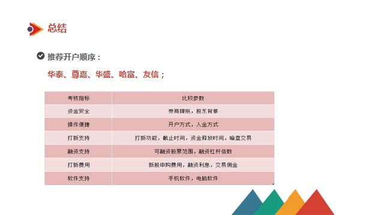
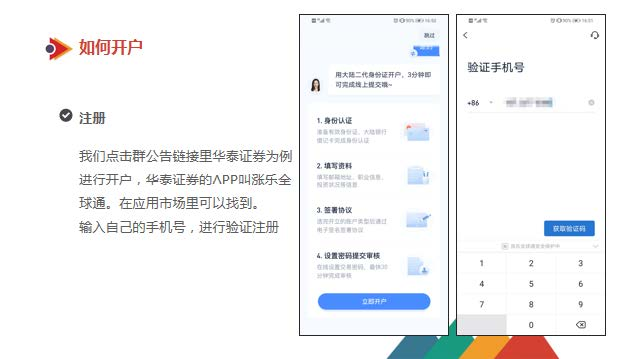
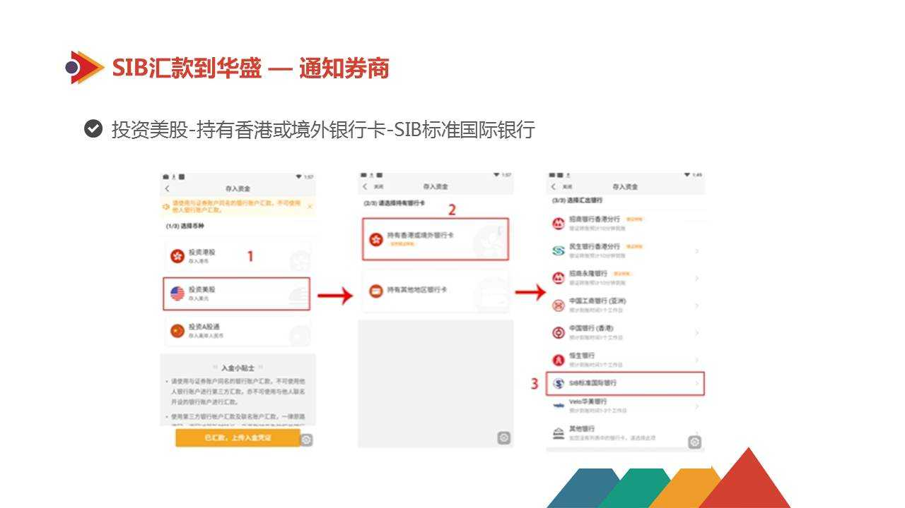
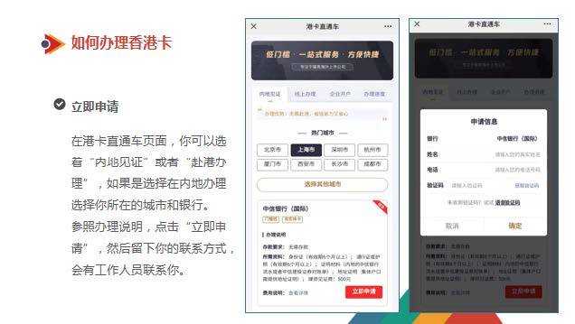

一入打新深似海, 从此节操是路人.

各位韭菜大家好, 我是职业搬砖, 副业打新的小北, 这里是港股打新第二章, 今天我们讲券商开户、 出入金以及港卡办理, 今天是我 3 天的课程中最不想讲的一节课.

干, 实在太干了, 这节课我建议大家准备一桶农夫来细品吧, 没事润一润...

我们先来回顾一下上一节课的内容;

我来问大家几个问题, 大家可以自测一下, 能不能都答出来

第一, 港股打新和 A 股打新相比, 有哪些优点?

第二, 港股打新到底赚的是谁的钱?

第三, 港股新股比 A 股多了一个交易时间段, 叫做什么呢? 什么时候开盘呢?

如果你答不上来的话, 记得赶紧回去复习一下昨天的课哦.

今天给大家带来的内容是港股打新的实操环节, 在这一节课中, 我会手把手教大家如何操作港股打新, 如何开户入金, 以及打新流程的完整演示.

学完今天的课程呢, 大家能掌握 4 块知识:

第一, 什么是券商? 我们该如何选择券商?

第二, 选好券商之后, 怎么开通券商账户?

第三, 讲讲大家最关心的问题: 如何把资金转到你们自己的券商港股账户

第四: 最后一步呢, 当大家已经赚到盆满钵满的时候, 想把钱拿出来的时候, 如何把钱转出券商账户

今天的内容实操性很强, 咱们一定要认真听课, 做好笔记.

## 第一步, 就让我教下大家怎么选港股的券商.

首先, 我们要参与港股打新, 必须要在香港券商里开一个港股账户.

香港券商呢, 也就是持有香港证监会券商牌照的正规券商, 这样可以受香港证监会法律监管保护, 资产托管在中央结算所, 现金账户还享有中小投资者基金的保险保障, 50 万港币以内可以全额赔付.

我知道, 有些小伙伴会在大陆券商开户, 然后用沪港通和深港通, 也能买卖港股, 相当于是有了港股账户的部分功能; 但是要注意, 沪港通和深港通都没法进行新股认购, 所以光有大陆券商账户是远远不够的.

子曰:"工欲善其事, 必先利其器", 在我的港股打新之路上, 期间用过券商不少, 比如辉立、富途、尊驾、玖富等等, 不一而足.

最初我认为券商是同质化的, 区别不大. 但后来, 在实际交易的过程中, 才发现券商之间, 佣金、功能和服务有云泥之别, 对投资的影响也非常大.

比如, 有的券商打新手续费就偏低, 有的券商有充足的孖展额度可以预约, 有的券商能提供方便的服务, 可以随时解答我交易中的各项问题.

总的来说, 我们合作的香港券商有 40 多个, 怎么选一个安全性高、操作方便、融资快捷的券商, 赢在起跑线上, 对打新很重要.

通过我这么多年的经验, 我给大家总结了这么几点.

### 1. 牌照.

大家在选择港股券商的时候, 必须要选择持牌券商, 持有香港证券牌照的券商受香港证监会保护, 如果券商安全性受到威胁, 或者破产导致投资者的本金遭受损失时, 香港证监会下辖的投资者保障基金, 可以为每位投资者赔偿最高 50 万本金的赔偿金.

### 2. 费用.

我们打新选择券商时要选择佣金费用低, 最好是现金打新免费的券商, 这样会降低我们打新过程中所产生的成本, 比如说尊嘉证券.

### 3. 额度.

我们还要看, 券商的融资额度够不够多, 利息是否够低, 当我们认购入场费高的新股时, 或者遇到扎堆新股上市要招股的时候, 我们的账户里资金不够, 就可以使用融资啦. 融资额度能够给 30 倍杠杆的券商, 推荐华泰证券, 另外活动期间华泰证券打新免手续费.

除此之外, 也需要看券商覆盖股票多不多, 融资杠杆倍数高不高, 资金释放速度快不快, 截止认购时间是不是更宽裕, 有无暗盘等等.

### 最后一点, 暗盘交易.

我们在选择券商时, 最好选择有暗盘的券商, 因为有暗盘的券商, 在新股破发的时候, 我们可以提前卖出止损, 从而把损失降到最低, 避免等到首日股价进一步下跌, 从而遭受更大的损失, 比如华盛证券不仅有暗盘, 而且暗盘费用更低哦.

当然, 如果你觉得指标太多, 懒得比较, 我帮你做了系统的分析, 直接推荐你一个开户顺序: 华泰、尊嘉、华盛、哈富、友信;

让大家开户的四家券商呢, 是目前支持大陆卡入金的券商, 优先入金华泰、艾德、华盛、老⻁

这几家券商的融资额度、开户入金速度和体验感都很不错, 都是打新利器.

当然, 除此之外, 还有非常多的优质券商值得我们使用, 大家打开微信群公告内的链接就可以看到哦.

这里我也帮大家做了一张表, 大家可以参照上面的指标一一对照.

上面讲到了如何选择券商, 好啦, 事不宜迟, 接下来我们来看下如何开通港股券商账户.

## 如何开通港股券商账户

这里需要提醒小伙伴, 开券商账户一定要从我们老师给出的链接里操作, 我帮大家争取到了很多独家权益, 这些都是直接在券商官网开户, 没有办法拿到的福利.

接下来, 我们就以华泰证券为例, 手把手带着大家开通属于自己的香港证券账户.

第一步, 点击群公告链接里的华泰证券进行开户登记并下载 APP, 输入自己的手机号, 进行验证注册.

第二步, 填写自己的基本信息, 工作信息, 大陆银行卡信息.

在这里, 大家要注意两点:

首先, 填写的地址要精确到的楼层和⻔牌号

其次, 一定要确保自己填写的邮箱地址是正确的, 因为后期的账户密码, 每天的结账单, 都会发送到你填写的邮箱里.

第三步, 填写财务信息

然后根据开户提示, 做一下活体检测, 确认是你本人在操作. 填写投资状况.

这个是任何金融机构都要做的, 即便是我们去银行买理财产品, 银行的客户经理也会给我们一个⻛险提示.

选择账户类型, 这里有一个重点, 大家千万不要弄错了: 记得选择融资账户;

当我们遇到新股入场费太贵或者遇到新股扎堆招股时, 我们账户里资金不够的时候, 可以使用融资认购.

接下来就是⻛险披露, 电子签名.

最后, 设置交易密码并提交, 就可以啦.

全部的开户流程已经走完啦. 需要等待券商进一步的审核, 一般 1-2 个工作日, 就可以开通证券账户了.

开户成功后, 券商就会把交易账户信息和汇款子账户信息通过邮件发给你.

那接下来, 进入我们今天的第三部分, 资金怎么转入券商账户呢?

## 资金怎么转入券商账户呢

重点强调:

课程内的账户、地址等信息都是举例的, 不能作为大家实际操作入金的时候的内容填写, 大家入金是应该按照自己个人的子账户的信息进行填写!!!!

在我们开通了证券账户之后, 我们还需要往账户里面存入一定的资金, 才能参与港股打新.

在这里我们先解释一下什么是入金和出金:

1. 入金就是往券商账户里面存钱打新.

2. 出金就是把券商账户里面的钱转出来.

那么在入金之前, 先和大家说一下该入多少钱:

在这里, 要跟大家强调的是, 虽然港股打新需要的资金并不多, 大多新股只需要 3000-5000 港币, 但是在入金的时候, 建议每个账户入金 20000-30000 港币.

这是因为如果赶上新股密集的发行的时候, 能确保你账户里面有充足的资金, 参与所有的港股新股认购.

不过, 从资金利用率的⻆度考虑, 大家也不用入金太多, 因为在没有新股的时候, 资金就会被闲置.

所以, 基于资金利用率和打新占用资金的综合考虑, 20000-30000 港币是比较合适的.

不少同学都参与过 A 股交易, 应该知道, A 股的银证转账是很方便的, 资金能快速在银行卡和证券账户之间流动. 但对于刚接触港股打新的投资者来说, 大部分是没有香港银行卡的, 因此, 转账就没有那么方便.

为了解决这个问题, 下面我就给大家介绍一下三种常用的入金方式:

第一种: 大陆卡入金, 不过目前由于政策原因, 大陆卡入金成功率不高, 但还是可以使用;

第二种: 香港卡入金, 入金最方便快捷;

第三种: 其他境外卡入金, 若没有香港卡的情况下, 可以通过开通标准国际银行 SIB 入金.

### 大陆卡入金

以华泰证券为例, 具体的入金步骤, 大家可以参照这个流程.

第一步, 首先申请开通境外收款账户;

第二步, 通过网上银行购汇, 把人⺠币换成港币或者美元;

第三步, 通过网上银行发起境外汇款, 把换来的外汇存入境外收款账户. 然后通过自己开户的证券 APP, 上传汇款凭证.

完成这一系列的操作之后, 一般 1-3 个工作日, 资金就会存入到你的证券账户, 你就可以参与港股打新了!

我们先了解第一步, 看看如何开通境外收款账户. 开户成功后你会收到邮件, 包含子账户.

也可以在华泰 APP 中获得子账户

划重点啦:

华盛和华泰在开户成功后, 就会在邮件当中收到子账户, 但是艾德需要我们再在 APP 里面申请, 大家点击艾德 APP 的入金, 然后就可以申请子账户啦

这里建议大家保险起⻅, 为了资金安全, 尽量去从券商 app 中获取自己的子账户信息, 在 app 中点击入金, 选择其他银行就可以获得

华泰和华盛的子账户开户成功后直接发到大家的邮箱里面, 艾德需要在 app 操作申请一下子账户, 有了子账户咱们就可以不用再申请开通境外收款账户啦

购汇

打开咱们的建行 app, 选择投资理财-结售汇-人⺠币购汇-填写信息, 完成购汇

在 APP 中选择购汇.

这里注意下, 需要填写的信息

购汇币种: 选择港币;

购汇金额: 华泰入金⻔槛 2.1w 港币

资金用途: 因私旅游

预计用汇时间: 这个月或者下个月(比如 202109)

跨境汇款(转账-境外外汇汇款-外汇转账-输入汇款信息)

回到建行主界面, 选择转账

填写汇款人信息, 只有画圈部分的是需要咱们填写的

汇款人地址这里需要大家将中文地址翻译为英文地址

填写收款人信息, 这也就是咱们第一步操作拿到的信息, 大家都记得吧, 按照收款子账户上的信息填写即可

这里有几个需要注意的点:

收款人账户: 注意填写券商给的港元账户, 不要填写人民币或美元账户

城市: 根据收款银行地址, 自行查找其中的城市. 如收款银行地址 : 1 Queen's Road Central, Central and Western District, Hong Kong, 城市就是 Central and Western District

收款人地址: 按照券商邮件中的地址填写, 如果有特殊字符, 删除即可

附言: living expenses

华泰给的地址是银行的地址, 如果没有填写详细会导致部分银行因为没有详细个人地址退回资金, 所以一定要仔细填写

第四步, 进入收款账户信息, 把收款信息复制到你汇出行的对应汇款信息栏里面, 填入汇款金额完成汇款

确认无误后, 就完成汇款了, 也就完成了咱们的大陆卡入金, 等华泰到账即可

这里呢, 如果课件讲的不够清晰呢, 我专⻔给大家做了一版入金流程, 大家记得收藏下

[开户流程和细节](https://docs.qq.com/doc/DYVN1dUJ5b3dldGdr)

[入金流程和注意事项](https://docs.qq.com/doc/DYU1ZWmRHUHh5VG5y)

下面介绍一下香港银行卡入金.

### 香港银行卡入金

由于香港银行众多, 大家办理的港卡又不尽相同, 比如说有的同学办了⺠生香港, 有的办了建行亚洲, 还有的办了汇丰, 渣打等等.

还是以华泰证券为例, 在入金⻚面, 选择港币, 然后选择银行, 点进去就能看到不同港卡的入金指引啦

如果你没有香港银行卡的话, 我们提供办理银行卡的资讯服务, 后面会讲到.

当然了, 每家券商的港卡入金步骤都有所不同, 我们在各个券商 APP 的"帮助中心"都可以看到哦.

那么我们如果没有港卡, 也没有合适的大陆卡, 我们又如何进行入金呢,

这种就是我们要讲到第三种入金方式, 其他境外卡入金, SIB, 也就是标准国际银行的入金方法

### 其他境外卡入金, SIB

我们先来看一下逻辑:

大多数国内银行可汇款美金到 SIB, 比如建行、中行、招商、工行等等, 具体操作是, 先从内地银行汇款美金到 SIB, 然后从 SIB 汇款美金到华盛, 接着在华盛交易软件内可以把美金免费兑换成港币即可. SIB 汇款到华盛不收取手续费, 可以当天到账.

SIB 的优势是, 全程线上开户更快捷, 只需身份证即可; 购汇入金很方便, 且同行内转账免费, 支持转账到其他境外的银行账户; 基本账户的开设免费, 且不收取月度管理费.

SIB 也有它的劣势, 基本账户的开设免费, 但 SIB 高级账户以及无限账户的开设会收取一定的费用, 不过基本账户基本也够用了, 有需要的朋友再自己去了解下高级账户和无限账户吧, 在这里我就不多说了.

接下来我们先看看 SIB 要怎么开通.

第一步, 前往苹果商店、谷歌商店或其官网, 下载 APP, 搜索"SIB Mobile", 即可下载.

第二步: 完成 SIB 新用户注册, 这样对入金到券商比较方便, 注册时, 我们选择个人账户既可.

最后一步就是大陆购汇转账到 SIB 了

我们先看下相关 SIB 收款地址格式, 依次填上自己的收款人名称、收款人账号, 收款人国家、收款人城市、收款人地址、SWIFT 代码、ABA 代码

可以按 PPT 上的内容填写, 这里需要注意, 附言为必填项, 切勿忘记. 汇款承担方式选择汇款人承担.

完成了从大陆银行卡汇款到 SIB, 接下来就是从 SIB 汇款到华盛了.

华盛收款账户资料如 PPT 上所示, SIB 汇款到华盛不收取手续费, 可以当天到账.

接着我们来看看具体流程, 首先, 打开 Sib Mobile 客户端, 登录完成后, 选择转账.

选择快捷转账, 在列表中找到"华盛证券", 也可以通过⻚面顶部的搜索栏输入"华盛证券"来搜索; 再点击华盛证券.

选择出款账户以及输入对应的转账金额, 然后点击确认转账按钮.

确认转账信息, 确保信息无误后, 点击确认转账按钮;

请先重点确认华盛收款账户资料信息是否如下所示, 收款人姓名为 Valuable Capital Limited, 收款人账号为 4020033003.

点击转账后, 输入交易密码, 就完成我们的汇款了.

汇完款后要记得到华盛那边上传汇款凭证, 可以点击"账户"-选择刚才汇款的账户, 截取本次转账流水作为本次的汇款凭证, 主要截图要包含交易日期、备注、收支等, 大家可以参考 PPT 上的截图

具体操作步骤是这样的:

登录华盛通 app, 选择我的、点击证券业务, 点击存入资金;

选择投资美股(存入美元)-持有香港或境外银行卡-选择 SIB 标准国际银行;

点击底部的"已完成汇款下一步"按钮, 填写存入资金以及提交汇款凭证. 然后点击"通知华盛收款", 然后就等工作人员处理入账了, 工作日也很快, 4 点前到账的一般当天能入账.

这样整个流程从建行到 SIB 再到华盛整个流程就走完了

关于 sib, 爱大家的小北也给大家准备了 sib 详细版的流程, 大家记得收藏下, 我建议是多会打算出入金的时候再去开户, 因为 sib 有开户费和账户管理费, 这个费用情况流程链接里也有的

开户 sib 成功后 45 天不入金会自动关闭的, 所以不出入金的就先别着急开户.

[SIB 银行注册、开户、入金完整指引](https://docs.qq.com/doc/DSmdHVkFrTmpEdGpa)

入金讲完啦, 下面就要讲到我们的出金啦.

## 如何把钱转出券商账户

在此之前要先说一下, 就是港股打新的是一个赚⻓期年化的一个事情, 所有的新股每年都会有一个波段, 然后我们赚的就是新股在首日上涨的这个部分.

这是一个⻓期的事情, 所以说我们做港股打新的话, 其实不是很着急去办香港卡, 大部分的港股打新的投资者基本上都是在出金的时候才去办的.

目前是有 2 个办法,

第一个就是你本身就拥有港卡, 可直接转出.

第二个就是部分券商支持 SIB 银行转出, 然后 SIB 银行转回到你内地卡.

如果没有的话, 以后有机会去香港边旅游顺带办理一张港卡.

我们在这里就先介绍港卡的出金方式.

### 港卡的出金方式

有银证转账的券商, 我们可以直接和银行绑定银证转账, 比如⺠生香港, 可以绑定十几家券商的银证, 一般出入金都是秒出, 非常方便.

没有银证转账的券商, 我们可以选择普通转账出金, 大多数券商出金都是没有手续费的, 具体每家券商的出金方式, 咱们在券商 APP 中的帮助中心都能看到的

这里我们以富途为例.

我们首先打开富途证券 APP, 然后点击"全部, 再点击"提取资金", 最后选择绑定我们的港卡账号, 输入要提取的资金金额就可以啦

看完出入金的步骤, 那么大多数同学是不是很想拥有一张香港银行卡呢, 接下来我们就要讲到如何办理港卡啦

第一步, 进入学习群, 点击群内公告, 开户链接, 进入开户⻚面在顶部点击港卡办理, 即可跳转港卡直通⻋⻚面.

第二步, 进入港卡直通⻋后, 可以选择"内地⻅证"或者"线上办理", 选择要办理的银行.

第三步, 填入相关信息, 提交预约, 随后港卡直通⻋客服小姐姐会联系确认开户信息.

OK, 以上就是开户入金的全部流程,

目前的话不建议大家去线上办理港卡, 因为办理港卡的费用和门槛都比较高, 没有必要, 等大家之后赚了钱, 顺带去香港旅游的时候办一张就行

下面我们就要给大家展示一下港股打新的完整流程了, 主要包括认购新股以及上市之后如何交易等等.

## 港股打新的完整流程

我们开始参与港股打新, 都是从新股招股开始, 我们需要通过分析新股的质地, 来确认是否参与这只新股的认购;

如果我们参与了新股认购, 在认购期结束后, 券商会在新股上市前一天公布参与的新股中签结果, 我们就可以查询是否中签;

如果中签则可以参与暗盘交易; 若暗盘未卖出, 第二天也可以直接参与上市交易.

### 第一步: 新股招股.

我们可通过披露易网站下载新股招股书, 了解该股基本面等情况, 确认是否认购.

### 第二步: 参与认购.

我们在 APP 找到新股认购, 选择一只新股, 确认现金认购或者融资认购, 确认提交.

### 第三步: 公布中签结果.

我们可通过券商短信提醒, 券商系统认购记录查询, 或者直接查看持仓确认是否中签, 若未中签, 未中签部分资金当日退回资金账户.

### 第四步: 暗盘交易.

暗盘可以根据各自的判断进行选择是否卖出, 暗盘交易时间为新股上市前一个交易日 16:15-18:30.

### 第五步: 上市交易.

新股一般建议暗盘或者上市首日择机卖出, 这里老师提醒大家, 咱们打新, 那只赚打新的钱, 不参与炒新.

最后, 我们以一只新股为例, 给大家展示打新完整流程.

### 示例

我们以"华盛通"APP 来做演示:

第一步: 打开华盛通, 点击"发现"—"新股中心", 找到目前正在招股的新股.

第二步: 点击"详情", 去新股简况以及招股书里, 去查看与新股相关的关键信息. 通过这些信息, 我们会对新股先做一个分析, 如果觉得这只新股还不错, 就可以点击"认购"申购这只新股啦.

第三步: 选择认购方式, 输入认购的手数, 点击认股, 输入你的交易密码, 新股认购就完成啦.

在认购的时候, 你会看到有两种认购新股的方式可以供你选择, 一种是现金认购, 就是拿自有的资金, 如果自己股票账户里面没有那么多钱, 就可以选择融资认购.

例如申购光荣控股这只新股至少要 3787.79 港币, 如果账户里面只有 3000 港币, 就可以选择融资认购, 也就是借证券公司一部分钱, 去认购这只新股.

当然, 券商的钱不是让你白用的, 你需要缴纳利息和融资手续费. 另外, 如果新股上市之后, 股价下跌, 券商为了自己的安全可能会强行卖出股票. 所以融资认购的⻛险还是比较大的, 建议刚踏入港股打新江湖的少侠谨慎使用.

到这一步, 就完成了新股的申购, 接下来就要根据新股的上市时间表, 查询你是否中签了.

第四步: 查询中签结果

在新股上市前一天, 在"新股中心", 点击"待上市", 可以看到待上市的新股, 点击"配售结果"就会看到这只新股的中签率. 然后, 我们点击"中签查询", 输入提示的"中签编码", 点击"查询"即可, 到这一步, 你就等查询到自己有没有中签了

第五步, 卖出新股

如果自己中签, 就可以在当天下午的暗盘时间, 或者第二天上市的时候, 卖出新股即可. 在交易⻚面, 选择你要卖出的新股, 点击"卖出", 输入你要卖出的新股手数和价格, 点击"卖出"即可

到这一步, 从新股的申购, 查询中签以及卖出, 全部就完成啦.

本次课程到这里差不多就结束啦, 主要给大家讲到了港股账户的开户入金, 以及港股打新的完整流程, 让大家学会如何进行打新的实操, 下一期课程咱们会教大家如何进阶为一个打新高手, 下期课不⻅不散!

## 课后总结:

今日学习内容: 港股打新第二章

主要知识点:

1. 如何选择券商账户: 牌照、费用、额度、暗盘
2. 如何开通券商账户
3. 如何入金券商账户
4. 如何出金券商账户
5. 港股打新的完整流程

今天的内容很干, 操作性的流程和步骤也很多, 但是为了保证开户入金的成功率, 大家一定要仔细严格认真按照操作流程来进行操作.

## QA

### 有港卡的入金吗

港卡入金的话大家知道大陆卡如何入金就知道港卡如何入金啦, 还是正常内地卡购汇, 然后境外转账到咱们的港卡账户, 再通过港卡转到券商账户就行(这里可能会涉及到券商账户绑定港卡, 正常绑定就行)

### 这么复杂入金流程, 就开一个坚持打新可以吧?

入金流程的话大家操作了一遍之后就熟悉了, 主要是第一遍大家不熟悉会麻烦一点, 入金的话要考虑 2 个点, 第一个是多账户同时打新中签率更高, 这个我明天晚上会给大家讲, 第二个是资金利用效率, 一个账户放 2-3w 就行, 多了的话资金利用率就没那么高

### 出金必须用港卡吗

出金的话目前有 2 种方式, 一种是港卡, 一种是 sib, 目前建议大家用 sib 出金, 到时候大家要出金的话我会给大家发 sib 出金的操作流程的

### 出金的二种都没有的话, 是不是就不能出金了?

不会没有的, sib 大家在线上就可以申请, 操作出金也是在线上, 非常方便

### 老师, 那明天就可以操作入金了? 有规定什么时间是入金时间吗?

讲完就可以操作入金啦, 入金没有具体时间限制, 其中入金的话目前中行卡入金成功率比较高, 如果有中行卡的小伙伴可以用中行卡入金, 同时其他的四大行成功率也不错

### 去香港办卡的话怎么办呢, 去哪个银行办什么卡好一点

办港卡的话以后有机会去旅游的时候办就行, 到时候可以提前百度一下有哪些可以办且提前打电话问一下银行客服门槛如何

出金的话咱们目前用 sib 出金, 用不到港卡

### 内地居民 5W 的外汇额度, 不要来回购汇结汇是什么意思? 是不要频繁入金吗

5W 的外汇额度是 5w 美元, 可以百度一下换算成人民币和港币是多少哈, 不要频繁出入金是因为出入金都会有一定的手续费, 入金是 100-300, 出金是 300-500, 频繁出入金一个是会交太多的手续费, 第二个也不利于咱们打新

### 在除了香港以外的国家可以办港卡嘛? 比如说美国呀, 日本有支行的地方, 暂时去不了香港的话?

不清楚其他地区办港卡能不能办, 门槛可能更高, 毕竟其他地区就不是一个国家了, 还涉及到跨国问题, 但是为啥不去香港办, 如果大家确实想办, 之后可以内地办理, 但是也有门槛和较高的手续费

### 内地线上办港卡和去香港柜台办卡有什么区别呢, 门槛不一样吗

简单举个例子, 内地办理港卡部分银行会需要几十万的存款放进去, 但是去香港办理就可能不要, 办理的门槛和费用香港更低

### 这个股数可以选择吗

不能, 股票交易是以手为单位的, 但是偶尔会有不足一手股数的股票存在, 我们一般称之为碎股, 碎股交易是要找券商客服打电话进行的, 而且一般要低于股票价格才能交易成功

### 大陆汇到 SIB 的需要的汇款信息在注册完 SIB 后就都有了吗? 比如收款人账号国家城市地址这些

sib 的话咱们是出金的时候才用, 到时候 sib 的账户信息在大家申请 sib 账户之后就有了

### 汇到 SIB 的附言也是每个人不同吗? 还是都是例子中的 001000000473

是子账户哈, sib 和子账户是两个东西, 大家别搞混了, 汇款附言一般是因私旅行或者 private traveling

### 用 SIB 出入金不会因为人民币、美元、港币的汇率问题造成一定损失吗?

咱们是用大陆卡入金哈, 出金才是 sib, 汇率变动确实会对咱们的资金有一定影响, 但是不大, 港股打新把钱转到手里才是稳

### 华泰给我开了一个汇丰子账户, 是不是代表我现在在汇丰就有一个和直接办理的银行账户一样的账户? 也可以做其他事情? 还是说只能用于华泰入金呢?

子账户只是大家入金时候的收款账户哈, 跟正常办理的银行账户还是不一样的

### 出金到港卡, 里面的钱咱们还是没法用吧, 还是要转到内地银行卡吧? 如果转的话咋转呢?

出金到港卡之后可以境外转账到大陆卡, 也有其他的使用方式, 例如绑定支付宝香港线上支付等等, 具体到时候如何使用的话可以再详细了解

### 入金都有几百手续费, 是不是没中就是亏损

打新机会多着呢, 而且打新是件长期的事情, 大家需要稳住心态, 把打新看做是一个长期的事情, 等待好机会, 然后看准机会出手赚钱.

### 入金不成功手续费也退吗?

我们转账的流程是:

购汇-内地银行转账-转账到子账户-券商在子账户审核

入金不是要境外转账么, 如果咱们银行卡入金不成功, 一般是不会扣手续费的, 因为银行不让咱们转, 大部分入金失败都是这个原因

如果境外转账成功了, 券商那边没查到钱, 钱被退回了是会扣手续费的, 因为境外转账已经转了, 产生了手续费了

### 券商没收到是因为咱们填写的信息有误吗?

因为咱们是子账户收款, 子账户这里很小概率可能没收到

### 退回来了还能再试吗? 还是只能换卡

只能换银行再试

### 如果 3 个账户入金的话, 是用一个银行卡还是 3 个银行卡分别汇款好?

如果有一张银行卡入金比较好用的话, 可以用一张卡, 但是记得错开使用, 隔几天再入金, 同时入金会容易被银行卡

### 去香港办港卡还有限制吗? 我朋友说要看人家给不给内地人办, 还要 1 万港币, 还要看近三个月内地住址水电缴费记录, 香港要确认你办卡写的住址, 就要你的缴费记录. 要么就券商的月结单

会有一些, 但是门槛具体要看银行, 如果之后去香港顺带办港卡的话可以提前打电话问一下

券商月结单华泰的每个月会给咱们邮件发, 其他的可以问问券商

### 汇了 21000 港币, 建行这边扣了 80 元(手续费和邮电费), 华盛到账扣了 125 港币

部分券商的子账户作为中转会收取一定的费用, 基本上拢共加起来入金的手续费在 100-200 之间, 有的不会收, 有的会收

### 入金流程只做了华泰、老虎和艾德, 那华盛呢, 是不建议入吗? 我现在准备入华盛, 但没流程, 都不敢操作了

华盛的话你在 APP 上找一下华盛的客服, 让华盛客服给一个入金流程, 华盛的要麻烦一点, 让客服指导下

### 我的钱全都转到建行换成港币了, 那现在怎样把它换成人民币转到其他银行呀?

结汇把港币兑换成人民币
