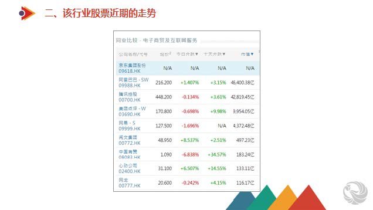

大家好, 欢迎大家继续学习我们的港股打新课程.

通过前两章的学习, 大家应该都对港股打新已经开始入⻔了, 执行力高的同学应该已经开港股账户, 开始入金, 对港股打新已经跃跃欲试了.

那 OK, 事不宜迟, 今天我们就来学习港股打新的进阶课——港股打新的实战技巧.

我们还是先看一下目录:

众所周知, 世上很少有轻松赚大钱的机会躺着等你来, 其实港股打新的技巧性还是比较高的, 你一定得真的懂, 才赚得到这个钱.

通过前几次的分享大家知道: 港股打新能帮助我们赚到钱的概率很大, 上市后的新股大部分都是上涨的,

只要大家去参与, 总体而言赚钱并不难.

但也有一些新股一上市就跌破了发行价, 我们称为破发.

那么, 哪些新股能打, 如何全面分析一家新股呢, 这是我们首先要学习的地方.

其次, 对于破发的新股, 我们要尽量避开, 我们也要学习如何规避新股破发的⻛险.

港股打新的中签概率虽然比较高, 但是有的人偏偏运气很差, 连喝绿茶都没中过再来一瓶. 如何规避运气⻛险提高打新的中签率? 这也是我们要学习的内容.

最后, 我们知道, 港股新股大概率会上涨的, 但股票上市后, 股价就会有波动, 关于卖点, 也很重要. 虽然我们可以无脑卖出, 比如在一开盘就卖出, 也能赚到钱.

但俗话说得好, 会卖的是师傅, 如果你有一些方法尽量卖在高位的话, 就能赚取更高的收益, 我们如何才能把股票卖在相对高位呢.

通过选择避开破发的新股, 提高整体中签概率, 中签后卖出的时候找一个比较好的时机, 这样你港股打新的收益率肯定要比平均的收益率要高出许多.

我相信, 通过我们这些课程的学习, 大家都可以形成自己的分析框架, 形成自己独特的交易模式.

首先, 我们开始第一节, 如何全面分析一只新股, 判断它是否值得认购.

## 如何全面分析一只新股

每次申购一支新股前, 我们都要先重点阅读「招股说明书」.

我一般重点看 2 部分:

第一, 看概要: 上市公司以第一视⻆向你介绍公司数据、行业地位、商业模式和发展策略, 是快速了解公司的重要资料.

第二, 看行业概览: 这是上市公司花大价钱, 请咨询公司出具一份客观的, 公司所在行业的调研报告, 也是快速了解行业的难得资料.

那看完招股说明书之后, 我们对一家公司有了大概认识, 那接下来, 我们如何全面分析一家公司呢? 我给大家总结了七大要素:

### 1. 公司基本情况

新股公司的基本情况, 我们一定要了解, 我们最看重的因素就是公司本身的质地了, 以及他处在的行业前景如何.

公司本身又可以分两块来考察, 一个是通过公司招股书来判断发展情况、未来前景等, 另一个是看公司是什么行业.

如何看招股书说起来也很复杂, 对于咱们打新的新手来说, 看看别人的评价可能更有效.

如果这家公司所处的行业前景不好, 或者已经是比较饱和的行业, 这样的公司可以不参与, 因为公司盈利的增⻓都是建立在市场增⻓上的, 如果行业前景不好, 那可以回避. 比如说银行、钢铁、煤炭等传统行业, 在港股上市后新股涨幅都很小, 也可能破发.

港股打新目前最受欢迎的行业是医药和物业股, 只要沾上这俩概念, 那基本就是大肉没跑.

这一块, 我们会在后面重点讲解.

### 2. 看公司规模

港股新股中有很多细价股, 也就是那种发行价很低, 股价两三毛的股票. 而根据历史数据看, 总市值太小的公司和融资规模太小的公司, 都容易暴涨暴跌, 打新总体收益率不好.

所以这种股票, 我们就要尽量少参与, 即使参与, 也是建立在其他方面还不错的基础上, 同时非常不建议融资打这类股票.

### 3. 看基石投资者

基石投资者主要指一流的机构投资者、大型企业集团、以及知名富豪或其所属企业, 可以给股票上市起背书的作用.

一般大型的 IPO 都会引入基石投资者, 基石最特殊的一点就是, 设有限售期, 一般是 6 个月, 过了限售期才可以抛售.

当然了, 同学要注意一点, 有基石投资者不代表新股是被看好的, 更重要是看基石投资者是谁, 以及其认购的份额.

如果基石投资者一看就阵容豪华, 并且大额认购, 那是可以给股票加分的.

所以, 如果一家公司的 IPO, 有优质的基石投资者参与, 代表他受到了知名投资公司的认可, 这样也有利于吸引市场散户来参与, 而且对于上市以后价格的稳定有非常大的帮助, 这种类型的公司, 可以考虑积极参与.

### 4. 看保荐人

保荐人是指企业上市的推荐人, 主要做保荐工作和上市辅导工作, 向证监会申报等, 赚取发行人的发行费用.

保荐人过往的历史表现, 也能影响新股上市以后的表现. 越是过往业绩好的保荐人, 为了保持自己的声誉, 会更为谨慎的挑选被保荐的公司. 同时如果保荐人过去保荐的公司首日的表现都很好, 那市场也会积极地认同保荐人的保荐项目.

因为港股的新股发行跟 A 股是完全不同的体系, 更加成熟和市场化, 非常考验保荐人的功力, 同时由于充分市场化竞争产生的差异化, 导致了每个券商都有自己独特的深耕领域.

总之, 保荐人就相当于一个信誉背书的存在, 一般来说, 保荐人历史业绩越好, 则新股在上市首日上涨概率大.

比如说, 对于小市值新股, 丰盛融资和汇富融资相对不错.

中大型新股, 建银国际和摩根士丹利不错.

中金和中信里昂, 则是出了名的护盘不积极, 思想有问题.

### 5. 看供应情况

所谓供应情况, 也就是新股的流通份额.

香港新股公开发售前, 会将发售份额分为国际配售和公开发售两部分, 两者比例通常为 9:1.

公开发售即给散户认购. 如果散户超额认购的话, 国际配售要向公开发售部分回拨. 假如回拨越多, 证明这支股票更受欢迎, 流动性程度也更高, 这样的股票建议第一天⻢上卖掉, 因为日后股价波动机率会很大, 很难 hold 住.

反之, 如果在股权相对集中的机构手上, 股票上市的初始阶段, 股价会更为稳定. 在此基础上, 日后企业经营良好, 行业走势好, 股价抬升的几率也更大.

### 6. 超额认购倍数

超额认购倍数很好理解, 指的是新股发行时, 买新股的金额和要发行金额的比值.

简单理解就是, 有 10 个美女都来追求我, 但我最后只能忍痛娶一个, 这样美女们对我的超额认购倍数就是 10 倍.

超额认购倍数一般可以反映市场对公司的认可程度及资金追逐程度.

某些毫无演技的小鲜肉为啥能火? 就是因为追捧他们的人足够多, 流量就是金钱.

怎么看这个数据? 以京东为例, 这个公司需要募集 15.69 亿的资金, 结果认购倍数是 178.9 倍.

近期的一致明星股时代天使, 超额认购倍数高达 2079 倍. 你可以感受一下大家对于好公司的追捧有多狂热.

如果自己不会判断, 那最好的方法就是等几天, 观察一下超额认购数, 然后跟着大佬们抄作业就完了.

当然, 超购还涉及到回拨等其他因素, 我们后面再说. 简单总结一句就是:

不超购, 谨慎申购.

当然了, 在这里要多说一句, 超购倍数多并不代表一定会上涨, 因为市场是复杂的, 我们还是要全面分析.

### 7. 市场情绪

这一点主要是目前宏观环境情况, 并不是看是否更受散户欢迎.

一般来看, 首先大盘要稳, 如果整体是牛市的趋势, 那么任何新股, 不必费力炒作, 都能轻松"⻜"起来.

其次就是, 新股所在的行业, 新股通常是"旧"不如"新", 尤其港股有偏好高科技、独特的新概念的传统.

反推就知道, 像内地银行股, 周期股、券商、房地产一类的新股则不建议投入.

好了, 一家新股的分析要点, 大致就是上面这些了.

除了上面这些因素之外, 还有一些其他因素, 比如定价区间, 是否有绿鞋等等, 但对普通投资者来说, 上面这些指标大概看一下就完全够用了.

那有同学就要问了, 分析一家新股好难, 在我没有学成之前, 有没有打新的简单实用方法呢?

当然是有的. 通过对历史数据和资本市场资金的偏好分析, 我们也可以知道哪些行业的新股值得参与, 快速判断是否要参与认购.

下面我们就开始学习这一节的内容.

俗话说得好, 男怕入错行, 打新也一样, 如果打到一个不好的行业的新股, 那吃面的概率可能就要远大于吃肉了.

因此排除掉一些不好的行业, 可以帮助我们提高收益率.

## 哪些行业的新股值得参与

我们判断一只新股的行业可以从两个维度去考察, 第一是其所处的行业本身是否受香港资本市场欢迎, 近一两年里同行业的股票在上市首日表现如何. 第二是分析其同行业的股票最近一两个月的走势如何.

### 第一点, 判断该行业是否受欢迎

首先, 我们要判断该行业是否受欢迎, 这个可以从同行业新股的历史表现数据中观察得知.

我们先看一看近期医药新股的表现. 大家看下面的表, 3 月份大盘行情的问题, 医药股有一波破发. 但医药股整体的表现还是很活跃的, 尤其是一些明星标的.

来看看与吃相关的公司表现. 香港市场对于与吃有关的公司通常给予格外的关注, 并且很多公司上市表现非常亮眼.

再看看物业股. 物业股在 2019 和 2020 年上半年表现很不错, 但进入 2021 年物业行业表现很差强人意了, 屡屡破发.

再看看地产行业, 近几年地产新股基本都是平开, 如果去申购的话纯粹浪费手续费占用资金, 地产股显然是不受欢迎的.

因此, 当一只新股上市的时候, 我们就可以通过这种方式, 来了解它所处的行业是否受市场欢迎.

如果同行业涨多跌少, 那显然是加分的. 而反过来如果同行业表现都不好, 那我们就需要小心, 可能会掉坑了.

### 容易上涨的行业和公司

我们也为大家总结了, 哪些行业值得参与.

对于比较容易上涨的行业和公司, 我为大家列举出来了.

比如高科技和互联网行业, 像阿里巴巴上市, 阅文集团, 就受到投资者的追捧. 像阿里巴巴的一手中签率是 80%, 当天上涨了 6.5%, 如果中签的话就能赚 1000 港币左右.

另外, 医疗保健类的行业与公司也都是上涨比较好的, 比如 2019 年上市的新股, 翰森制药, 首日收盘上涨了 36%, 一手中签率是 60%, 中一签的话就能帮投资者赚 10000 港币, 比如今年 6 月份上市的时代天使, 一手中签率 1.5%, 一手入场费 3.5 万, 首日收盘涨幅 130%, 一手净赚 4.55 万.

除此之外, 医疗行业上涨的新股还有很多, 比如沛嘉医疗, 诺辉健康, 康圣环球等等, 但是随着新型医疗公司上市数量越来越多, 新股标的的稀缺性不再有, 市场不再愿意给予更高的溢价了, 医疗行业的新股表现就是逐渐分化, 好的概念的公司会表现亮眼, 质地平平的就会有破发的⻛险.

独特概念的上市公司, 就是说这类公司业务模式独特, 市场没有可以对比的公司, 也容易受欢迎, 比如神州租⻋, 众安在线, 还有就是现在的新经济类型的公司, 面对年轻人群体新的消费概念不断涌现, 比如泡泡玛特、快手、时代天使、农夫山泉.

另外, 与同类企业相比, 估值比较低, 招股定价比较便宜的公司, 也容易上涨. 以 2017 年 9 月 27 日上市的中国万桐园为例, 发行市盈率仅 12 倍, 相比于同类型上市公司, 福寿园的 29 倍市盈率, 具有明显的估值优势.

2021 年 6 月份上市的森松国际, 是一个压力设备制造商, 但由于招股时市盈率是有 7 倍, 估值明显偏低, 再叠加大盘情绪向好, 首日开盘上涨了 258%.

看完容易上涨的行业和公司, 再来说一下建议避开的行业, 这类行业的新股, 破发的概率很大.

### 可能破发的行业和公司

第一类, 是内地的银行股, 比如 2019 年上市的两只银行股, 一个是贵州银行, 首日下跌了 7%, 另外一个是泸州银行, 首日涨幅为零, 这种没有任何申购价值! 还白白浪费了交易手续费.

第二类是券商股, 券商属于周期性的行业, 行情好的时候, 发行定价比较高, 行情不好的时候, 即便是定价很低, 市场也不认可, 因此也没有必要参与.

第三类是建筑行业地产股, 地产股也有很多跌破净值, 几乎不具有任何估值优势, 上市首日多数股票是下跌的.

第四类是招股定价太高的公司, 没有给市场留足上涨的空间, 也很容易破发.

当然, 大家请注意, 我在这里所列举的仅仅是目前的一个情况, 并非一成不变的, 每一次新股上市的时候, 我们都需要用这个方法来分析它所处行业的情况, 而不要刻舟求剑照搬这里的结论.

### 第二点, 查看该行业股票近期的走势

当有新股上市的时候, 我们需要查看同行业股票最近的走势.

我们以京东为例, 京东是 6 月 8 日到 6 月 11 日申购, 6 月 18 日上市的, 我们就要查看互联网股当时的表现.

我们从看十日升跌, 可以推断出在 6 月 11 日前申购的时候, 互联网股的表现都是不错的(上图中红跌绿涨). 事实上如果在 6 月 11 日之前申购的时候, 就能看到互联网股票的最近表现都很好.

因此回到我们当时申购的时间点, 对于这只即将上市的新股, 从行业这个维度我们是看好的. 其本身所处的互联网行业, 最近一两年都是受香港市场欢迎的, 而同行业的股票最近一段时间走势也不错, 因此我们可以得出结论, 京东是可以参与申购的.

因此, 我们总结一下什么样的新股能打, 首先是分析新股所处的行业, 要看其行业最近一两年新股上市的历史表现, 第二, 是看其行业新股最近一段时间的走势, 可以帮助我们快速识别⻛险和机会.

如果不好的话, 就要谨慎了, 建议放弃申购或者小仓位申购, 以控制⻛险为主.

在这里, 我们所用的工具, 手机 APP 有鑫财通、捷利交易宝, 网⻚端则可以借助披露易等工具.

通过上面的学习, 我们已经基本了解了新股一些基本审美了, 当然了, 我们在每个新股招股后, 都会给大家提供新股的全面分析报告, 也是围绕这些要点分析的, 你只用看我们的分析报告, 就可以快速知道新股是否值得认购了.

在学习完了新股分析之后, 接下来, 我们就要学习一个重要的知识点, 大家一定要注意听.

总体而言, 虽然港股打新中签的概率要远远高于 A 股打新的中签概率, 但是并不一定能保证 100% 中签, 碰上涨势喜人的新股, 如果自己没有中签, 只能眼睁睁的看着别人赚钱. 所以, 提高中签概率, 也是一项重要技能.

下面, 我们来看一下如何提高港股打新的中签概率.

## 如何提高港股打新的中签概率

想要提高自己港股打新的中签概率, 我们先来回顾一下港股的发行和新股的分配机制.

港股新股的发售分为两部分, 一部分是国际配售, 另外一部分是公开发售.

国际配售主要是一些大的投资机构, 或者资金实力比较雄厚的个人来购买, 一般占到新股发行份额的 90%.

这些投资者通常在新股公开发售之前, 就与上市公司签订了新股认购协议, 协议里面如果规定了锁定期, 也就是新股上市之后的一段时间内不能卖出, 我们就称这部分投资机构为基石投资者.

公开发售主要卖给了个人和散户, 公开发售的占比一般只有 10%. 公开发售部分在分配新股的时候, 又分为甲组和乙组, 乙组是认购金额在 500 万以上的大户, 对于大部分散户来说, 都是属于甲组.

对于甲组的投资者来说, 港交所为了照顾资金量比较少的散户, 只申购一手的新股中签率是最高的, 也即是一手中签率是最高的, 随着你申购的手数越来越多, 平均每手的中签率是不断下降的, 我们来看一下沛嘉医疗这只新股的分配例子.

甲组中签结果如下:

申购 1 手中签率为 8.5%

申购 2 手中 1 手的中签率为 8.6%

申购 3 手中 1 手的中签率为 8.7%

申购 4 手中 1 手的中签率为 8.8%

如果换一种思路, 家里有两个人参与港股打新, 你和你的爱人同时各自申购一手沛嘉医疗, 这样两人总体的中签概率就是 8.5%\*2=17%, 中签的概率要远远高于一个账户打 2 手的中签率, 通过这种方式, 就能提高整体的港股打新中签概率.

接下来, 我再来给大家分享一下, 新股中签之后如何卖在高位.

## 如何才能把新股卖在相对高位

首先, 大家应该记住一个卖出原则, 港股打新不是炒新, 新股中签之后, 一定要在暗盘卖出, 或者上市首日卖出.

如果大家工作比较忙, 没时间看盘, 可以采取无脑卖出的方法.

无脑卖出的时间点有三个, 暗盘卖出, 也就是通过券商内部的交易系统卖出, 另外是首日开盘或者是首日收盘卖出, 我们统计的 2019 年港股打新的收益率也是按这三个时间点统计的.

如果想把新股卖在高位, 就要关注两个因素, 一个是暗盘的走势, 另外一个看新股是否有绿鞋机制.

新股在暗盘的价格走势, 一般是新股上市首日走势的⻛向标.

如果新股在暗盘大涨, 第二天上涨的概率也会比较大.

如果新股在暗盘下跌了, 第二天下跌的概率也会很大, 那我们就要在暗盘及时卖出, 防止自己的亏损进一步扩大.

我们在前面的课程中了解过绿鞋机制, 我们再回顾一下.

绿鞋机制也叫超额配股权, 是上市公司给予保荐人的一项多发行一部分新股的权利, 用来稳定新股上市后的股价.

如果新股上市之后, 新股股价上涨, 保荐人就可以行使超额配股权, 按招股价多发行一部分股份, 卖给机构投资者, 随着新股数量的增加, 能够起到平抑股价的作用.

如果新股股价在新股上市之后出现破发, 这时候保荐人就会放弃行使超额配股权, 而是选择从市场上买入新股, 然后再以发行价卖给机构投资者, 随着保荐人的不断买入, 一般能把新股股价重新拉回到发行价附近.

所以, 对于有绿鞋机制的新股, 即便是出现破发, 大家也不用着急卖出, 可以跟随保荐人护盘的节奏, 当保荐人把新股股价拉回到发行价附近时, 再择机卖出, 这样能减少自己的投资亏损.

最后, 给大家一个具体的港股打新卖出建议: 如果新股出现破发, 没有绿鞋机制护盘, 建议直接在暗盘卖出, 如果有绿鞋机制, 可以选择在首日卖出.

如果新股在暗盘上涨, 并且市场的关注度比较高的话, 上市后一般还会有更高的涨幅, 建议首日卖出. 如果暗盘涨幅不大, 既可以在暗盘卖出, 也可以在首日开盘时及时卖出.

港股打新有哪些禁忌? 我也给大家总结了一些经验.

## 港股打新禁忌

### 第一, 打新不炒新.

港股打新玩的是一个高中奖率的彩票游戏, 只要掌握一点技巧, 以及运气不要太差, 根据历史数据看, ⻓期下来肯定是可以赚钱的.

而炒新却是亏钱概率较高的赌博游戏, 普通人对人性和心态的控制是极难把握的, 港股的⻛险极高, 妖股多套路多, 不受限制的涨跌幅, 如果胡乱炒新就很容易亏钱.

所以, 我们常说打新就是打新, 不管打中的新股是跌是涨是赚是亏, 绝大部分都是首日出手, 千万不能一直拿着恋恋不舍.

### 第二, 低开破发股, 一定及时止损, 更不能补仓.

虽然百分之六七十的港股首日都是上涨的, 但是仍然有百分之二三十的新股会出现破发. 而且暗盘破发的新股, 有 70%的概率首日仍然是破发.

所以如果暗盘破发, 一定要及时的卖出止损, 不要对它有任何留恋, 这一次跌了你就认了, 反正日后还有其他的新股可以打, 既然是猜输了, 那就让他输吧, 没必要去和这种弱势股多纠缠.

当然上面说的是大部分情况, 也有例外情况, 低开高走的, 割肉之后可能反转大涨的, 但是这是小概率事件.

### 最后, 新股卖出之后, 千万不要再关注.

港股打新, 你肯定会遇到妖股. 开盘破发或者不涨, 然后等你卖出之后, 一路狂飙暴涨, 遇到这种很容易心态就崩了, 眼馋后悔遗恨. 但是千万不要恼羞成怒, 去追加资金, 不然后面极有可能被套, 吃掉你浮盈, 亏掉你的本金.

## 课后总结:

今日学习内容: 港股打新第三章

主要知识点:

1. 如何全面分析一家新股
2. 如何规避新股破发的风险
3. 如何提高港股打新的中签率
4. 如何才能把新股卖在相对高位

今天的知识同样也比较干, 而且需要理解到位, 大家下来做完笔记再多看一看哈

好了, 我们的课程, 到这里也就全部结束了.

其实, 港股打新在过去一段时间, 也就是 2021 年第一季度, 港股打新行情经常破发, 很多人就坚持不下去了.

但进入 6 月份以来, 行情全面复苏, 很多新股上市都是首日百分之几十, 甚至超过百分之百的涨幅.

其实, 我们在第一节课中就给大家讲过一个道理, 新股要完成发行, 总是需要吸引投资者人认购, 那么一级市场和二级市场就一定会留有一个可以获利的差价, 即便某些新股可能破发, 但总的一定会是盈利大于亏损, 这样新股发行才能正常运转.

想明白这个道理, 就知道即便短期出现破发, 也应该坚持打新的理由了.

看一下今年的时代天使上市, 申购人数达到 79 万人, 而 2019 年阿里巴巴上市时才有 21 万人申购, 可以预⻅到, 这个队伍在迅速变大.

还在观望的同学, 请你迅速行动起来, 赶快参与到打新投资中来吧!

## QA

### 打新之后, 暗盘需要经常关注吗?

新股上市前一天下午 16:15-18:30 就是暗盘, 建议大家在这段时间内持续关注, 同时在新股上市当天也需要持续关注. 卖得好才是真的好, 大家不要前面分析、认购还要看有没有中签花了大量时间, 但是最后卖的时候却不关注, 导致自己的收益变低甚至亏损, 就得不偿失了

给大家举个例子哈, 正好前两天, 堃博医疗暗盘开盘前 5 分钟, 涨了差不多一块多, 当时一手可以赚 500 块钱左右, 但是 5 分钟之后持续走低, 上市首日直接破发百分之十几, 到现在跌了将近 20%, 一手亏 1500.

有一个小伙伴就是因为忘记了没有关注, 直接导致暗盘开盘了快一个小时才反应过了. 当时分析并不看好这只票, 如果暗盘一开盘就卖, 其实还是能赚的, 但就是没有关注, 导致后面还亏损了

### 目前只够一个券商的资金, 选择哪个最好呢?

艾德、华泰、华盛都可以, 这三家各有优势, 大家可以用开户链接的 PK 功能选择最适合自己的

### 如何知道基石投资者是不是优质的? 对这个完全不了解

在新股认购界面, 可以看到基石投资者是谁, 然后大家可以上披露易网站去看看这个基石的过往业绩和信息, 大致可以判断, 同时咱们不仅要看基石本身是否优质, 还要看基石投资者的数量和认购的比例来判断新股, 基石投资者越多越好, 认购比例越高越好

### 券商股是什么?

券商股就是券商公司上市发行的新股, 跟医药股、科技股是一样的说法

### 上市头一天暗盘 4:30 到 6:30, 如果这只港股质地不好, 就可以上市头一天通过暗盘卖掉, 如果质地好就是上市当天卖是这样吗?

暗盘时间是 4:15-6:30 哈, 别搞错了, 时间就是金钱

对于质地不好的新股, 要么咱们不打, 要么最好在暗盘卖掉, 质地好的新股看暗盘走势, 可以选择在上市当天卖

不是每只新股咱们都打的, 耐心等待好的新股, 避免盲目打新亏钱, 这样才能收益最大化

### 怎样知道这只新股有没有绿鞋机制?

新股认购的界面就会有的, 会显示是否有绿鞋, 以及行使绿鞋的保荐人是谁

### 暗盘时间和港股上市当天必须要一直盯着吗, 如果当时在上班错过了怎么办

不需要完全不能离开视线地盯着, 但是开盘前 5 分钟, 开盘后一段时间, 以及收盘前是需要花时间来看着的

当然如果已经选择时机卖出了就不用再看了, 一旦卖出就不要再关注了, 无论是涨是跌都跟咱们没有关系, 避免影响个人情绪
