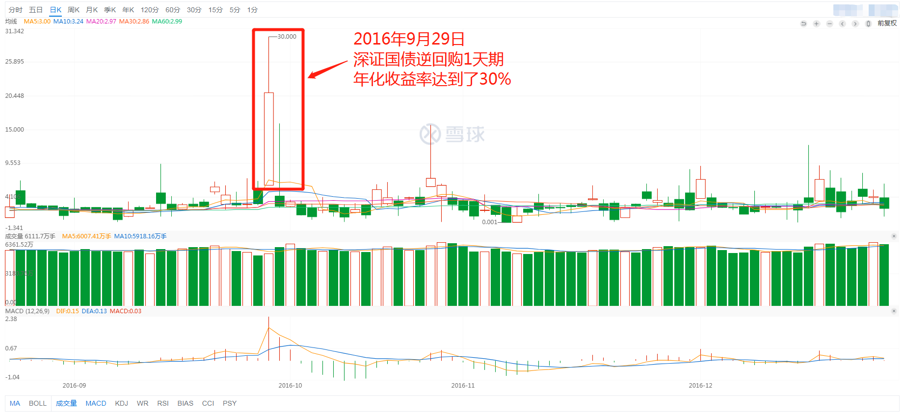
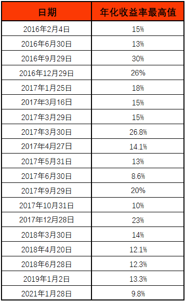

学理财, 上水星财富学堂.

小伙伴们你们好, 欢迎学习低风险理财实操课程:《国债逆回购: 教你低风险"薅羊毛"》. 我是小星学长.

如果学长告诉你, 有这样一种投资品, 几乎从来没有出现过亏损, 而且年化收益率可以达到 30%, 你会相信吗?

乍一听, 这种投资品有些违反常识, 但它却真实存在.

它的名字就是: 国债逆回购.

## 表现优秀的国债逆回购

大家看图, 2016 年 9 月 29 日, 1 天期国债逆回购的年化收益率曾经达到过 30%.

有些小伙伴可能会说: 学长, 你说的已经是 2016 年的事情了, 不会只出现过那一次高收益吧?

30%的年化收益率确实不常见, 不过, 学长统计了过去 5 年国债逆回购的历史表现, 大家可以看文稿中的表格, 年化收益率 20%以上的情况不只一次, 年化收益率达到 10%更是频频出现.

深证 1 天期国债逆回购历史年化收益率

看到这里, 小伙伴们有没有举起激动的小手, 准备尝试一下了呢?

别着急, 我们先稳住心态, 不要忘了先学习再投资. 接下来, 学长就带着大家系统学习一下, 国债逆回购究竟是什么, 怎么投资才能"薅到羊毛".

## 国债逆回购是什么?

首先, 学长来解答一下, 到底什么是国债逆回购.

很多投资新手一听名字就想"撤退"了. 这五个字都认识, 但放在一起就不知道是什么意思了.

其实, 国债逆回购的原理很简单.

学长先来解释一下名字里的一个关键字: 债

所谓的债, 大家可以理解为借条.

国债, 就是国家找社会各界借钱, 打出来的借条.

那么, 逆回购又是什么意思呢?

答案很简单. 有些公司手里持有国债, 但是国债没到期, 钱取不出来, 这时候公司又急用钱. 怎么办呢?

公司就来找我们这些投资者, 问我们借钱, 还会给一定的利息.

为了让我们放心出借, 公司会把手里的国债作为抵押物, 抵押给我们.

等公司返还了我们的本金和利息, 我们再把国债退回给对方, 解除抵押关系.

这个过程就是国债逆回购. 一来一回, 我们就赚到了公司支付的一笔利息.

实际操作中, 我们不需要和公司面对面做交易. 以上全部过程都可以直接在手机上完成.

## 国债逆回购会亏钱吗?

国债逆回购的风险极小, 它常常被人们称作"无风险投资工具"

原因有两个.

第一, 咱们在做国债逆回购交易的时候, 钱不是白白借给公司, 而是有国债作为抵押物.

国债被称为"金边债券", 是我国安全等级最高的债券类型之一. 有国债作为抵押, 国债逆回购的安全性自然也高.

第二, 退一万步讲, 即使公司变成"老赖", 借钱不还了, 也还有中国证券登记结算有限公司(简称"中登公司")为我们"出头". 如果借款人还不出来钱, 中登公司会先垫付给我们.

所以, 对于低风险偏好的投资者来说, 国债逆回购是个不错的选择.

## 总结

本节课的内容就到这里啦. 学长给大家总结一下:

我们学习了国债逆回购的本质, 其实就是公司找我们借钱, 把手里的国债抵押给我们, 我们把钱借给对方, 赚点利息.

国债逆回购有国债作为抵押物, 在出现借钱不还的情况时还有中登公司可以垫付给我们, 所以风险极小, 被大家称为"无风险投资工具".

下节课, 学长将带着大家分析一下, 什么时候下单国债逆回购最划算.
