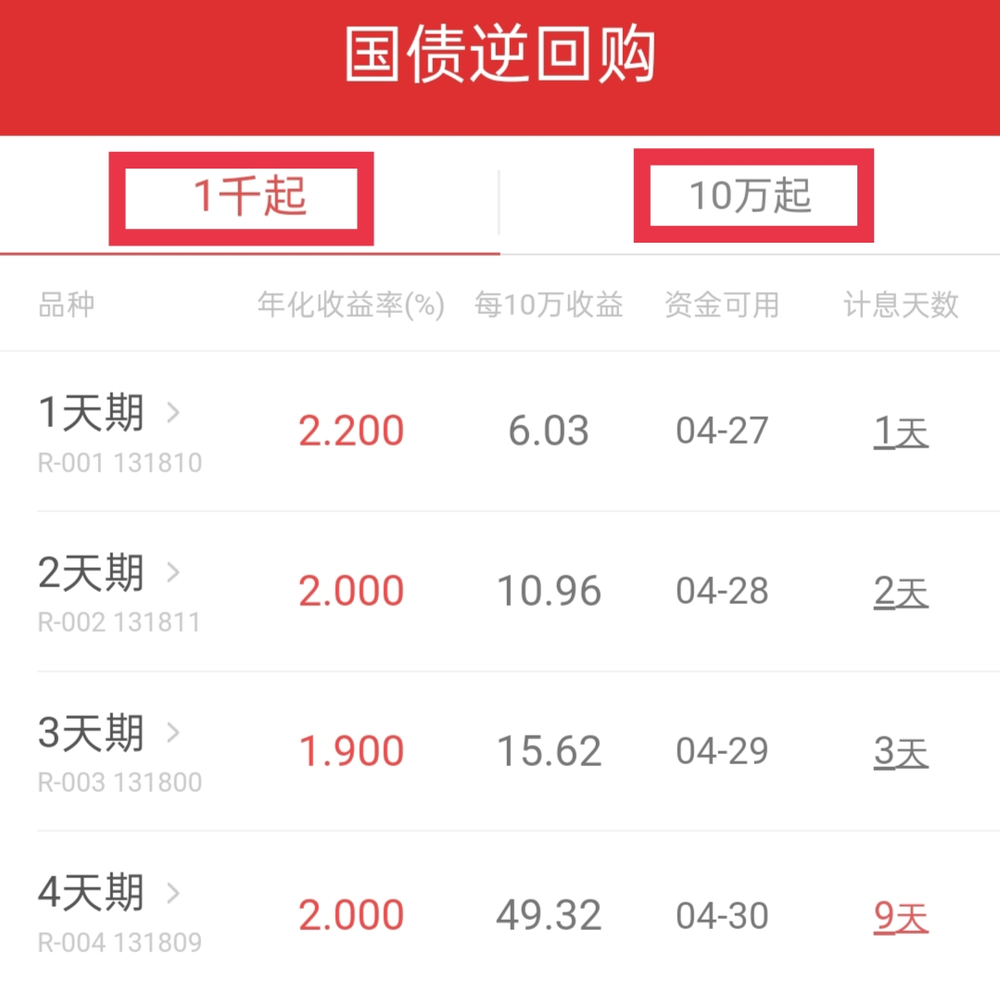

学理财, 上水星财富学堂.

小伙伴们你们好, 欢迎继续学习《国债逆回购: 教你低风险"薅羊毛"》. 我是小星学长.

上节课, 我们认识了国债逆回购这个低风险理财"神器". 那么, 国债逆回购到底该怎么参与呢?

## 交易之前, 这些前提须了解

参与国债逆回购需要开立证券账户, 也就是平时投资股票的那个账户.

不过, 国债逆回购和股票互不干涉, 咱们开了户之后, 如果害怕股市波动太剧烈, 完全可以只参与国债逆回购, 不玩股票也没什么影响.

国债逆回购的交易日和股票交易日一致. 每周一到周五可以交易, 双休日无法交易, 遇到节假日也无法交易.

在节假日前后补工作日的情况, 咱们可能周末上班、上学, 但是, 投资市场很"任性", 它不会补交易日. 也就是说, 节假日前后补的工作日, 国债逆回购无法交易.

交易日期了解清楚了, 咱们再来看交易的市场.

大陆交易国债逆回购的市场有两个: 上海市场和深圳市场. 它们最大的区别在于资金门槛.

上海市场的国债逆回购 10 万元起购, 适合家底比较雄厚的投资者; 深圳市场的国债逆回购 1 千元起购, 对普通投资者非常友好. 两个市场的国债逆回购收益水平有一点区别, 但总体差异不大.

以华泰证券开发的涨乐财富通 App 为例, 其界面显示如下. 左侧菜单显示"1 千起", 说明它代表深圳市场; 右侧菜单显示"10 万起", 说明它代表上海市场.

## 选择几天期的品种更好?

国债逆回购的品种从 1 天期到 182 天期不等.

如果选择了 182 天期, 就意味着, 咱们下单之后, 钱要在里面冻结半年之久. 对大部分人来说, 这个体验可能不太友好

国债逆回购的亮点之一便是流动性好, 也就是钱可以在短时间内取回, 所以建议大家选择期限较短的品种, 比如 1 天期, 2 天期, 3 天期, 4 天期, 还有 7 天期.

而且, 从历史表现来看, 期限短的品种出现高收益的机会更大. 咱们上节课提到的 30%的年化收益率, 就是 1 天期品种的表现. 从这个角度讲, 也能说明期限短的品种更好

在这些品种里面, 学长重点推荐大家关注 1 天期的国债逆回购. 因为他可以让我们投资中的闲置资金不再闲置, 每天都可以为我们薅一把羊毛.

这就要说到交易时间啦.

## 让闲置资金滚动起来

国债逆回购的交易时间是 8:30~15:30

大家注意哦, 国债逆回购下午 3 点半才结束交易, 而股票和场内基金是下午 3 点整结束交易. 中间相差半个小时.

这半个小时, 给了投资者一个"薅羊毛"的大好机会!

每天下午 3 点, 股票和场内基金交易结束. 这时候, 很多投资者并没有把全部的本金都投出去, 而是留了一些钱在现金账户里, 等待更好的投资机会.

那么, 我们就可以用没投出去的这笔钱, 在下午 3 点到 3 点半这半个小时内, 下单 1 天期的国债逆回购.

相当于让这笔闲置资金为我们赚了一天的利息.

等到下一个交易日早上, 这笔钱会自动回到我们的现金账户, 完全不耽误我们投资股票和场内基金.

也就是说, 如果不下单 1 天期国债逆回购, 这笔钱就白白闲置了一晚上; 如果下单了 1 天期国债逆回购, 则赚了一笔小小的利息.

回报的数额可能不算大, 但经过日积月累之后, 也是一笔可观的收入呢. 有些小伙伴靠着国债逆回购, 可以每年"白捡"几百块.

学长温馨提醒, 只有选择 1 天期的品种, 才能让钱在第二天一早就回到现金账户. 大家一定要认准 1 天期, 选择其他期限的品种是不能实现的哦.

## 总结

本节课最后, 学长带大家回顾一下, 我们都学到了哪些内容:

我们了解了交易的前提是开户, 交易日期是周一到周五, 双休日、节假日无法交易; 交易市场分为上海市场和深圳市场, 上海市场 10 万元起购, 深圳市场 1 千元起购.

国债逆回购的品种从 1 天期到 182 天期不等, 建议大家选择 7 天以内的短期品种.

国债逆回购的交易时间是 8:30~15:30, 结束交易的时间比股票和场内基金晚了半个小时, 利用这半个小时, 可以每个交易日薅一把羊毛, 让闲置资金滚动起来, 为我们赚利息.

有些小伙伴可能想说: 我不买股票, 也不买场内基金, 是不是就不能"薅羊毛"了呢?

当然不是, 对于纯玩国债逆回购的小伙伴来说, 还有更多"薅羊毛"的机会等着大家.

下节课, 学长就为大家揭晓答案.
