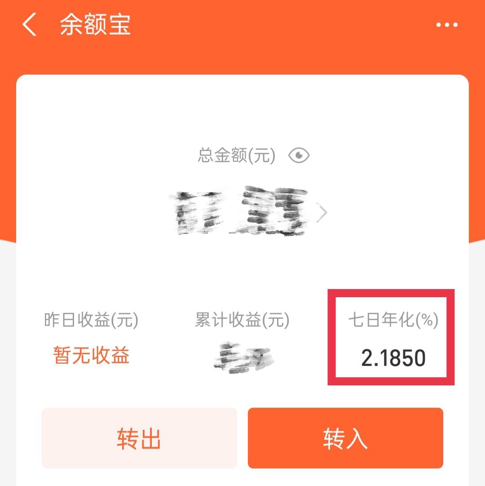
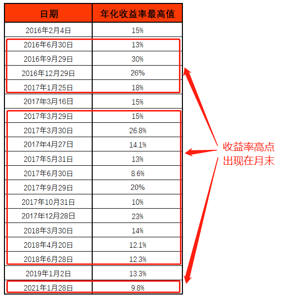
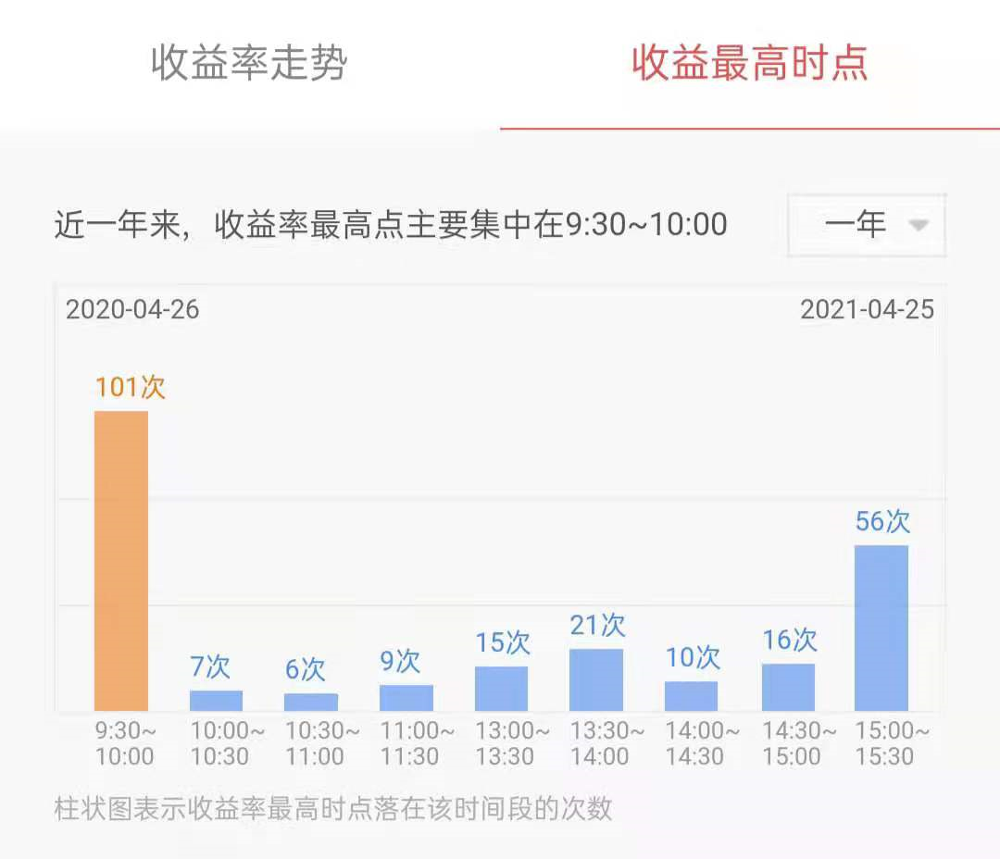

学理财, 上水星财富学堂.

小伙伴们你们好, 欢迎继续学习《国债逆回购: 教你低风险"薅羊毛"》. 我是小星学长.

上节课, 学长答应大家, 让纯玩国债逆回购的小伙伴也找到"薅羊毛"的机会. 这节课, 学长就来兑现承诺啦.

## 代替余额宝、零钱通

大家可以准备一笔闲钱, 放在证券账户中, 每天下单一次国债逆回购, 用它来代替余额宝、零钱通这类理财工具

截止到 2021 年 4 月, 余额宝的 7 日年化收益率在 2%左右.

这个收益率对于国债逆回购来说, 堪称"小菜一碟".

国债逆回购的收益率, 通常情况下在 2%上下, 和余额宝, 零钱通相差不多. 但是, 余额宝、零钱通基本维持在这个收益水平不怎么动, 而国债逆回购却时不时带来意外惊喜.

比如咱们在第一课提到过的, 1 天期国债逆回购的收益率甚至可以达到 30%, 这对于余额宝的用户来说, 想都不敢想.

大家注意, 在交易时间内, 国债逆回购的年化收益率时刻在波动, 但是, 最终给我们计算收益的时候, 就以下单时候的年化收益率为准.

比如, 我们在年化收益率波动到 30%的时候下单成功, 最后拿到手的收益就按照 30%来算. 下单成功后, 不管年化收益率怎么波动下去, 不管涨了还是跌了, 都和我们没有关系了.

有的小伙伴可能会想, 如果平时只是 2%的年化收益, 感觉也没什么吸引力呀.

那么, 有没有一种可能, 我们不用每天关注国债逆回购, 只在它的收益率最可能涨高的时候下手呢?

方法当然有, 学长马上给大家揭晓.

要想在收益率最有可能涨高的时候下手, 我们先得知道, 在哪一天的哪个时间段, 收益率最有可能涨高.

## 选择月末、周四更有戏

在第一节课中, 学长给大家展示了过去五年中, 国债逆回购收益水平较高的一些日期.

如果大家足够细心会发现, 这些日期中, 绝大多数都出现在月末.

学长想告诉大家的是, 月末参与国债逆回购, 遇见高收益的概率会更大.

其中, 尤其是季度末, 也就是 3 月、6 月、9 月、12 月的月未, 更容易出现高收益.

这可不是凑巧发生的现象, 而是有事实依据的.

国债逆回购的本质是公司找我们借钱, 给我们利息. 那么大家想一下, 公司在什么时候更需要借钱呢?

通常来说, 各个公司都会在月末、季度末做资金结算, 往往这时候更需要借钱度过"资金荒". 为了及时借到钱, 公司就会给咱们开出更高的利息.

所以, 学长建议, 如果小伙伴们的时间有限, 那就在每个月的月末, 留出最后一周关注国债逆回购就好啦.

根据历史表现, 每周的周四, 国债逆回购的利率一般会高于其他几天. 所以, 选择周四买入是最划算的哟.

## 选择 9:30~10:00 更有戏

除了聚焦周四以外, 大家还可以选择聚焦时间段. 在月末的最后一周, 每天拿出半个小时关注一下国债逆回购即可.

这里的半个小时, 说的是早上 9 点半到 10 点.

选择这个时间段的依据是华泰证券的官方统计数据.

华泰证券统计了国债逆回购收益率出现的最高时点. 在一年之中, 国债逆回购收益率的最高值落在 9:30~10:00 的次数最多.

以深证 1 天期国债逆回购为例, 截至到 2021 年 4 月 25 日, 收益率的最高值落在 9:30~10:00 区间里的次数为 101 次, 次数最多. 这说明, 选择 9:30~10:00 这个区间下手, 遇上高收益的可能性更大.

除此之外, 每天的最后半小时, 也就是 15:00~15:30 这段时间, 出现收益率最高值的次数位居第二.

大家看图便知, 早晚两端更容易遇上高收益, 中间的时段不太容易遇上高收益.

所以, 小伙伴们如果精力有限, 可以重点在月末最后一周的上午 9:30~10:00、下午 15:00~15:30 关注国债逆回购.

## 总结

最后, 学长总结一下本节课的重点: 纯玩国债逆回购也能薅羊毛.

大家可以用国债逆回购代替余额宝、零钱通, 收益水平会更加可观.

如果大家只想在收益率最可能冲高的时间关注, 学长建议, 把精力集中在月末的最后一周.

首先, 周四的收益水平更高一些, 建议大家重点在周四关注国债逆回购.

其次, 高收益落在上午 9:30~10:00、下午 15:00~15:30 的可能性更大, 建议大家重点在这两个时间段关注.

下一节课, 学长将带着大家学习国债逆回购的高阶玩法: 选择 1 天期国债逆回购, 连赚 9 天利息.
