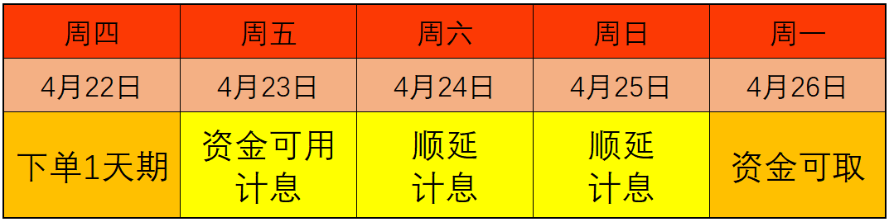

学理财, 上水星财富学堂.

小伙伴们你们好, 欢迎继续学习《国债逆回购: 教你低风险"薅羊毛"》. 我是小星学长.

2020 年国庆节前, 学长曾经下单了一笔国债逆回购. 当时选择的是 1 天期的品种, 最后赚到了 9 天的利息.

听起来是不是非常神奇? 其实方法很简单, 只要选对了日期, 大家都可以实现.

本节课, 学长就来揭秘这个神奇的技巧.

## 分清两个重要日期

首先, 我们需要区分两个重要的日期. 一个叫资金可用日, 另一个叫资金可取日.

国债逆回购到期后, 本金和利息会自动回到我们的现金账户. 收回本息的当天, 叫做"资金可用日".

"可用"的意思是, 我们可以用回到账上的钱去买其他东西了, 不管是股票、基金, 还是理财产品, 都可以买. 当然, 我们也可以什么都不买, 让钱留在现金账户中不动.

唯一的限制是, 在资金可用日, 我们不能取现, 也就是说, 不能把现金账户里的钱转到银行卡.

我们必须再等一个交易日, 到了资金可取日, 才能取现.

大家可以看文稿中的表格.

以 3 天期国债逆回购为例, 假设我们在 2021 年 4 月 19 日下单 3 天期国债逆回购, 那么, 3 天后的 4 月 22 日, 交易到期, 本金和利息自动回到现金账户, 这一天就是资金可用日, 本金和利息可以用来买其他的投资理财工具, 但是不能取出来.

再过一个交易日, 也就是 4 月 23 日, 我们就能把本金和利息取出到银行卡了.

整个过程计息天数一共 3 天, 和"3 天期"的名字相匹配.

有的小伙伴可能想问: 学长不是说过, 可以多赚几天利息吗? 为什么这里正好三天?

想要多拿利息, 我们只知道两个日期的意思还不行, 必须得选对下单日期和品种.

下面学长就介绍一个本人经常用的技巧, 那就是: 在星期四下单 1 天期国债逆回购, 可以计算 3 天利息.

## 周四下单 1 天期, 连赚 3 天

为什么会产生这种神奇的效果呢? 秘密就在于两个字: 顺延.

学长举个例子:2021 年 4 月 22 日是周四, 假设我们在这一天下单 1 天期国债逆回购, 那么一天之后, 也就是 4 月 23 日, 就到了资金可用日.

理论上来说, 再过一天就是资金可取日了. 但是, 4 月 24 日赶上了周六, 双休日无法交易, 我们的钱也取不出来, 所以只能顺延.

接下来一天是 4 月 25 日, 还是属于双休日, 继续顺延.

直到 4 月 26 日, 也就是下周一, 我们才能真正把钱取现到银行卡. 这一天才是真正的资金可取日.

这里学长给大家两个提示:

第一, 凡是遇上双休日、节假日, 资金可取日都要顺延;

第二, 在资金可取日到来之前, 每一天都要计算利息, 顺延几天就多拿几天利息.

所以, 顺延不是坏事, 反而是为我们多赚钱的好事.

在每周四下单 1 天期国债逆回购, 可以巧妙地利用双休日顺延两天, 多拿两天利息, 所以最后总共能拿到 3 天利息.

## 巧用"顺延", 狂赚 N 天利息

大家还记得学长在课程开始提到的操作吗? 下单 1 天期国债逆回购, 最后狂赚 9 天利息.

这又是怎么做到的呢?

其实方法和前面异曲同工. 秘诀还是在于顺延. 之前咱们只利用了双休日顺延, 但是大家不要忘了, 节假日也可以顺延.

遇到节假日, 顺延的天数更多, 计息的天数也更多.

比如, 2020 年的国庆节, 国家法定节假日一共 8 天, 全部可以用来顺延.

学长在 9 月 29 日下单 1 天期国债逆回购, 9 月 30 日就是资金可用日, 计息 1 天.

理论上, 接下来的 10 月 1 日是资金可取日, 可是这一天全国放假, 只能顺延, 而且是一直顺延到假期结束. 整个 8 天假期, 全部都可以计息.

原本 1 天期的品种只能计息 1 天, 结果因为国庆节顺延, 多了 8 天利息, 所以学长最后总共拿到了 9 天利息.

希望大家学会这个神奇的技巧, 及时运用起来. 在我们国家, 很多假期的时间都不短, 特别是五一劳动节, 国庆节和春节这三个节日, 假期一般至少 5 天.

大家根据放假时间往前推, 提前两个交易日下单 1 天期国债逆回购, 就能够多赚几天利息啦.

而且, 细心的小伙伴可能记得, 学长之前提到过, 每逢月末, 国债逆回购的收益率上涨可能性更大.

而我们国家的很多节日都在月初, 我们可以在前一个月的月末下单国债逆回购, 刚好利用后一个月的月初放假, 顺延几天.

一方面能把握住月末, 博取高收益率; 另一方面又能利用节假日, 多赚几天利息. 如果收益率和计息天数都增加, 那简直可以说是"双喜临门"了.

## 总结

本节课的内容就到这里啦. 最后, 学长给大家总结一下课程的主要内容.

首先, 我们认识了两个重要日期, 分别是资金可用日和资金可取日

其次, 我们学习了在每周四下单 1 天期国债逆回购, 可以连赚 3 天利息.

最后, 我们又学习了一个升级技巧, 在节假日之前下单国债逆回购, 可以利用假期的天数连续顺延, 多赚 N 天利息.

小伙伴们, 你们学到了没有.

下节课, 学长就要带着大家实操下单了. 而且我们有两大策略, 方便我们合理安排收益预期.
