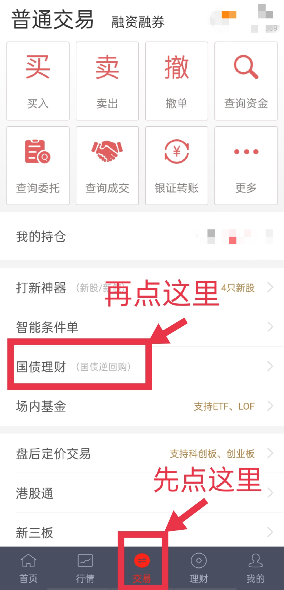
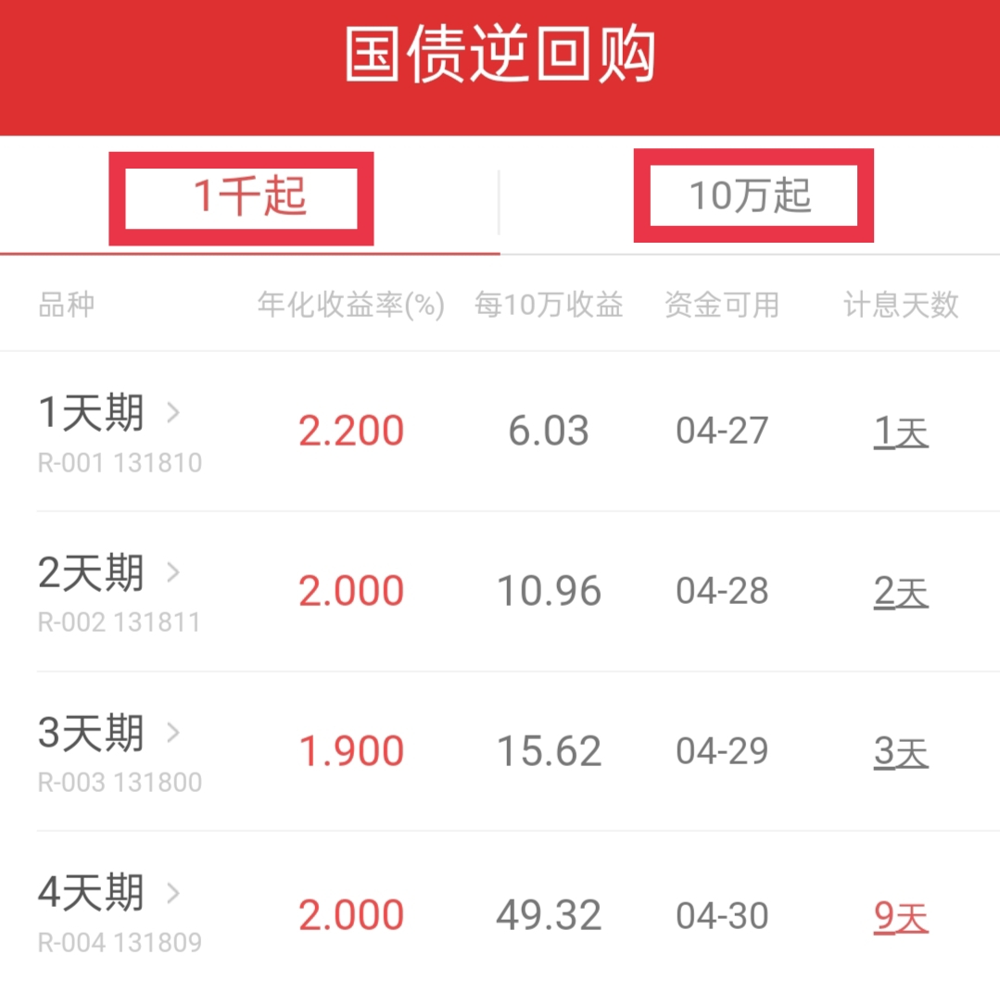
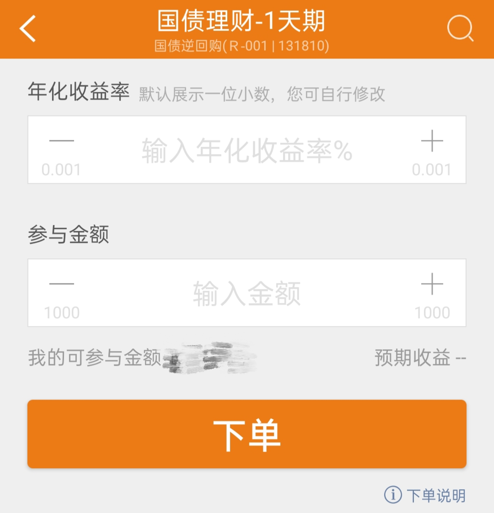
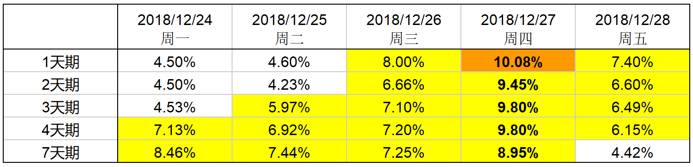

学理财, 上水星财富学堂.

小伙伴们你们好, 欢迎继续学习《国债逆回购: 教你低风险薅羊毛"》我是小星学长.

在前四节课中, 小伙伴们已经了解了国债逆回购的几乎所有奥秘. 今后再提起国债逆回购, 大家个个都是"小专家"啦

不过咱们可不能只做理论家. 投资理财的所有方法, 只有实操运用起来才有意义.

本节课, 学长就带着大家开启实操, 体验一下国债逆回购交易的完整过程.

## 实操

国债逆回购交易的渠道有很多, 学长就以涨乐财富通 App 为例, 带着大家实操一遍.

学长曾经提到过, 参与国债逆回购有个前提, 那就是开立证券账户. 还没有开户的小伙伴们, 最好提前开好账户, 等到机会来了直接参与.

开户不麻烦, 花个 20 分钟就能搞定. 开户本身不收取任何费用.

如果你参与了水星财富学堂 8 天理财训练营的学习, 还可以联系自己的班班, 获取低佣金开户渠道, 平时做股票、场内基金交易的时候能够节省手续费.

开户完成的小伙伴, 可以按照下面的步骤实操起来啦.

第一步, 请大家登录涨乐财富通 App, 底部选择"交易" 子菜单, 然后找到"国债理财", 点击进入.

接下来就是我们看过的界面啦, 左边菜单写着"1 千起", 说明它代表深圳市场; 右边菜单写着 10 万起, 说明它代表上海市场

学长就以深圳市场的 1 天期品种为例, 教大家如何下单.

第二步, 我们直接在"1 天期"这一行点击一下, 就可以直接跳转到下单页面.

这时需要我们输入两个数字, 一个是年化收益率, 另一个是参与金额. 这里就需要一点策略和技巧了.

如果我们输入的年化收益率过高, 可能一整天都达不到这个收益率, 最后导致无法成交, 白玩一场.

如果我们输入的年化收益率过低, 最后只能按照低收益率成交, 收益金额会变少, 而且, 如果交易成功后, 收益率波动到高位了, 我们也只能无奈错过.

那么, 究竟怎么设置合适呢? 学长给大家提供两大策略.

## 基础策略: 一次性下单

第一个策略很简单, 直接在年化收益率一栏输入 5%, 参与金额根据自己的实际情况设置, 最后点击下单, 一次性搞定.

为什么设置 5%的年化收益率呢?

这是因为, 根据历史表现, 国债逆回购在月末的年化收益率冲破 5%的可能性比较大.

以 2018 年底时的深证国债逆回购为例, 大家看图, 绝大部分情况下的年化收益率都冲破了 5%

2018 年末深交所国债逆回购最高收益率

如果你担心 5%可能成交不了, 那么可以稍稍降低预期, 填写 3%、4%的年化收益率, 更容易成交.

当然, 咱们前面学习过, 国债逆回购的年化收益率, 高的时候可以冲击到 10%以上, 少数情况下甚至会达到 30%

我们只设置 5%的话, 会不会错失机会呢? 如果你对 5%的收益率不满意, 想博取更高的回报, 可以参考下面的升级策略.

## 升级策略: 分三档下单

升级策略需要一连 3 次下单, 适合资金量较大的投资者.

举个例子: 小明拿出 30 万投资国债逆回购, 他选择把这笔钱等分成 3 份, 每份 10 万.

第一次操作: 设置年化收益率 5%, 参与金额 10 万, 下单

第二次操作: 设置年化收益率 10%, 参与金额 10 万, 下单.

第三次操作: 设置年化收益率 15%, 参与金额 10 万, 下单

大家可以一次性下完 3 单, 设定好 3 档收益率. 只要收益率浮动到你的设定值, 这一单就自动成交.

这样做的好处是, 当 10%和 15%这么高的年化收益率出现时, 我们就不会错过了.

下完单之后, 我们就可以安心学习工作, 坐等成交, 不用一直盯盘啦.

还有的小伙伴可能想问: 如果收益率一直低于 5%, 连一档也达不到, 我们岂不是白下单了?

其实, 如果收益率低于 5%, 投资回报很有限, 吸引力本身就没有那么大了, 我们错过了也没什么可惜的.

咱们最怕错过的是高收益, 而不是低收益. 大家说对不对?

## 总结

以上就是本节课的全部能容啦. 学长带着大家学习了实操下单的步骤, 而且给了大家两大下单策略, 分别是一次性下单和分三档下单.

建议大家在月末、季度末的时候, 尤其是在节假日之前可以增加计息天数的时候, 把这两个下单策略用起来.

《国债逆回购: 教你低风险薅羊毛》到这里就全部结束了. 小星学长预祝大家天天"捡钱", 次次遇上高收益.

小伙伴们, 再见啦.
