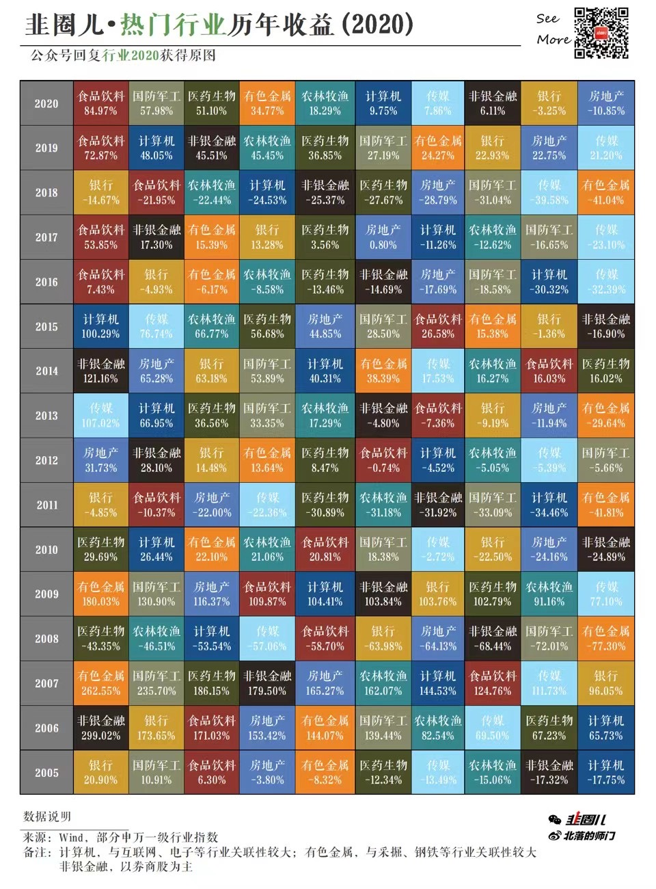
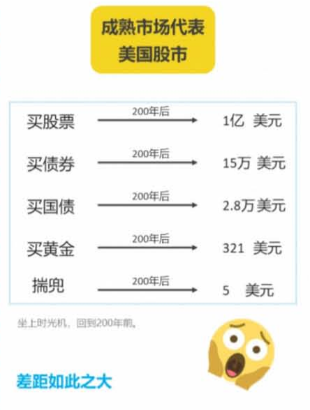
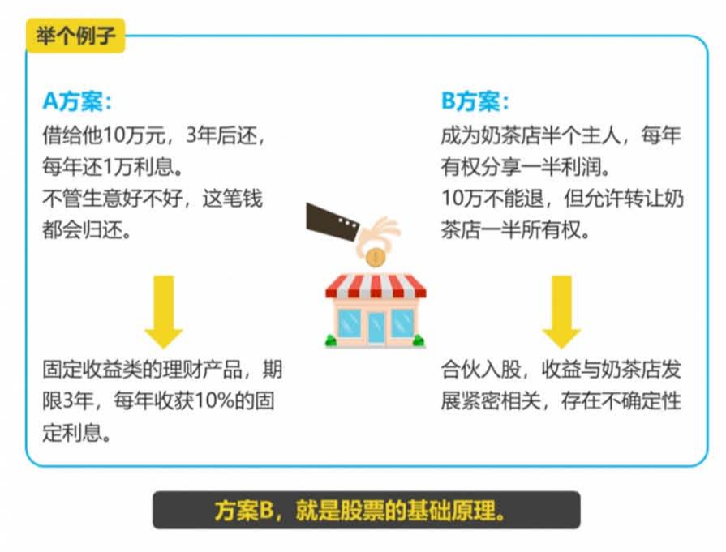
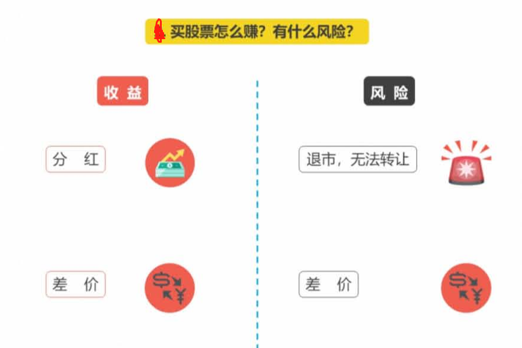
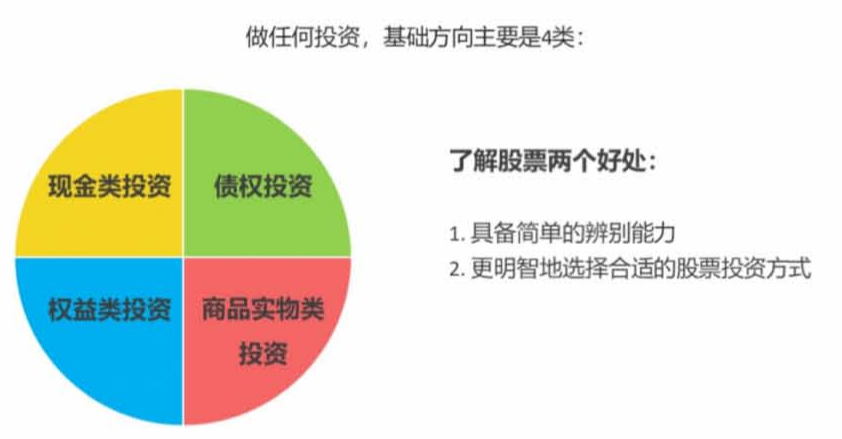
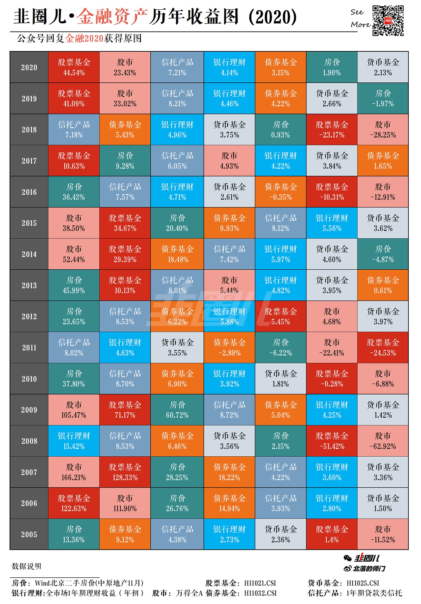

欢迎大家来到股票进阶课.

在这个时代, 想要守护自己的财富, 只要你决定投资, 你就很难绕开股票, 为什么这么说呢? 今天就让老师带大家从最基础的概念开始讲起, 带大家重新认识一下股票.

首先聊聊大家最关心的话题, 在股市投资到底能赚多少钱?

## 在股市投资到底能赚多少钱

我们分别以新兴市场的代表中国市场和拥有几百年历史的成熟市场美国股市的数据为例, 看一下历史统计的结果.

先从我们中国 A 股的收益情况看起. 从 2005 年到 2020 年之间, 这张图显示了中国股市热门行业历年收益:

在任意一年、五年、十年、二十年的股市, 年化收益率范围数据表明时间越短, 股市收益率波动越大.

但随着时间拉长, 收益率的波动性不断减小, 在任意二十年时间里, 在扣除通货膨胀因素后, a 股市场的实际年化收益率, 在负的百分之一和百分之九点六六之间, 亏损的可能性就并不大了.

这说明短期来看, 股市确实和大家想象的一样, 大起大落不是大赚就是大亏. 但长期来看, 收益率其实是比较稳定的.

那么股票和其他投资品相比表现又怎么样呢?

我们再来看看成熟市场上美国股市的情况. 美国股市的历史比较悠久, 也比较成熟. 所以咱们可以坐上时光机, 一起回到更早的两百年前.

如果你在那个时候有一百美元, 你会投资什么呢? 美国一位学者给了我们一个惊人的答案. 如果你买股票两百年后, 你大概会拥有近一亿美元.

如果你投资债券、国库券或者黄金的话, 这一百美元分别变成了大概十五万美元、二点八万美元. 和三百二十一美元.

而如果你不做任何投资, 只是把这一百美元揣在兜里, 那么考虑通胀的因素, 你实际只剩下五美元左右的购买力了. 这个差别是不是非常惊人?

不论在中国这样的新兴市场还是美国这样的成熟市场, 短期来看股票的风险确实比较高. 但从长期来看, 风险其实没有你想的那么大.

再反过来看, 如果你长期不参与任何股票类投资, 反而是一个巨大的风险, 会无法跑赢通货膨胀.

那长期来看, 股票有那么高的收益率, 又是为什么呢?

我们还得来看看股票到底是什么, 又存在哪些风险.

## 股票到底是什么, 又存在哪些风险

股票是一种有价证券, 它代表公司的一部分所有权.

公司发行股票其实就是拿企业部分的所有权换的资金用于后续的经营发展. 而你花钱买入股票拥有了公司一部分股权, 也就成为了公司的股东.

所以说股票不是一串虚拟的数字. 他的背后是一个实实在在的公司.

可能这么说, 你还一下无法理解, 没关系, 咱们来做道选择题.

假如有朋友计划用二十万开一家奶茶店, 你特别看好这家店, 也想投十万元. 朋友给了你两个选择.

a 方案: 借十万元给他, 三年后还你, 他每年还你一万利息, 不管生意好不好, 这笔钱都会给你.

b 方案: 你也成了奶茶店的半个主人, 每年有权分享利润的一半. 所以说这笔外援不能退给你, 但你朋友允许你把这奶茶店的一半所有权转让给其他人.

换句话说, 方案 b 就是生意越好, 你拿到的分红也就越多. 要是生意不好, 亏了你可能一分钱也拿不到.

这两个方案可以说各有千秋, 你会怎么选择呢?

选择 a 就好比买了固定收益类的理财产品, 期限三年, 每年收获百分之十的固定利息.

你不需要关心奶茶店是不是生意火爆.

而选择 b 就相当于合伙入股, 你的收益, 就要和奶茶店的发展牢牢绑在一起了, 存在很大的不确定性.

奶茶店的生意好, 年收益百分之十不成问题, 甚至会有人出高价求你转让. 但奶茶店也可能生意不好, 不仅没有利润分红, 投入的十万元也打水漂.

这个方案 b 其实就是股票投资的基础原理.

了解了什么是股票, 大家也就不难理解, 股票是如何赚钱的了.

企业赚钱了可以拿一定比例的利润分给股东.

股票收益最初的来源就是企业的分红. 公司越赚钱, 大家分到的钱就越多. 就像奶茶店拿出每年利润的一半分给你一样. 这也体现了我们买股票的重要原因, 是分享公司成长的红利.

不过还有些人买股票的目的不是为了等分红. 毕竟分红要等待很长时间, 急着用钱的人就会把手里的股票转让给其他人.

所以股票收益的第二个来源就是买卖价差.

除了正常的买卖差价, 还有一种特殊的方式是通过打新股的方式.

因为新股上市之后, 股价普遍会带来大幅度的上涨. 打新股是比较特别的制度, 我们在后续课程中会仔细介绍

对普通人来说, 我们投资股票的原因就是通过低门槛接触优秀的公司, 并分享他们的成果.

首先, 股票投资的门槛并不高, 几百上千元就能够参与了. 而如果你想经营一家优秀的企业, 且不说管理能力, 光是把一家企业开办起来就很复杂, 投入不少成本.

当然上市公司可不是开普通的奶茶店那么简单, 我们说的股票是上市公司才能发行的. 上市公司有着严格的筛选条件, 几乎涵盖了各行各业最优秀的公司, 有更多关于上市的科普, 欢迎你在课后一起来涨知识.

而我们要获得较好的收益, 就要从里面挑选出最有竞争力的公司. 现实中, 好企业往往会给我们带来巨大的回报.

我们做任何投资, 基础投资方向主要就是四类: 现金类投资、债权类投资、权益类投资和商品实物类投资, 也就是我们常说的投资四原色. 股票是作为权益类投资最重要的形式之一.

我们即使不炒股, 也需要做基本的了解, 这样对你有两个好处:

第一, 具备简单的辨别能力, 你自然就不会被那些所谓的原始股骗局轻易欺骗.

第二、搞懂了这些基本原理后, 你会更明智的选择合适的股权类投资方式.

好了, 今天的内容就先到这里了, 我们来总结一下:

## 总结

1、首先, 投资股票的收益率大概有多少? 我们从历史数据中发现, 股票投资的收益率相对稳定, 而且回报也远远高于其他投资品, 是跑赢通胀的好选择.

2、其次, 因为股票不是一串虚拟的数字, 它代表公司所有权的一部分. 投资优秀的公司就是让最有能力的人帮我们赚钱. 我们投资股票有这样几种方式可以帮我们赚钱. 一呢, 是分红, 二是买卖差价, 也就是低买高卖. 其中比较特殊的一种是打新股.

3、最后, 老师要提醒大家, 也不能忽视股票投资的风险. 如果你卖出价低于买入价或者持有的股票退市, 就会遭遇亏损. 我们需要接触最优秀的公司, 并分享他们的成长成果. 所以即使你不打算炒股, 也不妨先了解一下股票的相关知识, 再做决定.

第一课就到这里了, 老师先要恭喜大家, 通过这一课, 建立了关于股票最基本的概念.

下一节课我们一起来聊聊, 股市的 4 大交易常识, 下节课见, 拜拜
