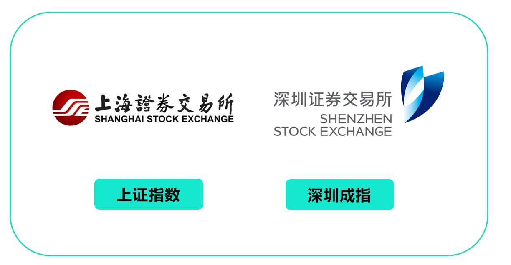

你好, 欢迎继续学习我们的股票课.

股票是一种高回报的投资, 现在你已经知道了普通人为什么要学股票, 可能很多人已经跃跃欲试. 但工欲善其事必先利其器, 如果你是新手, 有一些基础知识必须了解.

## 一种有价证券

上节课已经说过, 股票的本质, 是一种有价证券, 它代表公司的一部分所有权.

投资者买股票, 看中的应当是股票背后企业的价值; 如果只看中股票短期价格波动, 那和投机无疑, 很容易陷入追涨杀跌. 所以, 第一个要记住的点, 我们学习的是投资, 而不是投机.

## 两大交易所

A 股市场有两大交易所, 分别是上交所和深交所.

这两大交易所, 相当于两个公开的"菜市场", 作用是方便大家买进或卖出股票.

在交易所里, 买方和卖方都把自己想要交易的价格以及数量申报到系统里, 系统自动撮合成交. 如此一来, 买卖股票就变得非常方便.

这两大交易所的股票也分别构成了两大指数: 上证指数和深证成指.

我们常说的"大盘", 指的就是上证指数, 反映的是在上交所所有上市股票价格的变动情况.

国家还在两大交易所里划分了不同板块.

其中, 上交所分为主板和科创板, 深交所分为主板、中小板和创业板.

不同的板块, 对于上市公司的要求和标准不同.

主板对上市公司的盈利能力以及规模的要求最高, 创业板和中小板次之, 科创板要求最低.

因此, 我们看到一些巨无霸公司都是在主板上市, 如工商银行、贵州茅台等; 而一些达不到主板上市要求的企业, 会选择在其他板块上市.

总体来说, 主板和中小板投资门槛和难度相对更低, 是更适合新手的一个选择.

不过, 虽然有两大交易所, 但在实际投资的过程中, 我们只需要开通一个股票账户, 上交所和深交所的股票就都可以交易, 还是很方便的!

## 三种手续费

买卖一只股票, 并不是免费的.

它需要交手续费, 分为三部分: 交易佣金、印花税和过户费

交易佣金, 是我们的交易金额乘以佣金率的结果. 一般由证券公司自行定价, 最低五元每笔, 不足五元, 按最低五元/笔收取; 最高不能超过成交金额的万分之三.

印花税, 则按照成交金额的千分之一计算.

我国实行单边征收制, 只向卖出股票的一方收取. 也就是说, 假如你买一万元股票, 并不需要缴印花税, 但是卖出一万元股票时, 则需要交印花税十元.

过户费, 是指股票成交后, 更换户名所需支付的费用. 卖方买方都要缴纳, 费用按成交金额的 0.02‰收取. 即, 我们买进或卖出一万元的股票, 还要另外收取零点二元的过户费.

## 四个交易规则

作为一种受监管的标准化证券, 股票的交易, 并不是完全随心所欲的.

它有四个最基本的交易规则.

### (1)交易时间

股票不是你想买, 想买就能买, 交易时间是有限制的!

所有的周六日加法定节假日, A 股都不开市.

股票的交易时间, 只限于非节假日的周一至周五 9:30- 11:30、13:00-15:00

### (2)交易单位

这里我们补充一个概念, 国际上通用的计算成交股数的单位:【手】

在股票交易过程中, 一般以 100 股为一手进行交易, 购买股票至少购买一手, 也就是 100 股.

### (3)交易制度

第三个规则, 如果当天上午买入 100 股, 下午能不能卖出呢?

在我国 A 股市场上, 这是不可以的.

目前我国股市是 T+1 制度.

T 为成交时间, 1 代表了一天, 就是说今天买进的股票要下一个交易日才能卖.

当然也有 T+0(当天可卖)概念, 不过只限于境外市场. 比如港股美股市场, 实行的就是 T+0 交易制, 也就是当天买进的股票可以在当天卖出, 并且不限制交易次数.

### (4)涨跌停板

我国 A 股市场中, 还有一个特别的规定: 涨跌停板制.

什么意思呢?

就是每一个交易日中, 单只普通股票的交易价格, 相对于上一交易日收盘价格的涨跌幅度不得超过百分之十.

举个例子.

假如一只股票价格是 100 元, 那么当天它最多只能涨到 110 元, 超过 110 元的报价无效.

这个就叫涨停板.

假如这只 100 元的股票当天下跌, 最低也只能跌到 90 元, 低于 90 元的报价也是无效的.

这个就叫跌停板.

## 股票有哪些类型?

沪市深市加起来, 总共有几千家上市公司.

在实际过程中, 想要快速选出适合自己的股票, 我们还需要对股票的类型有个了解.

最常见的分类, 是用收益和风险之间的关系来衡量不同股票.

按这个标准, 我们把股票分成四大类: 蓝筹股、成长股、周期股和概念股.

### (1)蓝筹股

大公司的股票不一定是蓝筹股, 蓝筹股却一定是大公司

蓝筹股公司业绩稳定, 在行业景气和不景气的时候都有能力赚取利润, 基本是各行业龙头, 破产倒闭的可能性小, 也因此投资风险较小.

蓝筹股有两个很明显的特点.

一是总股本大.

一般来说, 因为代表大公司, 实力雄厚, 蓝筹股所对应的总股本也很大, 大都在一百亿以上.

像宇宙第一大行工商银行(SH:601398), 它的总股本就达三千多亿.

二是现金分红稳定.

连续稳定的现金分红, 往往是公司财务和经营状况稳定的表现. 蓝筹股背后的公司大多进入了成熟期, 盈利稳定, 因此现金分红也就相对稳定

如果你不想花太多时间精力去研究股票, 蓝筹股是一个省心的选择.

但正因为规模大, 不易受到人为操控, 蓝筹股的股价波动也很平稳, 不会大起大落. 有一些蓝筹股股价上涨幅度会比较小, 相应收益也就小了. 这也是买蓝筹股的一个小缺点.

### (2)成长股

成长股, 指的是公司处于高速发展阶段, 业绩高速增长的股票.

和蓝筹股相比, 成长股也有两个特点.

一是成长股公司规模不大, 所以总股本往往也不大.

二是不少成长中的公司更愿意把钱投入到公司未来发展中, 所以没有那么稳定的现金分红.

不过, 因为成长股背后一般是成长性较大的中小公司, 随着公司发展壮大, 股价会有明显的上涨. 假如你持有一只优质成长股时间越长, 可能获得的回报也就越大.

反之, 如果成长性不足, 那么持有成长股的你, 不但得不到任何回报, 还可能遭受巨大损失.

这也告诉告诉我们, 成长股所在的新兴市场, 蕴藏着更多的不确定性, 风险更高.

进入 2021 年以来, A 股两极分化, 大盘股强势, 可代表 A 股小盘股的中证 1000 指数走势却疲弱. 这说明市场对中小公司股票的预期, 现在比较悲观.

但我们要辩证地看待.

长期来看, 还是会有一些优质、高成长性的中小公司.

这些优质公司正处于低估期.

随着 2020 年财报披露, 这些优质成长股可能将迎来一个好的投资机会, 只不过这个过程会对我们的选股能力提出更高要求.

### (3)周期股

周期股是指公司的经营业绩明显受到经济周期影响的股票.

有三种行业是典型的周期股.

① 作为工业基础原材料的大宗商品, 比如原油、有色金属、钢铁、农产品、煤炭等;

② 航运业, 比如远洋运输、港口等;

③ 生活必需品行业, 比如汽车, 房地产等;

这些公司所处的行业和宏观经济高度相关.

经济繁荣的时候, 市场对它们的需求非常大, 公司业绩会大幅增长. 而到了经济萧条的时候, 市场需求减弱, 公司业绩大幅下滑, 甚至会出现亏损.

因此, 周期股的股价波动大, 经常大起大落, 呈现出明显的周期性. 假如你在行业最低谷时买入周期股, 而在行业最高峰之前卖出, 阶段性地持有, 可以获得不错的投资收益.

问题在于, 怎么判断行业所在周期呢?

周期股往往大起大落, 万一在错误的周期阶段买入, 那亏损可就很严重了.

这也就成了买周期股的风险所在.

想要在正确的时间买入周期股, 除了要对公司和行业有所了解外, 更要把握宏观经济节奏.

### (4)概念股

什么是概念股呢?

其实就是具有某种特别内涵的股票, 这一内涵通常会被当作一种炒作题材, 成为股市热点.

什么热就炒什么, 炒起来就是概念. 比如共享经济概念、5G 概念等.

为什么大家喜欢炒概念股?

因为概念股有共性, 就具有了非常强大的广告效应. 一只股票自身或许没多大吸引力, 可一旦它被纳入某个概念中, 就会受到全体投资者的密切关注.

很多人都说买概念股就是买情绪.

但情绪这个东西本身存在着极大不确定性, 而且概念股往往受到消息或政策的驱动, 没有实质业绩支撑, 一旦股价上涨过多, 透支了预期, 真跌起来可能也更快.

因此, 概念的炒作有一定的风险.

面对各种诱人的"概念", 投资者一定要认清本质, 回归常识, 理性投资.

## 课程总结

好了, 今天的课就到这.

总结一下, 这节课我们主要学习了股票投资中的一些入门知识.

(1)股票是一种有价证券, 本质代表着企业的一部分所有权, 投资人是企业的股东.

(2)我国 A 股市场有上交所和深交所两大交易所.

(3)在买卖股票的过程中, 要交三种手续费: 交易佣金、印花税和过户费.

(4)在 A 股市场, 股票交易有着特定的交易时间、交易单位、交易制度, 还有涨跌停板.

(5)A 股有几千只股票, 按收益和风险两维度分成: 蓝筹股、成长股、周期股和概念股.

不同类型股票的收益和风险不同, 投资思路也有比较大的区别.

我们要结合自己的精力、知识、风险偏好、投资期限等要素, 选择出适合自己的类型.

那面对具体的股票, 我们又该怎么判断分析呢?

这就是我们接下来很长时间里要重点学习的内容了, 下节课见.
