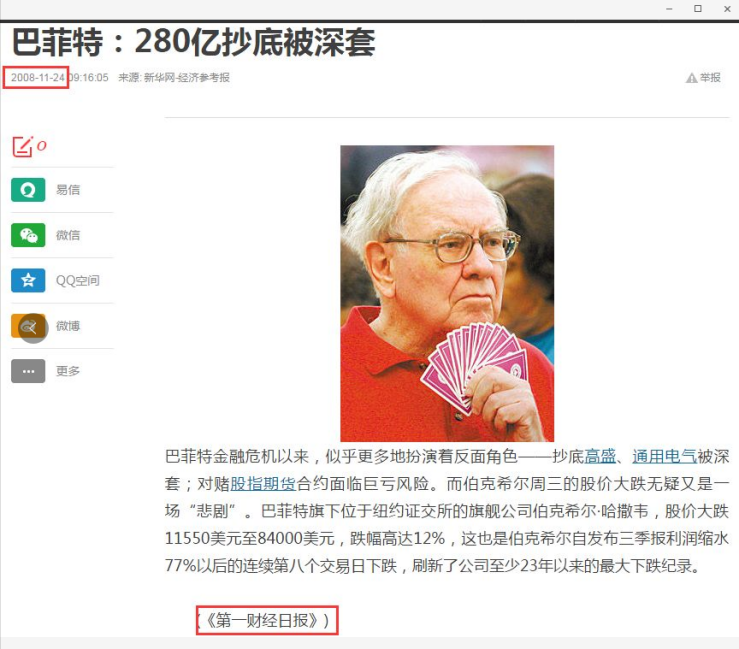
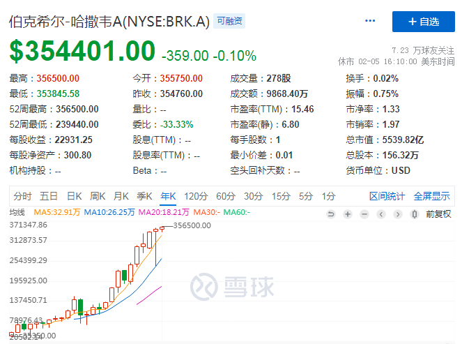
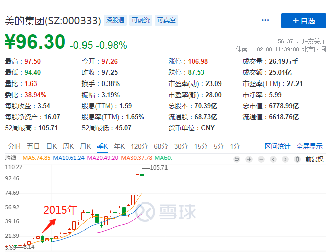
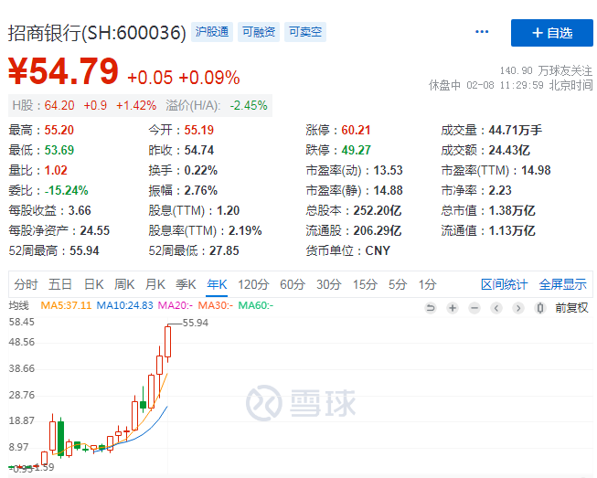
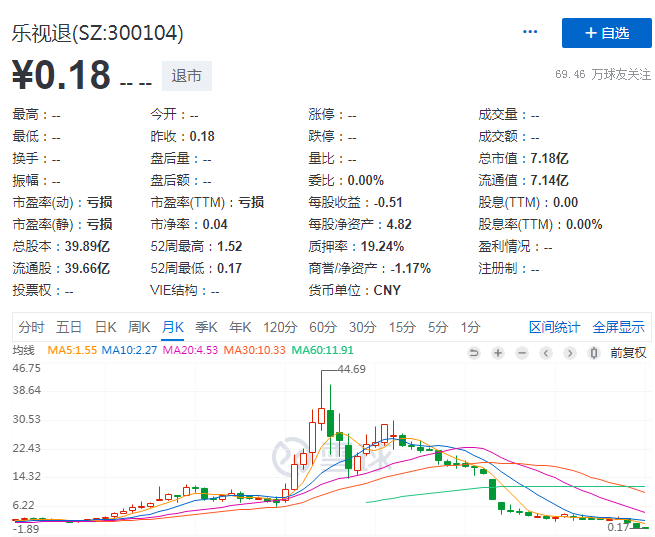

你好, 欢迎继续学习我们的股票课. 这节课我们来讲下价值投资:

价值投资的本质就是找到一家内在价值不断增长的公司, 并长期持有.

价值投资的核心是什么?

价值投资的核心是赚企业创造出来的价值. 其中大部分权重来自企业长期、稳定、持续、复利式的利润与现金流增长创造的价值. 简单来说, 价值投资就是在时代中最具成长潜力的产业里, 找到最具壁垒与持续性的商业模式和持续创造价值的企业.

首先给大家看一段话, 这是国内顶级价值投资私募大佬 2006 年讲的一段话, 该私募大佬在充满投机氛围的中国股市前 30 年中, 他一直坚持价值投资, 从 8000 元起步到过亿资产, 是真正的赢家:

"在我的投资过程中, 总结下来, 每次重仓买入的股票都是被深套在里面, 这些经历能使我对这些过程印象深刻, 第一次套我的是深发展, 大约在 94 年我开始买入深发展, 当时深发展的股价已从高时的一百元跌到当时的九元多, 当时我就开始买, 买入后它也继续下跌, 最后好像跌到六元, 我也没有卖, 后来好像涨到了六十以上.

第二次时, 买入香港的一支股票, 发行价是一块二毛八, 跌到五毛五, 我开始买入, 买入后股价最低跌到两毛钱, 这支股票最终让我赚了数十倍.

04 年开始买茅台的时候, 茅台当时价格是三十元, 我买完后, 股价跌到了二十元, 五粮液也是从十元跌到六元多, 07 年我开始买入同仁堂科技, 当时的价格是十四元, 08 年金融危机时, 股价曾到过四块多, 但今天复权价已超过了四十五元

回想以前的经历, 几乎能让我赚大钱的股票都是要深套我, 我买了就跌, 好象没有例外.

另一个规律就是, 我发现我认识的一些人, 他们也知道我买了什么, 但是他们说要等更便宜的价格才买, 几年过后, 我问他们买了没有, 所有的人都说一股没买, 但他们还要问我现在能不能买, 我说现在涨了几倍了

这就是人性, 每个人都觉得他自己最聪明, 都不会觉得自己笨. 我就是笨人笨办法认为价格合理就随机买入, 有钱就买, 结果就是股份越买越多, 越买越套, 但现在的结果过去套住的都是金项链, 我发现这样的规律不光在 A 股市场存在, 在港股欧美股市都有此规律. 我已经习惯了买入被深套的这种结果, 好象买套是我愿意见到的结果, 买后股票往上涨我反而不高兴, 涨了我可能买得少了, 对我来说数量比价格更重要."

看了以上的这段话, 可能你觉得不可思议, 这个世界其实并没有股神, 只有价值发现者. 巴菲特也如此, 每次买入都会被深套, 但是因为他们都具有价值发现的笃定, 因为坚信股票的内在价值, 市场长期看就是称重机, 总会价值发现而回来. 所以任凭市场如何跌, 他们始终稳若泰山, 毫不动摇.

2008 年美股金融危机的时候, 巴菲特抄底高盛和通用电气, 买入后这两个股票继续下跌超过 30%, 最高可能接近 50%, 也就是股神巴菲特被深套 50%, 但是巴菲特依然坚定持有, 并且公开宣言, 越跌越买.

因为他在买这个股票之前已经对这家公司了如指掌, 现在低估了, 市场总有一天会发现价值, 并且给他带来丰厚利润. 果不其然, 这两只股票后来给他带来了超过 100 亿美金的利润. 我还找到了国内知名媒体在 2008 年笑话 "股神"的报道.

大家看看上面报道里面, 伯克希尔的股价跌到了 8 万多美金一股, 最新的伯克希尔股价是 35 万美金一股(如下图), 也就是你金融危机投资伯克希尔这种好公司, 10 年时间也赚了 3 倍, 请问你们短线进短线出, 这 10 年有 3 倍吗?

再好的公司都会有经济困难的时刻, 都会有波动的时刻, 不可能是直线上涨, 一个正常的市场肯定会有起伏波动, 要理性看待股价的涨跌.

我们再去看看 A 股的那些好公司, 回头去看看, 不管上证指数跌幅接近 70%的 2008 年, 还是 2015 年百年一遇的大股灾, 哪怕你是最高位买入的, 回头去看看也只是一个 "小土堆"而已. 真的有种登高之后"一览众山小"的感觉

再看几个 A 股的实例:

1、美的集团, 2015 年的大跌几乎已经看不出来了.

现在看美的集团, 之前的大跌是不是只是一个小土堆.

2、招商银行, 2008 年跌幅较深, 现在看来都是买入的最佳时期.2015 年的股灾更是微不足道.

我就不一一例举了, 如果你觉得以上案例没有说服力, 大家可以去看, 只要它是一个行业的领头羊, 年度财报没有亏损过的, 能够长期持续分红的, 净资产收益率在 20%以上的绩优股, 从长线角度来分析几乎没有亏钱的可能.

相信你看过这篇文章后, 你以后期盼的是"熊市"来临, 大熊市就是机会, 果断买入后从此不会再担心亏损的问题. 最后我想说的是, 如果你手上持有类似于这样的好公司的股票, 那么不用担心了, 安心上班, 我们一起追寻价值洼地, 享受资本红利.

那么价值投资的最终核心到底是什么? 其实就是选公司, 选择优质的好公司才是最最核心的事情.

我们再分析贵州茅台这家公司, 他的生意模式和品牌护城河已经无人能敌, 所以具有持续赚钱的能力, 所以股价一飞冲天, 地球人都已经知道茅台是好公司, 为什么我们不买茅台呢?

因为太"贵"了, 很多人喜欢买便宜的股票, 乐视网从 44 元跌到 4 元的时候打开跌停, 很多人冲进去了, 结果跌到 0.18 元钱, 现在已经退市了. 也就是 44 元跌了 90%后, 你拿了 100 万进去"抄底", 如果持有到退市之前卖出, 亏损 95.5 万, 以后 A 股一定会有越来越多的垃圾公司退市.

所以买股票不要看价格便宜还是贵, 一个烂公司, 那么你的买点再低, 还有更低. 而优质的公司不怕价格高, 贵州茅台 2007 年年底大牛市的顶端, 股价突破了 200 元大关, 大家都觉得他已经到顶了, 不可能再涨了, 让你选择, 你肯定恐高.

但结果呢? 即便是当时 200 元的"天价"买入, 到现在 (2020 年 2 月初)的收益也超过 10 倍.

对于做价值投资的人来说, 选择一个好公司比选择一个好价格更重要. 如果你选择了贵州茅台类似的股票(上面举的例子几乎都是), 那么你只要闭着眼睛买入, 肯定比你们短线进短线出, 辛辛苦苦几十年赚得多, 而且快乐, 不用那么焦虑.

即使你买在高点, 长期持有也会有不错的收益. 当然, 如果你选择大熊市对这种公司下手, 那收益更是了不得.

不过如果短期买在高位, 可能需要漫长的等待才能回本, 所以巴菲特宁可大部分时间持有现金, 等待机会也不会猴急买入, 因为几十年的经验告诉他, 不用着急买入, 选择一个好机会, 对真正的好公司下手, 那么会赚得更多.

价值投资既然是这么简单的事情, 为什么很少有人这样做呢?

1、大部分人过于关注眼前的价格波动, 并且预测股价的涨跌, 没有投资标准, 甚至让股价的波动影响到自己的情绪, 股价涨了期待大牛市, 慌里慌张杀进去, 套在了高位. 股价跌了, 认为股市是骗人的, 卖在了最低点. 实际上关注短期股价波动根本没有意义.

2、大部分人对于自己买入的股票并不熟悉, 买房的时候还知道去看看地段、周围学校、环境, 但是买股票很多时候都是听别人说的消息, 也不去阅读这家公司的财报, 研究这家企业到底做什么的? 靠什么赚钱? 背后的商业模式能不能持续? 能持续多少年, 一下子就买入, 就寄希望于这个股票能上涨.

这会导致什么结果呢? 如果买入之后股价下跌, 由于自身不了解这家公司, 这个时候市场上很可能都是对股市的悲观看法, 于是承受不了, 卖了出去, 亏损. 如果股价上涨, 还是由于不了解这家公司, 认为股价已经涨了很多了, 于是经不住诱惑, 卖了出去, 错过了这家公司未来的上涨.

这两种情况都可能让你最终没有坚持下去, 倒在了价值投资的路上. 同学们现在能做到这两点吗?(其实掌握技能就可以做到, 这就是为什么我们学习股票课程的原因, 这将让你在未来的人生中受益无穷)

其实巴菲特为什么成功? 第一是因为, 他在很年轻的时候想明白了很多道理(掌握了技能), 并用一生的岁月来坚守. 当然, 这个"坚守"除了他的思想以外, 还有他的商业模式, 甚至在碰到危机的时候, 巴菲特还能够再买入, 这就是他与一般投资经理的最大不同点.

第二是因为巴菲特赶上了好的时代, 美国在过去的 100 年虽然中间经历过几次大的危机, 但是整体经济是飞速发展的. 今天的中国又何其相似, 虽然短期经历经济结构调整的风险, 但是长期依然是非常乐观的.

而现在的同学们完全具备巴菲特当时的条件, 大家学习的股票课程也是为了让大家选出好公司.

在一个长期向上的经济体中, 寻找到一个有核心定价权的公司, 买入并长期持有就能获得非常不错的收益.

从 A 股成立以来的 30 年中, 很多领一时风骚的人物, 但风吹浪打后就几乎都不见了, 唯一长存的就是价值投资者, 未来还会是这样!

这不仅仅是中国现象, 在其他国家也是如此, 投资是一个世界语言. 比如说我们去美国, 会买 Facebook.、亚马逊、谷歌、苹果、微软等等美国的核心资产.

那么美国人来中国也是买茅台、五粮液、美的、福耀玻璃、海天味业、伊利股份等这样的中国核心资产.

最后总结下:

价值投资的本质就是找到一家内在价值不断增长的公司, 并长期持有.

只有与伟大企业共同成长, 才能够穿越时间的河流. 对巴菲特来说, 他就是一直在寻找可以持续创造财富的公司, 然后牢牢抓住并坚持伟大的公司, 比如茅台, 他们就类似银行, 你把钱存在这些企业里, 能帮助你实现复利增长.

我们抛开行情起伏不管, 只要你能充分的研究企业, 抓住企业内在价值, 并在极具安全边际的位置下注, 在过分高估的时候抛售, 那么胜利终会倒向我们这一边!

知易行难, 大部分人的问题并非不知道价值投资, 而是不会行动和执行, 价值投资需要相应的能力匹配, 否则是一句空话.
