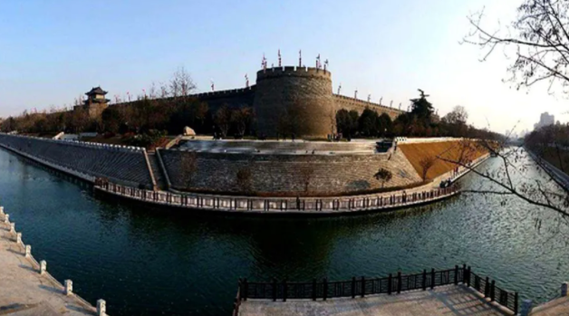

说到护城河, 这个概念大家应该都耳熟能详.

它最早是在 1993 年, 巴菲特致股东的信中正式提出的. 当时他是这么说的, 像可口可乐和吉列这样的公司, 面临的风险要比什么计算机公司小多了.

"对我来说, 最重要的是弄清楚公司周围有多大的护城河. 当然, 我喜欢的是一座大大的城堡, 环绕着一条有食人鱼和鳄鱼的护城河."

## 护城河的本质

为什么护城河非常重要?

咱们举个例子

你在一条街上开一个饭店, 很赚钱, 日进斗金. 于是, 大街上不久又新开一家, 口味好价格还更便宜, 你的生意一下子差了不少.

过几个月, 又一家新店开张, 口味好价格便宜服务还特别好, 你的生意一下子一落千丈.

这就是没有护城河的生意: 曾经很赚钱, 但是没法持续.

没有护城河的股票, 都不值得长期投资, 也会像这个饭店一样昙花一现, 早晚被竞争对手把利润率拉下来.

护城河的本质是一种我有他无的商业资源, 能有力地排除竞争对手.

故宫内的组织看作是一个企业, 皇帝是大老板, 他为了防止敌人(竞争对手)入侵他的领地, 就修建了城墙、 挖了护城河.

护城河是避免你被竞争对手模仿的东西: 产品特性, 销售渠道和品牌形象等, 就像是挖了一条深深的护城河, 别的竞争对手根本打不进来, 所以能牢牢守住市场份额.

事实上, 哪怕最优秀的牌手拿了一堆小牌, 也打不赢满手王炸的业余玩家. 这就是巴菲特所说的, 要买傻子都能经营好的公司, 因为他们拥有强大的护城河, 管理者的影响微弱, 其实就是这个道理.

## 四大护城河

所以要想判断清楚到底是真实护城河还是虚假护城河, 一定不能停留在表层, 要去深入分析公司的经营结构.

我们选出最重要的四大类分别是无形资产、转换成本、网络和规模效应、科技实力

### 无形资产

第一种呢, 叫做企业拥有的无形资产, 如品牌, 能让该企业出售竞争对手无法效仿的产品或服务.

我们有一节股票课讲过消费行业中牛股频出, 而且穿越周期股价长青, 重要原因就是因为有强大的护城河, 品牌价值

中国第一品牌: 茅台, 在 2018 年的时候, 胡润排行榜做了一个中国品牌价值的排名, 茅台高居榜首, 品牌价值超过两千亿.

茅台靠参选评奖, 然后绑定了红色文化, 反复强调老一辈革命家对茅台的认可, 比如说周恩来总理夸赞说茅台比伏特加好喝, 能消除疲劳, 慢慢地, 国酒形象已经深入人心了, 五粮液和汾酒追也追不上.

加上茅台工艺流程长, 总生产周期长达五年, 一上市经常面临供不应求, 于是很多人都养成了收藏茅台的习惯, 成了身份的象征, 一提到高端白酒, 大家首先想到的就是它, 如果送礼, 一定要送茅台

这就是它强大的品牌价值构建起了深厚的护城河. 品牌是一种很难复制的无形资产, 贵州茅台、五粮液、云南白药、海天味业等很多牛股, 都来自于强大的品牌. 他们占领着用户心智, 很难被改变.

### 转换成本

第二种护城河, 叫作转换成本, 简单来说, 就是企业的产品或服务让用户难以割舍, 形成了某种依赖, 以致于就算出现了另一家公司, 提供类似的产品, 价格更便宜, 用户仍然不愿意迁移过去.

苹果公司是个典型的例子, 凭借其 iOS 平台, 构造起各式各样的转换成本, 从而让公司得以保留大部分的现有用户.

iOS 平台的封闭与独特性使得用户只能在这个平台构建起的闭环中购买 APP、传输资料的 icloud (它可以在所有的苹果设备上同步传送用户的媒体、图片、留言及其他内容)

在该平台获得的内容并不能传输至安卓平台或其他移动设备上使用. 拥有一台装载 iOS 系统的设备一一比如一台苹果平板电脑的用户不太可能会从使用苹果手机转换到使用安装安卓系统的手机, 那会妨碍他同步传输数据.

用户每新增一台苹果设备, 比如电脑或苹果手表, 转换成本还会进一步提高. 这些用户不会单单因为价格因素就弃用苹果公司的产品, 转用其他厂家的产品, 否则他们就要付出高昂的转换成本.

### 网络和规模效应

第三种护城河呢, 就是网络效应, 随着用户数量增加, 产品或服务的价值也在同步提升. 每增加一个用户, 对所有用户都增加了使用价值.

最常见的网络效应的例子是通讯网络. 比如电话, 安装电话的人越多, 使用电话的人能联系到的人就越多, 电话对他的价值就越大. 类似的通讯网络还有 IM 和社交网 , 如 facebook 和微信 .

另外一种典型的网络效应来源于双边市场. 比如包含创作者和读者的内容社区, 如微博、B 站, 还有服务、商品的双边市场, 如滴滴、Airbnb 、AppStore 等.

比如腾讯公司. 假如说现在出现了一款新的社交 APP, 比微信更加好用, 界面更加简洁, 朋友圈也不会有广告打扰, 问你一个问题, 你愿意放弃微信, 改用新的软件吗?

大多数人的回答, 应该都是不会. 因为你的亲戚朋友, 同事同学等一切社会关系, 都已经沉淀在微信里了, 大家不愿意迁移到新平台, 且微信沉淀了大量的内容创作、小程序等等, 用户越多, 价值越大, 几乎成为社交的基础设施的垄断地位.

### 科技实力

第四种护城河就是科技型公司的专利、特许经营权等

另一节课讲到的医药行业牛股, 恒瑞医药、康泰生物、 信达生物、君实生物这些则具有创新药物的专利权, 达芬奇手术机器人(NASDAQ : ISRG)具有手术机器人的独家生产技术, 这些企业可以在一段时间内享有高额的利润率.

不过专利是有期限的, 并且竞争对手也可以发明出类似或者更好的技术. 因而, 专利权可以让企业享有护城河, 但没有品牌的护城河那么宽.

实际上护城河是动态的、都是有生命周期的, 所以所有的品牌、渠道、技术规模、知识产权等, 都不足以成为真正的护城河.

## 实战拆解护城河

让我们学以致用来分析具体的案例, 看看这家公司有没有护城河?

这家公司叫片仔癀, 是一家做中药的上市公司, 主营是片仔癀药, 一颗很贵差不多要五六百块钱, 治疗肝病, 当品牌的日用品, 比如片仔癀牙膏、珍珠霜等等.

我们先来判断硬指标:roe

从投资收益的角度出发, 如果有护城河的企业, 一定是 ROE 长期优秀

可以看到, 从 2003 年上市到今天, 片仔癀的 ROE 始终为正而且一半的年份都超过了 20%, 可以说是不折不扣的优质公司了. ROE 这个指标能到 20%, 是非常不容易的,

A 股三千多家上市公司能做到连续十年 ROE 都超过 20% 的, 只有 12 家, 每一只都是长线大牛股, 其中最优秀的就是茅台, 基本能稳定在 30%以上.

它的优势是不是来自于我们前面提过的那四种护城河?

同样都是针对大众的消费药品, 片仔癀和东阿阿胶对比下, 片仔癀有护城河. 因为阿胶的产品容易被模仿, 竞争对手太多了, 但是片仔癀很难被模仿.

片仔癀拥有国家双绝密配方, 且能使用天然麝香.(片仔癀主要成本来自麝香, 而麝香是雄麝香囊中的分泌物, 一头雄麝年能产的香也就不到 30g, 而且目前全国不到十万头, 可以说是濒危保护动物.05 年开始, 国家就加强了管控, 只允许少数几味药使用天然麝香, 而片仔癀是这少数中药之一.)

其它企业知道片仔癀的生产工艺吗? 不知道.

其它企业知道片仔癀的配方吗? 不知道.

其它企业能使用天然麝香吗? 不可以.

片仔癀有这样的独一无二优势, 顺势不断提价, 它的产品几乎没有竞争对手可以生产, 可以说是非常宽的护城河了.

所以片仔癀是有护城河的优秀企业之一.

巴菲特致股东的信提到过:

"投资的关键不是评估一个行业如何影响社会, 或者成长空间有多大, 而是判断这个公司的竞争优势和优势的持久性. 能给投资者创造回报的是有宽广护城河的产品和服务."

企业必须要有一项核心竞争力护城河, 必须是他的对手短期之内无法复制的, 可以是他的某项专利技术, 也可以是它的资金优势, 也可以是他的某种优势, 比如品牌优势, 或者营销优势、规模优势、专利技术、网络效应等等, 从而享有超额利润.

## 总结

今天的课程就到这里. 总结一下:

护城河的本质是一种我有他无的商业资源, 能有力地排除竞争对手. 没有护城河的股票, 都不值得长期投资, 就会像这个饭店一样昙花一现, 早晚被竞争对手把利润率拉下来.

我们选出最重要的四大类分别是无形资产、转换成本、 网络经济、科技实力

第一种, 企业拥有的无形资产, 如品牌

第二种, 转换成本, 就是企业的产品或服务让用户难以割舍, 难以迁移过去

第三种, 网络规模效应

第四种, 硬核科技、专利、特许经营权等

衡量护城河, 评估护城河最重要的是看企业的价值创造

有一些公司或因为进入行业早、或具有一定的技术壁垒, 但随着消费者需求变迁、科技迭代等等原因, 护城河并非坚不可摧科, 企业竞争力被削弱.

当取代智能手机的新技术出现时, 原来的霸主诺基亚并没用及时跟上.

当微信取代成为社交平台的"基础设施"时, 原来的飞信、QQ 并没有及时跟上.

消灭你的不是对手, 是一个时代.

护城河是会变的, 世界上只有一条护城河, 那就是企业家不断创新, 不断地疯狂地创造长期价值.

最后给留一道思考题: 除了我们今天举过的案例你还知道哪家公司具有护城河? 它是四种护城河中的哪一种呢?
