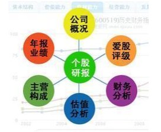
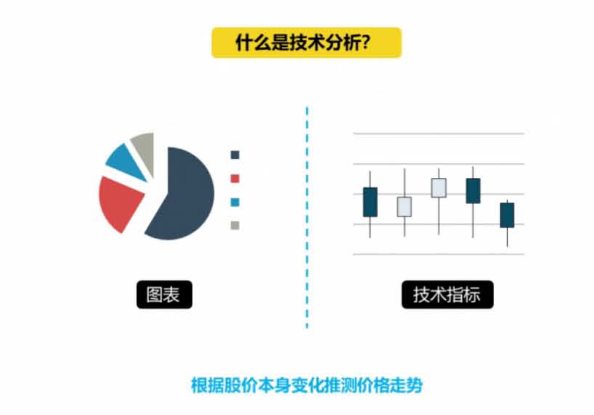

同学们大家好, 从今天起我们的股票课程就要迈入第二阶段了, 课程的难度在不断加大, 老师提供的干货也会越来越有价值, 小伙伴们要努力跟上哦~

我们进行股票投资, 有成千上万种方法, 不过主要思路分为两大门派, 基本面分析和技术分析. 概括来说, 基本面分析关心的是公司本身的价值, 而技术分析关注点是股价本身的变化.

基本面分析和技术分析, 哪个好呢?

这个问题多年来一直争议不断, 今天我们就来详细说一说, 这两大流派.

下面给大家先讲解基本面分析.

## 基本面分析

通俗来说, 基本面派就是希望在好行业中选出一家好公司, 然后在他价格便宜的时候买入好行业.

基本面是指对宏观经济、行业和公司基本情况的分析, 包括公司经营理念策略、公司报表等的分析, 就像一个人的五观, 高矮胖瘦, 性格特点等一些基本信息, 它包括宏观经济运行态势和上市公司基本情况.

宏观经济运行态势, 反映出上市公司整体经营业绩, 也为上市公司进一步的发展确定了背景, 因此宏观经济与上市公司及相应的股票价格有密切的关系.

上市公司的基本面, 包括财务状况、盈利状况、市场占有率、经营管理体制、人才构成等各个方面.

基本面分析, 主要有以下四个作用和优势

### 四个作用和优势

### ① 基本面分析可以判断公司长期的股价运行趋势方向.

在证券市场里, 股价短期内的涨跌和基本面有时候关系不大(股价短期涨跌受市场情绪和资金进出推动影响较大),

但是长期必然是同向平行的运行. 简单的说就是股价几天、几周、几月的涨跌, 受市场情绪波动而造成的资金进出影响股价的涨跌,

但是时间拉长到一年、两年, 甚至几年、几十年来看, 股价的涨跌运行方向一定是和公司业绩增降方向一样的.

长期来看一家业绩一直持续快速增长的公司, 股价也一定是持续快速上涨的.

所以通过基本面分析判断公司业绩长期的增降方向和增长的速度, 从而能够掌握股价的长期涨跌趋势方向.

### ② 基本面分析不必盯盘, 从而节约大量时间.

基本面分析往往在初期首次全面分析一家公司时比较费时费力,

而在完成首次全面分析后只需要对公司的一些基本面变化的持续跟踪就好, 一家公司基本面变化一般都是一个缓慢的过程,

普通投资者有足够的时间跟踪分析, 只需抽部分时间留意公司公告就好, 有条件的可以对公司进行调研那就更好, 当然如果你买的公司在生活中能接触到公司产品, 那么调研就更方便了.

### ③ 基本面分析利于投资者心态稳定, 涨跌不慌.

基本面分析做为长期分析的有效方法, 是基于基本面变化做出投资决定, 而减轻对股价短期上涨下跌的关注, 心态自然平和, 涨跌不慌不乱.

### ④ 通过基本面分析可以判断公司的估值, 从而判断公司股价目前低估还是高估了.

当我们通过基本面分析大致判断出高估或是低估的范围后, 就可以做出相应的买入卖出投资决定.

再来说技术分析

## 技术分析

和基本面分析完全不同, 技术分析, 是通过研究以往价格和交易量数据, 来预测未来的价格走向.

所以呢, 技术分析侧重于图表与公式的构成, 通过这些数据, 捕捉趋势, 估测市场周期的长短, 最终识别买入或卖出的机会.

下面, 老师先为大家介绍四种主要的技术指标

### 四种主要的技术指标

### 1、量价关系

量价关系分析是我们做技术指标分析的基础, 因为与价格联系最紧密指标就是成交量.

成交量和价格之间最原始的逻辑顺序是, 只有成交量的放大, 才会使得市场价格上涨. 而市场价格的上涨又进一步引起市场投资者的心理效应, 纷纷投身市场交易, 成交继续出现变化.

所以大家一般利用成交量来做市场价格运行趋势分析.

### 2、分时图

分时图就是整个市场以及其中若干时间段的价格运行周期行情变化图, 在分析市场关系转化的过程中占据着十分重要的地位.

一般来讲, 短线投资者能够从分时图的变化上对价格的瞬间转换做出及时反应, 这也是分时图能够真实反应市场价格变化的重要特征.

### 3、K 线

K 线图是技术分析的基础, 也是大多数散户找寻最佳买卖点的重要途径.

它记录某一市场价格在周期内的行情变化图, 它记录了价格的开盘, 收盘, 最高, 最低 4 个位置数值, 周期的大小从分钟到月年.

### 4、均线

均线, 即我们通常所说的 MA 和 MACD, 这种理论和成交量一样能够比较真实客观地反应价格的运行情况, 具备较高的稳定性, 广受投资者喜爱.

通过这些指标, 技术分析能够帮助投资者较直观的做出判断, 大多数人判断股票走势都会选择参考技术分析的结果, 但技术分析是存在局限性的.

所以老师要特别提醒大家, 千万不要沉迷于技术分析, 它有几个常见的的弊端:

### 常见的的弊端

### 1、对长期走势作用不大

技术分析适合分析股票短期走势, 决定股票长期走势的还是政策、经济运行环境、市场动态等等因素. 单纯运用技术分析来准确预测长期股价走势准确性不高.

### 2、有时候会出现技术陷阱

主力会利用技术指标制造上涨的假象, 来迷惑投资者做出错误的判断. 在技术角度这种就骗线. 股票上涨到某个阶段, 拉个涨停板或制造金叉来让投资者进场接盘

### 3、部分指标滞后

实盘会发生这种情况, 股价走出来了, 技术指标才发出上涨信号. 这个过程是比较滞后的. 并且传统指标本身就是数据滞后, 就会做出错误判断.

### 4、受环境影响

某一种技术分析方法在牛市成功率很高, 但到了震荡市、熊市成功率很低. 受环境影响比较大, 所以很难稳定赚钱

很多股民一开始炒股选择的就是技术分析, 因为他们看到技术分析好像赚钱挺容易, 所以也想跟风, 但是大多数人不仅赚不到, 反而赔进去不少, 这又是为什么?

技术分析这一派并不好学, 因为你需要不断地战胜更多人.

在技术分析者眼中, 股票就类似这样一个玻璃珠, 它在人们手中换来换去, 大家更关注的是如何赚其他人的钱, 而非公司本身的价值.

但是归根结底, 推动股价上涨真正的原因是什么? 是资金, 主力, 概念, 支撑线? 老师可以告诉大家, 这些都不是, 而是股票背后的这家公司内在价值的不断增长.

所以说, 接下来的课程中, 老师会给大家重点详细拆解基本面分析而非技术分析, 同学们要做好准备, 努力跟上老师噢.

今天的课程就上到这里, 同学们有任何问题都可以在群里提出, 咨询班班或者和小伙伴们一起交流进步, 加油!
