你好, 欢迎继续我们的股票课.

我们说买股票, 本质上买的是股票背后的企业.

企业发行股票筹集资金, 但企业能不能把借来的钱用好、产生更多价值, 运营能力怎么样这些就是我们需要关注的问题. 所以, 在买股票时, 一定要了解企业背后的财务状况.

今天, 我们就来学习资产负债表, 它是最重要的三张财务报表中的一张.

## 资产负债表是什么?

先来说说, 什么是资产负债表.

资产负债表记录了一家公司在某一时点的"家底". 比如说年报, 那就是 12 月 31 日这个时点公司所承担的资产和负债情况, 一般每年的 4 月, 是年报的密集披露期.

要理解资产负债表, 要记住: 资产=负债+所有者权益

等式左边, 代表公司的钱用在了哪. 等式右边, 代表公司的钱来源于哪.

有多少钱投入进来, 相应就会有多少钱用出去, 这个等式永远成立.

举个简单的例子.

小星喜欢美食, 想要开一家餐厅, 怎样才能开一家餐厅呢?

最关键的问题是钱!

小星手头有 40 万, 好像有点不太够, 于是朝朋友借了 60 万, 约好 5 年还清, 加起来共 100 万.

然后, 小星注册了自己的一家公司. 花 70 万买下了一块小店面、弄了厨具设备等. 再花 10 万买了一些食材、半成品菜. 还剩 20 万资金在银行卡里.

这个时候, 这家餐厅一张简单的资产负债表就已经成型了.

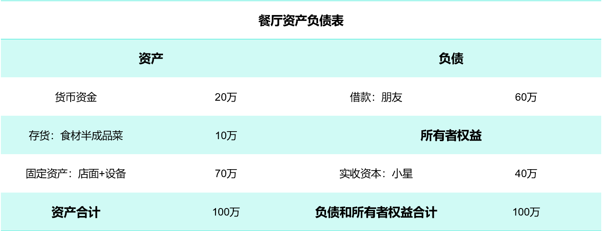

一张资产负债表有非常多琐碎的项目, 但这些项目, 从上到下的排列符合一个基本规律: 流动性. 流动性强的在前面, 流动性弱的在后面.

还是以小星那家餐厅为例.

20 万货币资金最灵活, 可以直接用, 属于【流动资产】

10 万食材存货能比较迅速变现为资金, 也属于【流动资产】;

70 万店面设备没那么容易脱手卖掉变现, 属于【非流动性资产】

在负债端, 小星向朋友借了 60 万, 约好 5 年还清.

【流动负债】是指在 1 年内就要偿还的债务, 也就是 12 万,

剩余 48 万偿还期在 1 年以上, 则属于【非流动负债】;

把这些项目按流动性规律排列, 我们可以得到一张更规范一点的资产负债表.

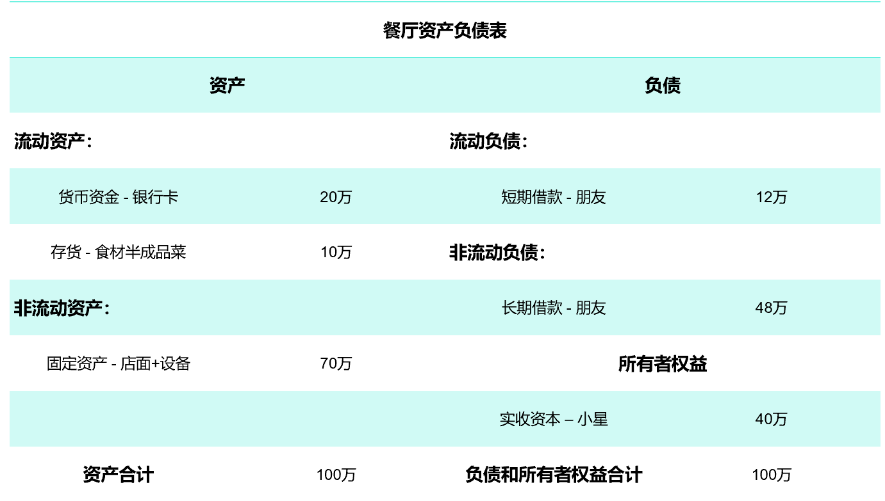

## 哪里找资产负债表?

那么, 哪里可以找到一家公司的资产负债表呢?

我们可以在公司官网找, 也可以借助一些财经网站(雪球/同花顺等)或信息披露网站.

比如说, 巨潮资讯网.

它是中国证监会指定的信息披露网站, 包括了沪深两市所有上市公司的财务报表.

以 A 股"巨无霸"贵州茅台(600519)为例.

打开巨潮资讯官网, 在首页搜索栏, 搜索茅台的股票代码:600519

里面会有贵州茅台公开披露的各种信息, 包括高管变动、财务数据、历史分红等.

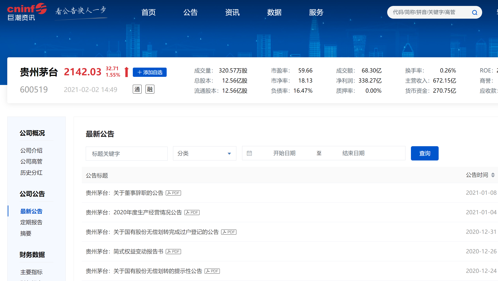

我们可以在公司定期公告里面下载完整的 pdf 财报.

也可以直接看简要的财务指标.

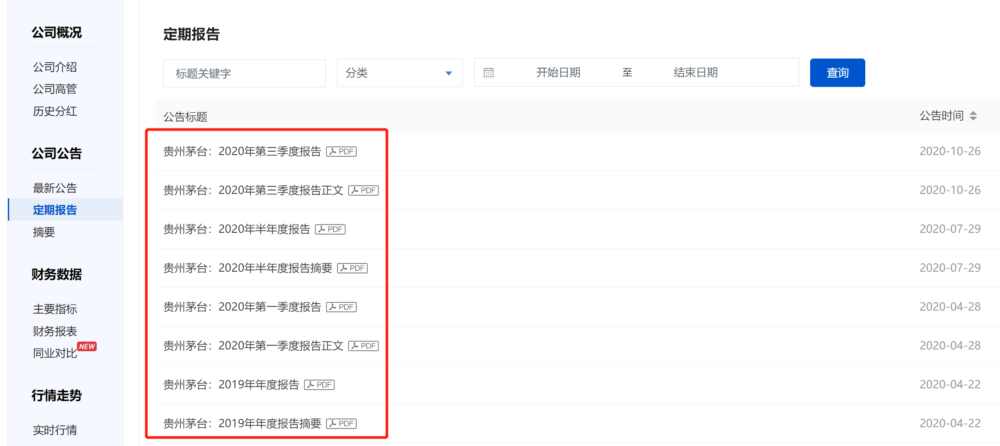

## 怎么看资产负债表?

现在, 我们找到了一家上市公司的资产负债表, 那怎么用它来实操呢?

### ① 先来看资产端.

对于一家公司来说, 往往有四个重要的资产: 货币资金、应收账款、存货、固定资产.

在前面小星餐厅那个例子中, 我们已经知道:

20 万在银行卡的钱是【货币资金】;

10 万食材半成品菜是【存货】;

70 万店面+厨具设备是【固定资产】

那什么是【应收账款】呢?

就是企业向客户销售了商品、提供了服务, 还没有收回来的钱.

还是以茅台 2019 年财报为例.

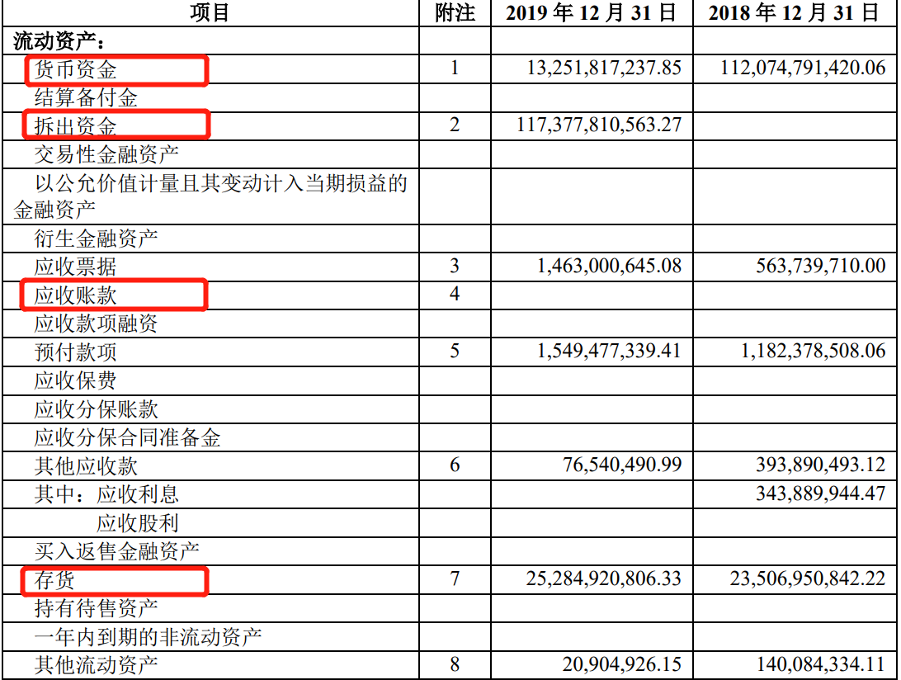

【固定资产】为 151.4 亿, 这个数据并没有什么特别.

【货币资金】132.5 亿, 加上存放在集团一家财务子公司的货币资金(它被列入到"拆出资金"里), 两项共 1305 亿. 也就是说, 茅台账面上的货币资金实际上有千亿.

【存货】约 252.9 亿, 主要都是还没有卖出的酒.

【应收账款】为 0, 这说明没有客户欠款, 该收的钱都收回来了

### ② 再来看负债端.

茅台的负债, 主要集中在流动负债上

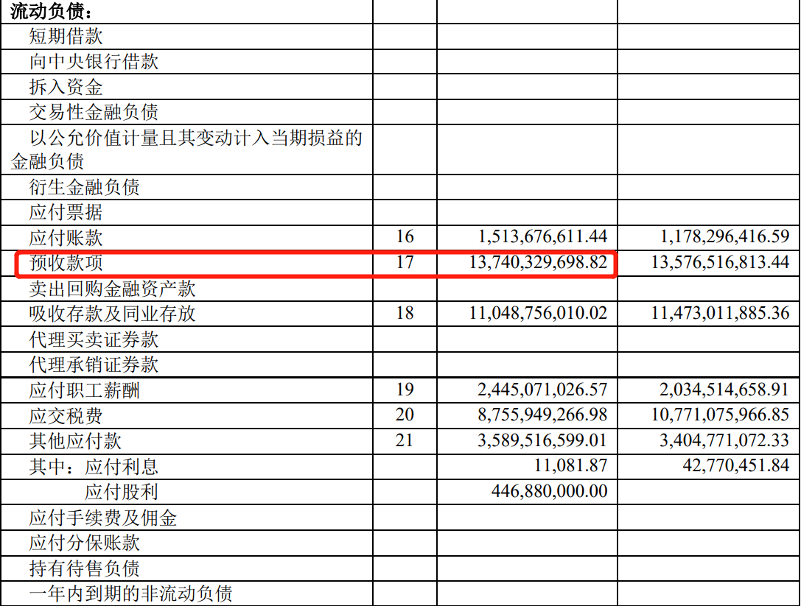

2019 年茅台流动负债有 410.9 亿, 其中光【预收款项】就有 137.4 亿.

什么叫【预收款项】呢?

就是企业预收的订金或部分货款, 也就是说, 有大量客户提前预订了茅台酒.

前面我们说到, 茅台 2019 年【应收账款】为 0

两者一对比, 可以说明什么?

说明茅台酒需求旺盛, 供不应求, 客户很看好它, 提前预订, 该收的钱也全部收回来了. 不仅没什么还债压力, 还反映出它很优秀, 是很多企业梦寐以求的数据.

在负债端, 除了看一家公司有哪些负债, 更重要的还要看一个指标: 资产负债率.

这个指标经常用来衡量一家公司的偿债能力、有没有财务风险.

一般而言, 负债越高的公司经营风险越大.

负债率在 30%~50%之间是比较正常的, 高于 60%的要警惕. 茅台 2019 年负债率为 22.49%, 作为一个这么赚钱且收益稳定的大公司, 这个负债并不算高.

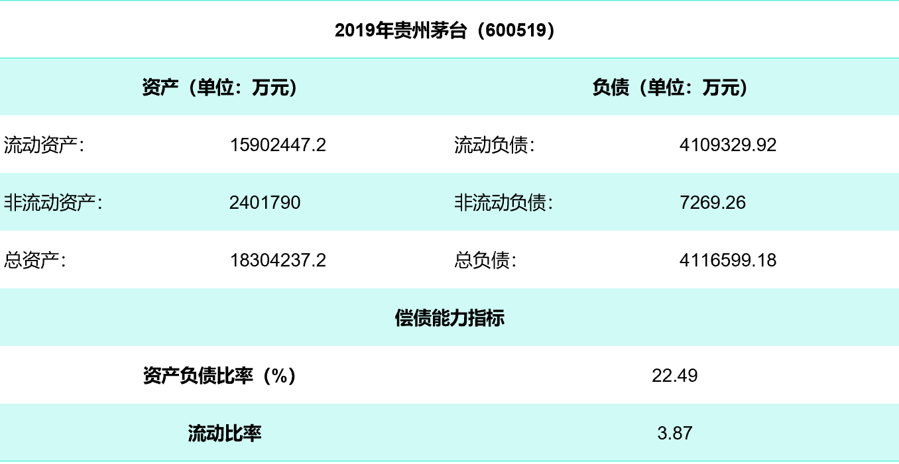

除了负债率, 衡量企业偿债能力还有一个常用指标: 流动比率.

流动比率=流动资产 ÷ 流动负债.

这个比率, 最起码要大于 1

大于 1, 说明流动资产可以覆盖流动负债; 小于 1, 说明企业的流动资产不足以偿还流动负债, 流动性风险有点大.

正常的流动利率, 一般在 2 左右比较合适. 这样, 流动资产是流动负债的两倍, 即使流动资产有一半不能变现, 也能保证 1 年内到期的流动负债得到偿还.

2019 年, 贵州茅台的流动比率是 3.87

大于 2, 这反映出茅台酒的资产变现能力是非常强的, 短期内不必担心会有还债压力.

需要提醒的一点是, 流动比率并不是越高越好.

过高的流动比率, 说明企业可能有过多的资金滞留在流动资产上, 没能更好地利用起来.

### ③ 再看所有者权益

所有者权益也就是股东权益, 因为所有者权益=资产-负债, 有时它也会被叫作净资产.

这部分是直接和股民利益挂钩的.

在资产负债表里, 所有者权益主要看两项:【实收资本】和【未分配利润】

【实收资本】是实际投入企业中各种资产的价值, 也就是股本

换句话说, 也就是上市公司发行的股票总份数. 例如茅台, 它的总股本就是 12.56 亿股.

【未分配利润】影响现金分红.

道理很简单, 一家企业要给股民分红, 必须得有钱.

如果说, 一家上市公司的"未分配利润"很高, 但却很少给股东进行现金分红, 或是分红水平很低, 这样的一家公司, 经常会被大众叫作"铁公鸡"!

2019 年茅台的分红方案为 10 派 170.25 元.

这背后的底气, 就离不开它 1158.9 亿巨额未分配利润的支撑.

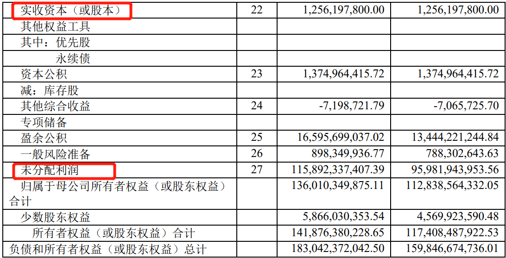

我们说, 所有者权益也叫净资产.

关于净资产, 还有一个非常重要的指标: 净资产收益率, 也就是 ROE.

ROE=净利润 ÷ 净资产.

这个指标, 经常被用来衡量一家公司的长期赚钱能力.

芒格说过一句很著名的话: 持有一只股票长期的收益率和其 ROE 差不多. 这句话本质还是强调要买一个好公司. 一家公司的长期高 ROE 是很难维持的, 一般来说, 划分区间如下

长期 ROE 在 10%-15%, 一般公司;

长期 ROE 在 15%-20%, 杰出公司;

长期 ROE 在 20%-30%, 优秀公司

ROE 长期大于 20%的企业在 A 股中数量很少, 总共也就二三十家. 茅台作为 A 股巨无霸, 它连续 5 年来的 ROE 都在 20%以上, 是一家非常优秀的公司.

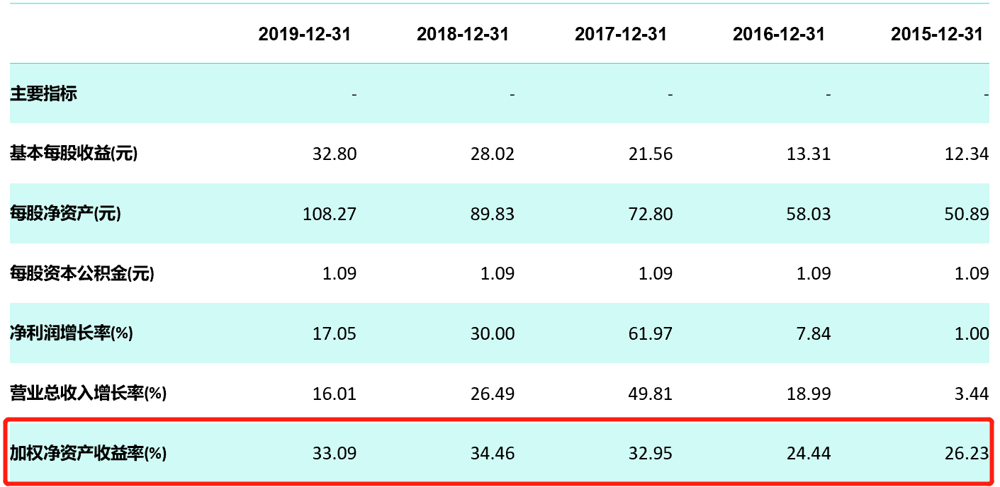

### ④ 横纵向行业对比

现在, 我们已经大致学会了怎么看一张资产负债表的具体信息.

但我们说, 我们追求的是价值投资, 单个指标意义不大, 核心还是要横纵向对比. 要把这些财务指标拉长到 3~5 年来看, 要对比行业, 这样才有价值.

同样的行业, 每一家公司的资产负债表透露出的信息都不同.

比如说, 白酒行业, 用茅台(600519)对比泸州老窖 (000568).

前面提到茅台 2019 年【应收账款】为 0

而在泸州老窖中, 【应收账款】为 1829 万.【应收账款】是企业经营活动中最常见的一个项目, 但这样一对比就足以看出, 茅台在白酒行业中的强势地位.

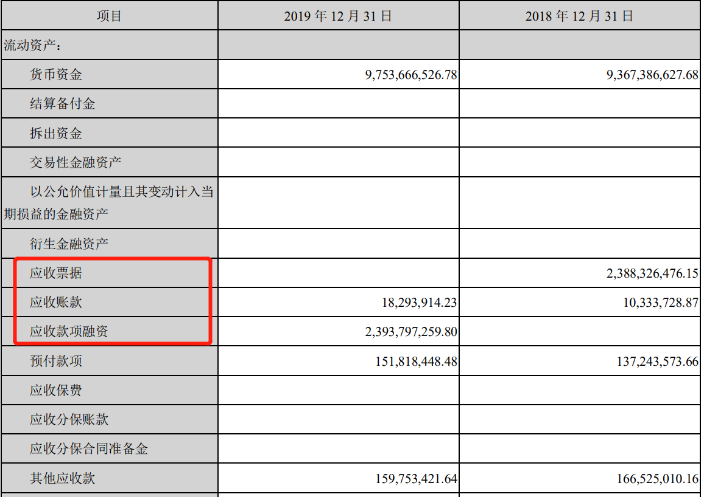

在不同的行业, 企业之间的财务指标也会有很大差别.

比如说, 白酒对比房地产, 用贵州茅台(600519)对比万科 A(000002)

前面提到茅台 2019 年负债率是 22.49%, 流动比率是 3.87

而在万科报表中, 它 2019 年的负债率为 84.36%, 流动比率为 1.13, 和茅台完全不同. 这就和行业性质有关, 房地产本身就是一个高杠杆、高负债的行业, 这么高的负债率并不稀奇.

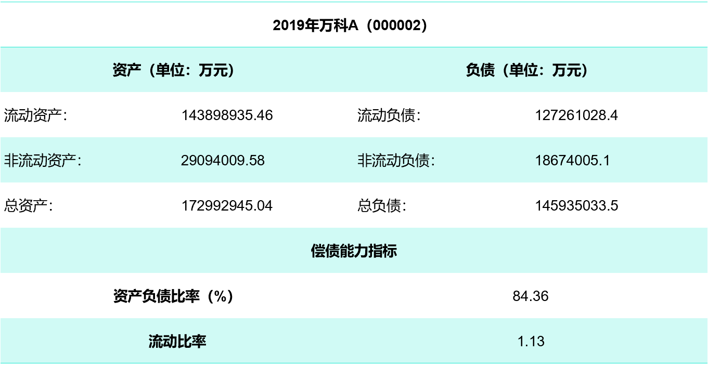

总的来说, 上述对比告诉我们, 每个行业都有着自己的特性.

对每一家公司来说, 它的经营模式、经营战略等, 都可能会被资产负债表记录下来. 我们能做的, 就是细心去体会报表传达出来的信息.

## 课程总结

好啦, 今天的课就到这儿. 总结一下:

(1)资产负债表记录的是一家公司在某一时点的"家底"情况. 要理解资产负债表, 要记住一个恒等式: 资产=负债+所有者权益.

(2)财务报表可以在公司官网、雪球和同花顺等财经网站, 或巨潮资讯上找到.

(3)对于一家公司来说, 往往看四个重要资产: 货币资金、应收账款、存货、固定资产.

(4)资产负债率经常用来衡量一家公司有没有财务风险, 负债率越高, 一般风险越大.

(5)衡量企业偿债能力还有一个常用指标: 流动比率, 这个比率在 2 左右比较合适.

(6)所有者权益也就是股东权益、净资产.

(7)净资产收益率(ROE)=净利润 ÷ 净资产. 这个指标, 经常被用来衡量一家公司的长期赚钱能力. 持有一只股票长期的收益率和其 ROE 差不多.

(8)不同行业、不同企业的资产负债表, 都存在着较大差异, 要横纵向对比, 细心体会.
