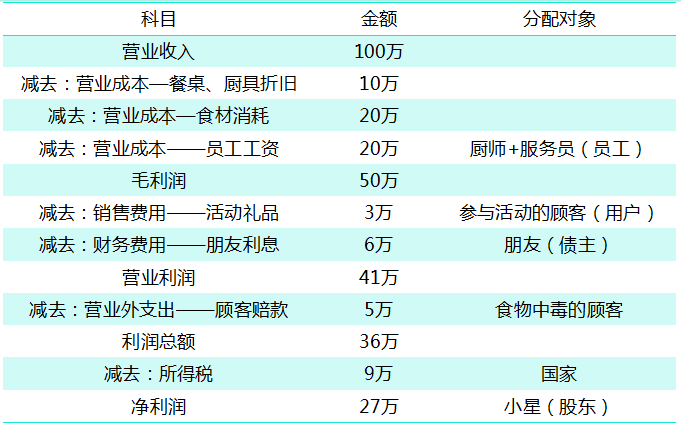

你好, 欢迎继续学习我们的股票课.

我们投资股票, 看中的是股票背后公司的赚钱能力, 那我们如何知道一家公司的赚钱能力呢?

这就是我们今天要学习的内容, 利润表. 通过利润表, 我们可以了解究竟企业怎么赚了钱, 又存在哪些风险.

## 认识利润表

上一课我们讲资产负债表的时候, 提到了餐厅的例子, 这节课我们讲资产负债表还是以餐厅为例, 餐厅开张后, 第一年的收入为 100 万元.

成本包含了食材 20 万元、厨师和服务员的工资 20 万元、 厨具和餐桌的折旧 10 万元, 合计为 50 万元.

此时我们可以计算出餐厅的"毛利润", 等于收入减去成本, 即 100 万-50 万=50 万.

### 总结第一个小知识点: 毛利润只和企业提供的产品或者服务有关.

毛利润的含义是"不纯洁", 也说明了经营一家面包店不仅仅只有营业成本.

这一年时间里, 餐厅搞了很多充值送礼品的促销活动, 这些礼品的成本为 3 万元, 这部分钱称为"销售费用".

餐厅筹建的时候, 向朋友借了 60 万, 和朋友协商的利率是 10%, 一年的利息是 6 万元, 这部分钱称为"财务费用".

销售费用和财务费用都属于"期间费用", 除此之外, 期间费用还包括"管理费用", 但是小星作为餐厅的唯一管理者不领取工资, 所以这里财务费用为 0

简单考虑, 毛利润再减去期间费用等于"营业利润". 计算得知, 第一年餐厅的期间费用是 3 万+6 万=9 万元, 营业利润是 50 万-9 万=41 万.

现实中, 企业其他一些经营行为也会影响到营业利润, 比如使用账面资金购买理财产品获得的"投资收益", 以及预提"存货"、"固定资产减值准备"而确认的"资产减值损失"等等.

怎么总结这些因素的共性呢? "营业利润"的关键词是"营业", 说明在经济意义上, 他除了考虑与产品、服务直接有关的成本, 还考虑了一切跟企业经营有关的因素.

### 总结第二个小知识点: 营业利润是企业一切经营行为创造的利润, 较之毛利润, 他兼考虑了期间费用、投资损益以及资产价值变化带来的影响.

在营业利润的基础上, 我们再来考虑一些更偶然的情况

有个顾客某一天在餐厅吃完饭后, 食物中毒去医院了. 这个顾客很生气就把餐厅告上法院, 法庭判决餐厅负有一定的赔偿责任, 应当向这个顾客赔 5 万元.

这 5 万跟餐厅的经营不直接相关, 所以它在利润表上为体现为一笔"营业外支出".

如果我们在利润中加上(减去)那些与日常经营不直接相关的收入(损失), "营业利润"就变成了"利润总额".

### 总结第三个小知识点: 利润总额是企业所有营业性、非营业性利润的加总.

现在餐厅的利润还剩下 41 万-5 元=36 万块钱了, 餐厅能全部拿走么?

不, 还是不行, 不能忽略了应付给国家的税金.

"净利润"是"利润总额"扣除所得税后的剩余部分. 假设国家的所得税率是 25%, 那么餐厅开业第一年的净利润是 36 万 ×(1-25%)=27 万元.

懂一点财务的人都知道净利润是利润表上最为重要的指标. 为啥呢?

因为我们日常所见的财务报表(比如上市公司财报)主要是给股东看的, 而净利润是指企业的经营成果在分配所有相关方(员工一厨师+服务员; 债权人朋友; 国家)后, 归属于股东净得的部分.

### 总结第四个小知识点: 净利润是归属于股东的经营成果.

我们把上面的计算步骤连接起来, 就可以得到餐厅第一年的利润表了.

在现实中, "毛利润"这个科目通常不单独列报, 得依靠营业收入和营业成本来进行计算. 但人们在财务分析时通常都会计算"毛利率".

毛利润、营业利润、利润总额、净利润是利润表最主要的 4 个层级.

利润表其实是一个过程, 那我们不妨形象地把利润表想象成一个过滤的过程, 经过层层过滤, 企业的各类业务、各种收支, 变成了最终的净利润.

## 看懂利润表的小技巧

数字和公式都不是最重要的, 核心是报表背后的经济意义.

如何看利润表? 这里有一些私货小技巧, 给大家分享下.

### 总结第五个小知识点: 维持高于同行的毛利率需要有充分的理由, 中小企业并不容易达到.

毛利率分析在每次财报分析中必做. 有些企业毛利率很高, 通常是因为三个原因.

第一是卖方市场. 比如烟草企业, 市场很大, 供给端垄断经营, 所以毛利率自然高, 企业自己说了算嘛.

第二是品牌价值. 现实中茅台就是这个例子, 其毛利率常年高达 90%以上, 绝大部分是消费者为"茅台"这个两个字买的单.

根据 BrandZ 发布的全球品牌价值排行榜, 2018 年底"茅台"的品牌价值高达 231.75 亿美元, 是白酒行业第二名 "五粮液"的十倍."国酒"的称号不是白叫的.

根据 2019 年年报, 贵州茅台的销售毛利率高达 91.3%, 与第二集团保持着肉眼可见的差距.

第三是产业链一体化. 产业链的纵向一体化, 节省了中间环节需要支付给供应商的必要利润, 推高了毛利率水平. 但产业链一体化往往也意味着大量的前期投入, 对资金实力的要求很高.

不论是卖方市场、品牌价值还是产业链一体化, 都不太容易发生在中小型企业上. 当我们发现一家企业毛利率明显高于行业的时候, 还是要多想一下的.

### 总结第六个小知识点:"资产减值损失"和"营业外支出" 是最主要的业绩杀手.

这两个科目, 平时没有什么存在感, 但关键时刻往往一击毙命

从上市公司的案例来看, 绝大多数的巨亏都和他们有关.

"资产减值损失", 顾名思义就是说企业资产实际价值和报表数出现了差异. 现实中资产减值无处不在, 重灾区是"商誉"、"应收账款"、"长期股权投资"及"在建工程".2019 年 A 股盐湖股份以 458 亿的巨亏荣膺 A 股"亏损王", 主要原因就是其资产的大额减值.

盐湖股份 2019 年跳楼价出售一项资产, 出售该资产为上市公司贡献的净利润为-402.93 亿元.

"营业外支出"发生的主要原因是"预计负债"的计提, 比如企业输了官司被要求赔偿.2019 年乐视网亏损了 90 多个亿, 就是因为一起违规担保案件的判决结果.

### 总结第七个小知识点: 固定成本占比高的企业财务风险较高.

可变成本是指会随着产品销量变动的成本, 固定成本则是对产品销量不敏感的成本. 固定成本既有可能在营业成本里, 也有可能在期间费用里.

以上面我们讲到的餐厅为例, 餐桌和厨具的折旧(营业成本)、朋友的利息(财务费用)都属于固定成本.

固定成本占比高的企业有更高的经营杠杆. 啥叫"经营杠杆"?—他表示的是企业利润对收入变化的敏感程度.

餐厅的固定成本主要是房租和人工, 固定成本比较高, 遇上疫情没收入, 直接倒闭.

"经营杠杆"越大的企业, 经营业绩越不稳定, 财务风险也越高.

## 总结

最后总结一下今天的知识点:

1、毛利润只和企业提供的产品或者服务有关.

2、营业利润是企业一切经营行为创造的利润, 较之毛利润, 他兼考虑了期间费用、投资损益以及资产价值变化带来的影响.

3、利润总额是企业所有营业性、非营业性利润的加总.

4、净利润是归属于股东的经营成果.

5、维持高于同行的毛利率需要有充分的理由, 中小企业并不容易达到.

6、资产减值损失和营业外支出是最主要的业绩杀手.

7、固定成本占比高的企业经营风险较高.
