欢迎继续学习我们的股票课.

我们来学习会计三张表的最后一张表——现金流量表. 今天, 你会掌握现金流量表的基本结构, 并学会用它判断企业的发展是否健康.

## 什么是现金流量表?

商业世界有一句话叫"现金为王". 现金流量表之于企业, 就如血液之于人体.

企业没了现金流就像人没了血液, 供应商是不会接受非现金的"利润"来作为货款的, 员工也不会接受这样的"利润"作为工资.

有良好的现金流入流出, 即便这家公司不赚钱也能生存下来

一个典型的例子就是京东. 从利润表上看, 京东每年都亏损, 但再一看现金流量表, 流入大于流出, 维持了正常运转.

这也反过来告诉我们, 一家企业如果光利润表很好看, 赚了很多钱, 但是现金流却是大幅流出, 甚至流出大于流入, 要引起警惕

理解了现金的重要性, 接下来我们看看什么是现金流量表.

### 1)期间概念

它反映企业一段时间内现金及现金等价物流入和流出的情况,

### 2)记账标准不同

现金流量表和利润表有什么区别呢?

用上次小星的餐厅来举例. 假如餐厅的营业收入是 100 万元, 全部是白条, 并没有收到现金.

利润表的白条 100 万也记为营业收入. 这就叫做"权责发生制".

但现金流量表却不一样: 只有实际收到或者支出现金及现金等价物, 才能记录, 其他像白条或者支票都不能算.

所以利润表有这 100 万营业收入, 但现金流量表却没有这 100 万现金流入.

如果一家企业的净利润很好, 现金流却一直很差, 要懂得远离风险; 反过来, 一家企业的净利润不太好, 而现金流却很好, 也值得分析, 说不定反而有投资机会.

## 现金流量表的结构

现金流量表的大逻辑是: 现金流量净额=现金流入-现金流出.

以贵州茅台 2020 三季年现金流量表的一部分为例.

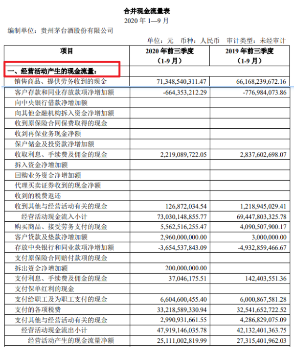

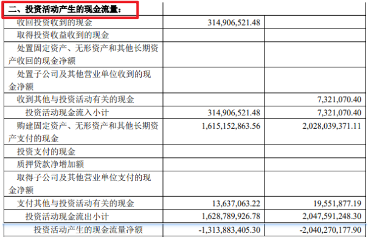

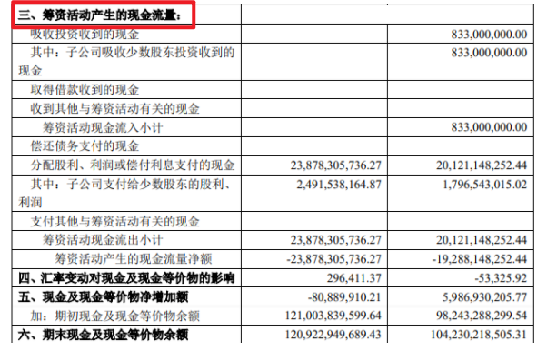

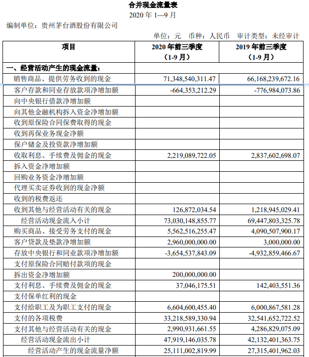

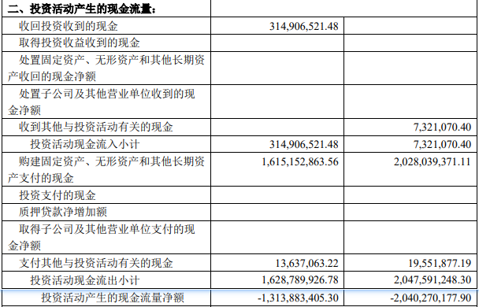

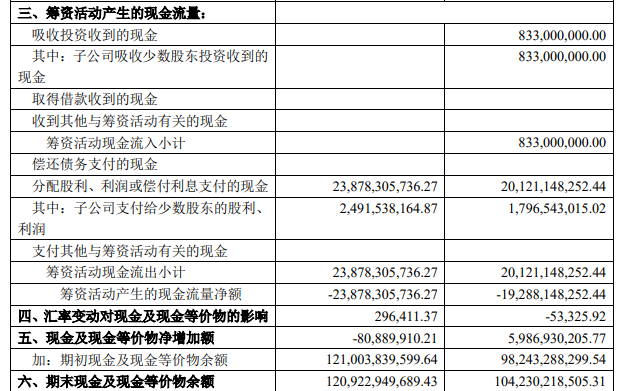

它把一家企业的现金流分为 3 种方式: 经营活动、投资活动, 筹资活动.

仍然用小星餐厅来了解一下.

### (1)经营活动现金流

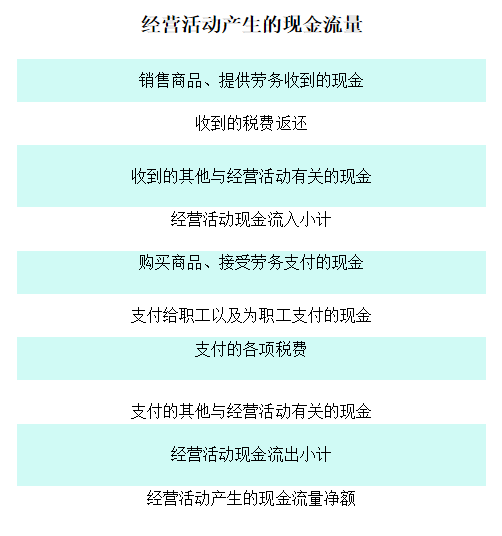

字面理解就是餐厅日常经营过程中产生的现金流入和流出.

比如, 餐厅收到顾客的现金付款, 是经营活动现金流入;

比如, 餐厅采购原材料, 支付员工的工资, 交的实际税金等, 就是经营活动现金流出.

### (2)投资活动现金流

是指餐厅在投资过程中产生的现金流入流出.

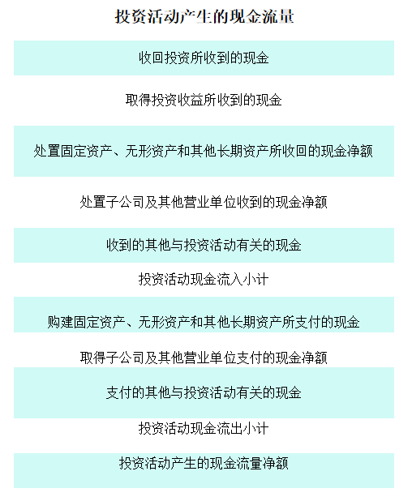

投资活动现金流入, 分为对内、对外 2 种:

比如对内餐厅卖掉厨具获得的现金收入; 对外可能是股票获得的现金分红.

投资活动现金流出, 同样分为对内对外 2 种:

对内, 比如购买新的店面、新厨具等; 对外, 可能是购买股票基金债券等.

### (3)筹资活动现金流

筹资活动现金流, 是指餐厅在筹集资金过程中产生的现金流入和流出

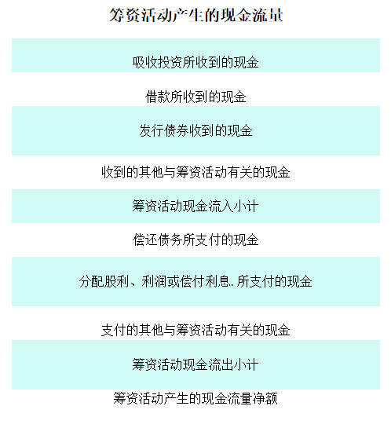

举个例子, 餐厅向银行借的短期借款, 就属于筹资活动现金流流入; 而它还钱给银行, 就属于筹资活动现金流流出.

以上三个活动现金流入流出, 根据"现金流量净额=现金流入-现金流出"这个公式

如果净额是正数, 说明企业的现金是净流入; 反之, 是负数, 则说明企业现金是净流出.

以贵州茅台为例.

巨潮资讯网站上可以直接查询这 3 种活动的现金流净额.

可以看出, 贵州茅台的经营现金流一直是正的, 而投资和筹资活动的现金流则是负的.

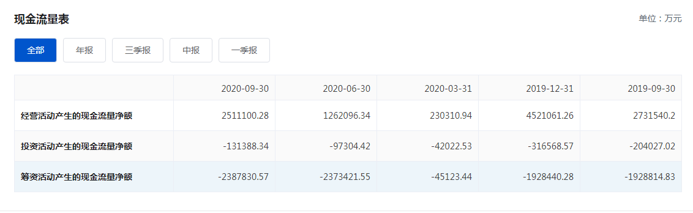

## 如何看现金流是否健康?

我们要着重看一下: 经营活动现金流.

我们强调过, 一家企业的经营活动, 才是赖以生存的根本, 就好比贵州茅台, 白酒是它的主业, 而投资只是副业, 现金流健不健康, 第一要义当然要先看经营活动.

而经营活动现金流好不好, 有 2 个指标:

### 净利润现金含量

经营活动现金流量净额 ÷ 净利润>1

净利润现金含量即经营现金流量净额/净利润, 就是说企业实现一元净利润实际流入多少现金. 长周期来看(10 年以上), 经营活动现金流量净额/净利润应该大于 1. 净现比不低于 0.5, 当然越高越好!

整个 A 股的净现比, 扣除金融业之后, A 股实现净利润 1.94 万亿元, 经济活动现金流量净额为 2.55 万亿元, 净现比为 1.32, 也就意味着 A 股实现 1 元的净利润, 那么流入的现金为 1.32 元.

如果经营活动现金流大于净利润, 意味着企业不仅账面上赚到了真金白银, 还提前收到了客户的钱.

比如, 一家餐厅预订的订金. 它不能被确认为营业收入, 计入利润表, 却可以被记为现金流入, 体现出餐厅经营良好.

### 经营活动现金流量净额

经营活动现金流量净额大于 0, 意味着企业经营活动的现金是净流入的, 企业经营处于正常运转的状态; 如果小于 0, 说明企业经营活动的现金净流出, 如果一家企业连续几年都是净流出, 是一个危险的信号. 此外, 经营现金流波动也不能过大, 否则也很异常.

## 通过现金流来躲避 A 股暴雷公司

经营现金流是用来衡量是否财务造假最常见的指标之一. 经营现金流差是该收的没收回来, 表现是应收账款高估

我们来举个 A 股案例: 康美药业的经营现金流供大家参考.

康美药业 2019 年 4 月底披露 2018 年公司年报, 散户这才发现这是一场预谋很久的三百亿造假大案. 其实从这个指标就能排查规避这个大雷

在上面我们说过, 经营现金流量净额/净利润, 长周期来看(10 年以上), 经营活动现金流量净额/净利润应该大于 1

再看看康美药业财报这项数据:

从 2010 年至 2018 年上半年, 康美药业累计实现净利润 201.08 亿元, 经营活动现金流量净额只有 94.65 亿元, 净现比只有 47%

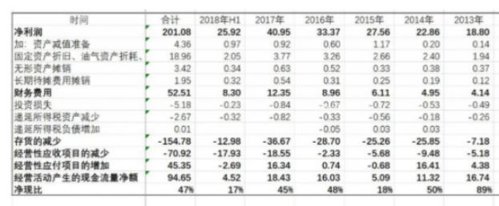

即实现 1 元的净利润流入的现金只有 0.47 元. 尤其是 2018 年上半年, 净现比只有 17%

再仔细分析后, 存贷双高现象很明显, 可以看出利润表虚增收入和利润的同时, 虚增相应的经营现金流流入, 对应的资产负债表虚增了货币资金.

当然这个数据只能是用来衡量上市公司财务造假标准之一, 至于能否发现并证实, 需要对公司的进行逻辑缜密的验证, 如果发现不符合常识、逻辑的地方, 那么大概率是有问题的.

## 三张表的关系

到此我们讲完三张报表, 我们来捋一捊三张表的关系.

### (1)三张表中最重要的报表是哪个呢?

是资产负债表.

即使没有利润表, 通过分析所有者权益中未分配利润的变动可以判断公司的盈利情况, 即使没有现金流量表, 通过资产负债表的货币资金变动也可以判断公司现金流的情况.

但当你想了解一家企业时, 一般人先看哪张报表?

我们举个例子, 相亲第一眼看的是什么? 当然是这姑娘俊不俊, 小伙子帅不帅, 如果对方颜值比较低, 那么你可能根本就没有了解的欲望. 这就是所谓的始于颜值嘛.

### (2)那么哪张报表可以告诉我们上市公司帅不帅、性不性感呢?

当然是利润表.

比如营业收入和净利润以上, 连续三年增速 100%, 或者发现毛利率 90%以上, 就问你惊不惊喜?

只有颜值不错的美女、帅哥我们才第一眼看得下去, 只有体现不错成长性和盈利能力的上市公司我们才有了解的想法.

始于颜值, 始于利润表吧.

### (3)接下来当然是关心对象的人品咋样啦. 最能反映上市公司盈利质量的就是现金流量表.

比如净现比, 收现比=经营活动现金流量净额/净利润, 代表实现 1 元净利润带来了多少现金, 当然, 这个比例也是越高越好.

比如自由现金流, 自由现金流越好, 说明公司创造现金的能力越强, 不仅赚的钱多, 关键是赚的都是真金白银, 而不是相亲对象随口胡说天天嘴炮.

相爱陷于人品, 投资则陷于现金流量表.

### (4)忠于资产负债表

谈对象到考虑结婚, 最后是互相盘点一下, 有没有房子, 贷款是多少? 地段怎么样, 是否有潜在升值空间? 有没有车, 车贷是多少? 如何还款? 有没有潜在的负债?

而资产负债表恰恰可以提供这些信息, 账上都有哪些资产, 负债和所有者权益分别是多少? 是否存在潜力资产, 是否存在可能减值的资产?

资产负债表也是需要我们花大力气去去了解的, 公司自成立以来所有家底的反映, 企业资产质量好与不好, 资产负债表最清楚.

对于一家第一次见面的公司, 我们需要多看几年的数据, 一般五年起, 看十年也是非常正常的, 而且也要跟踪了解, 不要着急买入.

这就像处对象, 怎么也要处个几个月、几年了解一下, 闪婚的往往靠运气

以上就是三张报表的顺序: 始于利润表, 陷于现金流量表, 忠于资产负债表.
