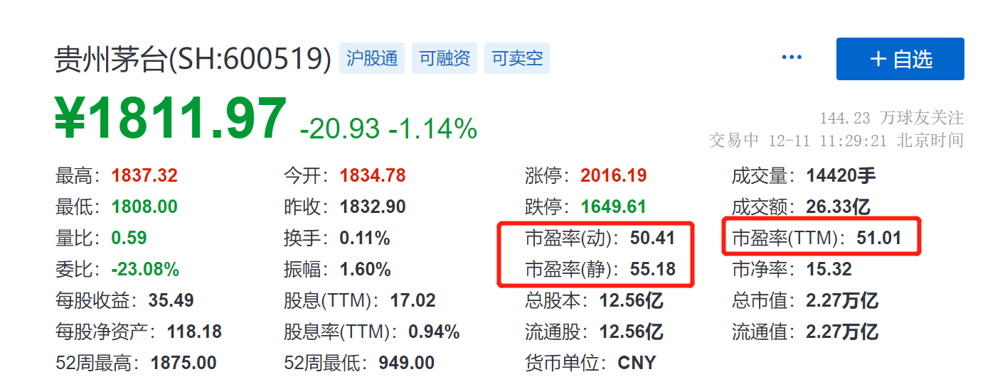
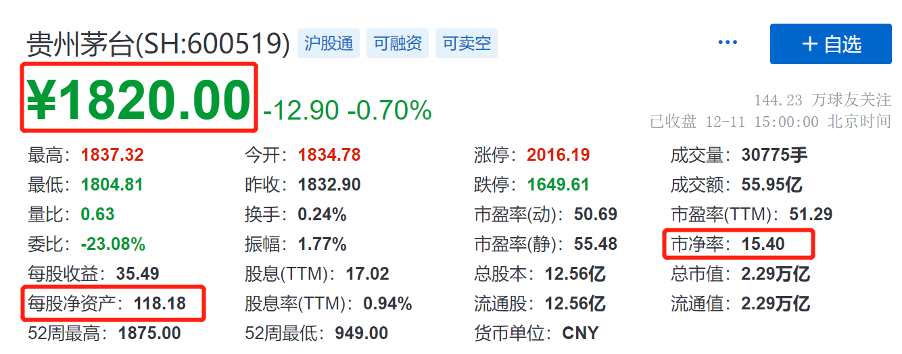
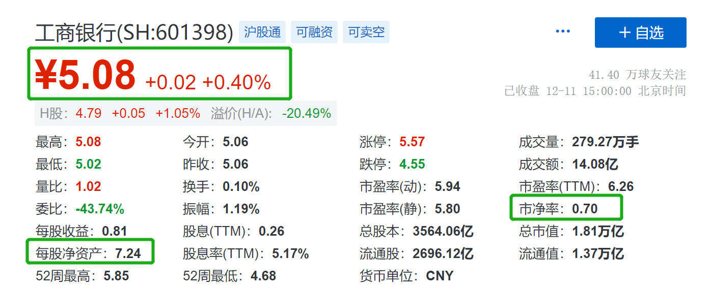
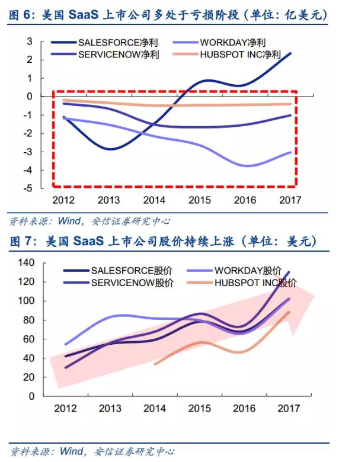
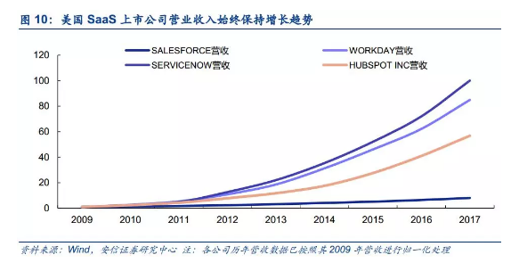

大家好, 欢迎继续学习我们的股票课.

通过财表, 我们可以分析一只公司是不是好公司, 但股票做为资产的一种, 自然也有价格便宜与贵的时候. 我们买股票就是买性价比, 买入的价格不对, 即使买入好股也赚不到什么钱.

问题是, 怎么判断股价是贵还是便宜呢?

这里就要用到估值了.

今天我们就来说说, 用估值来判断股价的方法.

## 市盈率 PE

说到估值, 相信很多人第一个想到的就是市盈率.

刚接触的朋友, 可能会觉得这太过专业了.

但其实这是一个非常容易理解的指标, 市盈率的高低, 代表着投资回本期限的长短

我们以开餐厅为例:

假设你准备买一家餐厅, 餐厅老板以 100 万转让给你, 这家餐厅每年能赚 10 万净利. 如果餐厅保持这一盈利能力不变, 买入后大概需要多少年回本呢?

我们可以算出, 10 年才能回本.

这个 10 年回本的理念, 就和市盈率的计算思路是一样的.

简单来说, 市盈率的市, 其实就是市值; 市盈率的盈, 其实就是盈利, 净利润.

这就得出它的第一个计算公式, 市盈率=市值 ÷ 净利润.

它的第二个计算公司是, 市盈率=股价 ÷ 每股收益.

这两个公式其实说的都是一个意思.

很多财经网站都会提供某只股票的 PE 指标, 我们可以很方便地查到.

比如在雪球找到贵州茅台, 里面就有市盈率.

不过, 如果你仔细一点, 也许已经发现, 雪球网站里的市盈率不止一个.

其实我们说的市盈率, 有三种: 静态市盈率, 动态市盈率, 滚动市盈率.

这三种市盈率的分子相同, 但分母的计算方法略有不同.

### 第一种: 静态市盈率.

静态市盈率还是等于总市值 ÷ 净利润, 只不过这个净利润是上一年度的净利润, 如果现在是 2021 年, 这个净利润就是 2019 年的净利润.

### 第二种: 动态市盈率.

动态市盈率=总市值 ÷ 动态预测的今年将产生的净利润.

### 第三种: 滚动市盈率, 也就是那个时常标有一个 TM 标志的 PE

滚动市盈率=当前总市值 ÷ 最近 4 个季度归属于上市公司股东的净利润, 它不是过去一整年, 而是最新四个季度的数据.

相比较静态市盈率, 动态市盈率和滚动市盈率, 都用得比较多. 毕竟我们投资是投资预期, 是一个动态过程, 看的是未来, 静态市盈率是过去发生的事, 用的是历史数据.

那么我们如何对比估值是否过高, 或过低呢?

### 最常用的一种方法, 是比较法.

一只股票的市盈率高低, 既可以横向和同行业其他公司比, 也可以纵向和过去的自己比.

横向比较, 就是用同行业公司的市盈率进行比较.

需要提醒的一点是, 市盈率不能够跨行业比较, 因为不同行业的市盈率差别非常大.

纵向比较, 就是用一家公司当前市盈率和历史平均市盈率做比较.

低于平均市盈率, 说明投资回本时间比平均时间短, 股价相对低估; 反之, 则说明股价高估.

当然, 这只是一个方便初学者理解的标准.

实际运用的时候, 我们还要对低估的标准做进一步细化.

这个细化的方法就是"估值百分位".

为了方便比较, 现实中经常用历史百分位来表示市盈率的位置.

比如说, 现在告诉你, 这只股票历史最高市盈率是 25 倍, 而且历史上仅有 42.97%的时间估值水平比这个低, 那么这个股票估值的历史百分位就是 42.97%

目前市面上的主流方法, 是把估值百分位划分为三个区:

估值百分位低于 20%, 属于低估区间;

估值百分位在 20%-80%, 属于合理区间;

估值百分位高于 80%, 属于高估区间.

当估值百分位低于 20%时, 这时的股价是一个相对便宜的好价格, 如果在这个时候买入, 随着企业业绩提升, 就能获得很不错的收益.

要说明一点的是, 在用估值百分位进行分析时, 最好关注下时间段是多长.

比如是过去 3 年, 还是过去 5 年的估值百分位.

相对来说, 选择的时间段越长, 意味着统计数越多, 最后得出的结果会更可靠些.

另外, 我们说的这些都是通用逻辑.

在实际过程中, 还需要更加灵活地运用. 如果一家公司业绩未来预期良好, 那它短期内的高市盈率并不代表估值过高, 未来高速增长的业绩足以消化掉高估值.

## 哪些公司适合 PE 估值?

好了, 现在我们知道了市盈率的含义与计算, 那哪些公司适合用市盈率进行估值呢?

### (1)PE 适合盈利稳定的公司

还记得餐厅那个例子吗? 我们假设以后每年餐厅都赚 10 万净利

市盈率有一个基本的假设, 就是未来的盈利水平保持不变, 但现实中, 很多公司的盈利水平并非是不变的, 有的大幅增长, 有的大幅下滑.

就好比一家餐厅今年赚 10 万元, 明年赚 15 万, 盈利以每年 50%左右的速度增长, 100 万买下的餐厅其实根本不需要 10 年, 就能提前收回成本.

从这个角度来说, 如果一家公司的盈利水平比较稳定, 也就是处于成熟期阶段的企业, 用 PE 指标进行估值会比较准确.

### (2)盈利高速增长的公司, 慎用 PE

同样的道理, 对于那些盈利高速增长的公司来说, 往往也是「成长股」, 其实它们也并不是很适合用 PE 来估值.

### (3)亏损的公司, 不适用 PE

还有一种情况是, 有些公司出现了亏损, 它的净利润是负的, 计算出的市盈率也是负数, 但市盈率为负不代表公司的价值就是负的

这个时候, 就可以用另一种常用的估值: 市净率 PB 估值

## 市净率 PB

市净率的"净", 指的就是企业的净资产, 也就是资产减去负债

所以它的一个计算公式, 就是市值 ÷ 净资产, 也等于股价 ÷ 每股净资产.

我们说市盈率是一个投资回本的概念.

而市净率的通俗理解, 就是为了买下这家公司的股票, 你愿意为他的净资产支付多少溢价?

还是以餐厅为例.

假设一家餐厅的转让价格还是一百万元, 它的净资产是五十万元

这意味着你花了一百万元买到了净资产五十万元的东西, 相当于你支付了两倍的溢价.

这 2 倍的溢价, 就是市净率, 也就是市净率为 2

比如图中, 就是贵州茅台的市净率, 大概是 15

它代表, 假如你现在花 1820 元买入茅台, 相对于它的净资产, 支付了 15 倍的溢价.

很多时候我们也会看到有些股票市净率低于 1

比如图中的工商银行.

市净率是 0.7, 这意味着你用 0.7 元的价格, 就可以买到 1 元钱的资产.

这种低于 1 的 PB, 类似于打折买入.

理论上来说, 市净率小于 1 的股票相对比较便宜.

但并不是说 PB 越小, 越值得买.

这个指标背后影响因素有很多, 比如公司经营状况不好, 影响了市场对它的估值, 它的市净率就可能小于 1 所以, 还是要综合应用, 不能一概而论.

## 哪些公司适合 PB 估值?

那么, 什么样的企业, 更适合用市净率 PB 估值呢?

大多数公司只要还在赚钱, 净资产就是正向增加的. 也就是说, 净资产一般比净利润更稳定.

所以, 很多盈利不稳定, 但净资产比较稳定的企业, 更适合用市净率估值.

具体来说:

### (1)业绩亏损的公司, 可以用市净率

正如前面提到, 对于净利润为负的亏损公司, 用市盈率 PE 没办法估值. 但如果它的净资产是正的, 就可以用市净率 PB 估值

### (2)账面价值稳定的公司, 适用市净率

账面价值稳定的公司, 往往是重资产行业. 比如金融就是非常典型的一类.

不少人对银行、保险、证券等金融类公司进行估值时, 就会采用市净率法

为什么呢?

以银行为例, 它的大部分资产和负债都是金融资产和金融负债, 在计算净资产(也就是资产减去负债)的时候已经是按市场价值来计量了, 所以账面价值比较稳定.

反过来说, 账面价值不稳定的公司, 就不适合用市净率了. 比如, 一些公司拥有的存货设备等很难变现, 或者存在坏账等, 都会导致它的实际资产价值并没有账面看起来那么多.

## 其他估值指标

除了用市盈率和市净率对公司进行估值, 还可以用市销率进行估值.

PS(市销率)=公司市值/销售收入;

大家不要将不同行业以及不同公司的市销率放在一起比较, 市销率估值方法的应用和市净率差不多, 只适合用于相同公司不同历史时期的比较, 看看这些公司当前市销率水平相比历史是处于高的水平还是低的水平.

最典型的例子就是大量互联网企业, 比如阿里, 京东, 拼多多, 在早期扩张阶段, 这些公司基本都不太赚钱, 花钱补贴用户培养消费习惯, 这些企业的早期肯定不适合拿 PE 进行估值, 最好的方法就是 PS, 重点关注公司的销售收入, 有没有利润暂时不重要, 只要有收入就行.

当然了, 市销率估值不仅仅局限在互联网企业, 只要盈利能力扭曲, 企业都可以使用市销率进行估值, 比如创新药企业、云软件服务公司.

云软件服务公司是一种厂商将软件部署于云服务器上并依据客户需求向其提供服务的商业模式.

像我们平时用的网页版的 PS 软件, 其实就可以理解为一种简单的云软件, 不需要下载 APP, 在网页上就可以直接打开

以美股为例, 4 家代表性的上市云软件服务公司大多在过去 5 年内经历了较长时间的亏损, 在部分时间内甚至出现了亏损扩大的情况, 但在此期间各公司的股价却维持了上涨的趋势.

这一现象表明, SaaS 行业上市公司在特定时期难以适用 PE 的估值方法.

云软件服务公司由于亏损而无法采用 PE 估值的原因在于其高昂的研发支出和销售费用. 研发支出方面, 4 家美股代表性企业每年的投入已维持了近 10 年的增长, 并且在早期部分企业的研发支出占营收比重甚至超过了 100%

由于云软件服务公司发展初期高额的研发和销售投入拖累了盈利, 在其营收尚未进入平稳高速增长阶段时, 公司将会维持亏损状态, 使得 PE 估值法无法满足适用条件

尽管 SaaS 企业大多尚未取得正盈利, 但其销售收入通常保持了稳定的增长, 并且和公司股价的同步性较高.4 家代表性企业的营收均在最近 10 年中伴随着其股价稳健成长. 因此, 使用市销率 PS 或更能准确刻画具有负盈利和高营收成长性的云服务企业的估值.

## 课程总结

好啦, 今天的课就到这儿~来总结一下:

今天我们主要学习了三个常用的估值指标: 市盈率 PE、 市净率 PB 和市销率 PS

市盈率, 代表你投资需要多少期限回本

市净率, 代表你为投资支付了多少溢价.

市销率主要适用于尚未盈利的高成长性企业.

一个大致的规则是, 这三个指标越低, 代表股票相对低估, 是一个相对便宜的好价格. 但这三个指标都有各自的适用条件, 不能一概而论, 具体我们要在实践中去积累, 才能应用自如.
