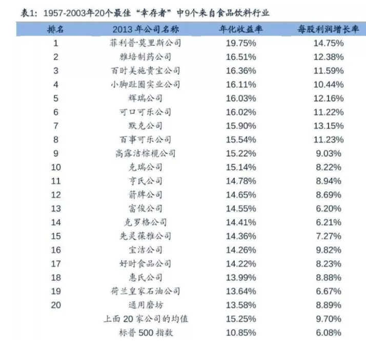

## 好行业才有牛股

在之前的小白训练营第 5 课中我们提到投资股票就是选好行业、好公司、好价格

什么是好行业呢?

巴菲特有一句名言:"人生就像滚雪球, 最重要的事是发现厚雪和长长的山坡."长长的山坡, 就是指的有复利的行业, 在长期内完成巨额财富累积的形象表述.

具备广阔发展空间的行业中, 盈利能力强的企业能够让投资者完成财富"滚雪球", 收获不菲收益. 巴菲特, 他一生都偏爱消费股和银行股.

有句话是这么说的: 美股的科技, A 股的消费是未来黄金十年牛股.

美股前五大公司分别是苹果、微软、亚马逊、谷歌和脸书, 他们代表着新经济科技股, 而 A 股的前十大公司贵州茅台、海天味业消费品公司独占 2 席.

对比一下这 2 年中证各个行业指数的涨幅, 白酒类涨了 3 倍, 中证消费涨了近 2 倍, 远远跑赢大盘和其他行业指数.

在 A 股市场中, 长线牛股大多都是大消费行业. 大家可以感受下:

酒: 贵州茅台、五粮液、青岛啤酒. 行业龙头是一路向上. 最火的茅台, 算上分红, 上市以来大涨了 300 多倍; 五粮液, 上市以来涨了 120 多倍

奶: 伊利股份涨了 700 多倍

肉: 牧原股份 7 年 53 倍、双汇发展涨了 105 倍

调味品: 海天味业、恒顺醋业

零食: 恰恰食品, 涪陵榨菜

电器: 格力股份, 涨了 470 倍

化妆品: 珀莱雅

## 为什么消费股长青?

### (1)市场足够宽广, 吸引外资等专业机构下注

中国的比较优势就是消费, 我们拥有世界上最多的人口、世界上最大的消费市场.

对于外资来说, 投科技股首选是美国, 因为美股的科技股实力特别强, 是他们的比较优势, 要是买消费股那一定是买中国的消费股, 因为中国拥有世界最大的消费市场.

过去 50 年美股表现最好的公司, 基本来自于两个行业, 其中一个是就消费品行业(糖果、番茄酱、汽水等公司), 另一个是医药行业.

外资懂得从全球牛股经验寻找中国的"可口可乐"

我们可以看到金龙鱼、贵州茅台、美的集团、双汇发展、五粮液、格力电器、苏泊尔等消费类公司是外资的最爱

### (2)护城河足够宽广

消费股具有长期的投资价值, 特别是具有品牌的消费股, 无论是高端消费品还是一般消费品, 都具有长期的投资机会.

例如茅台、五粮液、恒瑞、片仔癀等等消费白马股的品牌价值无疑是非常高的, 这是最为广阔的护城河. 这些品牌价值是公司的优质隐形资产, 品牌价值、品牌溢价也会让一些消费公司享受高估值.

俗语说: 死不了的消费品行业, 食品行业有很多老品牌都是老国企, 比如伊利、恒顺醋业、广州酒家、涪陵榨菜

必需消费公司的护城河不是它的科技实力, 因为这些行业受新技术的影响较小, 而是品牌价值.

而科技股盈利波动大, 行业地位不稳固, 十年之前的科技股已经重换一批名单, 而消费行业公司是长青甚至强者恒强.

### (3)消费股盈稳盈利增长稳定、波动小

对于盈利稳定的企业大家会给高估值, 而消费股正具有这个特征. 买入消费股, 大家享受的是稳稳的幸福.

科技股的投资, 波动大风险高, 很多科技股的技术含量比较高, 大家很难看出这个公司的技术到底有没有领先优势, 自己选股的难度是非常大的.

消费股, 商业模式清晰, 数据可查, 业绩稳定、可以长期持有做股东.

根据以往历史, 黑天鹅般的事件所对市场的影响是短暂的, 不管是 03 年的非典还是 08 年三聚氰胺, 还是白酒塑化剂风波, 走出阴霾之后, 消费类公司持续股价创新高

最后, 总结下

消费是实施扩大内需战略的重要环节, 是推动 GDP 增长的三驾马车之一.

从长期逻辑来看, 人均收入提高带来的消费升级、庞大人口基数带来的大市场是未来大趋势. 消费股中牛股频频出现, 长期持续经营能力很强, 业绩增速稳定, 能够穿越周期

市场投资越来越偏长期化, 专业化, 选长期型的赛道, 一定是内需长期成长的行业, 消费就是最好的赛道之

## 可选消费和必选消费

总得来说, 消费行业可以分为必需消费和可选消费.

这两者虽然都可以被归入"消费"板块中, 但是特点和投资方式都有所不同, 想要投资, 就先搞明白这两者之间的区别.

### (1)必需消费

必需消费, 指消费频率高, 属于刚需. 无论经济好坏, 该吃的还得吃, 该喝的还得喝. 包括食品、饮料、烟草、居家用品、主要用品零售商等.

前面提到的贵州茅台、伊利乳业, 还有海天味业、温氏股份等, 都属于必需消费.

疫情导致整个经济停摆, 只有必需消费不受影响, 资金都疯狂涌入相关的公司, 从而推高股价.

必需消费公司的护城河是品牌价值.

一旦获得行业垄断地位, 例如白酒中的茅台, 调味酱中的海天味业, 就会拥有更宽、更深的"护城河", 更有利于抵御新进入者的威胁, 使竞争优势持续时间更长.

### (2)可选消费

可选消费就不是生活刚需了, 主要是用来提高生活质量的消费品, 例如家电、影视传媒、餐饮旅游等等.

相对于必需消费, 可选消费受到经济周期的影响更大. 我们可以一个星期不下馆子, 一个星期不去看电影, 但总不能一个星期不吃饭.

因此, 可选消费的需求是不如必需消费更加稳定的. 如果经济环境不好, 我们也会倾向对这类可选品延迟满足, 俗称: 消费降级.

另外, 可选消费受科技进步影响较大, 像家电、手机、 电脑这类 3C 产品更新迭代的速度很快, 三五年就是一轮大迭代

如果企业跟不上科技发展的脚步, 或者没抓住未来的发展方向, 早晚会走向衰落. 昔日的手机巨头摩托罗拉、 胶卷巨头柯达就是鲜活的例子.

可见, 投资可选消费的公司要比必需消费风险要更高, 但依旧具有相当不错的投资价值.

## 有哪些消费股票池可以选择?

必需消费股比较适合普通人长期持有. 食品饮料基本属于必需消费品, 不受经济周期影响, 所以一直以来, 收益都是非常不错的

在中证食品饮料指数(Wind 代码:000807. CSI)有 50 只股票成份股, 主要成分股包括五粮液、伊利股份、海天味业、贵州茅台、泸州老窖、洋河股份、双汇发展、 中炬高新、安琪酵母

这些公司都是食品饮料板块中比较有竞争力的公司.

网上还有一份"消费 30"清单, 大家也可以看看

贵州茅台、五粮液、安踏体育、华熙生物、裕同科技、 锦江酒店、周大生、海天味业、伊利股份、华润啤酒、 中国中免、美团点评、好未来、永辉超市、晨光文具、 中顺洁柔、欧派家居、首旅酒店、青岛啤酒、宋城演艺、步步高、珀莱雅、大北农、海大集团、湘佳股份、 申洲国际、恒安国际、普莱柯、牧原股份、李宁.

消费股最适合普通人投资

全世界最优秀的基金经理之一, 彼得·林奇曾经说过的话: 普通人所找到的能赚 10 倍的大牛股, 都逃不出 2 个规律

1)这些公司就在你身边: 比如你的住处附近、是你喜爱的品牌, 或者你工作的地方;

2)它的业务足够简单, 最好一个 12 岁的孩子都能明白这家公司怎么赚钱的.

消费股就具备这 2 个特征.

## 课程总结

总结一下:

今天我们主要学习了消费行业作为牛股、牛基频出的行业的优势在于

1. 市场足够宽广, 吸引外资等专业机构下注
2. 护城河足够宽广, 有超越同行的品牌优势
3. 消费股盈稳盈利增长稳定、波动小

消费行业又分为必需消费和可选消费. 必需消费频率高, 比如食品、肉制品、白酒类等属于刚需. 无论经济好坏, 必需消费的优质公司盈利稳定, 穿越牛熊周期, 更适合普通人长期持有.
