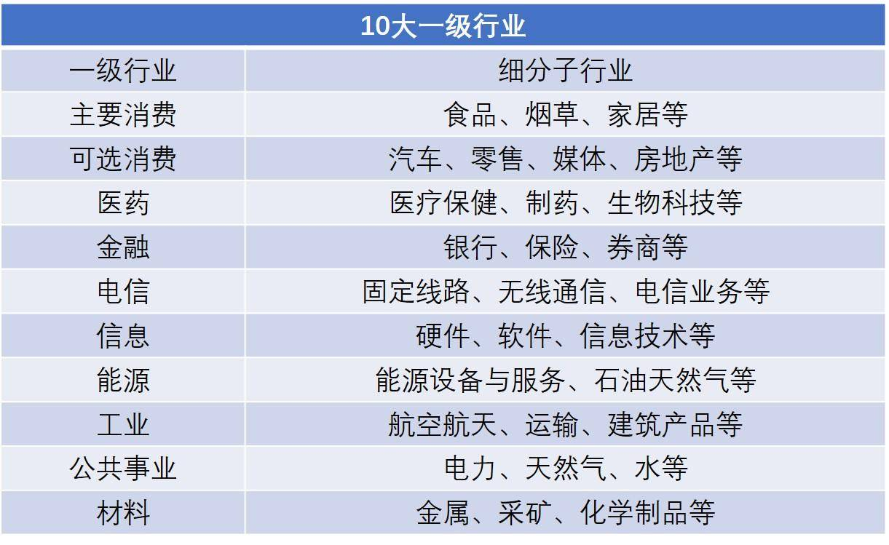
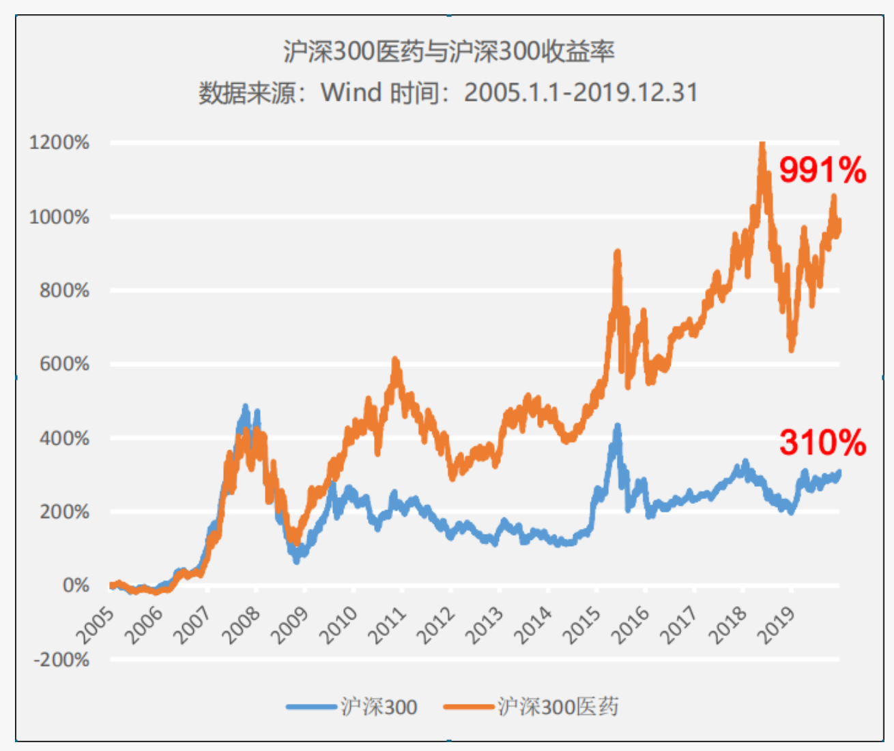
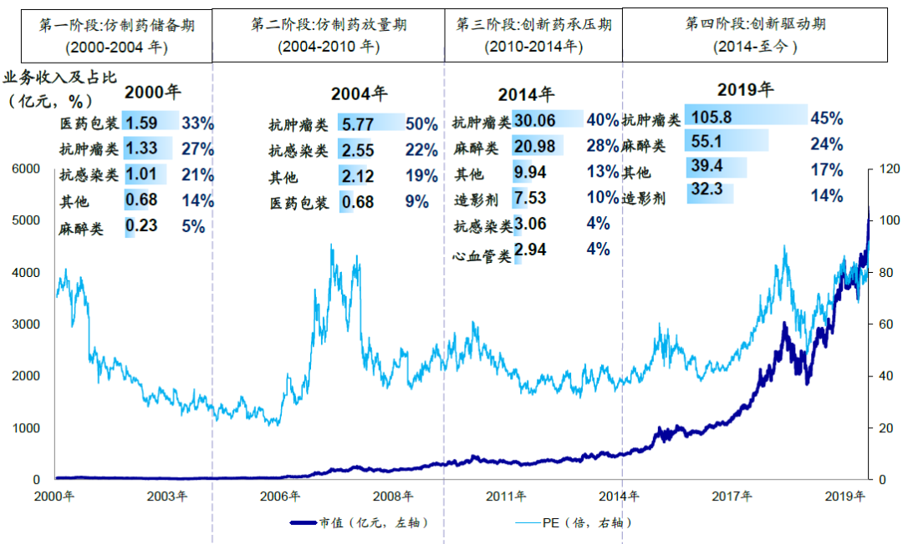
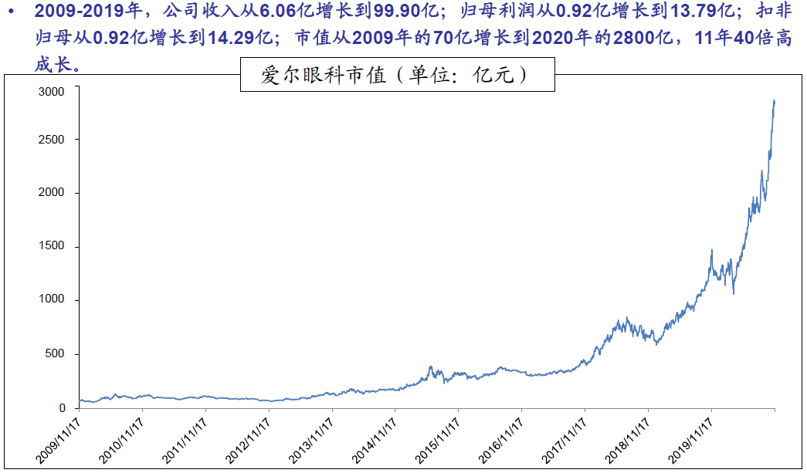
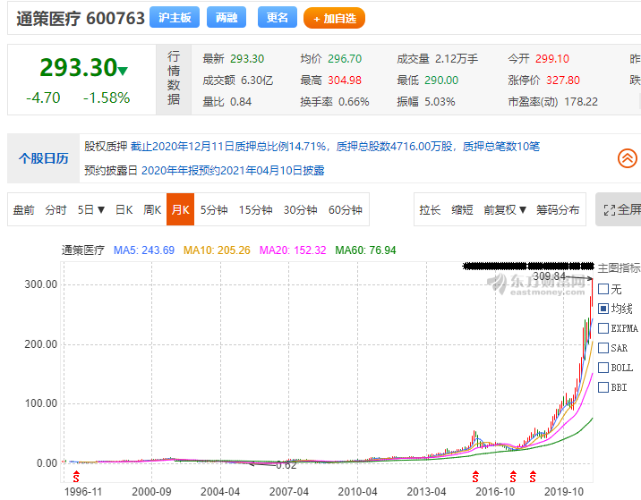
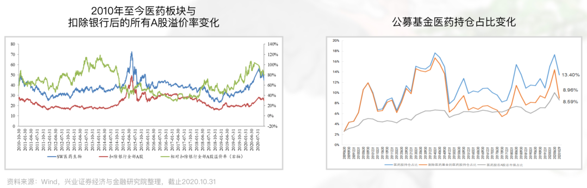
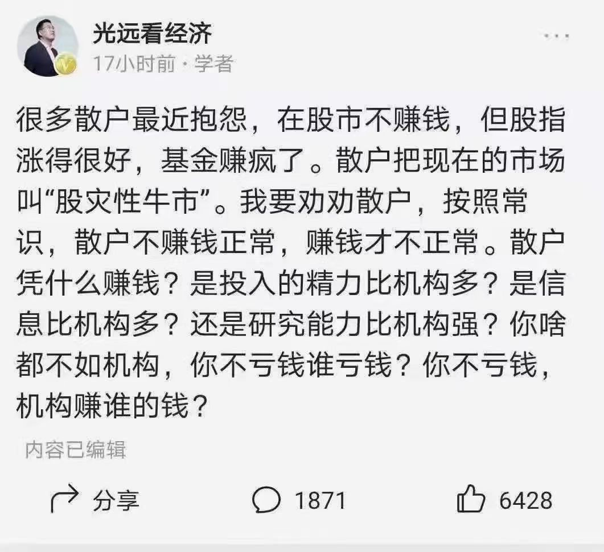
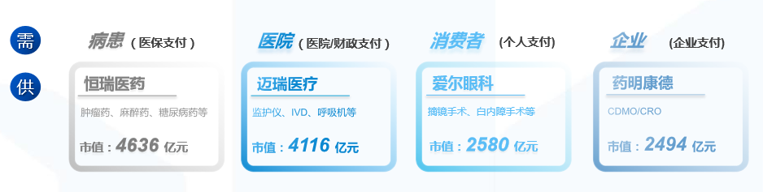
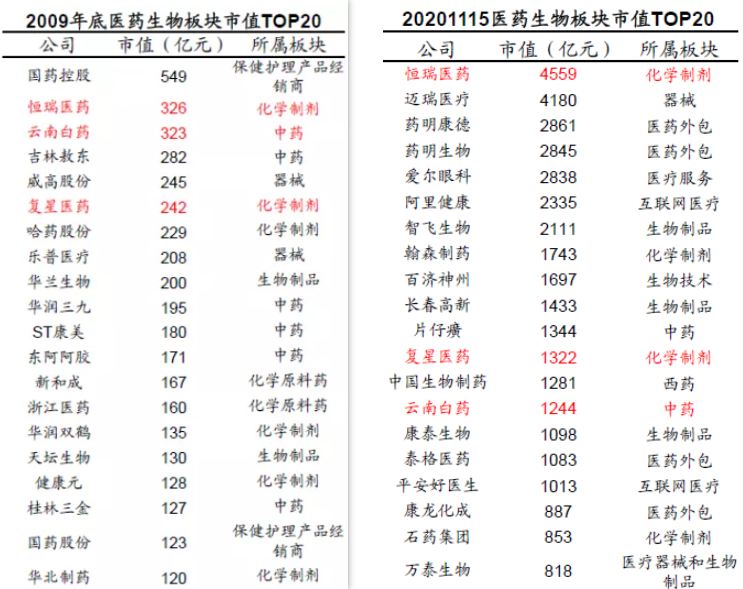

上一节课我们学完消费行业, 知道了酒类是中证消费涨幅最高的细分行业

在 A 股, 有句话叫做喝酒吃药. 医药与消费可谓长期行业.

投资需要看对大趋势.

未来 20 年, 中国人口变化的趋势是步入老龄化社会.

2019 年中国 65 岁以上人口占总人口的比例为 12.6%, 且仍然呈现升高的趋势. 未来的 20 年, 老龄化将更严重, 医药消费需求未来长期向好.

医疗支出在人的一生占比非常高, 华大基因董事长汪健在接受凤凰卫视采访时曾说过:"60%的人将 60%的积蓄用于生命的最后 28 天".

比如老龄化人口的慢性病, 癌症、糖尿病、高血压的发病率将分别提高至 0.7%、14.4%、27.8%, 长期用药及科学疾病管理成本, 带动中国医疗开支增加.

从全球来看, 高收入国家卫生医疗支出占 GDP 比重为 12.4% ,

我国卫生医疗支出占 GDP 的比例持续提升, 2000 年初为 4.6%, 2019 年达 6.6%, 仍处于上升阶段. 随着我国经 GDP 发展, 医疗支出占比提升空间仍然巨大.

事实上, 在美股市场, 过去 3 年、5 年、10 年, 美股总市值涨幅前二十的企业中, 分别有 17、11、6 支股票来自医药健康板块, 最高的个股 3-5 年可有 30-50 倍涨幅.

即使在美国这种医药行业非常发达的国家, 其业绩增速仍然能保持中速增长,

医药行业在中国才刚刚起步, 至少有 10 年的黄金发展时期, 暂时看不到天花板

## 医药涨幅有多高? 有哪些牛股?

A 股的医药行业被越来越多投资者视为"核心资产".

从中信一级 30 个行业来看, 医药这 20 年来的涨幅仅次于食品饮料, 而且医药中众多的细分子行业, 包括创新药、医疗器械、医疗服务等都是未来空间较大的优秀赛道

10 年 10 倍股, 医药是最多的行业, 没有之一.

我们不妨来围观下

恒瑞医药市值 15 年 128 倍

爱尔眼科市值 11 年 40 倍高成长

通策医疗 11 年 40 倍增长, 2009 年 18 亿到现在市值 940 亿

## 医药股高吗? 医药板块未来的投资机会还有多大?

2020 年疫情的爆发, 更是给医药板块带来了一轮大涨, 但从长期看 A 股市场, 医药行业仍然具有高配置价值.

我们可以从图表中看到纵观 A 股市场, 医药行业确实是一个能提供长坡厚雪的好赛道. 医药行业是十年十倍股最多的行业, 没有之一

现在每三股医药股, 有一股是行业基金买.

大部分投资者长期看好追捧且行业景气度持续高企, 使得整个医药行业估值长期处于高位

经济学家马光远曾说过:

很多散户最近抱怨, 在股市不赚钱, 但股指涨得很好, 基金赚疯了. 散户把现在的市场叫"股灾性牛市". 我要劝劝散户, 按照常识, 散户不赚钱正常, 赚钱才不正常. 散户凭什么赚钱? 是投入的精力比机构多? 是信息比机构多? 还是研究能力比机构强? 你啥都不如机构, 你不亏钱谁亏钱? 你不亏钱, 机构赚谁的钱?

## 如何选择优质的医药股

医药行业是一个很庞杂的领域, 我们先重点关注这几个细分领域的股票:

### 创新药

国家现在重点鼓励医药创新以来, 创新药公司研发经费外部支出由 2011 年的 211.25 亿元增长至 2019 年的 609.60 亿元, 年化复合增长率高达 14.15%. 国内创新药龙头外市值与对比国外医药例如辉瑞、默沙东、BMS 仍有空间

代表公司有恒瑞医药

抗肿瘤药研发和生产龙头, 恒瑞医药已经进入收获期, 不像国内大部分创新药企业还处在烧钱投研发的阶段.

例如恒瑞上市 20 年来终成 A 股医药龙头, 共计为投资者带来超过 200 倍的惊人收益回报

### 医疗器械

老龄化进程加速, 因此骨科、植入性医疗器械、影像诊断设备等需求不断提升, 叠加国产器械替代的政策鼓励, 行业板块景气度越来越好. 例如以疫情急需的呼吸机等设备为切入点, 迈瑞医疗等龙头加快提升全球市场占有率

代表公司有: 迈瑞医疗(各类医疗设备)、乐普医疗 (心血管医疗设备)

### 消费用药

品牌价值和门槛高, 龙头公司优势明显核心投资逻辑在于老龄化趋势和中国人对健康生活需求的提升代表公司有: 片仔癀、云南白药、白云山

### 医疗服务

例如国内眼科绝对龙头爱尔眼科, 预计未来五年医学视光 16%、屈光手术 30%、眼表疾病 21%、青少年斜弱视 29%年增长, 爱尔眼科通过"分级连锁"的商业模式不断扩张, 满足了不断扩大的摘镜手术、白内障手术等用户市场化需求

其他如通策医疗(牙科)、美年健康(体检)也是在处于需求高增长的细分行业龙头

### 疫苗研发

经过疫情, 公众疫苗防疫价值认知大幅提升全球产能吃紧, 推动跨国巨头与本土龙头公司的研发生产合作, 对国内龙头股价长期利好

代表公司有长春高新(生长激素)、康泰生物(乙肝疫苗)、智飞生物(HPV 疫苗)

以上这些细分行业和公司都是不错的投资标的. 不同需求催生了不同细分领域的龙头.

大家多关注财报中的增长速度和增长质量.

## 投资医药行业股票有哪些风险要注意?

消费行业很简单, 只要选龙头就不会犯什么大错, 但目前的医药行业变数很大, 选对了股就是一飞冲天, 选错了就是万丈深渊.

最大的风险往往不在公司本身, 而在于宏观和行业环境的变化, 我们规避医药行业的一些明显风险.

医药行业存在许多黑天鹅, 2011 年的安徽模式、2018 年的集采、去年心脏支架的降价, 反商业贿赂、药物研发的阶段性坎坷等一系列事件

在这总结了以下 2 类风险

不去投资受医药政策影响大的子行业, 哪怕这些行业"看上去很美".

医保大趋势是控费, 选择那些政策影响小、行业空间大、趋势向好的行业.

2018 年下半年, 由于带量采购对仿制药的影响最大, 杀伤力特别强. 而像爱尔眼科、欧普康视、通策、迈瑞、 恒瑞这些公司近两年股价能一直向上涨?

一方面是由于业绩的增长, 但更多的是估值的提升, 市场认为这些公司的业务主力消费人群不受医保政策影响, 确定性更高, 所以愿意给更高的估值.

不要买没有护城河的公司, 一定要买真正具有创新竞争力的医药公司.

从长期来看, 注册制背景下, 医药上市壳公司不会再是一个稀缺的资源.

医药从来都是买的成长而不是便宜, 决定企业长期竞争力的是赛道选择和核心壁垒; 好赛道+优质公司估值高企预计会成为常态, 泡沫不可避免, 最终走出来的可能只是凤毛麟角.

100 个公司里面真正长大的或许只有 5-10 家. 例如, 十年医药 TOP20 中除了恒瑞、云南白药和复星医药, 全是新面孔.

这是一个专业性的赛道, 更新迭代非专业投资人士才能预判前景

## 课程总结

总结一下:

1、投资需要看对大趋势.

未来 20 年, 中国人口变化的趋势是步入老龄化社会我国卫生医疗支出占 GDP 的比例持续提升, 空间仍然巨大.

医药行业是一个能提供长坡厚雪的好赛道, 10 年 10 倍股, 医药是最多的行业, 没有之一.

2、不同需求催生了不同细分领域的龙头.

重点关注创新药、医疗器械、消费用药、医疗服务、疫苗研发等这几个细分领域的股票:

医药行业要规避风险, 不去投资受医药政策影响大的子行业, 不要买垃圾股, 要买真正具有创新竞争力的公司
