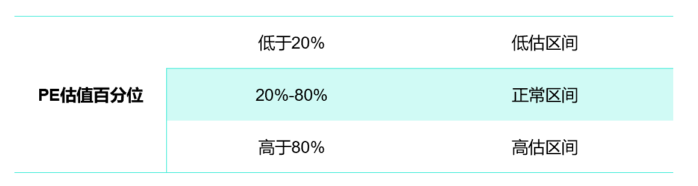
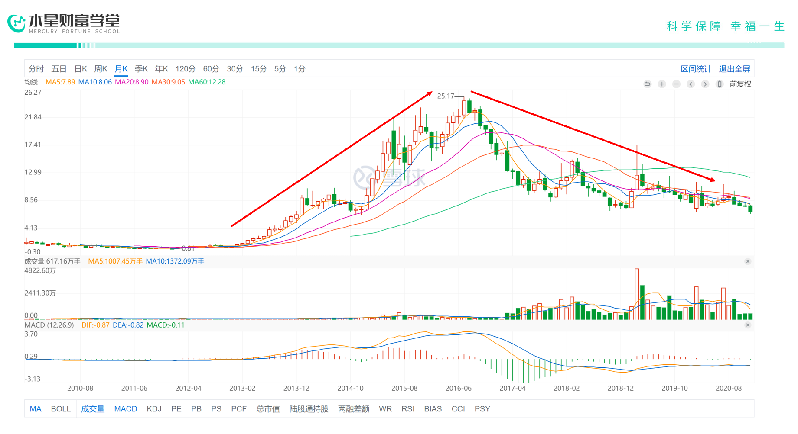
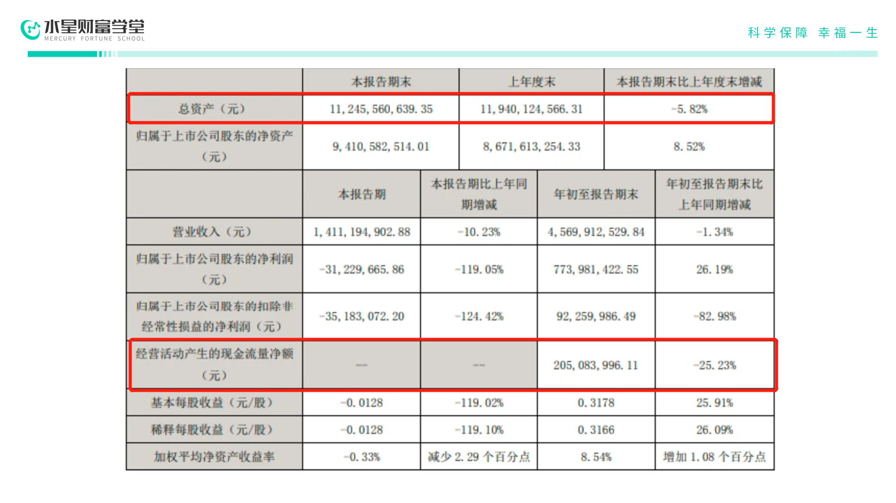
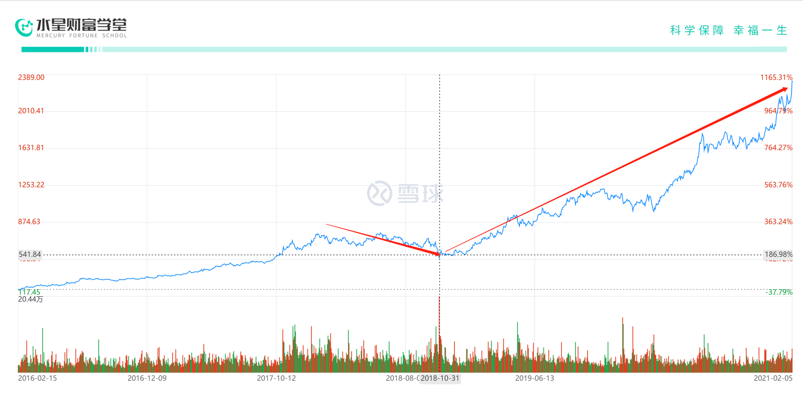

大家好, 欢迎继续学习我们的股票课.

到现在为止, 我们已经学习了非常多的股票分析知识.

我们知道, 从根本上说, 一家公司的经营业绩决定了它的股价. 我们也知道, 在一个便宜的价格买入, 才有可能赚更多钱.

不过, 股市中还流传着这样一句话: 会买的是徒弟, 会卖的才是师父. 买入股票之后, 我们不能不管, 在适当的时候卖出也很重要. 不然, 别说收益, 很可能连本金都亏损掉.

今天, 我们就来学习怎么判断卖出时机.

## PE 高估卖出法

首先要明确的, 我们卖出股票, 其实是担心股价下跌带来损失, 那为什么股价会下跌呢? 这个问题的答案, 其实和股票上涨动力是一样的, 就是情绪和业绩.

对于一些股票, 尤其是成长股, 一旦业绩开始下滑, 原来看好它的人会因为业绩不理想对它产生怀疑, 转而纷纷抛售, 市场情绪往往会出现同步下降.

最后, 恶性循环, 导致股价大幅下跌.

这种情况就叫"戴维斯双杀"

在实际投资过程中, 我们判断股票的卖出时机, 就是为了避免"戴维斯双杀".

那在今天我们要讲的第一个方法, 是 PE 高估卖出法.

还记得什么叫 PE 吗? 就是我们的市盈率.

通常来说, 在市盈率低估的时候, 我们可以考虑买入, 这个时候, 股票价格是相对便宜的.

那么, 对应地, 当市盈率高估的时候, 我们也可以考虑卖出

我们之前讲过, 判断买入时机, 可以拿滚动市盈率和历史平均值作比较, 看估值百分位.

在市盈率低于历史 20%估值水平时, 可以买入;

同样地, 在市盈率高于 80%时, 我们可以选择卖出.

一般来说, 如果公司基本面没在短时间内发生大变化, 而市盈率却在短时间内快速上升到高估区间, 这个时候, 其实是可以考虑卖出的.

这是为什么呢?

其实很简单, 因为市盈率的高低, 某种程度上反映了市场情绪的高低, 如果基本面未大变, 而过高的市盈率, 可能意味着市场陷入了一种狂热情绪.

我们都知道, 狂热往往是不可持续的, 说不定哪天就消散了, 而你没有及时卖出的话, 就好比坐了一回过山车, 大起大落.

所以, 在实际过程中, 虽然有些粗糙, 但通过估值判断大致卖出时机, 却是一个简单的方法.

## 止盈止损卖出法

第二种方法, 是止盈止损卖出法.

通过估值, 我们可以大致判断卖出时机, 但到底以什么价格卖出比较合适呢? 要知道, 现实中的股价, 涨跌往往是一个特别的现象: 要么涨过头, 要么跌过头.

什么意思呢?

就是股价涨到高估区间, 它不一定马上就会下跌, 还有可能继续上涨. 反之, 当股价进入低估区间, 它也不一定就立刻回升, 也有可能会继续下跌.

所以, 我们在卖出股票的时候, 具体又分 2 种情况: 一种是盈利, 另一种是亏损.

在盈利的时候及时卖出, 称为止盈; 在亏损的时候及时卖出, 称为止损.

我们就从止盈和止损 2 个方面, 来看看什么时候适合卖出.

### (1)止盈卖出

先来说说, 止盈.

在实际投资中, 如果你持有一支股票开始进入高估区间了, 等到一个比较合适的卖出点, 及时落袋为安, 这就是止盈.

止盈有 1 种比较简单粗暴的方法: 最高点回落止盈.

什么是"最高点回落止盈"呢?

简单来说, 就是当股票进入高估区间, 我们可以在股价从最高点回落的时候卖出, 这个回落的幅度一般是以百分比为参考标准, 比如说 10%

10%这个参考值不小也不算太大, 相对折中, 比较实用, 也比较通用.

举个例子.

一只股票现在涨到了 60 元, 已经属于比较高了.

之后股价开始下跌.

等跌了差不多 10%, 也就是从 60 元回落到 54 元, 我们就可以考虑在 54 元价格左右卖出.

这个方法简单直接, 还能保住大部分利润, 对于初学者来说是一种很好的止盈方法.

### (2)止损卖出

说完了止盈, 再来谈谈第二种卖出的情况: 止损.

股票是一种风险很高的投资品.

现实没有那么美丽, 当我们买入一只股票之后, 股价可能并没有如想象中那样一路上涨, 反而大幅下跌, 甚至比买入时的成本价更低, 这就是我们俗称的"套牢".

大多数人发现自己被套牢了, 心里想的是, 卖出会亏钱, 还是等等吧, 说不定哪天就回本了.

这种心理, 可能出现两种情况.

第一种, 如果你买的是蓝筹股, 大企业业绩稳定, 买入后虽然出现暂时性下跌, 但通过长期持有, 也还是有机会迎来回本的那一天;

第二种, 如果买的是业绩不稳定的股票, 一旦企业无法维持高增长业绩, 市盈率会下滑, 股价会成倍地下跌, 亏损幅度会更大, 今后想要再涨回来, 很难很难.

这种情况, 我们就要及时卖出止损.

那具体什么时候卖出会比较好呢?

现实中股价涨跌的原因非常复杂, 但记住, 我们买股票, 本质上买的是股票背后的企业, 股价下跌的核心原因是企业的基本面恶化.

只要抓住这一点, 一旦公司基本面有变坏迹象, 也不用再去琢磨技术面, 也不要心存侥幸, 幻想它会重新上涨到原来的价格, 可以直接卖出.

还是举个例子.

曾经科技股的一只明星股, 网宿科技(300017)

2009 年上市的网宿科技, 在 2013 年、2014 年净利润增速高达 128%、104%, 2015 年业绩更是达到高峰, 一度被真爱粉称为创业板中的"灵魂大白马".

但 2016 年以后, 股价陡转直下.

如果你在 2016 年中以 25 元左右价格买入网宿科技, 那你至今都被"套牢着, 没有回本

导致它股价下跌的原因, 就是企业基本面的恶化.

2016 年以后, BAT 巨头入场, 阿里云强势抢夺市场, 网宿科技没有一条宽大的护城河来抵御竞争对手, 扭转自己的业绩. 往后几年, 它一步步跌落神坛, 到 2019 年已经是财务亏损状态.

与之相反, 假如一家公司基本面没有恶化, 盈利能力也持续保持在一个较好的水平, 即使股价在短时间波动下跌, 长期来看, 股价还是向上的, 不用担心择时问题.

拿 A 股巨无霸贵州茅台(600519)为例

2018 年的熊市, 茅台公司的股票同样大幅下跌, 从最高点的接近 800 元下跌至 500 多, 跌幅超过 30%. 假如你在 2018 年卖出, 那你将错过茅台股价从 500 元突破到 2000 元的巨大收益.

所以我们说, 关键还是要判断基本面.

## 课程总结

好啦, 今天的课就到这儿~

我们来总结一下今天的内容:

在股票投资过程中, 一个合适的卖出时机非常重要.

那怎么判断卖出时机呢?

我们常用的办法有两种, 一种是市盈率高估卖出法, 一种是止盈止损卖出法.

在市盈率低于历史 20%估值水平时, 可以买入; 相应地, 在高于 80%时, 我们可以卖出.

在股价从最高点回落 10%后, 我们可以考虑止盈卖出;

而在企业有变坏迹象时, 也不要心存侥幸, 可以直接止损卖出.

需要提醒的是, 止盈止损是一种短中期行为, 赚的是小钱, 盲目的止盈止损可能会错过很伟大的公司. 最关键的, 还是要从企业的基本面出发.
