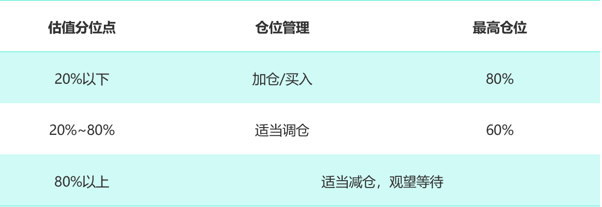
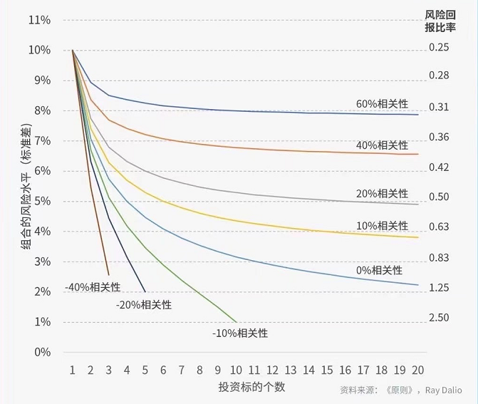

大家好,欢迎继续学习我们的股票课。

不知不觉我们的课已经进入尾声了,经过这么长时间学 习,其实股票交易中的三大核心问题我们已经大致解决了:买什么,什么时候买,什么时候卖。

不过,投资是概率问题,股票是一种高风险投资,亏损 的可能性非常大,想要稳妥一点,离不开风险管理,这 其中就涉及到第4个问题:仓位管理。

今天,我们就来说说股票投资中的仓位管理。

仓位管理这个概念有点空,我们把它说得具体一点,也 就是买多少股票。再具体一点,还可以拆解为2个部分: 我们要花多少钱买股票?买多少只股票比较合适?

## 花多少钱买股票?

这个问题,它涉及到的是资金管理。

刚刚入市的朋友想必都会有这样一个疑惑:我究竟要拿 出多少钱投入到股市?

对于新手来说,初始资金量是一个非常非常需要重视的 问题:

如果太多,一旦亏损会造成太大的损失;

太少了,我们心理重视程度又会下降,达不到投资实践 或练习的效果。

那究竟要投入多少钱好呢?

其实,每个人心理承受能力不一样,这个问题没有绝对 的一个标准。

非要说的话,一般2~3个月工资是比较好的,这个数量不 会太多,即使亏了还能赚回来。但同时也不会太少,2~3 个月工资还是一笔不小的数目,足够让我们保持重视。

而且,记住一点,即使准备了2~3个月的工资,也不要满 仓。

什么叫满仓呢?

比如说,有些人准备拿3个月工资入市,结果一口气全买 光,账户上一分钱都不留,等哪天股价跌了,想加仓可 没钱了,这种通俗的说法就叫“满仓”。

许多投资大师都不建议满仓这样的行为。

巴菲特就说过这样一句话:现金像是氧气,当你使用它 的时候,你99%不会注意到它,但一但它没有了,你立 刻就发现它的关键了。

对于我们普通人来说,最好还是保留一部分现金仓位, 来应对市场。

比如说,把投资股票的资金平分成三份,买进3-5只好 公司;

当符合买入区的时候,先买个三分之一;

之后当股价每下跌5%-10%就再买进三分之一,直到慢 慢打光子弹。

整体上,仓位管理就是建立三步原则:开仓原则,加仓 原则、减仓原则。

什么时候买入,初始资金量是多少; 什么时候加仓,加仓资金量是多少; 什么时候减仓,以及什么时候卖出。

那具体的一个原则是什么呢?

还记得PE估值分位点吗?这里我们还是可以用到这一指 标。

结合PE估值,我们的仓位管理,大致可以遵循以下一个 逻辑:

(1)20%以下,加仓或买入,但最高仓位尽量不要超过 资金量的80%;

(2)20%-80%,看估值适当调仓,但最高仓位不要超 过资金量的60%;

(3)80%以上,尽量按兵不动,也可以适当卖出或减 仓。

总体的一个原则就是,不要满仓,明显高估的时候要减 仓,避免市场回调造成的损失。这样一来,赚的多,亏 的少,收益自然可以稳一点上升。

## 买多少只股票?

说完花多少钱买股票之后,我们来说说第二个问题,买 多少只股票?

我们先设想一下,假如你只有一只股票,比如某科技 股,你的风险来自哪里?

你可能会想到两种风险。

一种来自于经济大环境,比如商业周期、利率、汇率 等;

第二种来自于公司影响,比如这家科技公司研发技术有 重大突破,高管爆出大新闻,这些因素会影响你持有的 这只股票,但基本不会影响市场中的其他企业。

现在考虑第二只股票。

将你的一半资金投入某石油股,另一半资金投入原来那 只科技股,这时的风险会怎样呢?

你会发现,风险好像降低了。

比如,当市场石油价格下降时,冲击了你持有的石油 股,但同时,市场的数字设备价格可能还在上涨,有利 于你的另一只科技股,这样两股力量相互弥补,就稳定 了组合的收益。

这其中的奥义,就在于分散投资。

因为石油股和科技股的相关性比较小,这样一个组合能 降低风险波动,使得收益更稳一点。

假如我们再买入第3只股票、第4只股票、第5只股票... 我们便会进一步分散掉风险因素,即使你是小白,长期 也能稳稳赚钱,这就是分散投资的魅力。

不过,分散投资也并不是说非要买二三十只股票。

普通人一般很难有时间和精力去了解几十家公司,如果 我们过于教条式地追求分散投资,真要追求一个最优 比,你的持仓中必然会有一些公司超出了你的能力,你 并不了解。

所以,巴菲特就曾多次建议,个人投资者最好是在“能力 圈”内投资,集中对自己熟悉的公司进行投资,这样才能 获取稳定的高回报。

对于咱们新手来说,持仓数量最好不超过10只。

如果你的资金量比较小,5只到8只股票是比较合适的, 而行业最好在3个以上。

总的来说,投资是一个从上到下的过程,分散投资要记 住三点。

第一,按照自己的总资金分配。

3到5个行业为佳,资金量少的,可以分配到2~3个行业, 5~8只股票。资金量大的,可以按照实际情况调整,尽量 不要超过10只,贵精不贵多。

第二,要选择确定性高的行业。

什么是确定性高呢?就是那些未来行业成长空间大的, 国家大力支持的行业。比如说消费、医药等行业。

第三,对每个行业里的股票单独进行操作。

我们选好了行业,不是在这个行业闭眼瞎买,要选择估 值合理的股票,灵活调仓。

最后,保持平常心,不要焦虑。

不要频繁交易,情绪化交易很可能陷入追涨杀跌。选出 了好公司,我们完全可以长期持有,如果实在焦虑得寝 食难安,那就适当减仓吧。

## 课程总结

好啦,今天的课就到这儿。

总结一下,其实我们投资股票,有4个问题:买什么,什 么时候买,买多少,什么时候卖。

买什么?买好行业、好公司。

《穷查理宝典》中有这样一段话,“在一些行业中,没有 哪家公司能赚到钱。而另一些行业中,则每家公司都很 赚钱。"

选行业是投资的第一步,选对了行业能事半功倍,我们 要选确定性高的行业,如医药消费。

那什么是好公司呢?这要结合基本面,分析公司三张 表,用各种比率指标度量企业盈利能力。

什么时候买?买好价格。

怎么才算是好价格呢?看估值,低估区间内的价格更便 宜,上涨空间大,赚钱概率更大。

什么时候卖?及时止盈止损。

在估值过高时适当减仓,在股价最高点回落10%后考虑 卖出,在企业基本面恶化的时候止损。

而具体买多少呢?要灵活仓位管理

结合自己的资金量,新手准备2~3个月工资,投资3~5个 行业,5~8只股票为宜。而且记住,不要满仓,要学会分 散投资,找相关性低的行业和股票,减小巨幅亏损的可 能性。

我们说,股票投资具有很强的政策性、规范性和技术 性。

但万变不离其宗,无论股价怎么频繁变动,它总是围绕 股票的内在价值上下波动。

在实际操作过程中,只要我们抓住企业本身,判断基本 面,选择有价值的股票,再相信时间的力量,长期持 有,就没那么容易被瞬息万变的市场蒙蔽,也能大概率 获得不错的收益。
