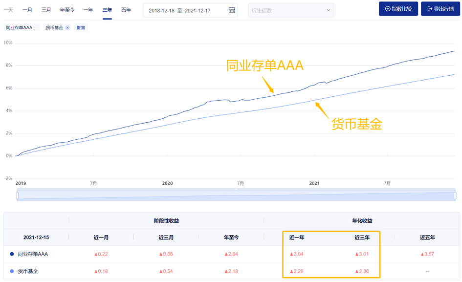
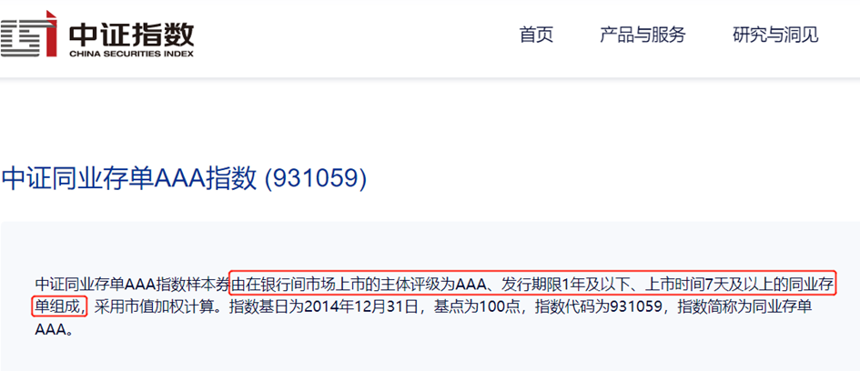
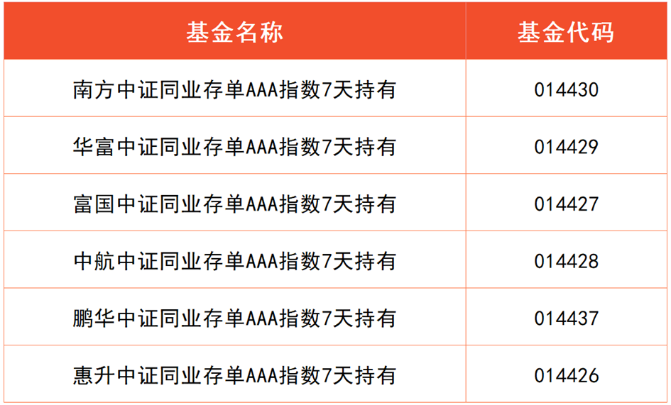
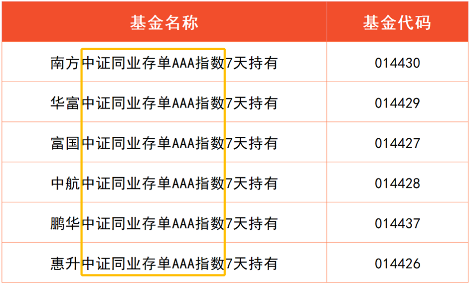
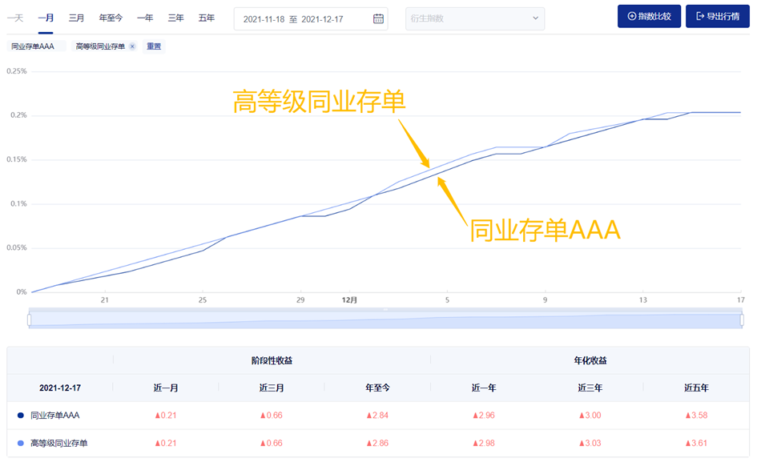
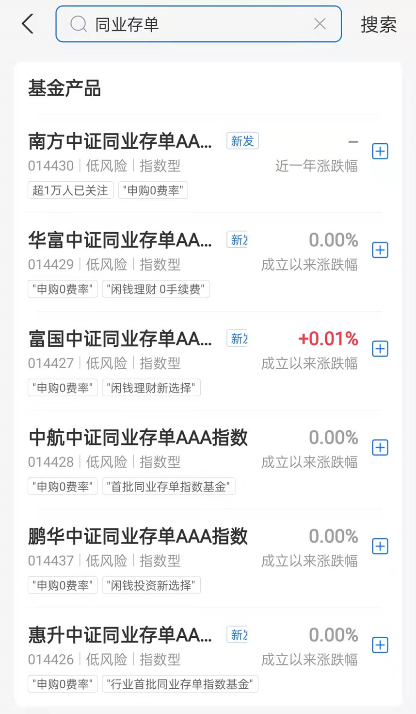
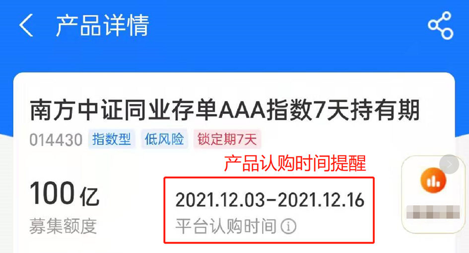
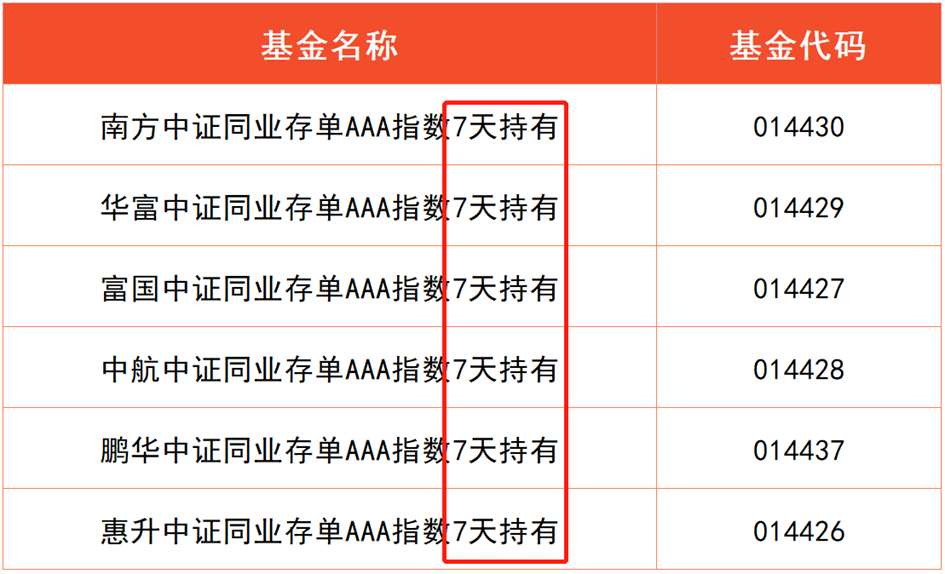

## 稳中有升的同业存单基金

学理财，上水星财富学堂。小伙伴你好，欢迎继续学习《基金会员实战营》。本节课，你将学到预期收益高于货币基金的闲钱理财工具：同业存单基金。

要想理解什么是同业存单基金，我们要先理解什么是同业存单。

同业存单的专业定义是，存款类金融机构在全国银行间市场上发行的记账式定期存款凭证。

大家可以通俗理解为银行之间互相借钱。A 银行需要借一笔钱，所以发行“同业存单”找同行借钱，规定一个还钱的期限; B 银行需要利息，所以就把钱给 A 银行用，等这份同业存单到期后，再取回本金和利息。

所以，同业存单类似于 B 银行在 A 银行存钱的一张“存折”。它本身属于银行存款类产品，安全性较高，是值得选择的稳健投资工具。

不过，同业存单只对商业银行、保险公司、基金公司等专业金融机构开放。普通人无法直接接触。好在如今有了同业存单基金，可以让我们以基金的方式，间接投资一篮子同业存单。

在我国的理财市场，同业存单基金是一个崭新的品种。2021 年 12 月 3 日，首批同业存单基金刚刚开卖。目前来看，市面上的同业存单基金数量较少，远没有货币基金那么多。不过，这不影响我们挑选合适的基金先“上车”，提升闲钱理财收益。

收益提升是否属实呢？我们可以用历史数据来验证。

大家可以看文稿中的插图。下图的数据统计时间为 2021 年 12 月 17 日，近一年时间内，同业存单指数的年化收益率为 3.04%，而货币基金的年化收益率仅为 2.29%;近三年时间内，同业存单指数的年化收益率为 3.01%，而货币基金的年化收益率仅为 2.36%。

截图来源：中证指数有限公司官网

可以看到，同业存单指数的历史收益水平总体高于货币基金。

而且大家要知道，同业存单基金和货币基金都是复利增值，每天的收益都会加入下一天的本金继续“滚雪球”。

短期来看，二者的年化收益率相差较小，但是拉长时间来看，收益总额的差距会越拉越大。

细心的小伙伴可能发现了，前面出现了一个陌生词汇，叫做“同业存单指数”。其中“指数”是什么意思呢？

## 什么是“同业存单指数”?

所谓的“指数”，可以理解为专业机构挑选出来的一篮子投资对象。

比如，债券指数，就是专业机构挑选出来的一篮子债券；股票指数，就是专业机构挑选出来的一篮子股票；同业存单指数，就是专业机构挑选出来的一篮子同业存单。

专业机构把指数编制出来以后，基金可以选择跟踪指数进行投资。基金经理只需要依葫芦画瓢，原样复制指数的成分即可。这就省去了基金经理自己挑选投资对象的麻烦，也帮我们减小了基金经理投资水平较差的风险。

以“中证同业存单 AAA 指数”为例：它是中证指数公司编制的一个指数，由在银行间市场上市的主体评级为 AAA、发行期限 1 年及以下、上市时间 7 天及以上的同业存单组成。

其中，评级是对同业存单发行方的信用评价，AAA 为最高评级，说明该指数所选的同业存单信用相对可靠。

而且，该指数在每个交易日自动调整一次成分。 满足条件的同业存单当日起计入指数，不满足条件的同业存单自次日起剔除出指数。对于不合格的同业存单，完全可以做到及时淘汰，帮助投资者及时“避雷”。

截止到 2021 年 12 月 15 日，该指数的成分一共包含了 9582 张同业存单。也就是说，我们此时购买一只跟踪“中证同业存单 AAA 指数”的基金，相当于分散投资了 9582 张同业存单。即使其中某一张存单出现问题，对总体收益的影响也微乎其微。

因此，国内首批发行的 6 只同业存单基金，全部选择了跟踪“中证同业存单 AAA 指数”。

汇总以上信息，我们可以得出如下结论一

投资同业存单指数基金时，我们拥有三层“安全垫”:

第一层，同业存单本身属于银行存款类产品，风险不大;

第二层，指数选择的同业存单评级达到了 AAA 级，进一步降低了风险;

第三层，指数的成分包含几千张同业存单，再一次分散了风险。

需要提醒大家的是，同业存单基金不一定非要跟踪指数。基金既可以跟踪指数，也可以非指数化投资，由基金经理主动分析、主动选择同业存单。

相比之下，建议大家优先选择指数基金产品。因为市面上的同业存单数量庞大，单单指数成分涵盖的同业存单就达到了几千张，基金经理精力有限，靠主动分析难以覆盖几千个产品，难免漏掉一些优秀的同业存单。

那么，如何判断基金有没有跟踪指数呢？

最简单的方法就是看基金名称。比如前面提到的 6 只首发基金，名称里都包含了“中证同业存单 AAA 指数”的字眼。

基金可以跟踪的同业存单指数总共只有两个：一个是前面提到的中证同业存单 AAA 指数，另一个是中证高等级同业存单指数。

大家可以看文稿中的图片，两个指数的历史表现高度重合。这就说明，不管基金跟踪的是哪个指数，最终收益都不会相差太大。

## 基金的封闭期和持有期

想找一只同业存单指数基金投资，方法如下：

进入基金销售平台，搜索关键词“同业存单”，找出相关基金，根据名称判断它是否属于指数基金。

如果不是指数基金，建议大家直接排除。如果是指数基金，先不要着急购买，我们还要进行下一步分析。

同业存单指数基金是刚面世不久的基金品类，所以会有大量的新基金出现。当新基金开放认购时，是否要参与认购呢？

请大家注意，新基金认购成功后会有一段封闭期，同业存单指数基金的封闭期通常为一个月，期间不可以赎回，只能等到封闭期打开以后再操作。如果你在这段时间里突然急用钱，就会面临取不出钱的困扰。

我们对同业存单指数基金的定位是“短期闲钱理财”，所以不建议大家认购此类新基金。相较而言，申购封闭期已经打开的基金是更灵活的选择。

(备注：新基金认购阶段会有认购时间提醒，开放申购后则没有。)

基金的封闭期打开以后，我们随时都可以参与申购。但是申购成功以后还要注意，你需要面临 7 天的持有期。大部分基金都会将“7 天持有”写在名称中。

持有期和封闭期类似，期间无法赎回。但对于闲钱理财而言，7 天的等待时间相对容易接受。而且等 7 天过后，基金“解锁”，你就可以选择任意一天赎回了 。

所以，同业存单指数基金适合存放半年内计划要花，但一周之内暂时用不到的钱。

如果你愿意牺牲一点流动性， 多赚一点收益，就可以选择同业存单指数基金。如果你更加看重流动性，想要 24 小时快速变现，那么货币基金更值得选择。

本节课的内容就到这里了。下面做一下总结。

## 总结

1.同业存单指数的历史收益水平总体高于货币基金。

2.同业存单基金不一定非要跟踪指数，但建议大家优先选择指数基金产品。

3.不建议大家认购新发行的同业存单指数基金。相较而言，申购封闭期已经打开的基金是更灵活的选择。

4.申购同业存单指数基金成功后，将面临 7 天的持有期，持有期内无法赎回，7 天过后可随时赎回。所以，同业存单指数基金适合存放半年内计划要花，但一周之内暂时用不到的钱。
