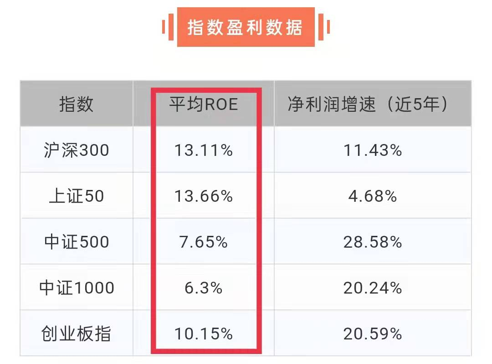

## 组合应对“二八轮动”

学理财，上水星财富学堂。小伙伴你好，欢迎继续学习《基金会员实战营》。

上一节课，我们学习了 A 股市场中 5 个常用的指数。其中，沪深 300、.上证 50 属于“大盘指数”; 中证 500、中证 1000 和创业板指属于“中小盘指数”。

在 5 个指数之间该如何取舍呢？我们不妨看一下它们的历史表现。下图为大家展示了 2012 年~2021 年这 10 年时间里，5 个指数历年的涨跌情况。

可以看到，2014、2016、 2018、2019 和 2020 这 5 年都是“普涨”或“普跌”的行情;不管你选择了哪个指数，都将和大多数投资者步调一致。既不会“独自赚钱，惊艳所有人”，也不会“独自亏钱，被市场打败”。

其余 5 年时间，5 个指数表现出了明显的分化，涨跌不再同步。2012 年和 2017 年是明显的“大盘行情”，只有沪深 300 和上证 50 明显上涨; 2013、2015 和 2021 这 3 年是明显的“中小盘行情”，只有中证 500、中证 1000 和创业板指明显上涨。

这种现象被称为“大小盘轮动”，也叫“二八轮动”。“二”代表数量占比 20% 左右的大盘股，“八” 代表数量占比 80% 左右的中小盘股，“轮动”指的是行情的轮番切换。

有的小伙伴可能想：我只要能猜对接下来是大盘行情还是中小盘行情，然后配置对应的指数基金就可以了。

想法很美好，但对于普通投资者来说，预测未来行情根本不切实际。专业的投资机构都无法保证准确预测，普通人就更不建议尝试。

不过，我们可以在大盘指数和中小盘指数中各选择一个代表，构建一个组合。一来可以分散投资风险;二来不管是大盘行情还是中小盘行情，我们都能从中获利。

按照“大盘指数 + 中小盘指数”的组合要求，总共有六种组合方式：

沪深 300 + 中证 500;

沪深 300 + 中证 1000;

沪深 300 + 创业板指;

上证 50 + 中证 500;

上证 50 + 中证 1000;

上证 50 + 创业板指。

到底哪一对组合才是最终选择呢？这需要我们在 5 个指数之间仔细挑选，留下投资“性价比”较高的那一对。指数的“性价比”主要看两方面，一是估值，二是盈利。乍一听很“高大上”，但理解起来非常容易。

我们可以把股票比作一只“下蛋的老母鸡”。想要靠它赚钱，方法有两个。

第一个方法，你可以买下这只老母鸡，养起来，让它源源不断地下蛋。这些蛋全部都是你的收益。就算老母鸡的市场价没涨，你也赚到了很多的鸡蛋。

所谓的鸡蛋，其实就是上市公司的盈利增长。只要公司一直赚钱，市值越来越大，投资者就能从中获利。这种方法需要我们了解上市公司的盈利能力和成长性，也就是现在能不能赚钱、未来能不能赚更多。

第二个方法，你可以低价买下这只老母鸡，养起来，等到它的市场价涨高了，再转手卖掉。在此期间，就算老母鸡一个蛋也没下，你也赚到了低买高卖的差价。

这种方法需要你进行估值。打个比方，你判断一只老母鸡的合理价格是 50 元，那么在 50 元以下时就可以便宜买入，超过 50 元再高价卖掉。

总的来说，第一种方法赚的是盈利增长的钱，第二种方法赚的是估值修复的钱。

以上虽然是针对单只股票的分析，但对于指数来说完全一样。指数是一篮子股票，我们需要知道的是这一篮子股票总体的估值、总体的盈利增长。

在构建组合的时候，可以分别选择一只“下蛋鸡”， 一只“低价鸡”，同时用两种方式赚钱。

## 两个指标，找到“下蛋鸡”

首先请大家思考一下：对于一只“下蛋鸡”来说，什么样的表现才算优秀呢？

首先，吃同样多的饲料，优秀的鸡应该下蛋更多。对上市公司来说就是高效利用手中的资产，创造出更多利润。考察指标叫做“净资产收益率”，英文简称 ROE。

计算公式为: ROE=净利润/净资产。

假设一家公司拥有 100 万元的净资产，一年可以创造 15 万元的净利润，那么 ROE 就是 15%。

从公式可以看出，ROE 代表的是利用单位净资产可以获得的净利润，翻译成大白话就是“给你一块钱，你能够赚多少钱”。别人用 1 块钱创造 1 毛钱的利润，你能用 1 块钱创造 5 毛钱的利润，你就算优秀。所以说，ROE 越大，代表盈利能力越强大。

其次，优秀的“下蛋鸡”，要做到一年比一年下蛋多。如果一只鸡今年下 50 个蛋，明年还下 50 个蛋，一直没什么长进，甚至出现倒退，那么就很容易被同类超越。这就要求我们考察它的成长性。对上市公司来说，就是“净利润增速”。我们要看的指标是：近 5 年的净利润复合年化增长率。

之所以选 5 年，是因为一家公司落实发展计划通常需要 3~5 年的时间，选取时间太短不足以说明问题，5 年的成长更加具备说服力。

净利润增速越快，说明成长性越好。如果公司近 5 年的净利润增速较快，未来就有较大概率保持发展势头;如果公司近 5 年的净利润增速较慢，未来“翻盘”的可能性也不大。

选择指数时，我们不需要分析每一只成分股的数据，只需要看指数的 ROE 和净利润增速就可以了，它们分别代表了一篮子股票总体的盈利能力和成长性。

大家可以关注“水星财富学堂”公众号，在底部菜单选择“基金课程”，点击“课程工具”子菜单。

此时可以在“指数盈利数据”中看到 5 个指数的平均 ROE。这里的“平均 ROE”是对指数成立以来的历年 ROE 取平均值，代表指数长期的平均盈利能力。

右侧一列是指数近 5 年的复合年化净利润增速，反映的是指数近 5 年的成长性。

两个指标其实没有严格的标准线。我们只需要综合对比 5 个指数的数据，选择平均 ROE 和净利润增速都较高的就可以了。

需要大家注意的是，计算 ROE 和净利润增速的数据来源于上市公司的定期财务报告，通常每个季度结束后才会有新的报告，所以数据不会频繁变动。

## 三个指标，找到“低价鸡”

本小节将带你寻找“低价鸡”，学会在低估时买入，高估时卖出，赚估值修复的钱。

估值的指标主要有三个：市盈率、市净率和股息率。

### (一) 市盈率

计算公式为：市盈率=市值/净利润。

假设 A 上市公司的市值是 100 亿元，每年创造 20 亿元的净利润，那么它的市盈率就是 100 除以 20，也就等于 5。

如果你是个土豪，花 100 亿把 A 公司收购了，那么按照它每年能为你创造 20 亿元的净利润来算，只需要 5 年的时间，你就可以回本啦。

所以，大家可以把市盈率理解为：投资收回成本所需要的时间。市盈率越小越好。因为市盈率越小，一笔投资收回成本的时间就越短。

### (二) 市净率

计算公式为：市净率=市值/净资产。

假设 A 上市公司的市值是 100 亿元，公司坐拥 50 亿元净资产，那么它的市净率就是 100 除以 50，也就是 2。

这里解释一下净资产的概念：

净资产就相当于，假设公司现在破产，把该还的债都还了以后，剩下的各种资产都卖掉，桌子椅子、锅碗瓢盆、房子机器全部卖掉，最后能收回多少钱。

如果你是个土豪，花 100 亿把 A 公司收购了，那么，按照它目前净资产 50 亿来算，相当于你出了两倍的价格买这家公司。

所以，大家可以把市净率理解为：需要花几倍的钱买下一家公司。 市净率也是越小越好。因为市净率越小，买相同的资产所花的钱越少。

### (三) 股息率

计算公式为：股息率=分红额/市值。

假设 A 上市公司的市值是 100 亿元，拿出 3 亿元来分红，那么它的股息率就是 3 除以 100，也就是 3%。

从公式可以看出，股息率指的是公司分红的钱占总市值的比例，也可以理解为“每股分红多少钱”。股息率越大越好。因为股息率越大，股东到手的现金就越多。

总结一下：市盈率、市净率都是越小越好，股息率是越大越好。虽然我们知道了这层关系，但到底多大算大、多小算小呢？

有的小伙伴可能认为：只要像上一节一样，综合比较一下 5 个指数的估值，选择市盈率、市净率数值较小，股息率数值较大的指数就可以了。

这种想法是错误的。打个比方，20 元一斤的进口车厘子，和 10 元一斤的国产香蕉，哪个更便宜呢？

如果只是对比数值，你会得出国产香蕉更便宜的结论。但实际上，进口车厘子远不止 20 元一斤，这个价钱相当于大甩卖;国产香蕉一般不到 5 元一斤，卖 10 元一斤相当于“宰客”。

所以说，判断贵与不贵，一定是拿一件东西和它自身的合理价值做对比，而不是不同东西之间互相对比。和自身对比就产生了一个指标，叫做“分位点”

分位点不需要大家手动计算，打开“水星财富学堂”公众号的“课程工具”，可以在“指数估值数据”中看到 5 个指数的估值分位点。其中，PE 是市盈率的英文简称，PB 是市净率的英文简称。

以市盈率为例

在每个交易日，指数都会产生一个新的市盈率，而市盈率的“分位点”就表示：在历史上有多少比例的市盈率数据低于当前的数字。也就是说，把历史上每天的市盈率按照从小到大排个序，然后看看当前的数值处在什么位置。

比如，市盈率的分位点是 10%，就说明，历史上只有 10% 的数据比现在的值更低。历史上已经没多少比当前市盈率更低的时候了，表明现在的市盈率已经足够低了。

再比如，市盈率的分位点是 90%，就说明，历史上有 90% 的数据比现在的值更低。历史上随便拿几个数据来看，都比当前的市盈率要低，表明现在的市盈率已经非常高了。

以上分析的是市盈率的分位点，其实市净率的分位点也一样。分位点越低，代表指数越被低估;分位点越高，代表指数越被高估。

一般来说，50% 是分位点的“中位值”，也就是当前数据处在历史中间位置，估值不高也不低。我们可以把 50% 分位点作为分界点，不管是市盈率还是市净率，小于 50% 为低估区域，大于 50% 为高估区域。

股息率估值的判断条件刚好相反。因为股息率越大越好，分位点小于 50% 反倒是高估区域，大于 50% 为低估区域。

一般来说，分位点是汇总过去 10 年的数据统计出来的。选择 10 年是因为，根据历史表现，A 股大约 7 年一轮牛熊更替，10 年时间足以覆盖一轮牛熊， 数据更加具有说服力。

当然，不排除有些指数成立时间较晚，即使我们想要回溯 10 年数据，它也没有足够的数据供我们回溯。中证 1000 就属于这样的指数。它成立于 2014 年 10 月 17 日，至今 7 年有余，但不满 10 年，因而需要采用成立以来的数据计算分位点。除了中证 1000 以外，其他四个指数都看 10 年分位点。

## 确定指数组合

课程查询日期为 2022 年 1 月 12 日。在这一天，指数盈利数据如下所示。

上证 50 虽然平均 ROE 较高，但净利润增速是 5 个指数里面最慢的;中证 500 和中证 1000 虽然净利润增速较快，但平均 ROE 却明显偏小。总体来看，沪深 300、创业板指更值得我们选择。

所以，我们的指数组合里，至少要包含沪深 300 和创业板指中的一个。经过筛选，6 种组合方式里面，只有 4 种满足条件。

同一天，指数估值数据如下所示。

沪深 300、上证 50、 创业板指的三项估值都超标;中证 500 的三项估值都达标，中证 1000 只有两项估值达标。

一般来说，三项全部达标的情况不常有，只要有两项达标就可以通过筛选。但既然中证 500 已经做到了三项全部达标，我们就没有必要留下太多选项了，直接选择中证 500 就可以。

也就是说，我们的指数组合里，必须包含中证 500。

综合考虑“下蛋鸡”和“低价鸡”，可以发现，只有“沪深 300+ 中证 500”这一对组合符合条件。

需要提醒大家的是，指数的三项估值都跟市值有关。指数的总市值在每个交易日都会波动，这就导致估值数据会出现日常波动。大家一定要及时跟踪公众号上面的数据更新，根据实际情况调整指数组合，不要直接照抄课程中的结果。

此外，如果大家发现 5 个指数的估值全都不符合条件，无法构建指数组合，这时候往往意味着股市总体处在高位，下跌风险较大，建议大家暂时不要投资指数基金，可以选择低风险的货币基金或同业存单基金，暂时避险，等出现低估的指数以后再考虑指数基金。

本节课的内容到此结束。最后总结一下课程重点。

## 总结

1.“大小盘轮动”，也叫“二八轮动”。“二”代表数量占比 20% 左右的大盘股，“八”代表数量占比 80% 左右的中小盘股，“轮动”指的是行情的轮番切换。

2.对于普通投资者来说，预测未来一年的行情根本不切实际。合理的做法是在大盘指数和中小盘指数中各选择一个代表，构建一个组合。一来可以分散投资风险;二来不管是大盘行情还是中小盘行情，我们都能从中获利。

3.在构建组合的时候，可以先选择一只“下蛋鸡”，赚盈利增长的钱;再选择一只“低价鸡”，赚估值修复的钱。

4.寻找“下蛋鸡”要看的指标是平均 ROE 和净利润增速。两个指标没有严格的标准线，只需要综合对比 5 个指数的数据，选择平均 ROE 和净利润增速都较高的就可以了。

5.寻找“低价鸡”要看的指标是市盈率、市净率和股息率。市盈率代表投资收回成本所需要的时间;市净率代表需要花几倍的价格买下一家公司;股息率代表每股分红多少钱。市盈率、市净率都是越小越好，股息率是越大越好。50% 是分位点的“中位值”，也就是当前数据处在历史中间位置，估值不高也不低。对于市盈率和市净率来说，分位点低于 50% 算低估，高于 50% 算高估。对于股息率来说刚好相反。三项指标中，只要有两项达标就可以通过筛选。

6.估值数据会出现日常波动。大家一定要及时跟踪公众号上面的数据更新，根据实际情况调整指数组合。如果 5 个指数的估值全都不符合条件，往往意味着股市总体处在高位，下跌风险较大，可以选择货币基金或同业存单基金暂时避险。
