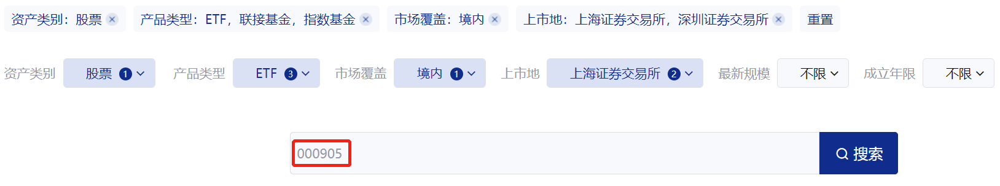
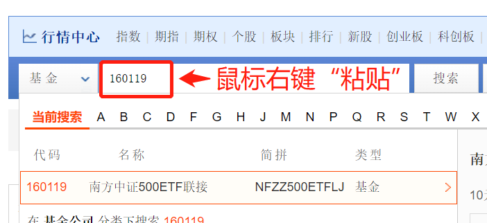

学理财，上水星财富学堂。小伙伴你好，欢迎继续学习《基金会员实战营》

上一节课，我们锁定了一对指数组合。不过，跟踪同一指数的基金产品有很多，你知道选择哪一只更好吗？本节课就来揭晓答案。

筛选指数基金重点看三个指标：基金规模、跟踪误差和费率。

## 第一个指标，基金规模。

基金规模太小会面临清盘的风险。清盘可以理解为基金产品下架，市面上买不到了，之前买过的会退钱。清盘浪费大家的投资精力，也耽误大家选择更好的投资机会。通常来说，基金规模在 1 亿元以上，基金清盘的概率比较小。

因为跟踪宽基指数的基金太多了，我们完全可以把标准定得更高一点，要求基金规模不小于 5 亿元。这样可以让我们的筛选过程更精简。

那么，指数基金的规模需不需要一个上限呢？答案是不需要。

指数基金复制指数的成分进行投资，不管募集到多少钱，都可以按比例分配到指数的成分股上面。所以说，规模过大对我们投资指数基金没有负面影响。而且，规模大代表大家都看好，都愿意把钱投资到这只基金上面。

总的来说，我们对指数基金规模的要求是不小于 5 亿元，而且越大越好。

## 第二个指标，跟踪误差。

指数基金的原理就是复制指数的成分，尽可能保持和指数走势一样。所以，判断一只指数基金好不好，重点不是看它业绩好不好，而是看它对指数的跟踪误差大不大。

跟踪误差越小，说明复制越精确;跟踪误差越大，说明复制越糟糕。

至于跟踪误差多小算小，其实没有严格的标准。我们只需要在筛选的时候综合对比多只基金，尽可能选跟踪误差小的基金就可以了。

## 第三个指标，费率。

基金的费率包含了申购费、赎回费、管理费、托管费和销售服务费。

其中，申购费、赎回费只在买卖环节一次性收取，在长期持有的情况下对收益率影响不大。而且大部分平台都给出了申购费一折的优惠;持有基金的时间足够长，甚至可以免去赎回费。所以，这两项费率可以忽略不计。

管理费、托管费和销售服务费统称为“运作费用”，这三项会按持有时间收取，持有基金越久收费越多。对于长期投资来说，这三项是主要的投资成本，对收益率的影响不可忽略。

所以，我们要重点考察指数基金的管理费、托管费和销售服务费，选择三项费用之和较小的基金。

## 实操 (上) :巧用指数官网

实操用到的工具有两个，一个是中证指数公司的官网，另一个是天天基金网。网址已经附在了文稿中。

[中证指数公司](http://www.csindex.com.cn/)

[天天基金网](https://fund.eastmoney.com/)

大家首先打开“中证指数有限公司”的官网，进入首页。

在顶部菜单中找到“产品与服务”，依次选择菜单下的“指数体系与服务”、“指数挂钩产品”。具体位置大家可以参考文稿中的插图。

点击“指数挂钩产品”，进入下一步。

“指数挂钩产品”页面为我们提供了 6 个菜单，分别是：资产类别、产品类型、市场覆盖、上市地、最新规模、成立年限。

这里我们只需要设置“产品类型”即可。点击“产品类型”菜单，选择 ETF、联接基金和指数基金 3 项。

其中，ETF 是一种在场内交易的指数基金;联接基金投资于 ETF，在场外交易，也属于指数基金。除此之外，还可能有一些其他种类的指数基金，我们把“指数基金”也勾选上。

菜单中的 LOF，既可以是指数基金，也可以是主动型基金，同时还可以是指数增强基金。勾选它会让筛选结果中混入我们不想要的基金，增加麻烦，所以我们不勾选它。

至于指数增强、增强 ETF，它们都属于指数增强基金。我们将在下一节课专门学习，本节课暂不勾选。

QDII 属于在境内投资于海外市场的一种基金。我们的筛选过程不涉及海外市场，所以不勾选 QDII。

搞定了“产品类型”以后，请大家把目光转移到在下方的搜索框。这里输入我们要选择的指数。

大家注意，搜索时，请在搜索框输入指数代码，而不是名字。

这是因为，很多指数的名字有重合的部分，比如：中证 500 成长估值、中证 500 等权，等等。这些“偏门”的指数，名字里也包含了中证 500，但它们都不是中证 500 的“真身”。我们搜索“中证 500”难免会把它们搜出来，混淆视线。

但是，指数代码是和指数一一对应的，代码具有唯一性，搜代码不会出现这种错乱。

有些小伙伴可能想问：我怎么知道每个指数的代码是多少呢？

很简单。只需要打开“水星财富学堂”公众号，在底部菜单选择“基金课程”，点击“课程工具”子菜单。

此时就可以看到“指数代码”

上节课我们锁定了“沪深 300+ 中证 500”的组合。针对这两个指数，各找一只基金就可以了。下面以中证 500 为例，来演示如何查找跟踪它的基金。

在“指数挂钩产品”的搜索框输入中证 500 的指数代码:000905，点击搜索。

可以看到，跟踪中证 500 的指数基金已经显示了出来。这么多产品，难道都适合买入吗？大家不要忘记在上面学习的筛选指标：基金规模、跟踪误差和费率。目前为止，我们还没有考察过这三个指标。

接下来，我们就将每只基金的三大指标都考察一遍，把数据过关的基金保留下来。

## 实操 (中) : 水星专属筛选表

上一小节选出了一批跟踪中证 500 的指数基金。现在，我们把目光聚焦到“产品名称”这一列。可以看到，中证指数官网不仅展示了基金的名字，还展示了基金的代码。

以第一只基金“南方中证 500ETF 联接”为例，复制它的代码“160119”

复制完成后，打开天天基金网。在首页的搜索框中，把刚才复制的代码粘贴进去。

粘贴完成后，会自动弹出下拉菜单，显示出基金产品的条目。点击条目，进入基金的详情介绍页面。

在跳转后的页面中，可以同时看到该基金的规模和跟踪误差。具体位置可以参考文稿中的插图。

可以看到，该基金的规模为 81.93 亿元，满足大于 5 亿元的要求。在天天基金网上，基金规模的数据来源于基金最近一次的定期报告，是可查证的最新数据。当其它网站和天天基金网显示的规模不一致时， 请以天天基金网的基金规模为准。

既然基金规模已达标，我们就先把它记录下来，作为候选，最后和其他基金放在一起综合评估。

水星财富学堂为大家准备了专属的筛选表格，让小伙伴们的实操更加方便。大家可以联系自己的训练营班班，获取表格。

我们把符合条件的基金名称、代码、规模、跟踪误差全部填入表格中。

想必小伙伴们已经发现，表格中的“三项费率”还缺少数据。查询基金费率很简单，直接在天天基金网的页面中点击“基金概况"就可以找到费率数据了。具体位置请大家参照文稿中的插图。

点击进入后，可以看到该基金的管理费率为 0.5%，托管费率为 0.1%，不收取销售服务费。所以，三项费率之和为 0.6%。

接下来，把 0.6% 填入筛选表格当中。

好了，第一只基金的数据已经全部统计完毕。接下来只需要重复上述步骤，在中证指数官网复制剩余基金的代码，粘贴到天天基金网查询三大指标，把规模达标的基金全部统计到表格里就可以了。

需要提醒大家的是，中证指数官网上面的某些基金显示为英文名，代码不是六位数字，或者上市地显示在海外，或者管理人是英文名。遇到这样的基金直接排除就好，不需要复制到天天基金网查询，因为在国内根本买不到它们。

课程中的这次筛选共统计出 16 只规模达标的基金。接下来就要综合评估这些基金，留下一只作为最终选择了。

## 实操 (下) :找出最满意的“基”

上一小节，我们已经选出了 16 只规模达标的基金。在这 16 只里面，如果某一只基金在规模、跟踪误差和费率三方面都很出众，那么不要犹豫，直接选择它就可以。

然而大多数情况是，一只基金只在一两个方面数据不错，每只基金看起来“各有千秋”，这时候应该怎么选呢？

正确的方法是优先看费率，其次看规模，最后看跟踪误差。

原因如下一

第一，凡是填入表格的基金，都是规模已经达标的基金，相当于是“精英聚会”了。基金规模更大代表选择它的投资者更多，但不代表收益率一定更高。

第二，跟踪误差更小，代表基金跟踪指数更紧密，与指数表现更一致，但这也不代表收益率越高，有时跟踪误差偏大可能是基金涨幅超过了指数。

第三，只要是跟踪同一指数的基金，收益不会相差太大，这时候成本优势尤为重要。基金的三项费率是确定的，只要表格中展示的费率更低，就能 100% 为你节约成本，省下就等于多赚。所以，我们优先拿下 100% 确定的优势，也就是低费率。

在 16 只基金中，三项费率只有 0.2% 和 0.6% 两档数据，我们优先选择费率为 0.2% 的基金，总共有 6 只。

在这 6 只基金之间，进一步对比规模和跟踪误差。可以看到，嘉实中证 500ETF (代码: 159922) 是 6 只里面规模最大、跟踪误差最低的。所以选它即可。

此外大家需要注意，该基金属于“ETF”基金，在场内交易，需要开通证券账户，而且基金价格实时波动。

如果你不想开通证券账户，也不想看到价格实时波动，只想每天看一眼净值变化，那么可以选择一只“ETF 联接”基金。

ETF 联接基金在场外交易，只在每个交易日的晚上更新一次净值，不会出现价格实时波动，可以让我们的心态更加平和。想要选择这样的基金，只要在刚才的筛选结果中，选择名字里带“ETF 联接”字样的就可以了。

在此提醒，课程中展示的所有基金，均不构成投资建议。在不同的时间进行筛选，结果也会千差万别。大家重点学习方法，亲自按照步骤实操一遍，才能选出适合投资的基金。

## “创业板指”有点不一样

经过实操环节的学习，我们了解了如何筛选跟踪中证 500 指数的基金。

想要构建“沪深 300+ 中证 500”的指数组合，只需要按照同样的步骤，再选出一只跟踪沪深 300 指数的基金就可以了。

如果要筛选跟踪其他指数的基金，方法也是类似的。不过大家要注意，5 个常用指数里面有一个例外，那就是创业板指。

跟踪创业板指的基金就不能用中证指数公司官网来筛选了，而是要用到“国证指数网”。网址已经附在了文稿中。

[国证指数网](http:/ /www.cnindex.com.cn/)

在国证指数网首页的右上角，有一个搜索框，在此输入“创业板指”，在弹出的下拉菜单中选择“创业板指”四个字，点击进入下一步。

我们可以看到，在跳转后的页面中，出现了四个菜单，分别是：指数表现、历史行情、样本行情、相关产品。

我们是来寻找基金产品的，所以直接点击“相关产品”就好了。

点击之后，就可以看到跟踪创业板指的所有基金了。接下来，我们只需要复制基金代码到天天基金网，剩下的步骤和前面一模一样。

本节课的内容到此结束。最后总结一下如何筛选指数基金。

## 总结

1.筛选指数基金要用到三个指标，分别是基金规模、跟踪误差和费率。指数基金的规模必须不少于 5 亿元才算合格，而且基金规模越大越好;跟踪误差代表了复制指数的精确度，指数基金的跟踪误差越小越好;管理费、托管费和销售服务费统称为“运作费用”，这三项费率越低越好。

2.筛选指数基金需要用到：中证指数公司官网和天天基金网;筛选跟踪创业板指的基金产品时，需要用到国证指数网。

3.在找出最满意的一只指数基金时，正确的方法是优先看费率，其次看规模，最后看跟踪误差。
