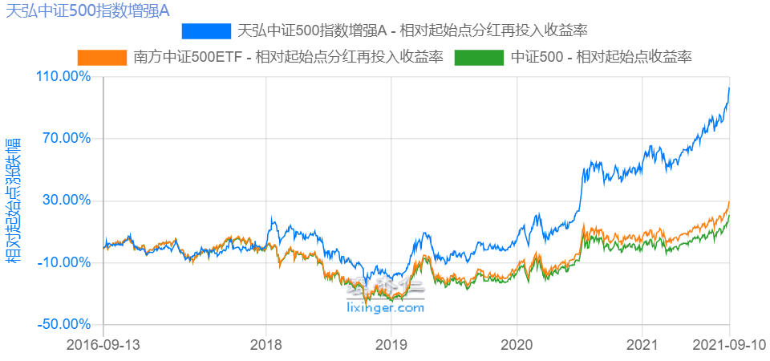
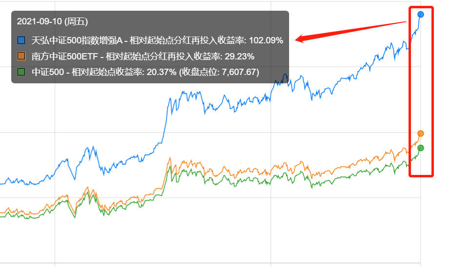
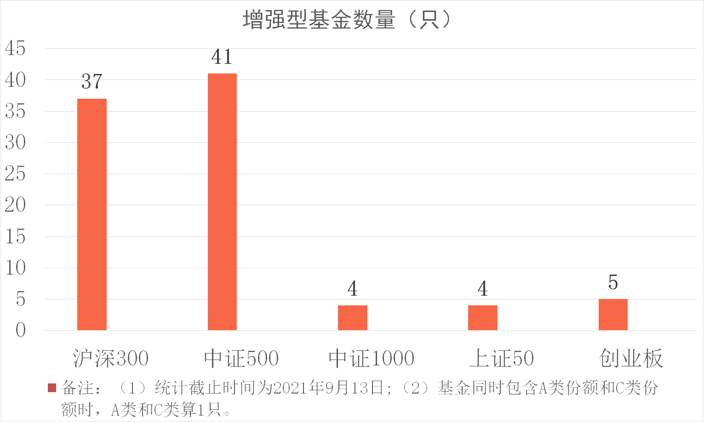
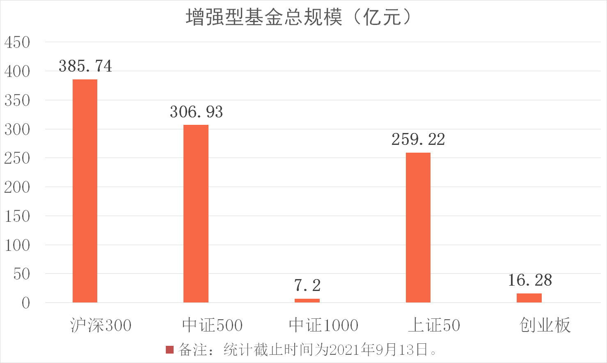

学理财，上水星财富学堂。小伙伴你好，欢迎继续学习《基金会员实战营》。

## 跟踪指数，同时跑赢指数

前面的课程介绍过，股票基金可以分成三大类，分别是指数基金、指数增强基金和主动型股票基金。指数基金的知识已经全部学习完毕。接下来，我们将开始学习指数增强基金。

指数增强的意思是，既跟踪指数，做被动投资; 同时又留出一定的空间，用来做主动投资。

打个比方：小星学长参加 1000 米赛跑，他的目标是跑赢小王，所以他在跑步过程中，紧紧跟着小王，你快我就快，你慢我就慢;在这个基础上，小星不断试图超过小王，跑到他的前面。

既跟着你，又试图超过你。这个套路用在基金领域，就是指数增强。

一般来说，指数增强基金用 80% 以上的资金跟踪指数，同时还保留 20% 以内的资金，由基金经理主动发挥自己的投资水平。这一部分主动投资就是基金的增强操作。

和单纯跟踪指数相比，增强对收益的贡献有多大呢？

以中证 500 指数为例，我们分别选择一只指数增强基金和一只指数基金，进行一次收益对比。

大家可以看文稿中的图片，绿色线条为中证 500 指数，红色线条为中证 500 指数基金，蓝色线条为中证 500 指数增强基金。可以发现，指数基金的长期走势基本与指数走势重合，而指数增强基金远远跑赢了指数。

具体到收益率，该指数增强基金的近 5 年收益率达到了 102.09%，指数基金的收益率仅为 29.23%，而中证 500 指数的涨幅仅为 20.37%。

可见，只要增强操作优秀，指数增强基金远比指数基金更加具备吸引力。

说到这里，估计很多小伙伴已经准备投入指数增强基金的怀抱了。但是，投资既要“知其然”，更要“知其所以然”。基金经理到底用哪些手段，才能跑赢指数呢？

## 超额收益从哪来

指数增强基金的收益共包含两部分：第一部分是指数本身上涨带来的收益，简称 β 收益;第二部分是增强带来的收益，简称 α 收益。

β 收益不用多说。只要基金规规矩矩地跟踪指数，就能拿到这部分收益，和基金经理的能力没有太大关系。

想要跑赢指数，重点依靠 α 收益，通常也叫“超额收益”。这部分收益非常考验基金经理的能力。

基金经理获取超额收益的手段可以概括为“两个大招”加“三个辅助”。我们分别来认识一下。

“两个大招”指的是两种经典的增强策略，一种是主观增强，另一种是量化增强。

### 主观增强

主观增强的意思是，基金经理根据主观判断进行选股、择时。一方面，他可以适当调整指数成分股的投资比例，特别看好的就多配一点，没那么看好的就少配一点;另一方面，他还可以投资指数中没有包含的股票，只要资金占比不超过 20% 即可。

### 量化增强

量化增强的意思是，借助数学模型和统计方法来进行数量化分析，从而对资产价格未来走势进行预测。说白了就是在投资的时候，不需要人主观拿主意了，而是交给计算机运算，根据运算结果来做决策。

现实中，绝大多数指数增强基金用的是量化增强，只有少部分使用主观增强。当然，也有基金同时使用“两个大招”，先用量化策略筛选一批股票，作为“股票池”，再人为考察基本面，从股票池里精选股票。

主观增强和量化增强是超额收益的主要来源。但除此之外，指数增强基金还有一些其他的获利方式，能够获取更多的超额收益。这些附带的获利方式，可以总结为“三个辅助”。

### 第一个辅助：打新股。

打新股的意思是申购新发行的股票。基金公司作为机构投资者，可以参与新股的网下配售，相当于享受优先权，不必等到网上申购拼运气。和散户相比，机构有更高的中签率。

基金参与打新股，收益一般在 1%~5% 之间。

### 第二个辅助：股指期货。

对于同一个股票指数而言，股指期货的点位有时会比指数点位低，出现套利空间，基金经理可以在期货市场布局，等到期货合约到期，股指期货和指数点位趋近，就可以获得部分收益。

监管规定，基金投资于股指期货的资金不能超过净值的 10%，所以套利回报相对有限。股指期货带来的收益一般在 1% 左右。

### 第三个辅助：转融通。

说到转融通就不得不提“做空”。想必很多小伙伴对做空交易有所耳闻。所谓的做空，就是高价借入股票，抓紧卖出，等到股票价格下跌，再按照低价把股票买回来，还回去。通过一借一还，做空方可以赚到差价。

要想做空赚钱，第一个步骤就要借入股票。这时候，指数增强基金就可以作为出借的一方，把持有的股票借出去。既然是出借，肯定会收取一定的“出借费”。这就是“转融通”赚钱的逻辑。

转融通拿到的“出借费”，可以给基金带来 0.5% 左右的收益。

到这里，“三个辅助”就介绍完了，它们分别是：打新股、股指期货和转融通。虽然“三个辅助”不像“两个大招”那样效果明显，但是加起来也有 2.5%~6.5% 左右的收益。经过复利的累积，增强效果会越来越明显。

以上我们认识了基金经理常用的增强手段。需要提醒大家的是，虽然方法是成立的，但每个基金经理的能力不一样，使用的效果也不一样。

这就好比，虽然解题的方法都一样，但是每个学生拿到的分数不一样。有的人拿满分，还有的人不及格。

对于指数增强基金来说，如果增强操作优秀，则可以跑赢指数;如果增强操作不及格，则可能帮倒忙，最终表现不如指数。

所以，我们还要进行一番挑选，把增强操作优秀的基金找出来。

## 指数那么多，选哪个增强

前面我们提到，指数增强基金的收益包括了增强操作的 α 收益和指数上涨的 β 收益。虽然增强操作很重要，但是大家可不能“捡了 α，丢了 β”。指数增强基金 80% 的资金都用来投资指数的成分股，跟踪指数所得的 β 收益绝对不容小觑。

实战的第一步，就是先锁定指数本身上涨的 β 收益。

绝大多数指数增强基金跟踪的都是五大常用指数，也就是沪深 300、上证 50、 中证 500、中证 1000 和创业板指。其中，建议大家优先选择沪深 300 和中证 500。

截止到 2021 年 9 月 13 日，市面上的沪深 300 指数增强基金有 37 只，中证 500 指数增强基金有 41 只。跟踪中证 1000、上证 50、创业板指的指数增强基金都在 5 只以内。

跟踪沪深 300 和中证 500 的指数增强基金明显较多。一方面，这反映出了基金公司对沪深 300 和中证 500 的偏爱;另一方面，我们选择这两个指数，也会有更多的产品可以选择。

其次，截止到 2021 年 9 月 13 日，指数增强基金总规模排在前两名的指数分别是沪深 300、中证 500，基金总规模都在 300 亿元以上。基金总规模大，说明投资者投的多，对它们有所偏爱。

排在其次的是上证 50，基金总规模在 250 亿元以上。而跟踪中证 1000 和创业板指的增强型基金总规模明显偏小，分别只有 7.2 亿元和 16.28 亿元。

综合考虑产品数量和产品总规模，可以看出，沪深 300 和中证 500 既受到了基金公司的偏爱，又受到了“基民”的偏爱。在选择指数增强基金时，可以优先考虑它们。

有的小伙伴可能会好奇：上证 50 指数增强基金只有 4 只，数量明显落后;而总规模却达到了 259.22 亿元，这是怎么造成的呢？

这是因为，统计期间，“易方达上证 50 增强 A”(代码: 110003) 这一只基金的规模就达到了 230.52 亿元，直接把总规模带了上去。此处仅作为解释，不代表投资建议。事实上，指数增强基金的筛选规则有些不同，对单只基金而言，规模并非越大越好。

本节课的内容就到这里了。最后做一下总结。

## 总结

1.指数增强基金用 80% 以上的资金跟踪指数，同时还保留 20% 以内的资金，由基金经理主动发挥自己的投资水平。这一部分主动投资就是基金的增强操作。

2.指数增强基金的收益共包含两部分：第一部分是指数本身上涨带来的收益，简称β收益;第二部分是增强操作带来的收益，简称α收益，通常也叫“超额收益”。

3.增强操作包含“两个大招”和“三个辅助”，“两个大招”是主观增强和量化增强，“三个辅助”是打新股、股指期货和转融通。

4.选择指数增强基金之前，要先选择指数。建议大家优先选择沪深 300 和中证 500。
