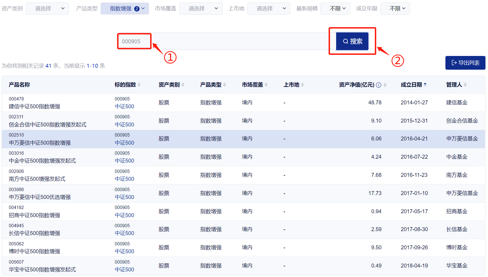

学理财，上水星财富学堂。小伙伴你好，欢迎继续学习《基金初级训练营》

上一节课介绍了指数增强策略，这节课就来教大家如何筛选出靠谱的指数增强基金。我们重点考察 3 个指标，分别是：成立时间、基金规模和信息比率。

## 指标一：成立时间。

对于指数增强基金而言，我们尤其看重它的增强操作;如果基金成立时间太短，我们就无法验证它的增强收益能否长期保持。

一般来说，基金有 3 年以上的历史业绩，才能体现出长期获取超额收益的能力。所以，我们把筛选标准定为：基金成立时间不少于 3 年。

## 指标二：基金规模。

首先，基金规模小于 1 亿元容易面临清盘风险。其次，机构参与沪深两市的网下打新，都需要持有市值 6000 万元的股票，加在一起就是 1.2 亿元。最后，基金参与转融通业务有 2 亿元的门槛。

综合考虑清盘风险、打新资格和转融通资格，我们取三者的最高门槛。也就是说，基金规模不能小于 2 亿元。

不过，基金规模并不是越大越好。因为绝大多数指数增强基金都采用了量化增强，而量化策略有一个“不可能三角”，也就是低风险、高收益和大容量，三者不能全部实现。

量化策略对风险控制有严格要求，这就要求它在高收益和大容量之间做出取舍。想要高收益，基金规模就不能太大;如果规模太大，就会拉低收益率。

而且，基金的增强收益有一部分来自于打新股。假设打新股收益是 1000 万，基金规模是 5 亿元，打新收益率等于 2%;如果基金规模是 50 亿元，那么打新收益率就只有 0.2% 了。也就是说，基金规模过大会稀释打新的收益率。

根据历史经验，指数增强基金的规模不宜超过 10 亿元。

## 指标三：信息比率。

基金经理进行增强操作，无形中增加了一些投资风险。信息比率考察的就是，增加单位主动风险到底能带来多少超额收益。

信息比率越大越好。数值越大，说明承担同等风险获得的超额收益越多，增强操作越优秀。

有的小伙伴要问啦：数值多大才算大？这一点没有统一规定。单看一只基金的信息比率意义不大，我们在筛选的时候，需要综合对比多只基金的信息比率，只要选出其中数值较大的就可以了。

最后总结一下 3 个筛选指标：

第一，基金成立时间不少于 3 年;第二，基金规模在 2 亿到 10 亿之间;第三，信息比率越大越好。

有的小伙伴可能好奇：为什么指数增强基金不考察跟踪误差和费率了呢？

这是因为，指数增强基金本身就追求主动偏离指数，跟踪误差大是正常现象，没有必要专门考察跟踪误差;此外，和低费率带来的成本优势相比，增强操作带来的收益优势更有吸引力，只要增强做得好，每年多付出百分之零点几的成本也问题不大，没有必要专门考察费率。

## 实操 (上) :巧用指数官网

首先要用到的工具是：中证指数公司官网。网址已经附在了文稿中。

[中证指数公司](http:/ /www.csindex.com.cn/)

最开始的步骤和上节课一致，依次选择“产品与服务”、“指数体系与服务”、“指数挂钩产品”。

接下来设置“产品类型”。这次我们选择“产品类型”菜单下的“指数增强”和“增强 ETF”。它们都属于指数增强基金。

然后在下方的搜索框中，输入指数的代码。以中证 500 为例，代码为 000905。 在搜索框输入 000905，点击搜索。

可以看到，跟踪中证 500 的指数增强基金已经显示了出来。接下来，我们将用成立时间、基金规模和信息比率三个指标，将这些基金全部考察一遍。

首先来看成立时间。在刚才的产品列表中，可以直接看到“成立日期”这一列。点击一下表头的“成立日期”四个字，产品将自动按照成立日期由早到晚排列，排在第一位的就是成立日期最久远的基金。

我们要找的成立时间不少于 3 年的基金，课程中的筛选时间为 2021 年 12 月 29 日，往前推 3 年就是 2018 年 12 月 29 日。也就是说，成立时间晚于 2018 年 12 月 29 日的基金可以直接排除，根本不用看。

需要注意的是，在这些基金里面，有些基金曾经只是普通的指数基金，后来变更为指数增强基金。对于这样的基金，中证指数公司官网在统计成立日期时，是按照变更为指数增强基金的那一天计算的，相对更加科学。当其它网站和中证指数官网显示的成立日期不一致时，请以中证指数官网的成立日期为准。

其次看基金规模。上节课已经介绍了查看基金规模的方法，那就是利用天天基金网。接下来，我们就按照上节课学过的方法，逐个复制基金代码，粘贴到天天基金网。

以第一只基金“建信中证 500 指数增强”为例，复制它的代码“000478”,粘贴到天天基金网查询基金规模。

可以查到，该基金的规模为 46.23 亿元。而我们的要求是 2 亿到 10 亿之间，说明这只基金不符合标准，可以直接排除。

接下来重复同样的步骤，查看第二只基金的基金规模。第二只为“创金合信中证 500 指数增强发起式”，代码 002311。所谓的“发起式”就是基金公司及高管也买了自家的这只基金。

在天天基金网查到该基金的规模为 5.08 亿元，符合 2 亿~10 亿的要求。这时候先不要着急把它记录下来，我们还要进一步考察它的信息比率。

直接在天天基金网的页面中点击“基金概况，具体位置请大家参照文稿中的表格。

在跳转后的页面中，左侧有一列“基金档案”，点击其中的“特色数据”一栏。

此时，我们就可以看到该基金近 1 年、近 2 年和近 3 年的信息比率数据。我们要选择增强操作长期保持优秀的基金，所以选择近 3 年的数据即可。

好了，该基金的信息比率已经找到。下面我们就把数据记录下来，以便和其他基金进行对比。

水星财富学堂为大家准备了专属的筛选表格，让小伙伴们的实操更加方便。大家可以联系自己的训练营班班，获取表格。

我们把符合条件的基金名称、代码、信息比率全部填入表格中。

注意，基金规模就不需要统计了。因为我们在上面的筛选过程中，已经使用基金规模考察了一遍，而且指数增强基金的规模并不是越大越好，只要满足 2 亿~10 亿之间就可以，没有必要进一步考察。

接下来只需要重复上述步骤，在中证指数官网复制剩余基金的代码，粘贴到天天基金网查询基金规模和信息比率，把规模达标的基金全部统计到表格里就可以了。复制时请大家留意基金的“成立日期”，成立不满 3 年的基金记得直接排除，以免自找麻烦。

课程中的这次筛选共统计出 8 只符合条件的基金。大家可以看文稿中的插图，有两只基金的信息比率达到了 0.3，明显高于其他几只基金的信息比率。它们分别是：中金中证 500A，代码 003016; 国投中证 500 指数量化增强 A，代码 005994。

那么是不是说，这两只基金可以任选一只投资了呢？

目前还不可以。因为增强操作对基金经理的能力有要求。前面仅仅考察了产品本身，还没有对基金经理进行考察

## 实操 (下) :三步考察基金经理

考察指数增强基金的基金经理，主要有三个指标。

第一，基金经理的累计任职时间不能少于 3 年，否则资历太浅，投资经验不足，难以保证未来的收益水平。

第二，基金经理的管理总规模不能少于 10 亿元。注意这里不是某只基金的规模，而是一位基金经理管理的所有基金规模总和。如果他管理的总规模太小，代表投资者不愿意选择他的产品，不太认可他的投资水平。

第三，基金经理需要有量化投资背景。因为绝大多数指数增强基金都会选择量化增强，如果基金经理没有量化投资背景，则未必能胜任这一岗位。

三个指标有了，下面就以“中金中证 500A”为例，代码 003016，我们来考察一下它的基金经理。

首先在天天基金网打开这只基金，找到“基金经理”。具体位置大家可以参照文稿中的表格。

可以看到基金经理的名字叫“耿帅军”，我们点击一下他的名字。在跳转后的页面中可以看到基金经理的头像，也就是一张证件照，我们点击一下照片。

接下来就能看到我们想要的所有信息了。基金经理的累计任职时间、管理总规模、背景资料全部都显示了出来。

可以看到，该基金经理的累计任职时间为 1 年又 69 天，管理总规模为 19.60 亿元;背景资料中看不出有量化投资背景。我们把这些信息填入筛选表格中。

接下来用同样的方法，考察另一只基金“国投中证 500 指数量化增强 A”，代码 005994。

可以看到，该基金的基金经理名叫殷瑞飞，累计任职时间为 8 年又 97 天，管理总规模为 22.40 亿元;背景资料中可以看到量化投资背景。我们把这些信息也填入筛选表格中。

两相对比会发现，前者有两项不达标，后者三项全都达标。后者无论是累计任职时间、管理总规模还是量化投资背景，都要比前者更胜一筹。所以，我们最终的选择是后者：国投中证 500 指数量化增强 A。

在此提醒，课程中展示的所有基金，均不构成投资建议。在不同的时间进行筛选，结果也会千差万别。大家重点学习方法，亲自按照步骤实操一遍，才能选出适合投资的基金。

本节课的内容到此结束。最后做一下总结。

## 总结

1.要选出增强操作优秀的基金，重点考察三个指标，分别是：成立时间、基金规模和信息比率。基金成立时间不少于 3 年;基金规模在 2 亿到 10 亿之间;信息比率越大越好。

2.考察指数增强基金的基金经理，主要有 3 个指标：累计任职时间不能少于 3 年;管理总规模不能少于 10 亿元;要有量化投资背景。
